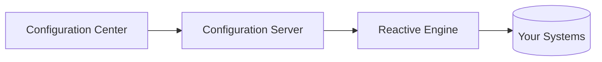

# What is layline.io?

**layline.io is a high-performance data integration and event processing platform** that lets teams build, deploy, and operate real-time and batch data workflows — without writing low-level streaming infrastructure code.

## The problem it solves

Building reliable, scalable data pipelines is hard. Teams routinely spend months developing and maintaining custom code to move, transform, and react to data across systems. When requirements change or volume spikes, that code becomes a liability.

layline.io removes that burden. Instead of writing infrastructure, you design workflows visually, connect your systems using built-in assets, and apply business logic using JavaScript or Python. layline.io handles the rest: execution, parallelism, fault tolerance, and monitoring.

> **The trigger moment:** *"I need to stop spending months building and maintaining complex event and data pipelines so I can reliably move, transform, and react to data in real time."*

## What you can build

layline.io is not limited to ETL or ELT. It covers the full spectrum of data and event-driven processing:

- **Real-time event workflows** — react to events from Kafka, message queues, or file streams as they arrive
- **Batch data pipelines** — process large volumes of structured or semi-structured data from files, databases, or object storage
- **Data transformation** — normalize, enrich, map, and filter data using built-in processors or custom scripts
- **Multi-output routing** — split and route data to multiple destinations based on content or business rules
- **System integration** — connect databases, file systems, Kafka, S3, SFTP/FTP, and more using pre-built connectors

## Who uses it

| Role | What they use layline.io for |
|------|-----------------------------|
| **Data Engineers** | Pipeline logic, transformations, source and sink connectivity |
| **Platform / DevOps Engineers** | Cluster deployment, scaling, monitoring |
| **Integration / Analytics Engineers** | Connecting systems, enriching and routing data |
| **Backend / Automation Developers** | Custom scripting logic within workflows |

## How it works

layline.io has three main components that work together:

1. **Configuration Server** — the control plane. Hosts the web-based Configuration Center, stores projects, and manages configuration.
2. **Configuration Center** — a browser-based UI where you design workflows, configure assets, deploy projects, and monitor running clusters.
3. **Reactive Engine** — the execution engine. Runs your workflows with high throughput and low latency. Scales horizontally across a cluster.

Projects you design in the Configuration Center are deployed to one or more Reactive Engines. The engines execute your workflows, process data, and report status back to the Configuration Center for monitoring.

## Ready to get started?

- **[Install locally](install-local)** — full installation on your machine (Windows, macOS, Linux)
- **[Run via Docker](install-docker)** — get up and running in minutes with a pre-configured image
- **[Core Concepts in 5 Minutes](core-concepts)** — understand the key building blocks before you dive in
