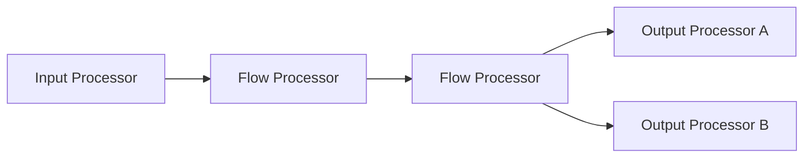
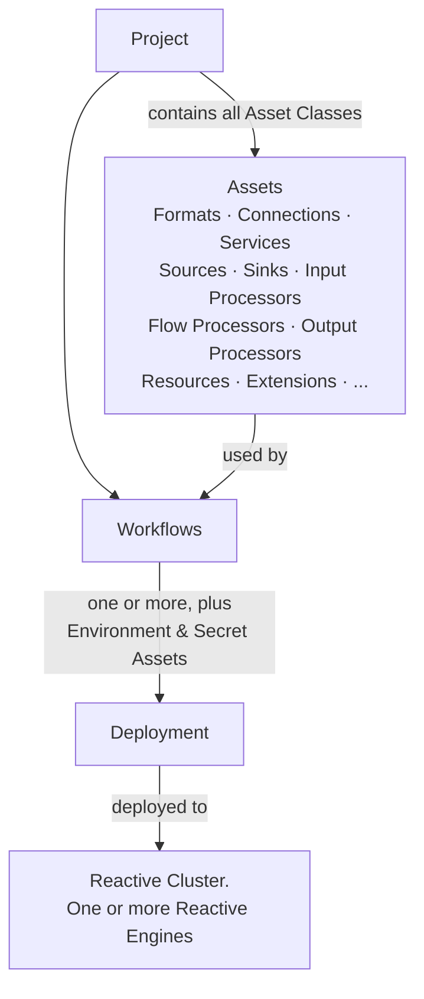

# Core Concepts in 5 Minutes

This page gives you the mental model you need before building your first workflow. Six concepts cover 90% of what layline.io does.

---

## 1. Projects

A **Project** is the top-level container for everything you build in layline.io. It is comprised of all configured Workflow Assets, Workflows, Deployment Assets, and any other project-specific configurations.

You create and manage Projects in the **Configuration Center**. When you're ready to run, you deploy a Project (or a selection of its Workflows) to a **Reactive Cluster**.

---

## 2. Assets

**Assets** are the reusable building blocks of layline.io. An Asset captures a specific piece of configuration — a connection, a data format, a processing step — independently of any particular Workflow.

Key things to know about Assets:

- **Assets can be defined independently of Workflows.** Workflows then "use" those Assets.
- **One Asset can be used in multiple Workflows.** For example, if two Workflows need the same output destination, they can share a single configured Output Processor Asset.
- **Assets support inheritance.** You can derive a **child Asset** from a **parent Asset**. Both must share the same Asset Class and Type. Children inherit all parent settings, and individual parameters can be overridden at the child level. This makes it easy to build portfolios of reusable, slightly varied Asset configurations.
- **Assets can depend on other Assets.** Many Asset types require other Assets to function. For example, an Input Processor Asset typically requires both a **Format Asset** (to understand the data structure) and a **Source Asset** (to know where to read from) — without those, it cannot operate. Understanding these dependencies is key to building correct configurations.

### Asset Classes and Types

Assets are organized into **Asset Classes**. Each class represents a category of functionality. Within each class, there are one or more **Asset Types** that represent specific implementations.

The following Asset Classes exist:

| Asset Class | Role |
|-------------|------|
| **Workflows** | Workflows are themselves an Asset Class |
| **Formats** | Define data structure (see Data Formats below) |
| **Connections** | Connectivity to external systems |
| **Services** | Shared service definitions |
| **Sources** | Read data in |
| **Sinks** | Write data out |
| **Input Processors** | Process data at workflow entry |
| **Output Processors** | Process data at workflow exit |
| **Flow Processors** | Transform, route, enrich, filter in between |
| **Resources** | Resource Asset definitions |
| **Extensions** | Custom extensions |

Each class provides one or more specific Asset Types. For example, the **Format** class includes these Asset Types:

- ASN.1
- Data Dictionary
- Generic
- HTTP
- XML

Other Asset Classes have their own specific Asset Types.

---

## 3. Workflows

A **Workflow** is the core unit of execution in layline.io. It defines how data flows from a single input through a series of processing steps to one or more outputs.

Workflow Assets are all Assets used directly or indirectly within a Workflow. A Workflow is comprised of **one Input Processor**, any number of **Flow Processors**, and one or more **Output Processors** — each of which is an instance of a configured Asset.

> **Important:** Each Workflow has exactly **one Input Processor**. It is the driving force of the Workflow — it reads from its source and pushes data into the processing graph. The Input Processor may read from additional sources (e.g. databases or REST interfaces) during processing, but there is only one driver per Workflow.

A Project can contain multiple Workflows.

---

## 4. Data Formats

layline.io needs to understand your data structure to process it. You define data structure using **Format Assets**.

Unlike other platforms that require you to map external data to an internal format and back again, layline.io works differently: it builds a **combined data dictionary** from all configured Format Assets, reflecting the superset of all formats in your Project. Data flows through the system using this unified dictionary — no intermediate mapping step required.

Common supported format types include ASN.1, Data Dictionary, Generic, HTTP, and XML.

---

## 5. Deployment

Designing a Workflow in the Configuration Center does not run it. You must **deploy** it to a **Reactive Cluster**.

Key concepts:

- A **Deployment** defines what **Workflows, Environment Assets, and Secret Assets** shall be deployed to a Reactive Cluster.
- A **Reactive Cluster** is a combination of one or more Reactive Engines.
- When a cluster contains only one Reactive Engine, it is often referred to simply as "one Reactive Engine" — but technically it is still a Reactive Cluster, just with one node and no failover.
- "Deploying to a Reactive Cluster" means sending a Deployment Configuration to the cluster — technically to one Reactive Engine, which then automatically propagates it to every cluster member.

---

## Putting it together

Here's how all the pieces connect:

You start by creating a **Project** in the Configuration Center. Within the Project, you define **Assets** across all Asset Classes — formats, connections, sources, sinks, processors, services, resources, and more. Every Asset Class plays a role; none are optional in the general sense. Because Assets are independent of Workflows, you can define and reuse them freely across multiple Workflows in the same Project, or use Asset inheritance to create variants without duplication.

Assets are not isolated — they depend on each other. An Input Processor, for instance, requires both a Format Asset and a Source Asset to function. Building a working configuration means wiring up these dependencies correctly.

Once your Assets are in place, you assemble one or more **Workflows** by connecting a single Input Processor, any number of Flow Processors, and one or more Output Processor instances. The Workflow defines the data path: how data enters, how it is transformed and routed, and where it goes.

When the Project is ready, you create a **Deployment** — a configuration that specifies which Workflows, Environment Assets, and Secret Assets to send to a Reactive Cluster. Deploying sends this configuration to one Reactive Engine, which propagates it to all cluster members. The cluster then executes your Workflows continuously.

---

## Next steps

- **[Install layline.io](install-local)** — get it running on your machine
- **[Your First Workflow](first-workflow)** — walk through a complete end-to-end example
- **[Asset Reference](/docs/assets)** — browse all available source, processor, and sink types
