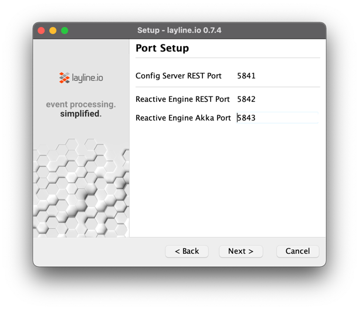
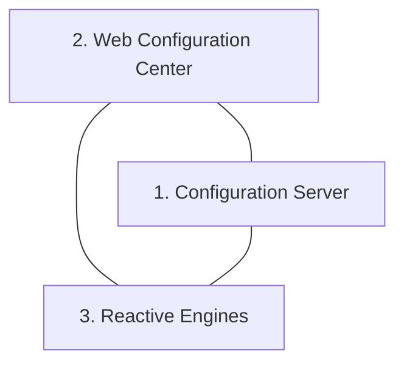
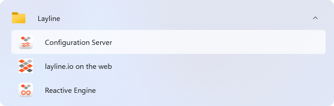
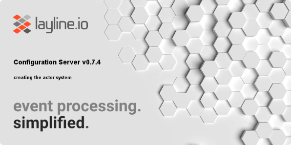
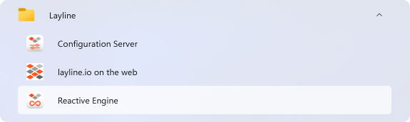
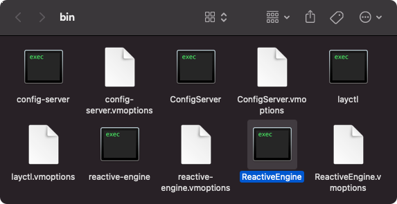
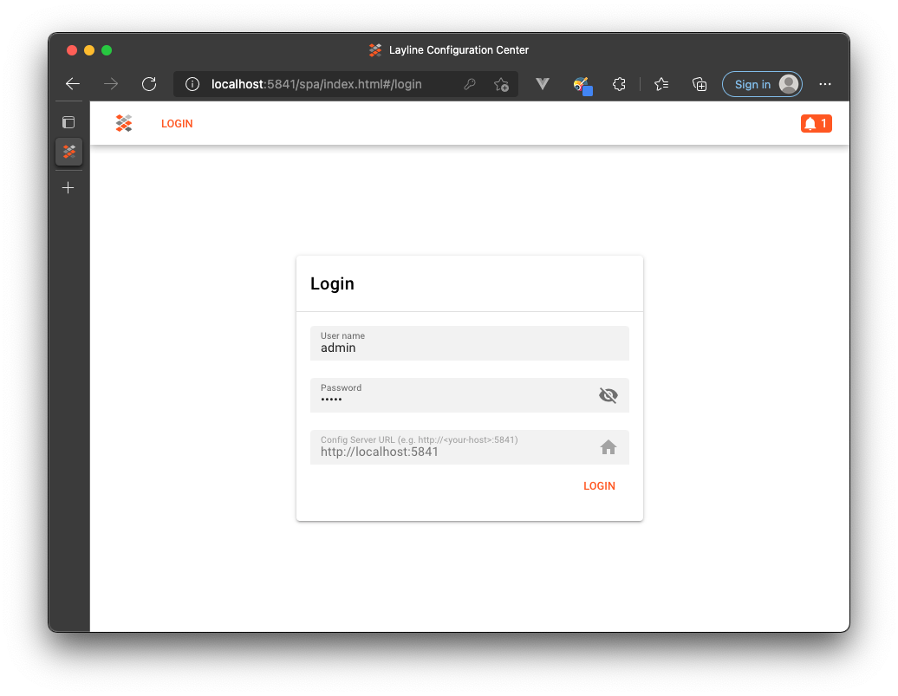
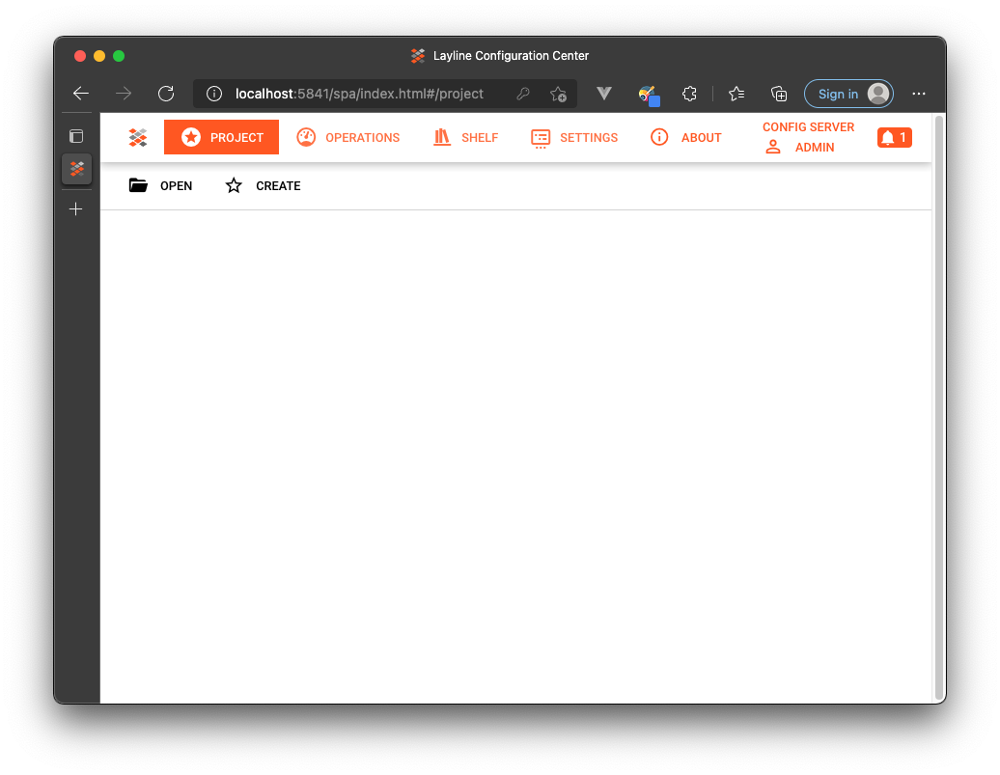

import Tabs from '@theme/Tabs';
import TabItem from '@theme/TabItem';
import WipDisclaimer from '../snippets/common/_wip-disclaimer.md'

[//]: # (import vars from '/variables.js')

## Download

Make sure you have downloaded layline.io for your respective operating system. You can check and download the latest version from our main website [here](https://layline.io/download).

:::tip Linux
On linux, or MacOS you can also download via curl:

Depending on your CPU architecture:

`curl -O https://download.layline.io/releases/layline-linux-amd64-<currentVersion>.sh`

or

`curl -O https://download.layline.io/releases/layline-linux-arm-<currentVersion>.sh`
:::

You can check recent changes in our [Release Notes](../release).

## Installation

Let's go ahead and run the installation now.

### Windows / MacOS

Run the installer:


<div className="tab">
<Tabs>
<TabItem value="windows" label="Windows" default>

Run:

```bash title="Windows"
layline-windows-amd64-<currentVersion>.exe
````

</TabItem>
<TabItem value="macos" label="macOS" default>

Run:

```bash title="macOS"
./layline-macos-<currentVersion>.dmg
```

layline.io is not signed by Apple. You will therefore get a warning. Hit ok and then <kbd>Alt</kbd> + <kbd>Right-click</kbd> and select <kbd>open</kbd> from the menu. Don't worry, there is nothing "
fishy" in the software.

")

")
</TabItem>
</Tabs>
</div>

<br/>
Hit <kbd>next</kbd> until you see:
<br/>
<br/>



These are standard communication ports required by layline.io. If they don't collide with anything you are already running, then just leave the defaults.

The installation should finish without issues.

### Linux

:::tip Prerequisite
You must have **libfreetype6** installed. If it is not installed you need to so prior to running the installer, or else it will fail with an error:

```bash title="Debian"
apt-get install -y libfreetype6
```

```bash title="CentOS"
yum install freetype
```

:::

<br/>

Next, pick and run the installer for your target processor architecture:

<div className="tab">
<Tabs>
  <TabItem value="amd" label="AMD" default>

   ```bash title="AMD"
   chmod +x layline-linux-amd64-<currentVersion>.sh
   ./layline-linux-amd64-<currentVersion>.sh
   ```

  </TabItem>
  <TabItem value="arm" label="ARM" default>

   ```bash title="AMD"
   chmod +x layline-linux-arm-<currentVersion>.sh
   ./layline-linux-arm-<currentVersion>.sh
   ```

  </TabItem>
</Tabs>
</div>

<br/>
Accept the defaults or change according to your environment (example for AMD).

```bash
root@b8a9e28ce031:/layline# ./layline-linux-amd64-1.0.2.sh
Unpacking JRE ...
Starting Installer ...
This will install layline.io on your computer.
OK [o, Enter], Cancel [c]

Click Next to continue, or Cancel to exit Setup.
Select the folder where you would like layline.io to be installed, then
click Next.
Where should layline.io be installed?
[/usr/local/layline]

Choose the listening ports for the layline components
Config Server REST Port
[5841]

Reactive Engine REST Port
[5842]

Reactive Engine Streams Port
[5843]

Create symlinks?
Yes [y, Enter], No [n]

Select the folder where you would like layline.io to create symlinks, then click Next.
[/usr/local/bin]

Extracting files ...
Setup has finished installing layline.io on your computer.
```

### Uninstall

If you want to uninstall layline.io, you can run the respective uninstallers on Windows or MacOS.

On Linux there is an uninstaller in your installation directory:

````bash
root@b8a9e28ce031:/usr/local/layline# ./uninstall
Are you sure you want to completely remove layline.io and all of its components?
Yes [y, Enter], No [n]

Uninstalling layline.io 1.0.2 ...
layline.io was successfully removed from your computer.
Finishing uninstallation ...
````

:::warning
Project data will not be uninstalled In case you have created some Projects with layline.io, these will remain and must be deleted manually.
:::

## Understand moving parts

Let's first understand what needs to run at a minimum. layline.io consists of three major elements:



#### Configuration Server

A process which

- Serves the Web-based Configuration Center
- Handles some configuration support services
- Manages the Project storage

#### Configuration Center

A web-based UI which is used for

- the configuration of layline.io Projects
- the deployment of Projects to a Reactive Engine / Reactive Engine Cluster
- the monitoring of one or more Reactive Engine Clusters
-

#### Reactive Engine

A process which

- executes a Project and Project Workflows
- is spawned 1..n times on 1..n nodes.

## Starting everything

### Starting the Config Server

<div className="tab">
<Tabs>
  <TabItem value="windows" label="Windows" default>

**Option 1: Start from Start Menu** <br/>

1. Open the ``Start Menu`` and locate `Layline` <br/>
2. Invoke ``Config Server``



3. The Configuration Server is started:<br/>



**Option 2: Start from command line**<br/>

1. Open a command windows and go to the `bin` folder in the installation directory.<br/>
   `C:\Program Files\Layline.io\layline>cd bin`

2. Start the Configuration Server from the command window:

```text
C:\Program Files\Layline.io\layline\bin>config-server.exe

09:35:21.916 INFO  ConfigServer                         - [LAY-00050] ###################################################################
09:35:21.916 INFO  ConfigServer                         - [LAY-00050] #        Layline Config Server 1.0.2 (2022-...)                   #
09:35:21.916 INFO  ConfigServer                         - [LAY-00050] #                                                                 #
09:35:21.916 INFO  ConfigServer                         - [LAY-00050] #  Copyright (C) 2018-2021  layline.io GmbH <https://layline.io>  #
09:35:21.916 INFO  ConfigServer                         - [LAY-00050] ###################################################################
09:35:26.291 INFO  ConfigServer.Plugins                 - [LAY-10014] successfully registered plugin 'processor_mapping' ('io.layline.config.plugin.processor.mapping.PluginFactory')
09:35:26.322 INFO  ConfigServer                         - [LAY-10016] starting the configuration server root actor
09:35:26.322 INFO  ConfigServer.Plugins                 - [LAY-10014] successfully registered plugin 'format_generic' ('io.layline.config.plugin.format.generic.PluginFactory')
09:35:26.385 INFO  ConfigServer.Plugins                 - [LAY-10014] successfully registered plugin 's3' ('io.layline.config.plugin.common.s3.PluginFactory')
09:35:27.025 INFO  ConfigServer.RestServer              - [LAY-00360] rest server is listening on address '127.0.0.1', port 5841
09:35:27.025 INFO  ConfigServer                         - [LAY-10018] layline configuration server is up and running ...
```

  </TabItem>
  <TabItem value="macos" label="macOS" default>

**Option 1: Start from Finder**<br/>

1. Change to the `bin` folder in the installation directory using the Finder<br/>
2. Invoke ``Config Server``

```text
| => /Applications/layline.io/bin/ConfigServer ; exit;

15:26:08.061 INFO  ConfigServer                         - [LAY-00050] ###################################################################
15:26:08.064 INFO  ConfigServer                         - [LAY-00050] #    Layline Config Server 0.8.0-SNAPSHOT (2021-10-04 10:38:09)   #
15:26:08.064 INFO  ConfigServer                         - [LAY-00050] #                                                                 #
15:26:08.065 INFO  ConfigServer                         - [LAY-00050] #  Copyright (C) 2018-2021  layline.io GmbH <https://layline.io>  #
15:26:08.065 INFO  ConfigServer                         - [LAY-00050] ###################################################################
15:26:11.392 INFO  ConfigServer.KeyStorage              - [LAY-12200] starting the key storage
15:26:11.533 INFO  ConfigServer.Plugins                 - [LAY-10014] successfully registered plugin 'processor_mapping' ('io.layline.config.plugin.processor.mapping.PluginFactory')
15:26:11.537 INFO  ConfigServer.Plugins                 - [LAY-10014] successfully registered plugin 'format_generic' ('io.layline.config.plugin.format.generic.PluginFactory')
15:26:11.545 INFO  ConfigServer.Plugins                 - [LAY-10014] successfully registered plugin 's3' ('io.layline.config.plugin.common.s3.PluginFactory')
15:26:12.415 INFO  ConfigServer.RestServer              - [LAY-00360] rest server is listening on address '0.0.0.0', port 5841
15:26:12.415 INFO  ConfigServer                         - [LAY-10018] layline configuration server is up and running ...
```

**Option 2: Start from shell**<br/>

1. Open a shell and go to the `bin` folder in the installation directory.<br/>
2. Start the Configuration Server from the shell:

```text
| /Applications/layline.io/bin
| => ./config-server

15:40:13.274 INFO  ConfigServer                         - [LAY-00050] ###################################################################
15:40:13.280 INFO  ConfigServer                         - [LAY-00050] #    Layline Config Server 0.8.0-SNAPSHOT (2021-10-04 10:38:09)   #
15:40:13.280 INFO  ConfigServer                         - [LAY-00050] #                                                                 #
15:40:13.280 INFO  ConfigServer                         - [LAY-00050] #  Copyright (C) 2018-2021  layline.io GmbH https://layline.io    #
15:40:13.280 INFO  ConfigServer                         - [LAY-00050] ###################################################################
15:40:15.861 INFO  ConfigServer.KeyStorage              - [LAY-12200] starting the key storage
15:40:16.015 INFO  ConfigServer.Plugins                 - [LAY-10014] successfully registered plugin 'processor_mapping' ('io.layline.config.plugin.processor.mapping.PluginFactory')
15:40:16.019 INFO  ConfigServer.Plugins                 - [LAY-10014] successfully registered plugin 'format_generic' ('io.layline.config.plugin.format.generic.PluginFactory')
15:40:16.028 INFO  ConfigServer.Plugins                 - [LAY-10014] successfully registered plugin 's3' ('io.layline.config.plugin.common.s3.PluginFactory')
15:40:16.811 INFO  ConfigServer.RestServer              - [LAY-00360] rest server is listening on address '0.0.0.0', port 5841
15:40:16.812 INFO  ConfigServer                         - [LAY-10018] layline configuration server is up and running ...
```

  </TabItem>
  <TabItem value="linux" label="Linux" default>

1. `cd` to the `bin` folder in the installation directory.<br/>
2. Start the Configuration Server from the shell:

```text
root@b8a9e28ce031:/usr/local/layline/bin# ./config-server

21-10-20 09:53:42.208 INFO  ConfigServer                         - [LAY-00050] ###################################################################
21-10-20 09:53:42.212 INFO  ConfigServer                         - [LAY-00050] #        Layline Config Server 1.0.2 (2022-...)                   #
21-10-20 09:53:42.212 INFO  ConfigServer                         - [LAY-00050] #                                                                 #
21-10-20 09:53:42.213 INFO  ConfigServer                         - [LAY-00050] #  Copyright (C) 2018-2021  layline.io GmbH https://layline.io    #
21-10-20 09:53:42.214 INFO  ConfigServer                         - [LAY-00050] ###################################################################
21-10-20 09:53:46.145 INFO  ConfigServer.Plugins                 - [LAY-10014] successfully registered plugin 'processor_mapping' ('io.layline.config.plugin.processor.mapping.PluginFactory')
21-10-20 09:53:46.151 INFO  ConfigServer.Plugins                 - [LAY-10014] successfully registered plugin 'format_generic' ('io.layline.config.plugin.format.generic.PluginFactory')
21-10-20 09:53:46.169 INFO  ConfigServer.Plugins                 - [LAY-10014] successfully registered plugin 's3' ('io.layline.config.plugin.common.s3.PluginFactory')
21-10-20 09:53:46.173 INFO  ConfigServer                         - [LAY-10016] starting the configuration server root actor
21-10-20 09:53:47.007 INFO  ConfigServer.RestServer              - [LAY-00360] rest server is listening on address '127.0.0.1', port 5841
21-10-20 09:53:47.008 INFO  ConfigServer                         - [LAY-10018] layline configuration server is up and running ...
   ```

  </TabItem>
</Tabs>
</div>

### Starting the Reactive Engine

<div className="tab">
<Tabs>
<TabItem value="windows" label="Windows" default>

**Option 1: Start from Start Menu**<br/>

1. Open the ``Start Menu`` and locate `Layline`<br/>
2. Invoke ``Reactive Engine``



3. The Configuration Server is started:


**Option 2: Start from command line**

1. Open a command windows and go to the `bin` folder in the installation directory.

`C:\Program Files\Layline.io\layline>cd bin`

2. Start the Reactive Engine from the command window:

```text
C:\Program Files\layline.io\layline\bin>reactive-engine.exe
2021-10-21 10:02:38.964 INFO  Layline                                            - [LAY-00050] ###################################################################
2021-10-21 10:02:38.964 INFO  Layline                                            - [LAY-00050] #       Layline Reactive Engine 1.0.2 (2022-...)                  #
2021-10-21 10:02:38.964 INFO  Layline                                            - [LAY-00050] #                                                                 #
2021-10-21 10:02:38.964 INFO  Layline                                            - [LAY-00050] #  Copyright (C) 2018-2021  layline.io GmbH <https://layline.io>  #
2021-10-21 10:02:38.964 INFO  Layline                                            - [LAY-00050] ###################################################################
2021-10-21 10:02:45.245 INFO  Layline.DeploymentStorage                          - [LAY-11500] deployment storage created
2021-10-21 10:02:45.292 INFO  Layline.ClusterMonitor                             - [LAY-11415] starting the cluster monitor
2021-10-21 10:02:45.448 INFO  Layline                                            - [LAY-11600] starting the activation controller

...

2021-10-21 10:02:46.417 INFO  Layline.StreamMonitor                              - [LAY-11410] recovery of the stream monitor completed
2021-10-21 10:02:46.449 INFO  Layline.SchedulerMaster                            - [LAY-12010] node akka://layline@127.0.0.1:5843 reports the following roles: [dc-default]
2021-10-21 10:02:46.464 INFO  Layline.SchedulerSlave                             - [LAY-12003] successfully registered at master on node akka://layline
2021-10-21 10:02:46.527 INFO  Layline.RestServer                                 - [LAY-00360] rest server is listening on address '0.0.0.0', port 5842
2021-10-21 10:02:46.542 INFO  Layline                                            - [LAY-11008] all system components are up and running
```

:::tip Firewall settings
You may get a firewall warning. Please `Allow Access` for the Reactive Engine:<br/><br/>
")
:::

</TabItem>
<TabItem value="macos" label="macOS" default>

**Option 1: Start from Finder**<br/>

1. Change to the `bin` folder in the installation directory using the Finder<br/>
2. Invoke `ReactiveEngine`<br/>



````text
| /Applications/layline.io/bin
| => /Applications/layline.io/bin/ReactiveEngine ; exit;

2021-10-21 10:02:38.964 INFO  Layline                                            - [LAY-00050] ###################################################################
2021-10-21 10:02:38.964 INFO  Layline                                            - [LAY-00050] #       Layline Reactive Engine 1.0.2 (2022-...)                  #
2021-10-21 10:02:38.964 INFO  Layline                                            - [LAY-00050] #                                                                 #
2021-10-21 10:02:38.964 INFO  Layline                                            - [LAY-00050] #  Copyright (C) 2018-2021  layline.io GmbH <https://layline.io>  #
2021-10-21 10:02:38.964 INFO  Layline                                            - [LAY-00050] ###################################################################
2021-10-21 10:02:45.245 INFO  Layline.DeploymentStorage                          - [LAY-11500] deployment storage created

...

2021-10-21 10:02:46.527 INFO  Layline.RestServer                                 - [LAY-00360] rest server is listening on address '0.0.0.0', port 5842
2021-10-21 10:02:46.542 INFO  Layline                                            - [LAY-11008] all system components are up and running
````

**Option 2: Start from shell**<br/>

1. Open a shell and go to the `bin` folder in the installation directory.<br/>
2. Start the Reactive Engine from the shell:<br/>

```text
| /Applications/layline.io/bin
| => ./reactive-engine

2021-10-21 10:02:38.964 INFO  Layline                                            - [LAY-00050] ###################################################################
2021-10-21 10:02:38.964 INFO  Layline                                            - [LAY-00050] #       Layline Reactive Engine 1.0.2 (2022-...)                  #
2021-10-21 10:02:38.964 INFO  Layline                                            - [LAY-00050] #                                                                 #
2021-10-21 10:02:38.964 INFO  Layline                                            - [LAY-00050] #  Copyright (C) 2018-2021  layline.io GmbH <https://layline.io>  #
2021-10-21 10:02:38.964 INFO  Layline                                            - [LAY-00050] ###################################################################
2021-10-21 10:02:45.245 INFO  Layline.DeploymentStorage                          - [LAY-11500] deployment storage created

...

2021-10-21 10:02:46.527 INFO  Layline.RestServer                                 - [LAY-00360] rest server is listening on address '0.0.0.0', port 5842
2021-10-21 10:02:46.542 INFO  Layline                                            - [LAY-11008] all system components are up and running
```

</TabItem>
<TabItem value="linux" label="Linux" default>

1. `cd` to the `bin` folder in the installation directory.<br/>
2. Start the Reactive Engine from the shell:<br/>

```text
root@b8a9e28ce031:/usr/local/layline/bin# ./reactive-engine

2021-10-21 10:02:38.964 INFO  Layline                                            - [LAY-00050] ###################################################################
2021-10-21 10:02:38.964 INFO  Layline                                            - [LAY-00050] #       Layline Reactive Engine 1.0.2 (2022-...)                  #
2021-10-21 10:02:38.964 INFO  Layline                                            - [LAY-00050] #                                                                 #
2021-10-21 10:02:38.964 INFO  Layline                                            - [LAY-00050] #  Copyright (C) 2018-2021  layline.io GmbH <https://layline.io>  #
2021-10-21 10:02:38.964 INFO  Layline                                            - [LAY-00050] ###################################################################
2021-10-21 10:02:45.245 INFO  Layline.DeploymentStorage                          - [LAY-11500] deployment storage created

...

2021-10-21 10:02:46.527 INFO  Layline.RestServer                                 - [LAY-00360] rest server is listening on address '0.0.0.0', port 5842
2021-10-21 10:02:46.542 INFO  Layline                                            - [LAY-11008] all system components are up and running
```

</TabItem>
</Tabs>
</div>

### Open the Config Center Web UI

It's time to check if we can start the web-based Configuration Center.

:::warning Please note
The **Configuration Center** is served by the **Configuration Server**. So make sure that it is up and running.
:::

Open a web browser and enter the url: `http://localhost:5841`.
In case you have installed the Configuration Server on another machine reachable through a different url, then enter the respective url instead of `localhost`.
Should you have changed the port number during installation, you also need to change the port number to what you have set it to.

You should be taken to the login page:



The default login is `admin` with password `admin`. Once logged in, you should see this:



### Starting issues

:::warning Issues when upgrading from previous version
Should you be upgrading a previously installed version, there is a chance that you may encounter starting issues with the Configuration Server and/or Reactive Engine.
The reason being that there are still old configuration elements lingering around. The easiest way to fix the issues would be to follow these steps:

1. Uninstall layline.io
2. Locate your layline configuration directory:

<div className="tab">
<Tabs>
<TabItem value="windows" label="Windows" default>

```bash
C:\Users\<username>\.layline
```

</TabItem>
<TabItem value="macos" label="macOS" default>

```bash
/Users/<username>/.layline/
```

</TabItem>
<TabItem value="linux" label="Linux" default>

```text
$HOME/.layline/
```

</TabItem>
</Tabs>
</div>
<br/>

3. Delete the above directory (Keep a backup until you know everything runs well post fix)
4. Reinstall layline.io

The problem should be fixed.
:::

---

<WipDisclaimer></WipDisclaimer>
