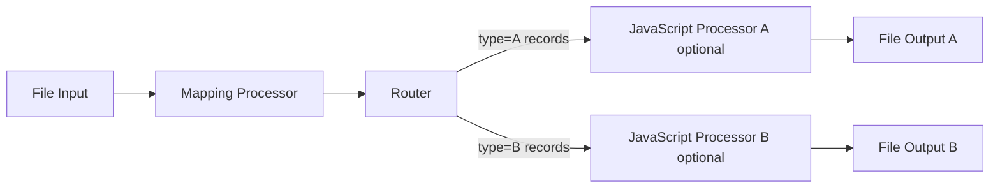

# Your First Workflow

This tutorial walks you through building a simple data processing workflow in layline.io. By the end, you will have a working pipeline that reads from a file, maps records into a different output structure, filters records by type, and writes them to two different output files.

**Time to complete:** approximately 15–20 minutes  
**Prerequisites:** layline.io installed and running ([local install](install-local) or [Docker](install-docker))

---

## What we're building

**Scenario:** A system produces transaction records as CSV files. We need to:

1. **Read** the input CSV file
2. **Map/Transform** records into a different output structure
3. **Route** records to different output files based on type
4. **Write** the results to two separate files
5. **(Optional)** append a trailer record at stream end



---

## Step 1: Create a new Project

1. Open the **Configuration Center** at `http://localhost:5841` and log in with `admin` / `admin`.
2. In the left navigation, click **Project → New**.
3. Name the project `simple-filter` and click **Create**.

You are now inside an empty project.

---

## Step 2: Define the input format

First, tell layline.io what your input data looks like.

1. In the left panel, navigate to **Formats**.
2. Click **Add Format** and choose **Generic Format**.
3. Name it `TransactionFormat`.
4. Enter the following grammar in the format editor:

```javascript
format {
   name = "Transaction Format"
   description = "Simple CSV transaction format"
   start-element = "File"
   target-namespace = "Transaction"

   elements = [
      {
         name = "File"
         type = "Sequence"
         references = [
            {
               name = "Header"
               referenced-element = "Header"
            },
            {
               name = "Transactions"
               max-occurs = "unlimited"
               referenced-element = "Transaction"
            }
         ]
      },
      {
         name = "Header"
         type = "Separated"
         regular-expression = "HEADER"
         separator-regular-expression = ","
         separator = ","
         terminator-regular-expression = "\\r?\\n"
         terminator = "\\n"

         mapping = {
            message = "Header"
            element = "Transaction"
         }

         parts = [
            {
               name = "RECORD_TYPE"
               type = "RegExpr"
               regular-expression = "[^,\\n]*"
               value.type = "Text.String"
            },
            {
               name = "VERSION"
               type = "RegExpr"
               regular-expression = "[^,\\n]*"
               value.type = "Text.String"
            }
         ]
      },
      {
         name = "Transaction"
         type = "Separated"
         regular-expression = "TXN"
         separator-regular-expression = ","
         separator = ","
         terminator-regular-expression = "\\r?\\n"
         terminator = "\\n"

         mapping = {
            message = "Transaction"
            element = "Transaction"
         }

         parts = [
            {
               name = "RECORD_TYPE"
               type = "RegExpr"
               regular-expression = "[^,\\n]*"
               value.type = "Text.String"
            },
            {
               name = "ID"
               type = "RegExpr"
               regular-expression = "[^,\\n]*"
               value.type = "Text.String"
            },
            {
               name = "TYPE"
               type = "RegExpr"
               regular-expression = "[^,\\n]*"
               value.type = "Text.String"
            },
            {
               name = "AMOUNT"
               type = "RegExpr"
               regular-expression = "[^,\\n]*"
               value = {
                  type = "Text.Decimal"
               }
            },
            {
               name = "DESCRIPTION"
               type = "RegExpr"
               regular-expression = "[^,\\n]*"
               value.type = "Text.String"
            }
         ]
      }
   ]
}
```

5. Save the format.

---

## Step 3: Define the output format

For output, use a different structure so the Mapping Processor performs an actual transformation.

1. In the **Formats** panel, click **Add Format** again.
2. Choose **Generic Format**.
3. Name it `TransactionOutputFormat`.
4. Enter the following grammar:

```javascript
format {
   name = "Transaction Output Format"
   description = "Output CSV with transformed transaction rows and optional trailer"
   start-element = "File"
   target-namespace = "TransactionOut"

   elements = [
      {
         name = "File"
         type = "Sequence"
         references = [
            {
               name = "Transactions"
               min-occurs = 0
               max-occurs = "unlimited"
               referenced-element = "Transaction"
            },
            {
               name = "Trailer"
               min-occurs = 0
               max-occurs = 1
               referenced-element = "Trailer"
            }
         ]
      },
      {
         name = "Transaction"
         type = "Separated"
         regular-expression = "OUT"
         separator-regular-expression = ","
         separator = ","
         terminator-regular-expression = "\\r?\\n"
         terminator = "\\n"

         mapping = {
            message = "Transaction"
            element = "TransactionOut"
         }

         parts = [
            {
               name = "RECORD_TYPE"
               type = "RegExpr"
               regular-expression = "[^,\\n]*"
               value.type = "Text.String"
            },
            {
               name = "TRANSACTION_ID"
               type = "RegExpr"
               regular-expression = "[^,\\n]*"
               value.type = "Text.String"
            },
            {
               name = "TYPE_LABEL"
               type = "RegExpr"
               regular-expression = "[^,\\n]*"
               value.type = "Text.String"
            },
            {
               name = "AMOUNT"
               type = "RegExpr"
               regular-expression = "[^,\\n]*"
               value = {
                  type = "Text.Decimal"
               }
            },
            {
               name = "DESCRIPTION"
               type = "RegExpr"
               regular-expression = "[^,\\n]*"
               value.type = "Text.String"
            }
         ]
      },
      {
         name = "Trailer"
         type = "Separated"
         regular-expression = "TRL"
         separator-regular-expression = ","
         separator = ","
         terminator-regular-expression = "\\r?\\n"
         terminator = "\\n"

         mapping = {
            message = "Trailer"
            element = "TransactionOut"
         }

         parts = [
            {
               name = "RECORD_TYPE"
               type = "RegExpr"
               regular-expression = "[^,\\n]*"
               value.type = "Text.String"
            },
            {
               name = "RECORD_COUNT"
               type = "RegExpr"
               regular-expression = "[^,\\n]*"
               value = {
                  type = "Text.Integer"
               }
            },
            {
               name = "TOTAL_AMOUNT"
               type = "RegExpr"
               regular-expression = "[^,\\n]*"
               value = {
                  type = "Text.Decimal"
               }
            }
         ]
      }
   ]
}
```
5. Save the format.

---

## Step 4: Configure a File Input

1. In the left panel, navigate to **Workflows** and click **New Workflow**. Name it `filter-transactions`.
2. From the asset palette, drag a **File Input** asset onto the canvas.
3. Double-click to configure:
   - **Directory:** `/tmp/layline/in` (create this directory on your machine)
   - **File pattern:** `transactions.csv`
   - **Format:** select `TransactionFormat` (created in Step 2)
   - **Move processed files to:** `/tmp/layline/done`
4. Save the asset.

---

## Step 5: Add a Mapping Processor

1. From the asset palette, drag a **Mapping Processor** onto the canvas.
2. Connect the output of the File Input to the input of this processor.
3. Double-click to configure:
   - **Name:** `MapForOutput`
   - Add one mapping scenario:
     - **Source message:** `Transaction`
     - **Target message:** `Transaction`
   - Add mapping steps:
     - `target.RECORD_TYPE := "OUT"`
     - `target.TRANSACTION_ID := source.ID`
     - `target.TYPE_LABEL := source.TYPE == "A" ? "TYPE_A" : "TYPE_B"`
     - `target.AMOUNT := source.AMOUNT`
     - `target.DESCRIPTION := source.DESCRIPTION`
4. Save the processor.

---

## Step 6: Add a Router

1. Drag a **Router** asset onto the canvas and connect it to the output of `MapForOutput`.
2. Configure two routes:
    - **Route A:**
       - **Name:** `TypeA`
       - **Condition:** `record.TYPE_LABEL === 'TYPE_A'`
       - **Output Port:** A
    - **Route B:**
       - **Name:** `TypeB`
       - **Condition:** `record.TYPE_LABEL === 'TYPE_B'`
       - **Output Port:** B
3. Save the router.

---

## Step 7 (Optional): Add trailer processors for stream-end summary rows

If you want each output file to end with a trailer row (`TRL,<count>,<sum>`), add one JavaScript Processor on each route branch before the File Output.

1. Add **JavaScript Processor A** between `TypeA` and File Output A.
2. Add **JavaScript Processor B** between `TypeB` and File Output B.
3. In each JavaScript Processor, use script logic that:
   - increments a counter for every `Transaction` message
   - accumulates `AMOUNT`
   - emits the original message in `onMessage()`
   - creates and emits one `Trailer` message in `onStreamEnd()`

   Example script template:

   ```javascript
   const OUTPUT_PORT = processor.getOutputPort('Output');

   let recordCount = 0;
   let totalAmount = 0.0;

   export function onMessage() {
      if (message.typeName === 'Transaction') {
         recordCount += 1;
         totalAmount += Number(message.AMOUNT || 0);
      }

      stream.emit(message, OUTPUT_PORT);
   }

   export function onStreamEnd() {
      // Adjust the namespace path if your data dictionary differs.
      const trailer = dataDictionary.createMessage(dataDictionary.type.TransactionOut.Trailer);
      trailer.RECORD_TYPE = 'TRL';
      trailer.RECORD_COUNT = recordCount;
      trailer.TOTAL_AMOUNT = totalAmount;

      stream.emit(trailer, OUTPUT_PORT);
   }
   ```
4. Save both processors.

> Note: The Mapping Processor performs the per-record transformation. Stream-end emission is done in JavaScript `onStreamEnd()`.

---

## Step 8: Configure File Output A

1. Drag a **File Output** asset onto the canvas and connect it to Route A output (or JavaScript Processor A output if you added Step 7).
2. Configure:
   - **Directory:** `/tmp/layline/out/type-a`
   - **Filename:** `transactions-a.csv`
   - **Format:** select `TransactionOutputFormat`
   - **Append:** ✓ (append to file)
3. Save the asset.

---

## Step 9: Configure File Output B

1. Drag another **File Output** asset onto the canvas and connect it to Route B output (or JavaScript Processor B output if you added Step 7).
2. Configure:
   - **Directory:** `/tmp/layline/out/type-b`
   - **Filename:** `transactions-b.csv`
   - **Format:** select `TransactionOutputFormat`
   - **Append:** ✓ (append to file)
3. Save the asset.

---

## Step 10: Deploy to the Reactive Engine

1. In the top menu, click **Deploy → Deploy to Engine**.
2. Select your local Reactive Engine (should be listed automatically at `localhost:5842`).
3. Click **Deploy**. The Configuration Center will package and push the project.
4. Navigate to **Operations → Cluster** and confirm the engine status shows **Up**.

---

## Step 11: Run the workflow

1. Create the necessary directories:
   ```bash
   mkdir -p /tmp/layline/in /tmp/layline/out/type-a /tmp/layline/out/type-b /tmp/layline/done
   ```

2. Create a sample input file at `/tmp/layline/in/transactions.csv`:

   ```csv
   HEADER,1.0
   TXN,TXN001,A,100.50,Payment for item 1
   TXN,TXN002,B,250.00,Payment for item 2
   TXN,TXN003,A,75.25,Payment for item 3
   TXN,TXN004,B,500.00,Payment for item 4
   TXN,TXN005,A,125.00,Payment for item 5
   ```

3. Drop the file into `/tmp/layline/in/`.

4. In the **Operations** section, click on your workflow to see live throughput.

5. Check the output files:
   - `/tmp/layline/out/type-a/transactions-a.csv` should contain transformed `OUT` rows for type A
   - `/tmp/layline/out/type-b/transactions-b.csv` should contain transformed `OUT` rows for type B
   - if you added Step 7, each file should also end with one `TRL` row
   - The input file should be moved to `/tmp/layline/done/`

---

## What you've learned

In this tutorial you:

- Created a layline.io project with input and output formats
- Built a workflow with File Input, Mapping Processor, Router, and File Outputs
- (Optional) Added stream-end trailer rows using JavaScript `onStreamEnd()`
- Deployed the workflow to a local Reactive Engine
- Ran it end-to-end and monitored the results

---

## Next steps

- **[Concepts in depth](/docs/concept)** — understand the architecture and data model in detail
- **[Asset Reference](/docs/assets)** — explore all available source, processor, and sink types
- **[Mapping Processor](/docs/assets/processors-flow/asset-processor-mapping)** — learn about data transformation
- **[Router](/docs/assets/processors-flow/asset-processor-router)** — learn about routing logic
- **[Operations Guide](/docs/operations)** — manage clusters, monitor deployments, handle errors
