# Your First Workflow

This tutorial walks you through building a simple data processing workflow in layline.io. By the end, you will have a working pipeline that reads from a file, maps records into a different output structure, filters records by type, and writes them to two different output files.

**Time to complete:** approximately 15–20 minutes  
**Prerequisites:** layline.io installed and running ([local install](install-local) or [Docker](install-docker)). We assume a running, standard local installation for this example.

---

## What we're building

**Scenario:** A system produces transaction records as CSV files. We need to:

1. **Read** the input CSV file
2. **Map/Transform** records into a different output structure
3. **Route** records to different output files based on type
4. **Write** the results to two separate files
5. **(Optional)** append a trailer record at stream end

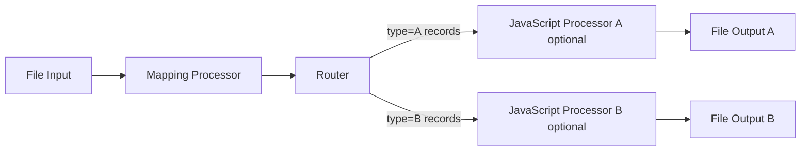

---

## Step 1: Create a new Project

1. First, we recommend to create a directory for your projects on your local machine (the web ui cannot do this for you):

   ```bash
   mkdir -p /Users/<yourname>/layline-projects
   ```
1. Open the **Configuration Center** at `http://localhost:5841` and log in with `admin` / `admin`.
1. On the right navigation, expand **Create New Project**.
1. Name the project `simple-filter`. Optionally add a description.
1. Enter the path to the directory you created plus the directory name of the project you want to create (e.g., `/Users/<yourname>/layline-projects/simple-filter`).
1. Click **Create**.

You are now inside an empty project.

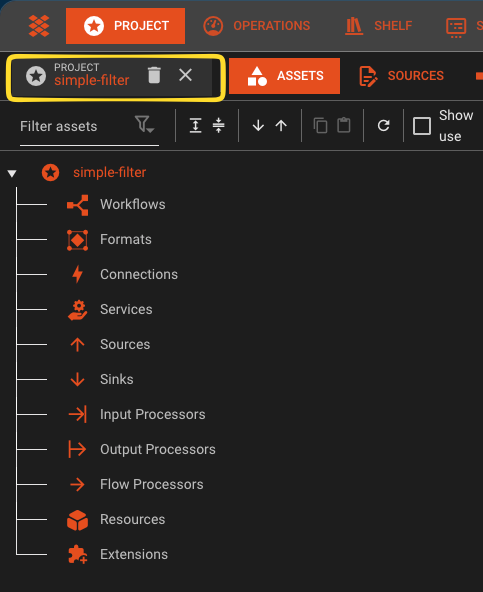

---

## Step 2: Define the input format

First, tell layline.io what your input data looks like.

1. In the left panel, navigate to the **Formats** leaf in the tree.
2. Click on the arrow next to it, and select  **Add Generic Format**.
3. Name it `TransactionFormat`.
4. Enter the following grammar in the format editor. This grammar defines the structure of our CSV transaction files - you can copy-paste it as-is:

```javascript
format {
   name = "Transaction Format"
   description = "Simple CSV transaction format"
   start-element = "File"
   target-namespace = "Transaction"

   elements = [
      {
         name = "File"
         type = "Sequence"
         references = [
            {
               name = "Header"
               referenced-element = "Header"
            },
            {
               name = "Details"
               max-occurs = "unlimited"
               referenced-element = "Detail"
            }
         ]
      },
      {
         name = "Header"
         type = "Separated"
         regular-expression = "HEADER"
         separator-regular-expression = ","
         separator = ","
         terminator-regular-expression = "\\r?\\n"
         terminator = "\\n"

         mapping = {
            message = "Header"
            element = "TRANS_IN"
         }

         parts = [
            {
               name = "RECORD_TYPE"
               type = "RegExpr"
               regular-expression = "[^,\\n]*"
               value.type = "Text.String"
            },
            {
               name = "VERSION"
               type = "RegExpr"
               regular-expression = "[^,\\n]*"
               value.type = "Text.String"
            }
         ]
      },
      {
         name = "Detail"
         type = "Separated"
         regular-expression = "TXN"
         separator-regular-expression = ","
         separator = ","
         terminator-regular-expression = "\\r?\\n"
         terminator = "\\n"

         mapping = {
            message = "Detail"
            element = "TRANS_IN"
         }

         parts = [
            {
               name = "RECORD_TYPE"
               type = "RegExpr"
               regular-expression = "[^,\\n]*"
               value.type = "Text.String"
            },
            {
               name = "ID"
               type = "RegExpr"
               regular-expression = "[^,\\n]*"
               value.type = "Text.String"
            },
            {
               name = "TYPE"
               type = "RegExpr"
               regular-expression = "[^,\\n]*"
               value.type = "Text.String"
            },
            {
               name = "AMOUNT"
               type = "RegExpr"
               regular-expression = "[^,\\n]*"
               value = {
                  type = "Text.Decimal"
               }
            },
            {
               name = "DESCRIPTION"
               type = "RegExpr"
               regular-expression = "[^,\\n]*"
               value.type = "Text.String"
            }
         ]
      }
   ]
}
```

The grammar language allows you to flexibly create a broad array of custom data formats. Note that this format defines a CSV file with one mandatory header record and an undefined number of transaction records.

5. You have created your first asset.

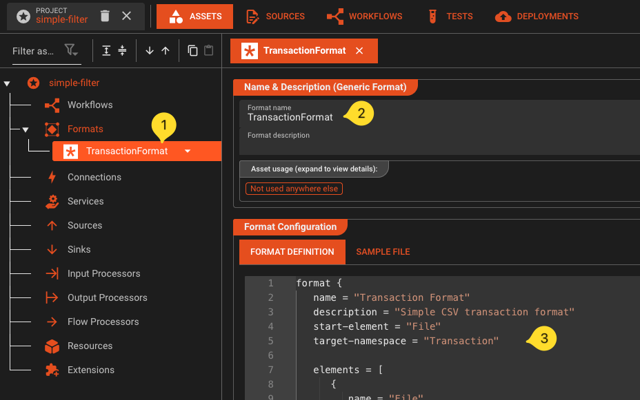

---

## Step 3: Define the output format

For output, use a different structure so the Mapping Processor performs an actual transformation.

1. In the **Formats** panel, click **Add Format** again.
2. Add another **Generic Format** asset.
3. Name it `TransactionOutputFormat`.
4. Enter the following grammar:

```javascript
format {
   name = "Transaction Output Format"
   description = "Output CSV with transformed transaction rows and optional trailer"
   start-element = "File"
   target-namespace = "TransactionOut"

   elements = [
      {
         name = "File"
         type = "Sequence"
         references = [
            {
               name = "Transactions"
               min-occurs = 0
               max-occurs = "unlimited"
               referenced-element = "Transaction"
            },
            {
               name = "Trailer"
               min-occurs = 0
               max-occurs = 1
               referenced-element = "Trailer"
            }
         ]
      },
      {
         name = "Transaction"
         type = "Separated"
         regular-expression = "OUT"
         separator-regular-expression = ","
         separator = ","
         terminator-regular-expression = "\\r?\\n"
         terminator = "\\n"

         mapping = {
            message = "Transaction"
            element = "TransactionOut"
         }

         parts = [
            {
               name = "RECORD_TYPE"
               type = "RegExpr"
               regular-expression = "[^,\\n]*"
               value.type = "Text.String"
            },
            {
               name = "TRANSACTION_ID"
               type = "RegExpr"
               regular-expression = "[^,\\n]*"
               value.type = "Text.String"
            },
            {
               name = "TYPE_LABEL"
               type = "RegExpr"
               regular-expression = "[^,\\n]*"
               value.type = "Text.String"
            },
            {
               name = "AMOUNT"
               type = "RegExpr"
               regular-expression = "[^,\\n]*"
               value = {
                  type = "Text.Decimal"
               }
            },
            {
               name = "DESCRIPTION"
               type = "RegExpr"
               regular-expression = "[^,\\n]*"
               value.type = "Text.String"
            }
         ]
      },
      {
         name = "Trailer"
         type = "Separated"
         regular-expression = "TRL"
         separator-regular-expression = ","
         separator = ","
         terminator-regular-expression = "\\r?\\n"
         terminator = "\\n"

         mapping = {
            message = "Trailer"
            element = "TransactionOut"
         }

         parts = [
            {
               name = "RECORD_TYPE"
               type = "RegExpr"
               regular-expression = "[^,\\n]*"
               value.type = "Text.String"
            },
            {
               name = "RECORD_COUNT"
               type = "RegExpr"
               regular-expression = "[^,\\n]*"
               value = {
                  type = "Text.Integer"
               }
            },
            {
               name = "TOTAL_AMOUNT"
               type = "RegExpr"
               regular-expression = "[^,\\n]*"
               value = {
                  type = "Text.Decimal"
               }
            }
         ]
      }P
   ]
}
```

Note that this output format in comparison to the input format contains no header record, an unlimited number of transaction records and am optional trailer record.

5. You have now created your input and output format assets.

---

## Step 4: Configure File Source

Next we configure a File Source Asset. This describes the physical parameters to access files from folders.

1. In the Asset Tree, navigate to the **Sources** category, and add a new asset there.
2. Add a **File System Source** asset
3. Name it `Input Source`` in the details panel for this asset which has opened to the right.
4. Go to the section **Folders** and do the following:

   - Click on **Add a Folder**
   - Name the new folder `Input-Folder`.
   - In field **Input Directory** enter your input folder (e.g. `/tmp/layline/in`). Create the folder you entered if it does not exist.\
     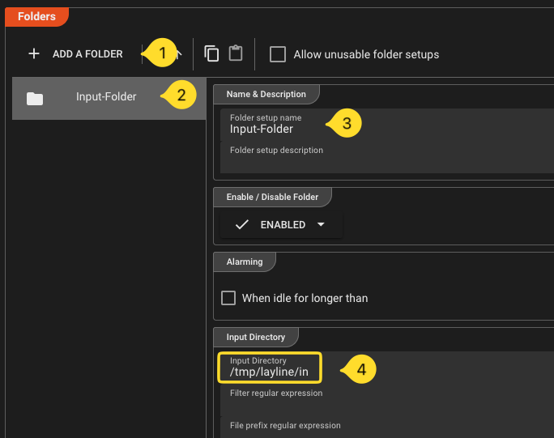
   - Repeat this for the fields **Done Directory** and **Error Directory** with their respective directories (`/tmp/layline/done` and `/tmp/layline/err`). Again, if these directories do not exist, then create them.

---

## Step 5: Configure File Sink

Likewise for the ouput files we configure TWO File Sink Asset. One for files wiht transactions of type "A" and another for files with transaction type "B"

1. Add a **File System Sink** asset
1. Name it `Output-Sink`` in the details panel for this asset which has opened to the right.
1. Go to the section **Folders** and do the following:

   - Click on **Add a Folder**
   - Name the folder `Output-Folder` 
   - In field **Output Directory** enter your output folder (e.g. `/tmp/layline/out/type-a`). Create the folder you entered if it does not exist.
   - In field **Temporary Directory** enter a temporary output folder (e.g. `/tmp/layline/out/type-a/tmp`). \
     \
     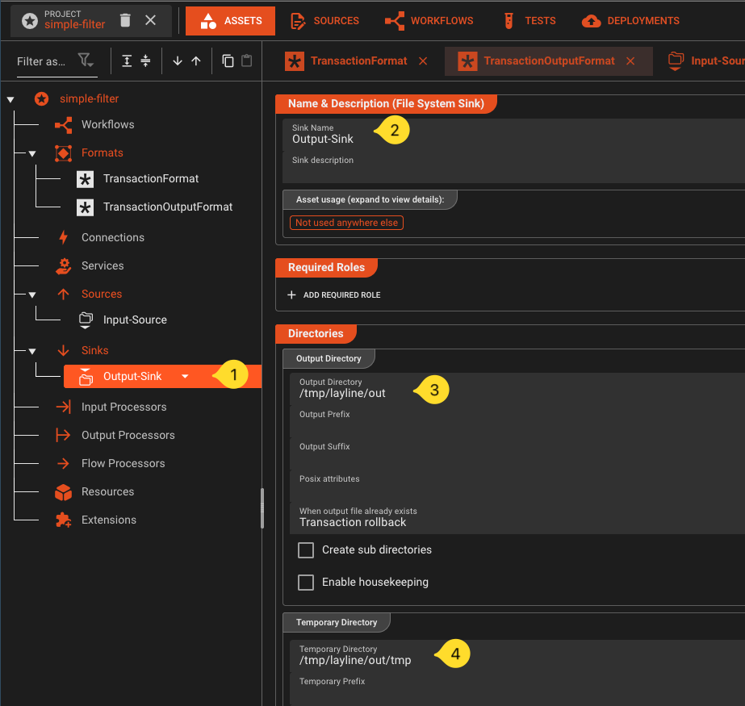
1. Create another **File Sink*, but this time with adjusted folders for files with transaction type "B" (`/tmp/layline/out/type-b` and `/tmp/layline/out/type-b/tmp`).

---

## Step 6: Configure a File Input

1. Now navigate to the **Workflow** tab:
2. In the toolbar, click on **Select Workflow**, and then select **Add a new Workflow**\
   \
   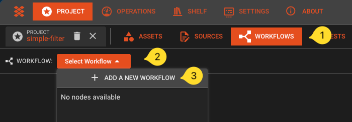\
3. Name it `FilterTransactions`.
4. Click the **Add Processor** button and select a **Stream Input** processor from the list.\
   \
   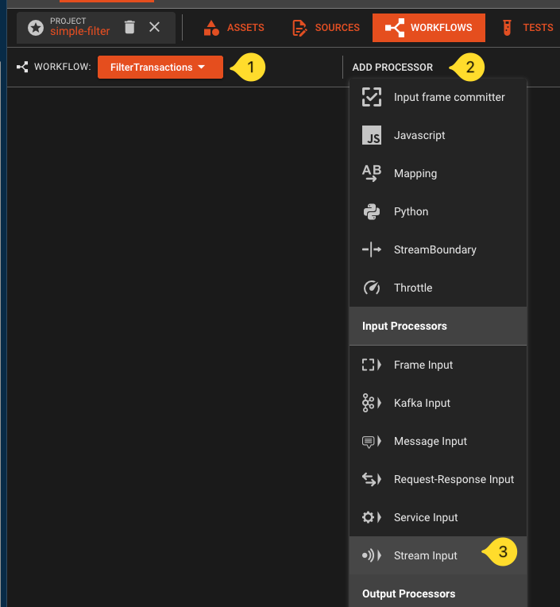\
5. Name it `File-Input` and select `Create without Asset`\
   \
   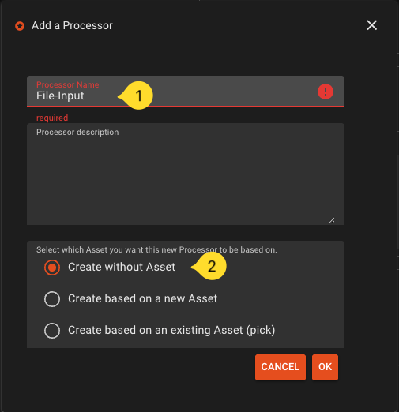\
6. If not already selected, select the new node on the workflow canvas. The right panel whill show the properties of this processor asset. Fill in the following:

   - **Format -> Assigned Format:** Select the `TransactionFormat`.
   - **Source -> Assigned Source:** Select the `Input-Source`.

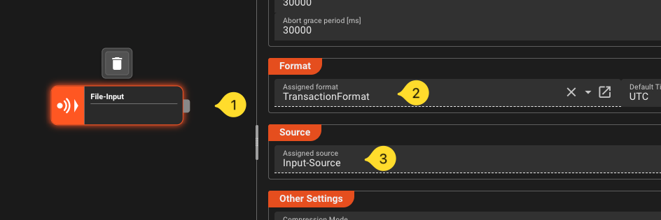

---

## Step 7: Add a Mapping Processor

1. Add  a mapping processor to the Workflow.
2. Name it `MapForOutput`
3. Connect the output port of the File Input processor to the input port of this processor.
4. Select the mapping processor. In the details pane to the right configure the following:

   - **Name:** `MapForOutput`
   - Add one mapping scenario:
       - Name it `HeaderRemoval` 
       - In field **Source message that triggers the scenario** enter `Header` 
       - This will eliminate the header in the mapping. It will then not be forwarded downstream. We do not need it in the output format.
   - Add another mapping scenario
       - Name it `MapForOutput` 
       - In field **Source message that triggers the scenario** enter `Detail` 
       - Enable `Forward original message` and `Update original message`
       - Add the following mapping steps (click **Add Mapping** or the **+-sign** next to a row to add a row):
           - `target.TRANS_OUT.RECORD_TYPE` := `"OUT"`
           - `target.TRANS_OUT.TRANSACTION_ID`` := `source.TRANS_IN.ID`
           - Add a new row and make it a **Conditional-Element** by clicking on the icon in the beginning of the row.\
             Enter `source.TRANS_IN.TYPE == "A"`
               - Click the plus under the conditional element and enter `target.TRANS_OUT.TYPE_LABEL` := `"TYPE_A"` 
           - Add a conditional row and enter `source.TRANS_IN.TYPE == "B"`
               - Click the plus under the conditional element and enter `target.TRANS_OUT.TYPE_LABEL` := `"TYPE_B"` 
           - `target.TRANS_OUT.AMOUNT`` := `source.TRANS_IN.AMOUNT` 
           - `target.TRANS_OUT.DESCRIPTION`` := `source.TRANS_IN.DESCRIPTIO`

For the `MapForOutput` configuration, this is what it should look like:

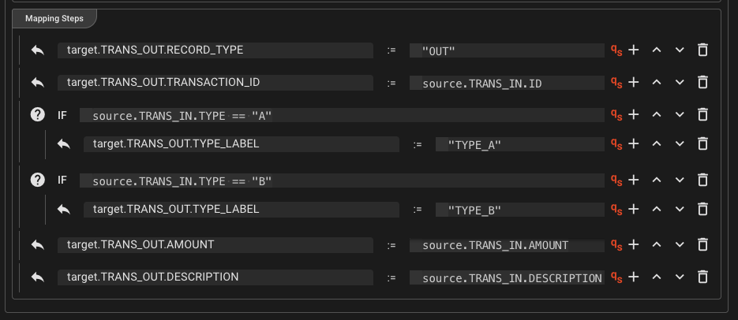

---

## Step 8: Add a Router

1. Add a **Router** processor ot the workflow. Smply name it `Router`.
2. Connect the output port of `Mapping` to the input port of `Router`.
3. Select the `Router` and add an output port to it. The processor now has two output ports.
4. Rename the first one `Output-A`, and the second one `Output-B`. 
5. In the section **Filter & Routing-Rules** clidk **Add at End**. A new rule is created. Fill in the following details for the new rule:

   - **Rule Name:** Name the rule `Label-A`.
   - **Conditions:** Enter `message.Detail.TRANS_OUT.TYPE_LABEL == "TYPE_A"`
   - **Emit Ports:** Select `Output-A`
6. Repeat the previous step and add another rule:

   - **Rule Name:** Name the rule `Label-B`.
   - **Conditions:** Enter `message.Detail.TRANS_OUT.TYPE_LABEL == "TYPE_B"` 
   - **Emit Ports:** Select `Output-B`

This is what the setting for route `Label-A` should look like:
\
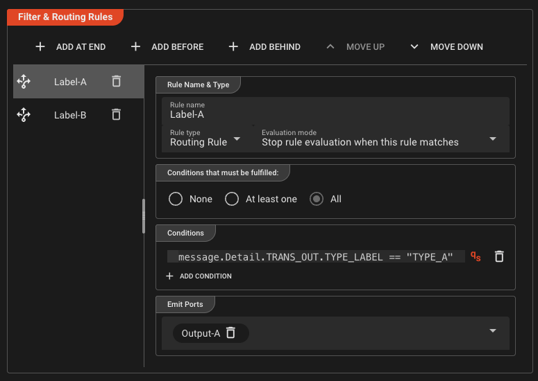

The route for `Label-B` is analogous.

---

## Step 9: Configure File Output A

Create a file output processor for files with transaction type "A".

1. In the **Workflow** tab, add a **Stream Output** asset onto the canvas and connect it to Route A output.
2. If not already selected, select the new File Output node on the workflow canvas. The right panel shows the properties of this processor asset. Fill in the following:

   - **Format:** Select `TransactionOutputFormat`.
   - **Sink:** Select `Output-Sink`.

---

## Step 10: Configure File Output B

Repeat Step 9 for the file with transaction type "B".

1. Create another **Stream Output** asset and connect it to port `Output-B` of the Router output.
2. Configure:

   - **Format:** select `TransactionOutputFormat`
   - **Sink:** Select `Output-Sink`.

---

## Step 11 (Optional): Add trailer processors for stream-end summary rows

Perform this step if you want each output file to end with a trailer row (`TRL,<count>,<sum>`).

### Create a script to perform the trailer calculation

We will create one script which you can use in two places.

1. Navigate to the tab **Sources**.
2. In the tree on the left click on the drop-down next to the **main** leaf and pick **Add file**.
3. In the upcoming dialog, 

   - **Name:** `TrailerCalc.js`, 
   - **File Type:** `JavaScript` (default),
   - **Template:** `Empty JavaScript`
   - confirm with `OK?
4. A code editor for this new file will open to the right. Paste the following code into the editor:

   ```javascript
   /**
   * Simple script to create trailer record.
   * Data for trailer is recorded during processing of detail messages
   */

   const OUTPUT_PORT = processor.getOutputPort('Output-1');

   let recordCount = 0;    // var to count records
   let totalAmount = 0.0;  // var to sum up contained amounts

   export function onMessage() {
     stream.logInfo('--- message: ' + message); // Output to stream log --> see audit trail

     // Check if the message is a detail message
     if (message.exists(dataDictionary.type.Detail)) { 
        recordCount += 1; // increment counter
        totalAmount += message.data.TRANS_IN.AMOUNT; // sum up amount
     }

     stream.emit(message, OUTPUT_PORT); // emit to output port
   }

   export function onStreamEnd() {
     // Create a brand new trailer message
     const trailer = dataDictionary.createMessage(dataDictionary.type.Trailer);

     // Fill the trailer with data
     trailer.data.TRANS_OUT = {
        RECORD_TYPE: 'TRL',
        RECORD_COUNT: recordCount,
        TOTAL_AMOUNT: totalAmount
     }

     stream.logInfo('--- trailer: ' + trailer); // Output to stream log --> see audit trail

     stream.emit(trailer, OUTPUT_PORT); // emit to output port
   }
   ```

### Create a Javascript Asset

1. Navigate to the **Asset** tab
2. In the asset tree on the left click on the leaf for Asset Class **Flow Processors** and add a **JavaScript Asset**.
3. Name it `Trailer-Calc`.
4. In section **Javascript Settings* select the script we just created from the drop-down menu.

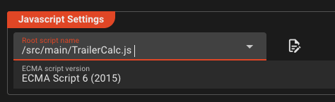

### Add Javascript Processors to the Workflow

1. Navigate to the **Workflows** tab.
2. Add a Javascript Processor:

   - Name it `Trailer-Calc-A`
   - In the options list select **Create based on an existing Asset**
   - In the tree on the right of the dialog, select the Javascript Asset we have created earlier
   - Confirm with **OK**
3. Connect the new Javascript Processor in between Processor `Router` and `File-Output-A`.

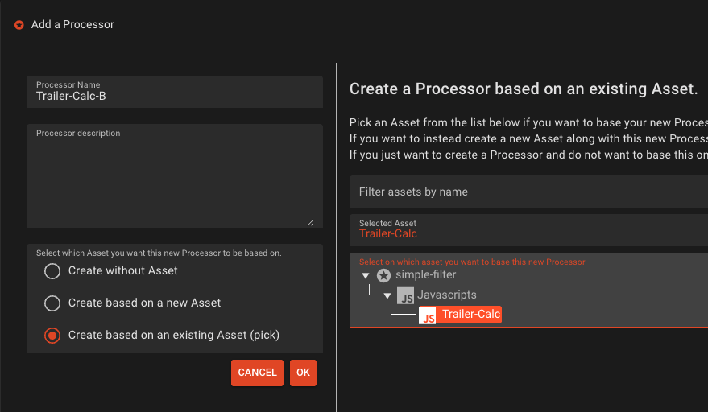

Repeat steps 1 thru 3, but this time

- Name it `Trailer-Calc-B`
- Connect the new Javascript Processor in between Processor `Router` and `File-Output-B`.

We have now added a two new Processors which are both **based on Asset `Trailer-Calc`** which we have defined earlier in the Asset tree. It is important to understand that we are reusing this Asset here in the workflow.

Add **JavaScript Processor A** between Router output `Output-A` and File Output A.

This is what your workflow should look like now:

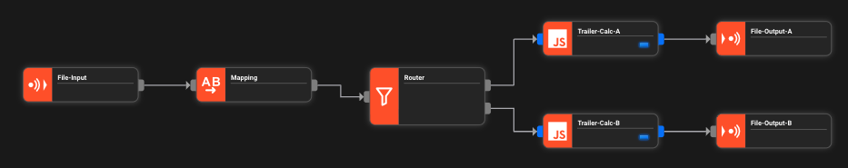

> Note the blue markers in the Javascript Processors which signal that this Asset and its ports are based on another Asset.

---

## Step 12: Deploy to the Reactive Engine

You are done with the Asset and Workflow configuration. You will now create an **Engine Deployment** which defines what should be deployed to your **Reactive Cluster**.

1. In the top menu, navigate to the **Deployment** tab.
2. Create a new **Engine Configuration** 

   - Name it `Local-Engine`.
   - In section **Assets to Deploy** click **Deploy all Workflows**. You only have one, so you do not have to make distinctions here.
   - In secction **Tag**, enter `simple-filter-${build:timestamp}`as the tag name.
3. Save!
4. You have now created a **Engine Configuration** and ready to transfer the Deployment to the Reactive Cluster.

   - In the section **Deploy to Cluster** pick **Deploy to Cluster** from the drop-down.
   - In drop-down **Pick Cluster to Deploy to** select `Local`.
   - Click **Transfer Deployment to Cluster**.
   - If it asks for login, enter `admin / admin`.

If all went well, then you should see this dialog:

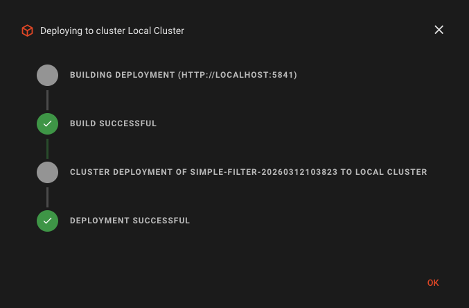

The Deployment has now been transferred to the Reactive Cluster. During this process all possible validations are performed. Should something be wrong, the Deployment will fail and you will get information about the root cause. In this case, fix the problems and retry the deplyment.

---

## Step 13: Start the Deployment

### Activate

We can now start the deployment on the Cluster:

1. Navigate to the top-level **Operations** tab.
2. Select the `Local Cluster` from the drop-down menu, if not already selected. If you are asked for login, then enter `admin / admin`.
3. In the **Cluster** tab, select **Controller ->Deployment Storage. YIf this is your first deployment, you should see this: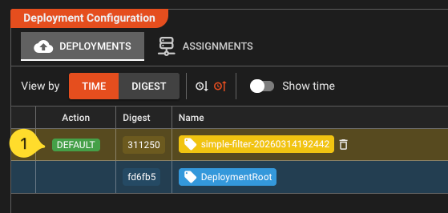
4. Select the top row. A button **Make Default** will appear in the **Action** column. Click it. This will activate the deployment on the cluster.

### Check State

1. Now check the **Engine State** of the Deployment by navigating to the **Engine State** tab. You should see all deployed elements as green:\
   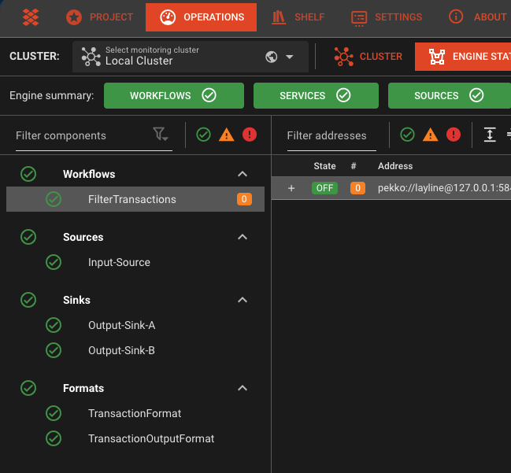
1. If this is not the case, select the item marked as red, and check the problem description on the right panel. Go back and rectify it. If it is simply a wrong or missing folder, then create it. It should automatically turn green. If it is a problem in your configuration, go back to the project, fix it and do a new deployment.

### Scale the Workflow

At this stage, we have no workflow instance running. Technically it would not process. As next step you will **schedule** the workflow, or in other words tell the Cluster how many instances of this workflow you want to run.

1. Go back to the **Cluster** tab
2. Select **Controllers -> Scheduler Master** in the tree on the left
3. On the right panel:

   - Make sure that our Workflow is selected in the drop down (1)
   - Increase **# of target instances** to `1` (2). This will tell the cluster that you want to run one instance of this Workflow.

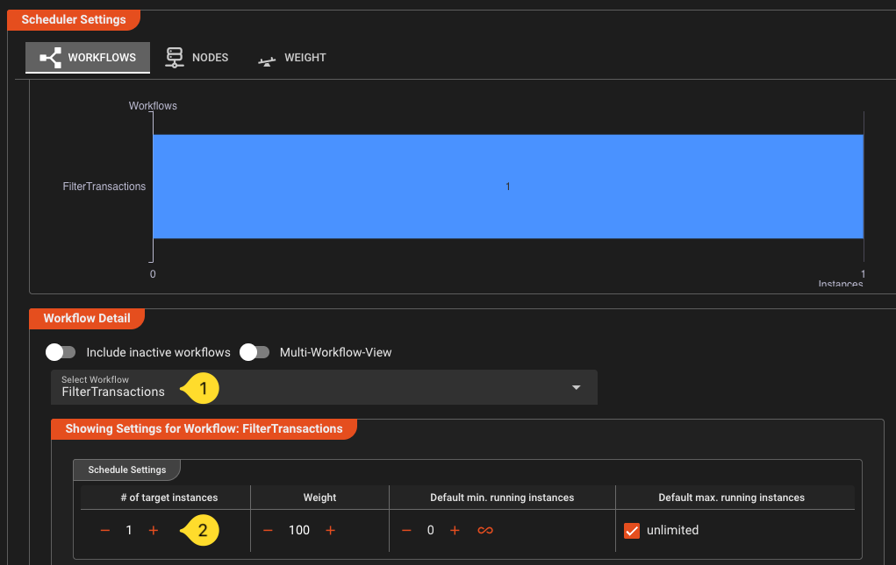

4. After a few seconds you should get visual feedback that the workflow has been instantiated and is running:

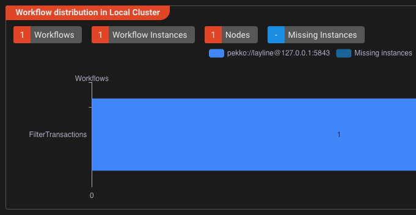

---

## Step 14: Run the workflow

1. Create the necessary directories if you haven't already done so. Adjust if you have a different folder structure:

   ```bash
   mkdir -p /tmp/layline/in /tmp/layline/done /tmp/layline/err /tmp/layline/out/type-a /tmp/layline/out/type-a/tmp /tmp/layline/out/type-b /tmp/layline/out/type-b/tmp 
   ```
1. Create a sample input file  `transactions.csv`:

   ```csv
   HEADER,1.0
   TXN,TXN001,A,100.50,Payment for item 1
   TXN,TXN002,B,250.00,Payment for item 2
   TXN,TXN003,A,75.25,Payment for item 3
   TXN,TXN004,B,500.00,Payment for item 4
   TXN,TXN005,A,125.00,Payment for item 5
   ```
1. Navigate to the  **Operations -->  Audit Trail --> Workflow Instances** tab. You should see our running workflow instance:

    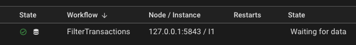
1. Navigate to the **Streams** tab. Once we process a file, it should who up here with the respective status.
1. Now drop the file you have created into `/tmp/layline/in/` (or wherever you created your input folder).
1. Check the **Streams Audit Trail**. If all went well, it should show that the file has been processed.

   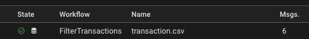

   When you select the entry you should see the detailed logs for this on the right panel:

   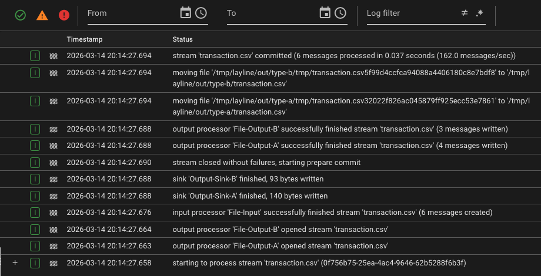
1. The folders `/tmp/layline` should show this:

   ```zsh
   .
   ├── done
   │   └── transactions.csv
   ├── err
   │   └── transactions.csv
   ├── in
   └── out
      ├── type-a
      │   ├── tmp
      │   └── transactions.csv
      └── type-b
         ├── tmp
         └── transactions.csv
   ```

   - `/tmp/layline/out/type-a/transaction.csv` should contain transformed `OUT` rows for type A
   - `/tmp/layline/out/type-b/transaction.csv` should contain transformed `OUT` rows for type B
   - if you added Step 11, each file should also end with one `TRL` row
   - The input file should be moved to `/tmp/layline/done/`

---

## What you've learned

In this tutorial you:

- Created a layline.io project with input and output formats
- Built a workflow with File Input, Mapping Processor, Router, and File Outputs
- (Optional) Added stream-end trailer rows using JavaScript `onStreamEnd()`
- Deployed the workflow to a local Reactive Engine
- Ran it end-to-end and monitored the results

---

## To run it again

layline.io by default keeps track of streams it has already processed. So if you want to run the same file again, you either have to rename it and drop it in the `/tmp/layline/in` folder, or you have to delete it from the **Access Coordinator**. To do the latter go to the **Operations --> Cluster** tab and select **Access Coordinator** from the tree. In the panel on the right pick the **Sources Coordinator** tab and then select the `File-Input` source from the list (should be the only entry if you started fresh). Select and reset the source. This will remove the file from the list of already processes artifacts.

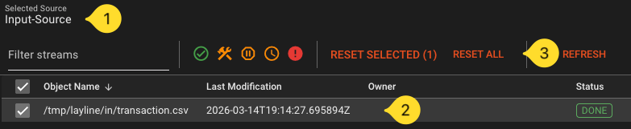

---

## Download ready-made project

If you have configured everything yourself, congrats to you! If you simply read to here and have not configured anything, you can download the whole project [here](https://download.layline.io/sample_projects/simple-filter.zip) and the **transactions.csv** [here](https://download.layline.io/sample_projects/transactions.csv).

To work with the downloaded project, you need to import it:

1. Close any open project first
2. On the right side of the **Project** tab you will find **Import from Archive**. Expand it.
3. Enter the following:

   - **Project name:** `my-project`(or any other name  without whitespaces). The system will also create a folder with this name and unpack the project there.
   - **Target directory:** `/your/target/folder`. This is where the folder will be created
   - **Choose a zip archive:** Drag or add the downloaded zip file to this section.
4. Click **Import**. The project will be imported
5. Click **Open** to open the project.

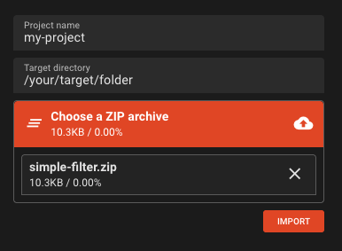

You can not investigate the project yourself using the previous steps as a guideline.


---

## Getting help

If you are interested in layline.io and need help getting started, you can always contact us at support@layline.io.


---

## Next steps

- **[Concepts in depth](/docs/concept)** — understand the architecture and data model in detail
- **[Asset Reference](/docs/assets)** — explore all available source, processor, and sink types
- **[Mapping Processor](/docs/assets/workflow-assets/processors-flow/asset-flow-mapping)** — learn about data transformation
- **[Router](/docs/assets/workflow-assets/processors-flow/asset-flow-filterrouting)** — learn about routing logic
