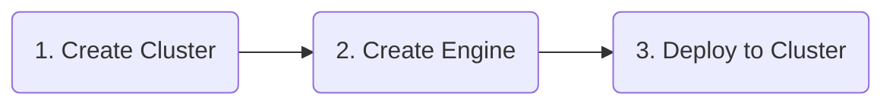

# Deployment

A "**_Deployment_**" is a collection of

- Workflows
- Environments
- Secrets
- Extensions

which are being "_**deployed**_" to a Cluster of Reactive Engines. As you can tell, it is not a Project which is being deployed, but a selected subset of the Project's Assets (which could end up being everything in the Project, however).

Reactive Engines run Workflows (not Projects). Deployments stand for moving one or more Workflows on to a Reactive Engine or a Cluster of Reactive Engines. To do so initially we will have to perform the following steps:

Switch the view over to "_Project **(1)** --> Deployments_ **(2)**":

")

## Creating a Cluster Asset

A "_**Cluster Asset**_" resembles one or more Reactive Engine endpoints which can actually receive and then activate a Deployment.
Therefore before we can deploy, we need to define what these endpoints are.

It is possible to create a Cluster either in global scope or Project scope:

- Project --> The Cluster configuration is specific to this Project.
- Global --> The Cluster configuration is available independent of a Project. Use this when your Cluster stays the same all the time.

We create a Cluster in the Project:

")

Our Cluster consists of one Node ("_http://localhost:5842_") which is the one Reactive Engine running on our local machine.

**When do we define many Nodes here?**
We define many Nodes when

1. We have a Cluster of many Nodes, and
2. We want more than one Node **to be able to receive a Deployment**. In that case if deployment to Node 1 fails, it will try to deploy to Node 2. If that fails then it tries Node 3, until it runs out of configured Nodes.

:::tip How a Deployment is distributed in a Cluster
At this point it is important to understand, that a Deployment is **automatically distributed to the individual Reactive Engines on separate Nodes within a Cluster**. It is part of the concept of layline.io that the one Reactive Engine receiving a Deployment, then automatically distributes it to all other Reactive Engines in the same Cluster. It is not necessary to deploy individually to each Reactive Engine.

")

Therefore, in the Cluster Asset which we define at this stage we only define the Nodes which shall be able to receive a Deployment, not necessarily all of the Nodes in a Cluster (this can also be a dynamically growing and shrinking number of Nodes based on load).
:::

## Creating an Engine Configuration Asset

An "_**Engine Configuration**_" is a collection of

- Workflows
- Environments
- Secrets
- Extensions

which can be deployed together in one go.

We are adding a new one like this:

")

- **Tag (1)** 
  The "_**Tag**_" is how we identify the Deployment on the Cluster, once it has been deployed. A Cluster can hold many different Deployments. One of which can be active at any time. Tag names must be unique throughout a Cluster. In the example we rely on a macro (_$\{build:timestamp\}_) to automatically append the timestamp to the tag. 

:::warning
Trying to deploy a Deployment to a Cluster with a tag which the Cluster already knows (duplicate), will lead to an error.
:::

- _**Workflows to deploy (2)**_ 
  The Workflows which should be deployed.
- _**Environments (3)**_ 
  Parameters which are specific to the environment.
- _**Secrets (4)**_ 
  Secrets (passwords, etc.) which need to be deployed for the specific target.
- _**Extensions (5)**_ 
  Extension configurations (only for Prometheus for now).

## Deploy to Cluster

The minimum configurations for the deployment to the local Reactive Engine are completed. We can now deploy to the Cluster.

- In the _Engine Configuration_ you see a blue box at the top
- Pick as a target type "_Deploy to Cluster_"
- Pick as the cluster to deploy the "_LocalCluster_" which we have defined previously.

")

- Now click "_**Execute Deployment to Cluster**_".

### Login to Cluster

As the Cluster runs independently, it has its own security barrier. In case you are not logged in yet, you will be asked now:

")

The default login here is also "_admin/admin_", just like with the _Configuration Server_. Press "_Login_".

:::warning Check that the Cluster is running and reachable
Make sure it says "_Cluster available_" at the bottom of the login dialog. If not, then your _Cluster Configuration_ is incorrect, or the Cluster cannot be reached (Reactive Engine may not be running, Network issues, etc.).
:::

### Deploy directly to Cluster

The system will try to

1. compile a Deployment from the Assets which have been selected in the Engine Configuration (and their dependent Assets), and
2. send this to the Reactive Engine Node which have configured in "_LocalCluster_".

")

This signals, that the Deployment was successful.

To check, we switch to the `Operations --> Cluster` Tab. Select the correct Cluster **(1)**.

")

The "_**Operations**_" Tab let's us see what's going on on Clusters. It's also possible to perform necessary operations from here. You can select the Cluster from the drop-down box at the top of the Tab.

On the left-hand tree, select `Controllers --> Deployment Storage`. There we can check our recent Deployment **(1)**:

")

### Deploy to File

Instead of deploying directly to Cluster, you may want to deploy to a File instead. This is useful, if you want to exchange Deployments asynchronously. A good example would be to transfer a Deployment to another Cluster outside of current reach, or simply to send a Deployment to someone else via email.

To deploy to a file select `Write to File` **(1)** from the "_Deploy to Cluster_" box. Enter the name of the file where to store the Deployment file **(2)**. 

The Deployment will be stored in a JSON-file which can be used for [upload in a Cluster](/docs/concept/operations/cluster/cluster#deploy-from-file).

If your browser is set to download files to a specific folder always (e.g. to the Downloads folder on your machine, which is the default in most browsers), then you can find it there.
Should your browser settings be such that you are asked where to store the file, then you can select the location yourself.

")
