## First: What is a message? What is an event?

As layline.io is a **message processing platform**, the first question may be: What is a message?

We define a message as a piece of structured data. We use the term _**message**_ and _**event**_ interchangeably.
Examples of structured messages are:

* IoT data
* Telecommunications meta data (e.g. call detail records (CDR))
* Application information
* Travel bookings
* Machine processing data
* Real-time flight information
* Images
* and many, many more.

There are millions of different messages and sources which create them, as well as sinks which need to process them.
New message types are created every day all over the world.

Common characteristics of messages are

* **Well-defined data structure**: It is possible to clearly define the structure of the message.
  The structure is usually a custom structure, which serves the specific use case.
* **Short**: Messages are usually short in nature. Their size typically is in-and-between a few bytes up to a few
  kilobytes.
  Larger messages types are rare

Probably 90% of all existing **moving** data can be considered to be structured messages.

## How layline.io reads, writes, and understands messages

layline.io does not understand any of your specific messages out-of-the-box.
This may sound shocking at first. Wouldn't it be nice of layline.io magically knew all messages formats?
Anyway, before it can process any of such information, you need to tell it **what your messages look like**.
This is where **Format Definition** comes in:

## Format Definition

_Format definition_ describes the process of defining a format, so that layline.io can both read (interpret), and
write (create) it.
For this purpose, and depending on the flavor of the message structure, we provide various options:

* **Generic format editor**: Works for most structured data formats.
  This is probably what you will use most of the time.
* **ASN.1 format editor**: As the name implies, this editor is designed to work
  with [ASN.1](https://de.wikipedia.org/wiki/Abstract_Syntax_Notation_One) structured data.
* **Data Dictionary format editor**: Direct way to extend the global Data Dictionary to store and process additional data not defined by any of the other formats.

You can define as many grammars as you need within a Project. Many times, you will only need two (for input and output).
But as soon as you start working with multiple workflows and many data sources and sinks, you will likely end up with
five, ten or more defined data formats.

## Data Dictionary - Internal Data Representation

One thing which sets layline.io apart from other message processors (e.g. Kafka), is that it was designed to understand
your data from the outset.
It's not enough to just push data around. If you need to work with data you need to understand it. Hence the capability
to define data formats of any kind.

In the previous chapter we explained how layline.io can deal with multiple external data formats all at the same time.
So how is this then internally represented?
Most systems ask you to map external formats to an internal format first.
Not layline.io.

**In layline.io all data internally is represented as a SUPERSET of all data formats which you have defined.**

This is then represented by one big Data Dictionary which in turn is maintained internally by layline.io upon
startup and for the duration of the Project's runtime.

### Lexical Parser

The Data Dictionary is thus dynamically created on startup, based on the sum of all defined and deployed grammars of
your Project.
It is actually a by-product of creating dynamic lexical parsers which provide functionality to read and write the
messages in specified formats.

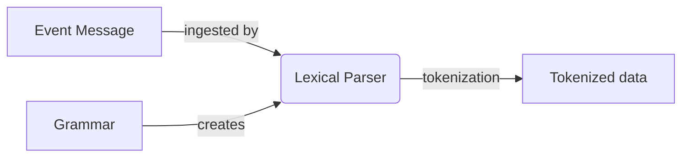

Processing event data, the lexical analyzer recognizes lexical patterns in the data.
Based on the grammar, the analyzer identifies and categorizes individual elements/tokens (tokenization) by applying the
regular expressions given in the grammar.
An element can look like anything; it just needs to be a useful part of the structured event.

## Example

### Example Workflow

Let us explain this concept using a real-life example. Assume we plan to create the following Workflow (1):
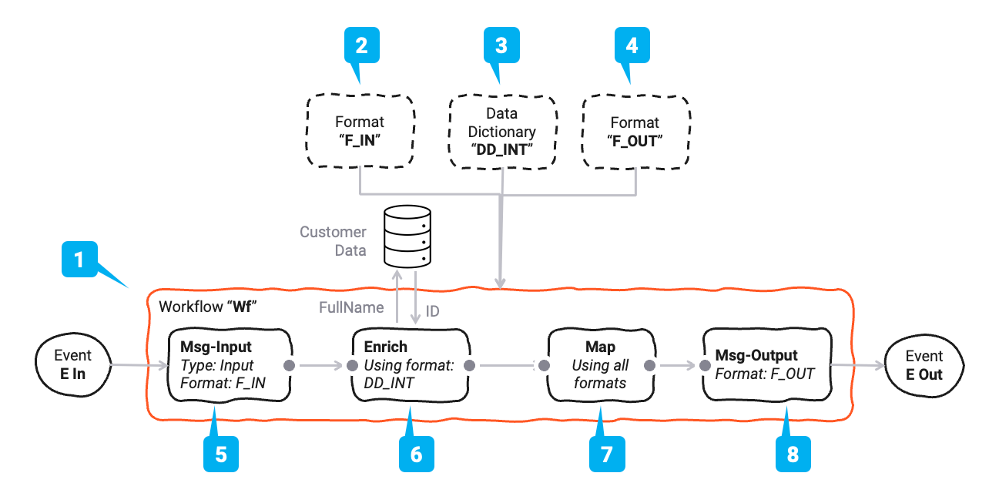

The Workflow has four processors:

| Name           | Ref | Purpose                                                          | Used formats    |
|----------------|-----|------------------------------------------------------------------|-----------------|
| **Msg-Input**  | (5) | Reading an input message from its source                         | F-In            |
| **Enrich**     | (6) | Enriching the message with a Customer ID which is read from a DB | DD              |
| **Map**        | (7) | Mapping the input data F-In and DD to the output format F-Out    | F-In, DD, F-Out |
| **Msg-Output** | (8) | Writing the message to the output sink                           | F-Out           |

### Data Formats

In this Workflow we will be working with three message formats:

| Name      | Ref | Type                   | Purpose                                                                      |
|-----------|-----|:-----------------------|------------------------------------------------------------------------------|
| **F-In**  | (2) | Generic Format         | The input format                                                             |
| **F-Out** | (3) | Generic Format         | The output format                                                            |
| **DD**    | (4) | Data Dictionary Format | A small data dictionary format which will only be used for internal purposes |

Their simple **logical** structure looks like this (example):

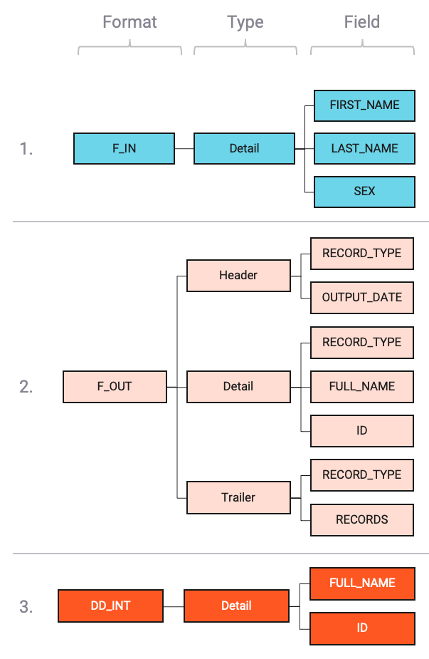

As the image shows, we have one format "_F-In_" with one record type `Detail`.
Another format "_F-Out_" with three distinct record types `Header`, `Detail`, `Trailer`.
And last an internal data dictionary format "_DD_" with only a `Detail`.

`Header`, `Detail`, and `Trailer` are arbitrary names which you define when you configure the formats.
We could have used other names, but this makes the example easier to follow.

Let's take a look at how for example the "_F-Out_" generic format is set up:

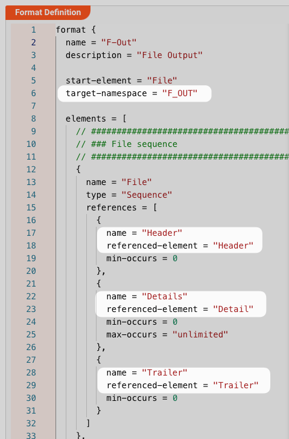

And then further down in the config:

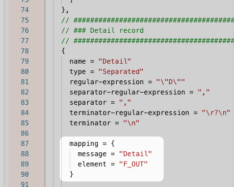

For the "_DD_" data dictionary format the setup in our example would be like this:

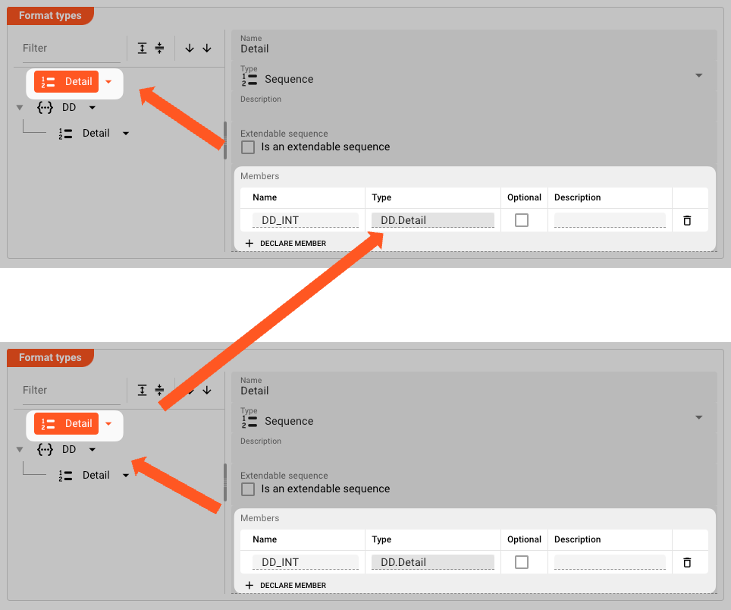

### Resulting Data Dictionary

When the Project is deployed and started, layline.io will create the following, **combined** Data Dictionary:

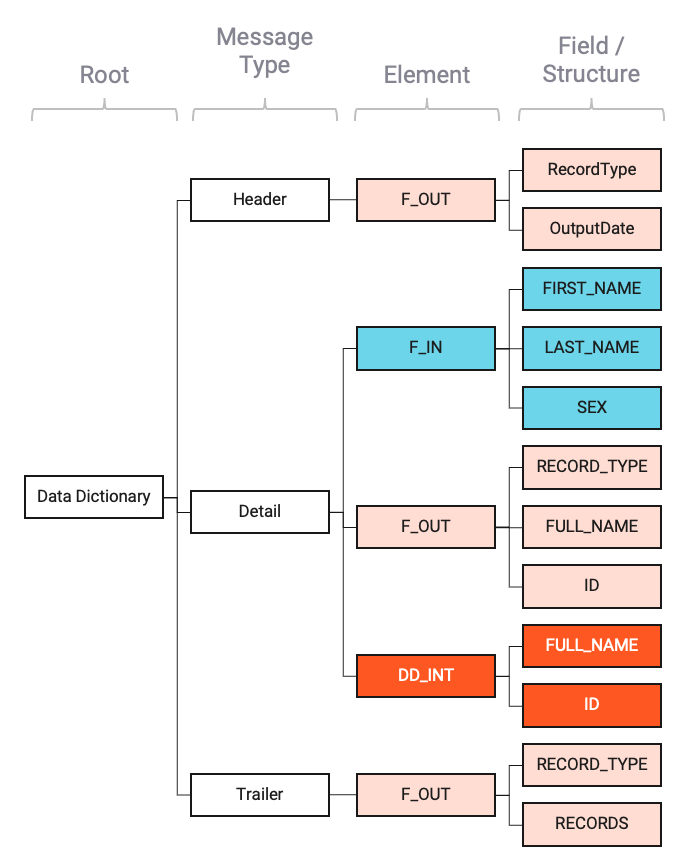

Note how the individual parts of the formats are represented within the global Data Dictionary.
All messages of type `Detail` are gathered under `Detail`.

### Flow of Data through Data Dictionary

Using our example Workflow, we can visualize how the data flows through the Data Dictionary:

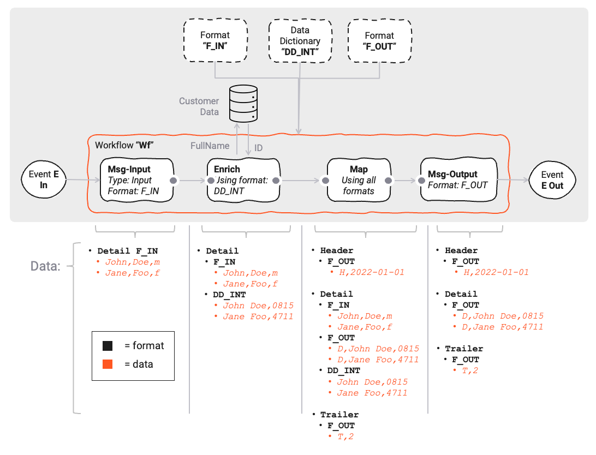

As we can see, the data in the data dictionary grows with each step in the Workflow.

In step (7) **_Map_**, the data is mapped to the output format. Conceptually this looks like this:

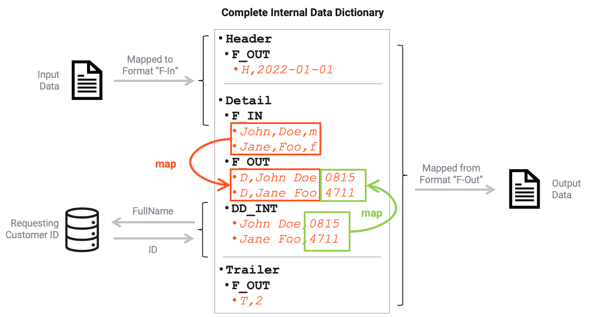

In the final step the **_Msg-Output_** (8) processor is configured to only eject the **_F-Out_** format, and thus only considers that branch from the data dictionary on output.

:::warning Please note that the structure of the Data Dictionary remains the same throughout processing.
The morphing of the data dictionary in the image above is only depicted for demonstration purposes.
:::

### Referencing data within layline.io

In the previous chapters and example we talked about how the internal Data Dictionary is spawned into existence.
Another - equally important - question is how to reference that information within layline.io when working with the data.
We will look at this again using our example from above.

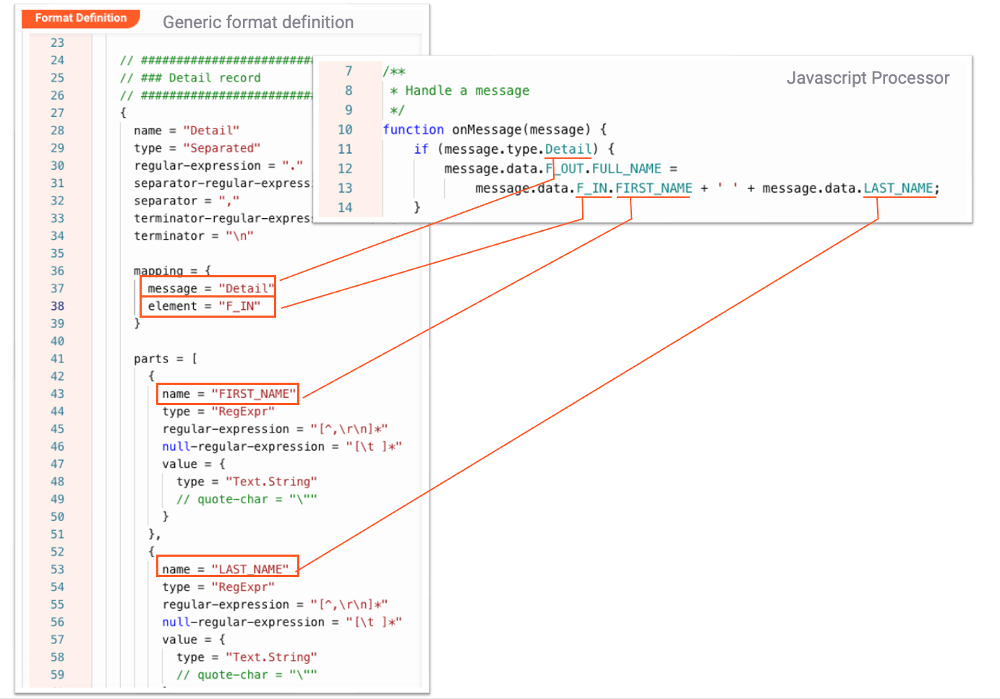

## Pitfalls

### "Defined Format does not exist in Data Dictionary after start."

Formats must be referenced in your Configuration to be included in the Data Dictionary.
Formats which are not used in your specific Deployment will not be included in the global Data Dictionary which is created at runtime.

For example, if you have defined a Format `X`, but are not using it anywhere in your Workflows (e.g. as part of an Input or Output Processor) in the Workflows which you deploy, then this format will
not become part of the global Data Dictionary.

You can force a format to be included in the Data Dictionary by adding is as a dependency to your specific Workflow.
To include them, go to your Workflow Asset and add the dependent formats there:

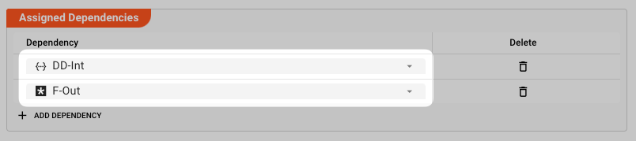

## Conclusion

You should now understand the importance of the Data Dictionary within layline.io.

1. The Data Dictionary is a **central element** within layline.io.
2. It is a **superset** of all defined data formats.
3. It is **created upon starting** a Deployment in a Reactive Cluster **if it is used** as part of what you actually deploy to the Cluster. 
4. You can **reference its parts** in various Flow-Processors within layline.io, e.g. Javascript Processor, Mapping Processor, etc. 

