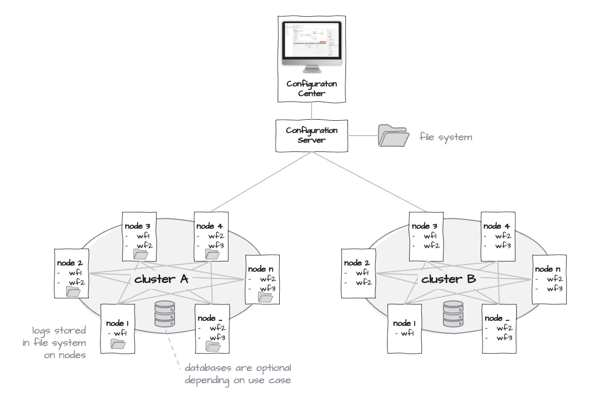
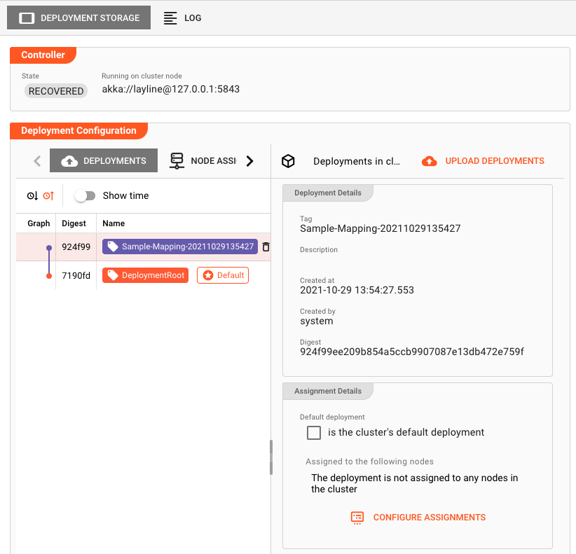
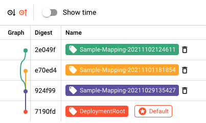
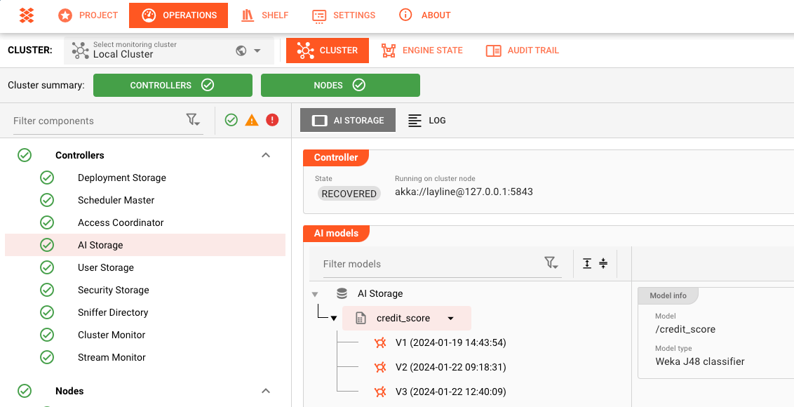

import WipDisclaimer from '/docs/snippets/common/_wip-disclaimer.md';

# Cluster

To understand what we mean by Cluster, let's take a look at the topology of layline.io.

All _Projects_ are created through the Configuration Center. The Configuration Center is hosted by the Configuration Server. The Server also stores the Projects in its file system.

_Clusters_ are a logical assembly of 1 to n _Reactive Engine_ instances. Each instance lives on a _Node_. A Node can be anything that runs a supported operating system. So it is either a physical server, a virtual server, a docker image, etc. Please note, a setup with only one Reactive Engine is a logical Cluster as well.

These Nodes and the Engine(s) living on them can be physically and geographically distributed. As said above, a Reactive Cluster is formed logically. All that's necessary is for the nodes to be able to "see" each other (network-wise).

Multiple clusters can be managed from the same Configuration Center/Server.

## Controllers

layline.io Clusters have a number of _**Controllers**_ which provide services to the Cluster and allow monitoring and management of how the Cluster performs. Each Controller has set of tasks that it is specialized in.

### Deployment Storage

This Controller manages the Deployments in the selected Cluster.

Let's go through the parts:

#### Controller
Shows which Reactive Engine the Controller Service "lives" on in the Cluster. If the Engine fails, the Controller will automatically switch to another available Engine.

#### How Deployments are stored

For the next steps it is important to understand how Deployments are stored in a Cluster: 

:::tip 

- Once you have transferred a Deployment to a Cluster, the Cluster saves it in its own internal persistent storage.
- All _**initial**_ Deployments are based on the so-called "_**Deployment Root**_" as you can tell from the example above. 
- If you change an existing Deployment "_D.1.1_" you can let layline.io know upon Deployment, that this new Deployment "_D.1.2_" is based on the previous Deployment "_D.1.1_". The tree will reflect such dependencies:

In the above example the both the yellow and green Deployment are based on the purple Deployment. The concept is similar to modern Version Control Systems like Git. layline.io also stores the data in a similar fashion in that it only store the differences from version to version.
:::

#### Deployment Configuration

The Deployment Configuration gives you an overview over the Deployments which are available on the Cluster, and allows you to operate them. Let's take a look:

")

There are two tabs "_**Deployments**_" **(1)** and "**Node Assignments**" **(2)**.

##### Deployments Tab

The _Deployments_ Tab gives you a tree view of the Deployments **(3)** which are known to the Cluster and also persisted thereon. We have explained earlier [how the Deployments are sent to a Cluster](/docs/concept/wf-config/deployment#deployment-run).

One of the Deployments is set to "_Default_" **(4)**, which means this would be the Deployment which the Cluster is executing if nothing else has been configured.  "_DeploymentRoot_" has a special role in that it marks an empty Deployment. If this is set to "_Default_" then the Cluster is not executing at all (no Workflows).

Highlighting a Deployment in the list, details its properties to the right **(5)**.

The Box "_**Assignment Details**_" **(6)** shows which Nodes (Engines) the selected Deployment is currently assigned to.

##### Node Assignment Tab

_Node Assignments_ **(1)** shows which which Nodes run which Deployments. In our example there is only one Node. This Node was directly assigned the displayed Sample-Mapping Deployment **(2)**. 

")

#### Activating / Deactivating a Deployment

:::warning Important Action
This action is something which is used commonly to start and stop a Deployment. Read carefully.
:::

Deployments are activated by
1. making it the Default Deployment, or
2. assigning a Deployment to one or more Cluster Nodes.

**Making a Deployment a Default Deployment**

")

In many cases (if not most) one Cluster will only run one Deployment at a time, and do so on all available Reactive Engines.

To activate a Deployment for a whole Cluster, make that Deployment the Default Deployment by 
- selecting it **(1)**, and then
- clicking on the checkbox "is the cluster's default deployment" **(2)**.

This simple action will activate the selected Deployment on the whole cluster.

**Activating a Deployment on selected Nodes (Assginment)**

You can activate a Deployment on a selection of one or more Nodes, instead of the whole Cluster.

To do so
- select the Deployment **(1)**,
- click on "Configure Assignments" **(3)**.

In the dialog that opens, you can assign the Deployment to one or more available Reactive Engines. If you want to assign it to all Engines, you can just make it the default (see above).

")

:::warning One Deployment per Engine
One Reactive Engine can only process one Deployment. If the Engine has been previously assigned a Deployment _D1_ and is now assigned another Deployment _D2_, the Engine will discard D1 and start activating D2.
:::

#### Deleting a Deployment

To remove a Deployment from a Cluster, click the trash can next to the Deployment name.

You can only delete Deployments which are not active. It is also not possible to delete the "_DeploymentRoot_".

#### Deploy from File

As explained [here](/docs/concept/wf-config/deployment#deploy-to-file) a Deployment can be written to a file. To install this Deployment on the Cluster you can select `Upload Deployments` **(1)**:

")

A upload dialog will open. You can add the Deployment file through the "_+_" sign **(1)** or via drag and drop **(2)**.

")

Upon successful upload **(1)** the dialog will expand to show the meta data of the Deployment file under "_Contained Deployment Tag and Description_".

")

You can override the Tag name **(2)** as well as the Description **(3)**. Remember that the tag name must be unique to the Cluster.

The box **(4)** shows the base Deployment that this Deployment will be attached to. It is filled with the Deployment which was pre-selected by you when you clicked on `Upload Deployment` before.

You can change the base Deployment by selecting it from `Browse by Tags` **(5)**.

Finally, click `Apply Deployment` **(6)** to execute the Deployment.

")

### Scheduler Master
#### Controller
Shows which Reactive Engine the Controller Service "lives" on in the Cluster. If the Engine fails, the Controller will automatically switch to another available Engine.

#### How Workflows are "scheduled" (scaled) in a Cluster

:::tip Let's understand how Workflows scale:

- Clusters run Workflows.
- Workflows run on Nodes.
- The same Workflow can run multiple times on a Node
- A Workflow can run on multiple Nodes.

Example:

 in a Cluster (Operations --> Cluster)")

A Workflow "**_W_**" **(1)** is deployed onto a Cluster of Reactive Engines running on 6 Cluster Nodes **(2)**. We have "_scheduled_" this Workflow "**_W_**" to run 12 times **(3)**. This means running the Workflow 12 times in parallel. Because Node 2 is a stronger Node, we set a target number of instances there to be 3 **(4)**. Node 1 is a weaker Node so we only want the Workflow to run a maximum number of 1 **(5)**. 

As a result, the layline.io Reactive Cluster will balance the 12 instances across the 6 Nodes as shown in the image.

If we request additional instances, they will be balanced out across Nodes 2 to 6. Node 1 will not be considered because it has a "_Max. Instances_" setting of one **(5)**.

:::

#### Scheduler Settings

A "_Schedule_" means the plan, of
- which Workflows should run  
- how many times, 
- and on which Nodes.

The "_Scheduler Settings_" display the current settings and support you in adjusting them.

")

There are two tabs `Nodes` and `Workflows` in the Scheduler Settings **(1)**. The _Nodes_ tab shows a tree view prioritizing Nodes and their Workflows, while the _Workflows_ view reverses this from the perspective of the Workflows.

In the above image there is only one Node and Workflow configured, but it works the same way for multiple Nodes and Workflows. 

Selecting the "_Scheduler_" Node in the tree will give you an overview over all Nodes and Workflows. Selecting the Workflow itself ("_FileMapping_") will only show you the settings of this Workflow on the given Node ("_akka://layline@127.0.0.1:5843_").

Let's look at the Scheduler Overview (all Nodes and Workflows):

##### Box: Workflow Distribution in Cluster

Here we can see how Workflows are distributed within a Cluster. For the Workflow "_DWH-to-File_" we have scheduled a total number of instances of 10 **(2)**  The Ring **(1)** shows how these 10 instances are distributed across a number of Nodes in the Cluster (5 Nodes in this slightly different example).

")

We can adjust the "_target number of running instances_" **(3)** through the +/- buttons. Increasing the number to 12 for example will instruct the Cluster in real-time to increase the number of this Workflow to 12. If no maximum or minimum number of instances per Node have been defined, the Cluster will itself balance on where to run the additional two instances of this Workflow. This will be mirrorred in the display wihtin a few seconds.

Running Workflows are competing for available resources. We can therefore assign a "_weight_" to a type of workflow to be considered across Nodes in a Cluster. The weight will then be taken in to consideration when the Reactive Cluster manages the balance between Nodes.

In the following example we have a small Cluster with two Nodes **(1) and (2)**. Our Deployment has two Workflows **_A_** and **_B_**. Workflow A runs a total of 5 instances and is configured with a weight of _**50**_. Workflow B runs a total of 1 instance and has a weight of _**100**_.

The following images shows how the Workflows are distributed across the two Nodes.

")

The "_Total Weight_" on each Cluster Node is then "_200_" **(3)** on Node 1 and "_150_" **(4)** on Node 2 respectively. Unless there are other restrictions (e.g. max instances per Node), layline.io will balance Workflows across available Nodes so that the total weight per Node is as evenly distributed as possible. 

**Let's see what happens when adding another instance 7 of Workflow A:**

")

layline.io - having the choice on where to mount instance 7 of Workflow A will always opt for the Node **which will lead to the smallest total weight difference between all available Nodes**.

:::tip Weights and Single Node Clusters
Please note, that differing weights have no impact in single Node clusters.
:::

##### Box: Workflow Assignments

"_Workflow Assignments_" shows how Workflows are assigned on a per Node basis. 

")

You can view the number of running instances per Node **(1)**, then also set the minimum and maximum number of instances supposed to run on this Node **(2)** and **(3)**. Checking "_unlimited_" for the minumum number of instances, essentially means that it can be zero on this Node.

##### Box: Workflow Weight Distribution

This is essentially an overview of all weight distributions of all workflows. Changing the weight here **(1)** is the same as changing it above. 

")

::: details UI change coming
We know that the Scheduler display is not perfect. But it serves the purpose for now. We are planning to completely overwork it shortly.
:::

### Access Coordinator

The "_**Access Coordinator**_" **(1)** is a process (Controller) which manages access to sources and resources. 

It supports you in:

1. checking which Sources were processed,
2. resetting Sources,
3. checking which Resources are available or occupied

**Sources** **(2)** are data sources which deliver data to layline.io. This could be dynamic sources like File- or Service-sources. 

**Resources** **(3)** are Sources and Sinks which are static and limited in nature. A great example is a partitioned Kafka topic with a fixes number of partitions. Each partition can then be reserved and released as required. If all partitions are reserved, the resource is depleted until released.

")

On the Access Coordinator section you can see whether all moving parts are operational. In our example we see:

- Controller: Operational and running on the displayed Engine URL.
- Sources Coordinator: Running and handling a total of 8 different sources
- Resource Coordinator: Running and handling a total of 10 different resource groups

#### Sources Coordinator Tab (2)

This is where you can view and manage processed Sources. In the example below we do have 8 Sources **(1)**. Sources displayed here, wil be recognized as having been configured as part of a Workflow. 

Selecting a Source will display it's processing history (Files in our example to the right). It is possible to then filter the Sources by name, or by their processing state. 
##### Removing an item from the Source list

:::tip Important to know: Source tracking
The Cluster keeps track of all processed Source items **(6)**. It will not process them again, unless they are removed from the Sources list.
:::

We may want to remove an item from the processing history of a given Source so that we can reprocess the item. In case you are wondering why a reprocessing may not work when you resupply the item to the source, there is a good chance that layline.io still recognizes this item as already processed and will therefore ignore it.

To remove the item select the it from the list **(6)** and then click `Reset selected`. To delete the complete list, select `Reset all`. If you then resupply the item you deleted from the list, it will be reprocessed. 

")

#### Resources Coordinator (3)

The "_**Resource Coordinator (3)**_" is like the Source Coordinator, except that it monitors the static resources (see above).

On the left is the list of individual Resource Groups. Again, selecting an entry **(4)** will display the details on the right. In the example below you see that the selected Resource Group is a Kafka topic separated into 10 partitions. You can see partitions 5 and 6 are currently reserved **(5)**. The other partitions are not occupied at the time.

##### Freeing up resources

To free up a resource you need to select it **(5)** and click `Revoke selected` **(6)**. Click `Revoke all`  **(7)** to reset all partitions in this example.

")

### AI Storage

The "_**AI Storage**_" is a process (Controller) which manages AI models.

### User Storage

To learn how to manage Users, Roles and permissions within layline.io, please check [User Storage](/docs/concept/operations/cluster/operations-user-storage) for user management on the cluster, or .

### Security Storage

layline.io by its nature is destined to connect to a multitude of systems and APIs which are usually protected by security mechanisms --> the "_Secrets_". 
These Secrets can be very sensitive in nature. But when working with such Secrets, there are always some risks in them being exposed, 
especially in Software and Configuration Projects where Secrets may end up in clear text more often than not, for lack of better mechanisms. 

To learn how to manage secrets resp. security within layline.io, 
please check [Security Storage](/docs/concept/operations/cluster/operations-secret-storage) for security management on the cluster.

### Stream Monitor

### Starting / stopping Workflows

<WipDisclaimer></WipDisclaimer>
