import WipDisclaimer from '../../snippets/common/_wip-disclaimer.md'

## Synopsis

In layline.io we try to make it as easy as possible to use artificial intelligence in your Workflows.
This includes both training and using AI models.

## Concept

Machine learning is a method of data analysis that automates analytical model building.
It is a branch of artificial intelligence based on the idea that systems can learn from data, identify patterns and make decisions with minimal human intervention.

Machine learning algorithms are often categorized as supervised or unsupervised.

### Supervised vs. Unsupervised

Supervised machine learning algorithms can apply what has been learned in the past to new data using labeled examples to predict future events.
Starting from the analysis of a known training dataset, the learning algorithm produces an inferred function to make predictions about the output values.
The system is able to provide targets for any new input after sufficient training.
The learning algorithm can also compare its output with the correct, intended output and find errors to modify the model accordingly.

In contrast, unsupervised machine learning algorithms are used when the information used to train is neither classified nor labeled.
Unsupervised learning studies how systems can infer a function to describe a hidden structure from unlabeled data.
The system does not figure out the right output, but it explores the data and can draw inferences from datasets to describe hidden structures from unlabeled data.

---

In layline.io for the moment, we support only supervised learning.

This feature is still in its infancy, but growing fast.
For starters, we started implementing [Waikato Environment for Knowledge Analysis](https://www.cs.waikato.ac.nz/~ml/weka/ "Waikato Environment for Knowledge Analysis") (Weka).
Weka is a collection of machine learning algorithms for data mining tasks developed and provided by the Waikato University, New Zealand.

It mainly contains classification machine learning algorithms which others have widely adopted.

Over time, we will add more AI frameworks and features to layline.io.

### How supervised learning works in a nutshell

#### 1. Training

Supervised learning is a process of providing input data as well as correct output data to the machine learning model.
The aim of the model is to map the input to the output.
The model is trained using the training set of data (1a).
The training set contains input data and the corresponding output data.
The model is trained until it achieves an acceptable level of performance (1b).
This results in a model that can be used to predict the output for a given input (1c).
It is also possible to use an existing model to predict the output for a new input.

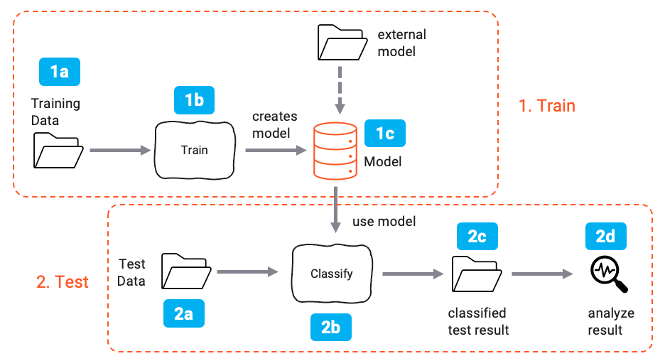

#### 2. Testing

Once the model is trained, it is tested using the test set of data (2a).
The test set contains input data and the corresponding output data.
The model which was created in the training phase is used to predict the output for the test data (2b).
This results in a predicted output (2c).

The predicted output is then compared with the correct output (2d).
The performance of the model is evaluated by calculating the error rate.

If the error rate reaches an acceptable level, the model is ready to be used for prediction.

### How this works in layline.io

In layline.io the process is basically the same

1. You provide a training set of data
2. You train a model
3. You provide a test set of data
4. You test the model
5. You use the model to predict the output for new input data

Results analysis is not yet supported, however.
We recommend using third party tools to analyze the results of your AI models (e.g. [kaggle](https://www.kaggle.com/) or for Weka use
their [desktop application](https://waikato.github.io/weka-wiki/downloading_weka/)).

You can train and use AI models in layline.io in 3 steps:

#### 1. Create a data format which is used to train and classify the data.

Usually the first thing you would want to do is define the data format which is used to train and classify the data.

Many times the data format to train the data is the same as the one used to classify data.
In this case, you only have to define the data format once.
If your training and classification formats are different, simply define two different data formats.

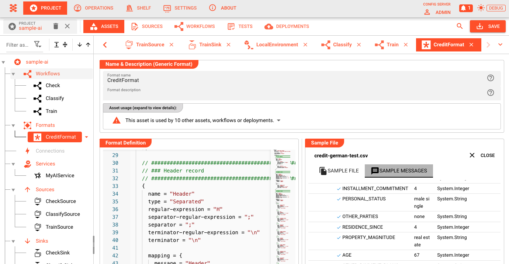

In our example, we are using a simple CSV data format which is used for both training and classification.

#### 2. Create the AI Model Resource

The [AI Model Resource](../../assets/resources/asset-resource-ai-model) is used to define the technical details of the AI model.
You should create this resource before you start creating the Workflow.

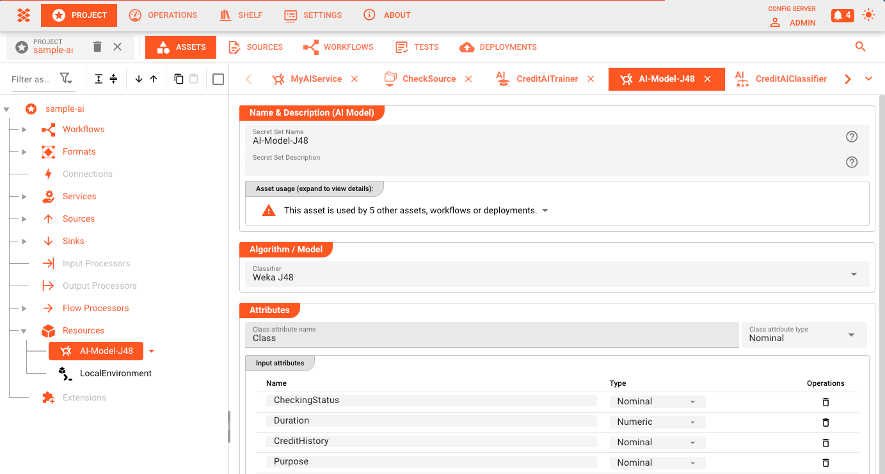

In this resource, you define things like:

* The AI algorithm to be used (e.g. _Weka J48_)
* The input attributes which are used to train the model
* Settings specific to the selected AI algorithm

An example of the attributes could be:

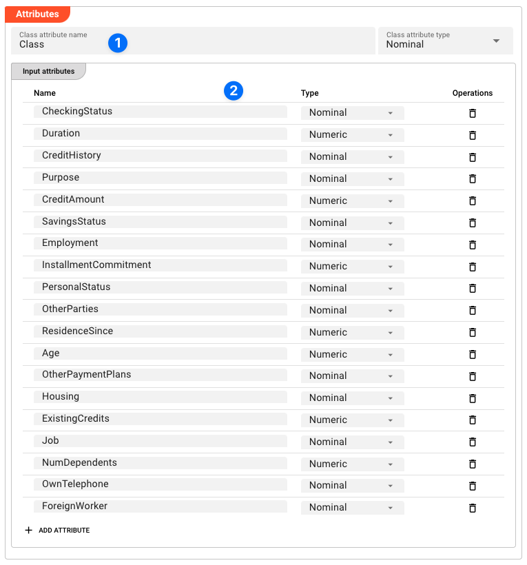

In this example you can see the defined classification attribute (our example named 'Class'(1)), as well as all the attributes which are used to train the model (2).
In subsequent steps, this Resource is then used by the [AI Training Asset](../../assets/processors-flow/asset-flow-ai-trainer) to train the model and then
the [AI Classifier Asset](../../assets/processors-flow/asset-flow-ai-classifier) to use the model to infer the results.

#### 3. Create an AI Trainer Asset

Next, you create an [AI Training Asset](../../assets/processors-flow/asset-flow-ai-trainer) (1).
This Asset is then used within a Workflow to train the AI model based on the training data and the AI Model Resource.

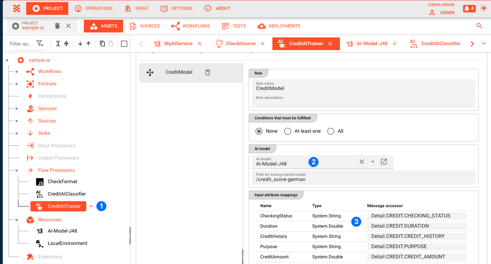

The AI Training Asset is linked to the AI Model Resource by selecting the AI Model Resource in the configuration (2).

All attributes defined in the AI Model Resource are mapped to the actual data format which is used to train the model (3).

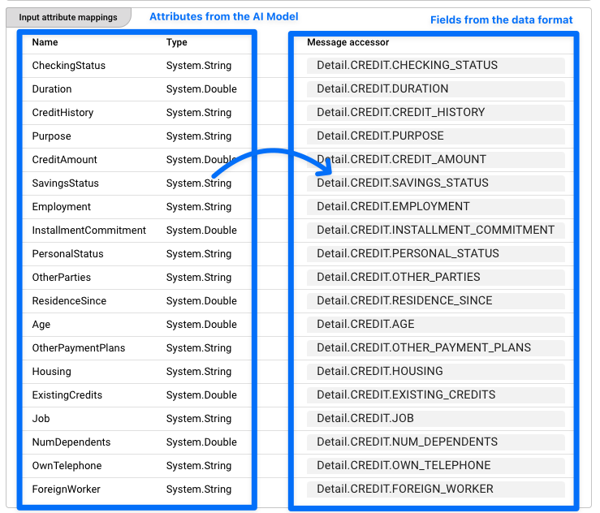

#### 4. Create an AI Classification Asset

Next to the AI Trainer Asset, you create an [AI Classification Asset](../../assets/processors-flow/asset-flow-ai-classifier) (1).
This Asset is then used within a Workflow to infer the results based on the input and the AI model.
The setup is very similar to that of the AI Trainer Asset.

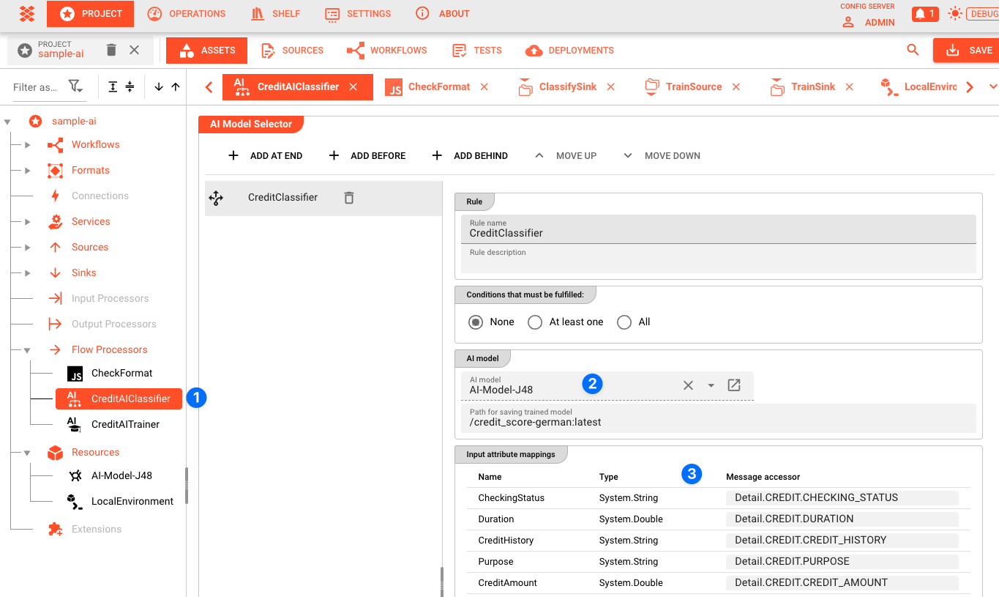

The AI Classification Asset is linked to the AI Model Resource by selecting the AI Model Resource in the configuration (2).

All attributes defined in the AI Model Resource are mapped to the actual data format which is used to classify the data (3).

One important difference to the AI Trainer Asset is that the AI Classification Asset allows you to define the output field which will hold the classification result (1).

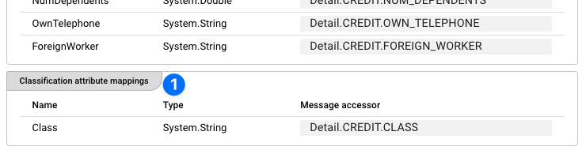

Again, the attributes in the data format are mapped to the attributes defined in the AI Model Resource (2).

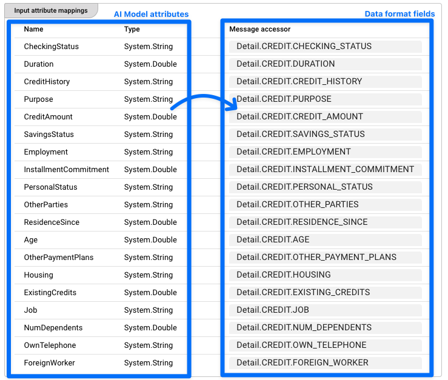

#### 5. Create a Training Workflow

Now that we have the AI Model Resource and the AI Training Asset, we can create a Workflow which is used to train the AI model based on a set of training data.

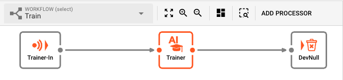

At the center of the Workflow is an [AI Training Processor](../../assets/processors-flow/asset-flow-ai-trainer) which uses the previously configured AI Training Asset to train the AI model based on
the training data.

When data passes through it, the AI Training Asset will train the AI model based on the training data and the AI Model Resource.
It therefore is the link between the AI Model Resource Asset and the training data.

The result is a trained AI model that can be used in a production Workflow in which data needs to be inferred from the input and the model.

At the center of the Workflow is an [AI Training Processor](../../assets/processors-flow/asset-flow-ai-trainer) which is used to train the AI model.
Based on the incoming training data, the AI Training Asset will train the AI model and store it in the [AI Model Storage](../operations/cluster/cluster#ai-storage).

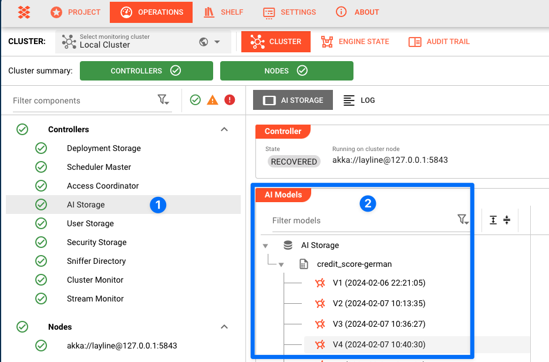

Each time the Workflow is executed, the AI Training Asset will train the AI model again and create a new version of the AI Model.
This is useful if you want to retrain your AI model based on new training data but retain previous training versions.
A new version of the model will be stored in the AI Model Storage each time you train it.

Alternatively, you can also use the [AI Model Storage](../operations/cluster/cluster#ai-storage) to import and store a model that was trained outside layline.io.
Once imported, you can use that model to infer data in a production Workflow.

#### 6. Create a Production Workflow

To use the trained model, you create a production Workflow in which you want to infer data based on the input and the model.

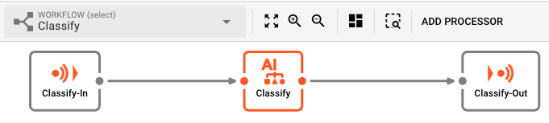

At the center of the Workflow is an [AI Classifier Processor](../../assets/processors-flow/asset-flow-ai-classifier) which we previously created to infer data based on the input and the referenced AI
model.
The AI Classifier Processor will load the AI model from the [AI Model Storage](../operations/cluster/cluster#ai-storage) and use it to come up with the data based on the input parameters.

The output which is generated by this Workflow will hold the classified data.

#### 6. That's it

You have now created:

* An AI Model Resource which is used to define the technical details of the AI model.
* A Workflow which is used to train your AI model based on a set of training data.
* A Workflow which is used to infer data based on the input and the model.

Of course, the example we used is basic.
You can create way more complex Workflows which use the AI model to infer data based on the input and the model.
The inferred data can then be used to do something else, either within the Workflow or by passing it to another system.

#### One more thing: AI Service

In addition to this,
you can also define an [AI Service](../../assets/services/asset-service-ai)
which you can use to access the AI Model Store within a [Javascript Asset](../../assets/processors-flow/asset-flow-javascript).

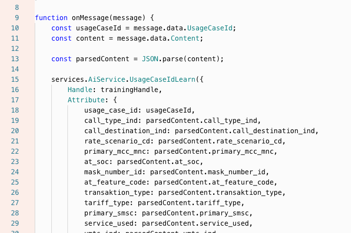

The Service provides a number of functions which allow you to train the model and/or use the model to infer results from it by providing the necessary parameters.

## Further resources

* [AI Model Resource](../../assets/resources/asset-resource-ai-model)
* [AI Training Asset](../../assets/processors-flow/asset-flow-ai-trainer)
* [AI Classifier Asset](../../assets/processors-flow/asset-flow-ai-classifier)
* [AI Service](../../assets/services/asset-service-ai)
* [AI Model Storage](../../concept/operations/cluster/cluster#ai-storage)

---

<WipDisclaimer></WipDisclaimer>

