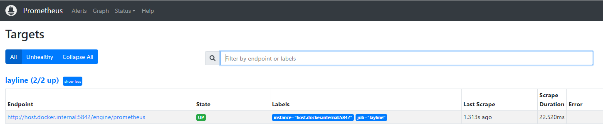

import WipDisclaimer from '/docs/snippets/common/_wip-disclaimer.md';

## Concept

layline.io allows capturing information about processed data in metrics. 
In fact, it provides default metrics that can be gathered during workflow processing in reactive clusters. 
Next to this, you can add own metric counters for your workflow configuration through Javascript.

### How to export layline.io default metrics?

Any data processed through reactive clusters can automatically trigger dropwizard metrics available in layline.io. 
Getting access to the various metrics requires the following steps:

1. Add layline.io “_**Extensions Asset**_” for Prometheus
2. Add mapping of available metrics
3. Include the “_**Extensions Asset**_” for “_**Deployment**_”

#### 1. Adding layline.io “Extension” for Prometheus

You can find "_**Extensions**_" within the "_**Asset Viewer**_"


Add a _**Prometheus Extension**_ by clicking on the available _**Add new Asset**_ option.


Define `Name` and `Description` for the newly created _**Prometheus Extension**_.

#### <a name="mappingMetrics"></a> 2. Adding mapping of available metrics

It is mandatory to define at least one mapping entry within the section _**Prometheus Mapping**_ to enable 
exports of metric data. Press the +-button to add new mapping entries


(1) Match

Define the regular expression that should match the metric you would like to use for gathering statistics, for instance

- Counter.Source.*.Files

> which counts the processed files grouped by <_**SourceName**_\>

(2) Name

> You will be able to find the respective metric matching your regular expression under the here defined name 
within the export of metric values, for instance _**io_layline_counter_source_files**_.

Press the +-button appearing in the Operations column to add Labels for the respective metric. 
These are made up of a _**Label**_-Name (1) and a Label-_**Value**_ (2) to capture your metric mapping. 
Labels ease the filtering when using the metric in subsequent evaluations


 
As usual for regular expression-based mapping, it is important to ensure the right ordering of mapping entries!


**Note**: layline.io provides a default _**Prometheus Mapping**_ that can be downloaded from Git [here](https://github.com/layline-io-sample-projects/sample-metrics-mapping). 
This allows to import a standard mapping to get a first glance on using metrics. 
The mapping can be re-configured resp. enhanced to project specific needs at any time.


#### 3. Include the Extension Asset for Deployment

It is necessary to include the _**Prometheus Extension**_ for the deployment towards the reactive cluster. 
This can be done in two different approaches:

(1) Assign the created Extension directly to the _**Project**_


Choosing this option ensures metrics are exported in any Engine Configuration.

(2) Add the created Extension to your _**Engine Configurations Asset**_


Choosing this option allows to decide per Engine Configuration whether metrics exports should be performed.

More Details on Workflow Deployment can be found [here](../wf-config/deployment).

The next reactive cluster activation of the deployment will generate metrics that can be accessed resp. 
exported through the url: ` http://localhost:5842>/engine/prometheus` 
(pls. exchange *localhost* and *port* information according to individual setup). 
You can view the exported information in your web browser, and it will look something like this:


### <a name="defaultMetrics"></a> layline.io default metrics

Metrics available in layline.io are named in a namespace approach using the dot notation. 
All metric names start with the constant “Counter”. 
The next level after a dot indicates the layline.io processing entity the metric relates to:

| **Metric namespace** | **Usage**                                                        |
|----------------------|------------------------------------------------------------------|
| Counter.Source       | any Source related metrics, e.g. number of input files           |
| Counter.Sink         | any Sink related metrics, e.g. number of created output messages |
| Counter.Workflow     | Workflow related statistics                                      |
| Counter.Service      | metrics in conjunction with implemented service functions        |
| Counter.Connection   | counter for the number of connection failures                    |

Subsequent individual layers are dynamically created during processing since they depend 
on the actual configuration implemented for a layline.io project.

**Note**: Depending on the used assets only some of the counters might be available. 

<u><b> Counter.Source.*.* </b></u>

The third level in this counter reflects the <_**sourceName**_\>. Hence, for each of the following 
elements we will see one counter per configured and processed source


| **No.** | **Metric**                                                                                 | **Usage**                                                                                    |
|---------|--------------------------------------------------------------------------------------------|----------------------------------------------------------------------------------------------|
| 1       | Counter.Source.<_**sourceName**_\>.Files                                                   | number of files processed by a source                                                        |
| 2       | Counter.Source.<_**sourceName**_\>.FilesCommit                                             | number of files committed by a source                                                        |
| 3       | Counter.Source.<_**sourceName**_\>.FilesRollback                                           | number of files rolled back by a source                                                      | 
| 4       | Counter.Source.<_**sourceName**_\>.FilesCancel                                             | number of files cancelled by a source                                                        |
| 5       | Counter.Source.<_**sourceName**_\>.Messages                                                | number of messages created by a source                                                       |            
| 6       | Counter.Source<_**sourceName**_\>.Failures                                                 | number of failures for a source                                                              |
| 7       | Counter.Source.<_**sourceName**_\>.Backlog                                                 | counter for the backlog of a source                                                          |
| 8       | Counter.Source.<_**sourceName**_\>.Lag.<_**topic**_\>.<_**consumer**_\>.<_**partition**_\> | counter for the lag of a sourceName’s Kafka topic messages per consumer / topic / partition  |
 

<u><b> Counter.Sink.*.* </b></u>

The third level in this counter reflects the <_**sinkName**_\>. Hence, for each of the following elements we
will see one counter per configured and processed sink 


| **No.** | **Metric**                                   | **Usage**                             |
|---------|----------------------------------------------|---------------------------------------|
| 1       | Counter.Sink.<_**sinkName**_\>.Files         | number of files processed by a sink   |
| 2       | Counter.Sink.<_**sinkName**_\>.FilesCommit   | number of files committed by a sink   |
| 3       | Counter.Sink.<_**sinkName**_\>.FilesRollback | number of files rolled back by a sink |                                                          |
| 4       | Counter.Sink.<_**sinkName**_\>.FilesCancel   | number of files cancelled by a sink   |
| 5       | Counter.Sink.<_**sinkName**_\>.Messages      | number of messages created by a sink  |            
| 6       | Counter.Sink.<_**sinkName**_\>.Failures      | number of failures for a sink         |

<u><b> Counter.Service.*.* </b></u>

The third level in this counter reflects the <_**serviceName**_\>. Hence, for each of the following elements 
we will see one counter per configured and processed service


| **No.** | **Metric**                                    | **Usage**                                            |
|---------|-----------------------------------------------|------------------------------------------------------|
| 1       | Counter.Service.<_**serviceName**_\>.Calls    | total number of function calls for a service         |
| 2       | Counter.Service.<_**serviceName**_\>.Failures | total number of function call failures for a service |

One level deeper, counters per <_**serviceName**_\> and <_**functionName**_\> are collected 

| **No.** | **Metric**                                                                   | **Usage**                                               |
|---------|------------------------------------------------------------------------------|---------------------------------------------------------|
| 3       | Counter.Service.<_**serviceName**_\>.Function.<_**functionName**_\>.Calls    | total number of calls of a specific service function    |
| 4       | Counter.Service.<_**serviceName**_\>.Function.<_**functionName**_\>.Failures | total number of failures of a specific service function |

<u><b> Counter.Workflow.*.* </b></u>

The third level in this counter reflects the <_**workflowName**_\>. Hence, for each of the following 
elements we will see one counter per configured and processing workflow and - where applicable - 
<_**workflowInstanceOrdinalNo**_\> (abbreviated in the following as <_**wfInstance**_\>)

| **No.** | **Metric**                                                          | **Usage**                                                |
|---------|---------------------------------------------------------------------|----------------------------------------------------------|
| 1       | Counter.Workflow.<_**workflowName**_\>.Instances                    | total number of active workflow instances                |
| 2       | Counter.Workflow.<_**workflowName**_\>.Input.Messages               | number of input messages for all instances of a workflow |
| 3       | Counter.Workflow.<_**workflowName**_\>.<_**wfInstance**_\>.Restarts | total number of active workflow instance restarts        |

One level deeper, counters per <_**workflowName**_\>, <_**wfInstance**_\> and <_**processor**_\> are collected

| **No.** | **Metric**                                                                                                   | **Usage**                                                                   |
|---------|--------------------------------------------------------------------------------------------------------------|-----------------------------------------------------------------------------|
| 4       | Counter.Workflow.<_**workflowName**_\>.Output.<_**processor**_\>.Messages                                    | number of output messages for all instances of a workflow for an output     |
| 5       | Counter.Workflow.<_**workflowName**_\>.<_**wfInstance**_\>.Output.<_**processor**_\>.Messages                | number of output messages for an output processor of a workflow instance    |
| 6       | Counter.Workflow.<_**workflowName**_\>.<_**wfInstance**_\>.<_**processor**_\>.<_**outPortName**_\>.Messages  | number of messages for a processor's output port within a workflow instance |

Specific counters for Profiling, currently mainly used for layline.io internally purposes, are available 
for customized dashboards as well: 

| **No.** | **Metric**                                                                                                                        | **Usage**                                                                                                                                                    |
|---------|-----------------------------------------------------------------------------------------------------------------------------------|--------------------------------------------------------------------------------------------------------------------------------------------------------------|
| 7       | Counter.Workflow.<br/><_**workflowName**_\>.<_**wfInstance**_\>.<_**processor**_\>.Profiling.PushMessage.<_**pushMessageType**_\> | processor specific Profiling.PushMessageType counters; here available pushMessageTypes:<br/>- TotalDuration<br/>- Events<br/>- MinDuration<br/>- MaxDuration |

<u><b> Counter.Connection.*.* </b></u>

The third level in this counter reflects the <_**connectionName**_\>. Hence, for the following element we will see one counter 
per configured connection

| **No.** | **Metric**                                          | **Usage**                      |
|---------|-----------------------------------------------------|--------------------------------|
| 1       | Counter.Connection.<_**connectionName**_\>.Failures | number of connection failures  |

### Configuring Prometheus and Grafana using Docker

A possible approach to create visualization dashboards for the exported 
metrics could be a Prometheus and Grafana setup using Docker. 

We assume Docker is installed on your system. If not, install it first: [Developers - Docker](https://www.docker.com/get-started/) .

In case you are not yet running a Prometheus and Grafana Docker setup in your environment you can make use of the following docker-compose.yaml:

*docker-compose.laylinemonitoring.yml*:
```
version: '3.8'
networks:
    monitoring:
        driver: bridge
volumes:
    prometheus-data-layline:
        driver: local
    grafana-data-layline:
        driver: local
services:
    prometheus:
        image: prom/prometheus:v2.37.9
        container_name: prometheus_layline
        ports:
            - '9090:9090'
        command:
            - '--config.file=/etc/prometheus/prometheus.yaml'
        volumes:
            - ./config/prometheus.yaml:/etc/prometheus/prometheus.yaml:ro
            - ./data:/prometheus
        restart: unless-stopped
    grafana:
        image: grafana/grafana-oss:latest
        container_name: grafana_layline
        ports:
            - '3000:3000'
        volumes:
            - grafana-data-layline:/var/lib/grafana
        restart: unless-stopped 
```
*/config/prometheus.yaml*: 
```
global: 
  scrape_interval: 15s 
scrape_configs: 
  - job_name: 'layline' 
    scrape_interval: 5s 
    static_configs: 
      - targets: ['host.docker.internal:5842'] 
    metrics_path: '/engine/prometheus' 
```

Environments where Prometheus and Grafana are already running, you’ll need to make sure to add layline.io metrics 
as Target-Endpoints to the Prometheus setup. (pls. adapt *host.docker.internal* and *port* information 
according to individual setup). 

You should be able to find the following after having activated the docker instance: 



At this stage you can enter your layline.io Prometheus Data Source to your Grafana instance:


The Prometheus server URL needs to reflect the given container-name and port configured for Prometheus service definition in the docker-compose file.

Now, all is settled to start building Dashboards using layline.io metrics! 

### How to configure user specific metrics?

In case layline.io metrics are not covering the specific needs for collecting statistics about your data processing, 
it is possible to add user specific metric collections through Javascript.

#### 1. Create and update user specific Metrics

Since Metrics are mostly used to count statistical data, the following section might use Counter as a synonym for Metric.

Creating Metrics in layline.io using Javascript is supported through the available static interface _**Metrics**_. 
Incrementing a counter’s value is performed through the increment method.

```js
let counter; 
    
counter = metrics.getCounter('Counter.User.Name');
    
counter.increment(); 
```

The `getCounter()` method expects the parameter `name`. 
It either creates and returns a new counter-object or simply returns an already existing object for incrementing its value. 
Any named counter created through this method is unique within the reactive cluster. 
Issuing `getCounter()` with the same name a second time references to the same counter and its content. 
Hence, counters should be created within the `onInit()` method. 
In case you need a more flexible approach for creating named counters (for instance: incoming data influences counter naming), 
make sure to implement an approach to check available counters (during runtime) before calling the `metrics.getCounter('Name')` method. 
It is recommended to approach the naming of your counters similar to the principles explained in [layline.io default metrics](#defaultMetrics).
Hence, any user specific metrics should start with “Counter.User”.

Let’s assume you are processing an input file with Header, Trailer and Detail records. 
Header and Trailer are discarded as well as specifically flagged Detail records. 
You would like to count DISCARDED vs. PROCESSED records per recordType through metrics.

The following function creates counters named ‘Counter.User.InputRecordTypes.<_**recordType**_>.<_**state**_>’ 
whereby <_**recordType**_> and <_**state**_> are generic since they are determined during processing based on incoming data. 
The COUNTER_USER_INPUT_RECORDTYPES array is used to keep track of counters already created.

```js
let COUNTER_USER_INPUT_RECORDTYPES = {
} 

...

/**
 * Get the customized Metrics counter Counter.User.InputRecordTypes.<recordType>.<state>
 */
function getCounterInputRecordTypes(recordType, state) {

    let counter = COUNTER_USER_INPUT_RECORDTYPES[recordType + '/' + state];
    
    if (! counter) {
        counter = metrics.getCounter('Counter.User.InputRecordTypes.' + recordType.toLowerCase() + '.' + state);
        COUNTER_USER_INPUT_RECORDTYPES[recordType + '/' + state] = counter;
    }

    return counter;
}   
```

Within the processing logic the counters are incremented according to their logic:

```js
function onDetail (message) {
    let recordType = message.data.SMPL_IN.RECORD_TYPE;

    if (recordType == 'D') {

        // MAPPING Detail Records only

        if (message.data.SMPL_IN.DESCRIPTION.startsWith("FALSE")){
            getCounterInputRecordTypes(recordType, 'DISCARDED').increment();
            stream.emit(message, DEVNULL_PORT);            
        }
        else {
            message.data.SMPL_OUT = {        
                RECORD_TYPE : message.data.SMPL_IN.RECORD_TYPE,
                FILE_NAME   : fileName,
                DATE        : message.data.SMPL_IN.DATE,
                DESCRIPTION : message.data.SMPL_IN.DESCRIPTION,
                CREATE_DATE : DateTime.now()   
            }
            getCounterInputRecordTypes(recordType, 'PROCESSED').increment();
            stream.emit(message, OUTPUT_PORT);
        }    
    }
    else {        
        stream.emit(message, DEVNULL_PORT);
        getCounterInputRecordTypes(recordType, 'DISCARDED').increment();
    }    
}  
```

Counters that are created would be:

* Counter.User.InputRecordTypes.H.DISCARDED
* Counter.User.InputRecordTypes.T.DISCARDED
* Counter.User.InputRecordTypes.D.DISCARDED
* Counter.User.InputRecordTypes.D.PROCESSED

In the next step these counters need an appropriate mapping to ensure they are exported correctly.

#### 2. Map user specific Metrics in layline.io Prometheus Extension 

Mapping user specific Counter is done in the same way as described in [Adding mapping of available metrics](#mappingMetrics).


By now you will be able to find your metrics by the configured Name **'io_layline_user_counter_InputRecordTypes_State'** in your metrics export.


A sample project to follow up on this topic can be found here (to be available soon)

<WipDisclaimer/>