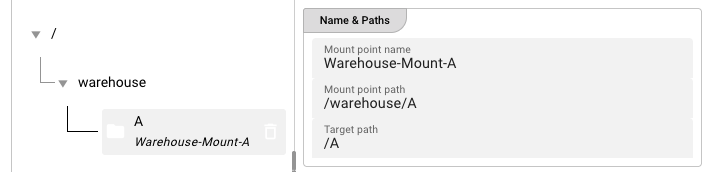
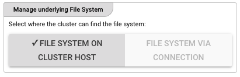
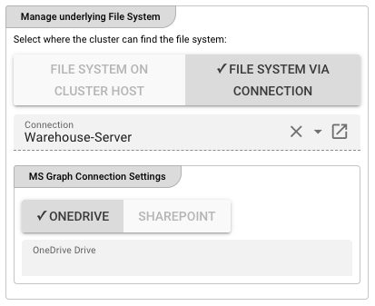
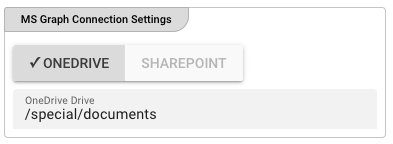
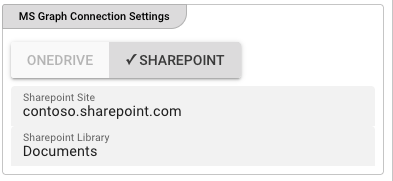

import WipDisclaimer from '../../../snippets/common/_wip-disclaimer.md'

# Connection Virtual File System

## Purpose

Provides a Virtual File System (VFS) connection that abstracts over multiple storage backends — including local filesystems, SMB/CIFS shares, NFS mounts, and cloud storage accessed via other connection types. VFS Sources and Sinks use this connection to read from or write to any supported backend without changing their configuration.

## Prerequisites

- A **Virtual File System Connection** asset requires no external service credentials itself — it is a pure abstraction layer.
- Child assets (Sources or Sinks) that use this connection must reference a valid VFS mount path.
- If using SMB, NFS, or cloud-storage backends, ensure the Reactive Engine node can reach those endpoints.

## Configuration

### Name & Description

")

**Name** — Unique name for this asset within the project. Spaces are not allowed.

**Description** — Optional description of what this connection is used for.

**Asset Usage** — Shows how many times this asset is referenced by other assets, workflows, or deployments. Expand to see the full list.

### Required Roles

")

In case you are deploying to a Cluster with Reactive Engine Nodes that have specific Roles configured, you can restrict use of this Asset to Nodes with matching roles. Leave empty to match all Nodes.

### Mount Points

")

The **Mount Points** section defines the accessible filesystem namespaces. Each mount point maps a logical VFS path prefix to a concrete backend.

Click **"+ ADD A MOUNT POINT"** to add a new mount point entry to the tree.

#### Mount Point Tree

The tree on the left shows the hierarchy of mount points. Each node displays:

- The **mount point path** (e.g., `/warehouse/A`)
- The **target path** on the backend (e.g., `/A`)

Use the toolbar to reorder, copy, or paste mount point entries.

#### Name & Paths (Detail Panel)

When a mount point is selected in the tree, the detail panel shows:

**Mount point name** — The display name for this mount point entry.

**Mount point path** — The logical VFS path prefix that child assets will reference. Must start with `/`.

**Target path** — The actual filesystem path on the backend (local path, SMB share, NFS mount, etc.).

### Manage underlying File System

The **Manage underlying File System** section defines how the cluster accesses the file system for this mount point. Choose one of two modes:

#### File System On Cluster Host

Select this mode when the file system is accessible directly on the cluster host. The cluster will access the file system using the local operating system.

#### File System Via Connection

Select this mode when the file system is accessed via a connection asset (e.g., SMB, NFS, or cloud storage). Choose the connection from the dropdown.

##### OneDrive Settings

When **MS Graph Connection Settings** is configured and **OneDrive** is selected, specify the target OneDrive drive path.

**OneDrive Drive** — The path within the user's OneDrive to mount (e.g., `/special/documents`).

##### SharePoint Settings

When **SharePoint** is selected, configure the following:

**SharePoint Site** — The SharePoint site URL (e.g., `contoso.sharepoint.com`).

**SharePoint Library** — The target document library within the site (e.g., `Documents`).

### Test Settings

")

**Local filesystem path** — A local filesystem path used for testing connectivity during configuration. This path is not used at runtime — it is only a probe target for the configuration-time connection test.

## Behavior

The Virtual File System Connection itself performs no I/O. Its only runtime purpose is to resolve mount point paths for child Source and Sink assets. All actual file operations are delegated to the configured mount point backends at workflow execution time.

Validation of mount point paths occurs when a child asset that uses this connection is saved or deployed.

## See Also

- [**VFS Source**](../sources/asset-source-virtual-fs.md) — Read files from a VFS mount
- [**VFS Sink**](../sinks/asset-sink-virtual-fs) — Write files to a VFS mount
- [**SMB Connection**](../connections/asset-connection-smb) — SMB/CIFS backend for VFS
- [**NFS Connection**](../connections/asset-connection-nfs) — NFS backend for VFS

---
<WipDisclaimer></WipDisclaimer>
