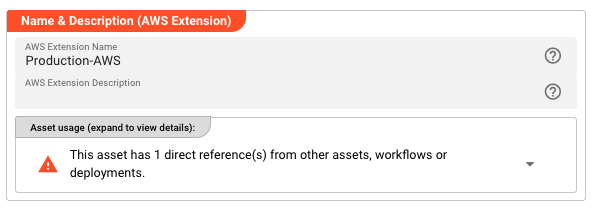
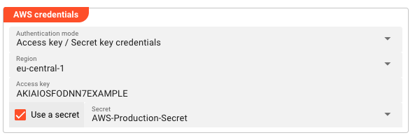

# Extension AWS

> Deploys an AWS macro resolver that provides `${aws:...}` macros for accessing
> AWS Systems Manager Parameter Store and AWS Secrets Manager values at runtime.

## Purpose

The AWS Extension deploys a macro resolver into your engine configuration. Once
deployed, you can use `${aws:<name>}` macros anywhere in your project where
macros are supported — Environment assets, connection strings, configuration
values, etc. The resolver connects to AWS and fetches values from either
AWS Systems Manager (SSM) Parameter Store or AWS Secrets Manager.

**Deployment model:** Add the AWS Extension to an Engine Configuration under
"Other Resources". Only one AWS Extension should be deployed per engine
(behavior with multiple extensions is undefined).

## Prerequisites

- AWS credentials configured in the extension (IAM role, access keys, or
  default credential chain)
- Parameters/secrets must exist in AWS SSM Parameter Store or Secrets Manager
  before they can be referenced

## Configuration

### Name & Description

**Name** — A unique identifier for this AWS Extension within the project.

**Description** — Optional human-readable explanation of this extension's purpose.



### AWS Credentials

**Authentication mode** — How layline.io authenticates with AWS:

| Mode | Behavior |
|------|----------|
| No credentials required | No authentication. Use only for public resources or local testing. |
| Use the default credential provider chain | Uses AWS SDK default chain (environment variables, ~/.aws/credentials, IAM role, etc.). |
| Access key / Secret key credentials | Explicit IAM credentials with optional Secrets Manager integration. |

**Region** — The AWS region for SSM/Secrets Manager API calls (e.g., `eu-central-1`, `us-east-1`).

**Access key** — The IAM access key ID (shown when using Access key / Secret key mode).

**Use a secret** — When enabled, the secret key is retrieved from a layline.io Secret asset instead of being stored directly.

**Secret** — Reference to a layline.io Secret asset containing the AWS secret access key (shown when "Use a secret" is enabled).



## Usage

Once deployed as an Engine Configuration "Other Resource", reference AWS values using macros throughout your project:

```yaml
# In an Environment asset
databasePassword: ${aws:prod/db/password}
apiKey: ${aws:arn:aws:secretsmanager:eu-central-1:123456789:secret:api-key}
jiraToken: ${aws:${lay:awsParamStoreArn}/jiraPassword}
```

**Macro syntax:**

| Pattern | Resolves To |
|---------|-------------|
| `${aws:<parameter-name>}` | SSM Parameter Store parameter by name |
| `${aws:<secret-name>}` | Secrets Manager secret by name |
| `${aws:<param-arn>}` | SSM parameter by full ARN |
| `${aws:<secret-arn>}` | Secret by full ARN |

### Using Parameter Store ARN Prefix

Configure the **Parameter Store ARN** field to set a base ARN prefix. Then reference parameters using the `${lay:awsParamStoreArn}` macro:

```yaml
# If Parameter Store ARN = arn:aws:ssm:eu-central-1:123:parameter/config/layline/prod
# Then ${aws:${lay:awsParamStoreArn}/dbPassword} resolves to the value at:
# arn:aws:ssm:eu-central-1:123:parameter/config/layline/prod/dbPassword
```

## Behavior

- Macros are resolved at runtime when the value is accessed
- The AWS Extension must be deployed in the active Engine Configuration for `${aws:...}` macros to resolve
- Parameter Store values are retrieved using the GetParameter API
- Secrets Manager values are retrieved using the GetSecretValue API
- Encrypted SSM parameters are automatically decrypted (requires appropriate IAM permissions)

## Example

**Scenario:** Multiple workflows need to access a shared database password stored in AWS Secrets Manager.

**Setup:**
1. Create an AWS Extension named `Production-AWS` with access key credentials for `eu-central-1`
2. Add the extension to your Engine Configuration under "Other Resources"
3. In your Environment asset, reference the secret:
   ```yaml
     db-password: ${aws:prod/database/password}
   ```

**Result:** When the workflow runs, the `${lay:db-password}` macro resolves to thre value of the database password stored in AWS Secrets Manager. You can also use the macro direct as `${aws:prod/database/password}`. When the secret rotates, workflows automatically pick up the new value on next execution — no deployment needed.

## See Also

- [Secret](../resources/asset-resource-secret) — Secure storage for sensitive values within layline.io
- [Environment](../resources/asset-resource-environment) — Project-wide configuration values
- [Engine Configuration](../../deployment-assets/asset-deployment-engine) — Runtime configuration including "Other Resources"
