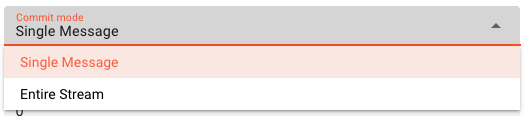
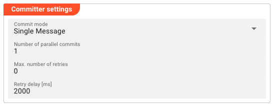
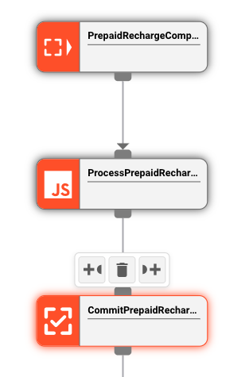

import WipDisclaimer from '../../../snippets/common/_wip-disclaimer.md'
import FailureHandling from '../../../snippets/assets/_failure-handling-flow.mdx';
import InputPorts from '../../../snippets/assets/_input-ports-single.md';
import OutputPorts from '../../../snippets/assets/_output-ports-single.md';

# Input Frame Committer

## Purpose

The **Input Frame Committer** (Processor type: `commitFrame`) finalizes the processing of messages that originate from message queue sources such as Amazon SQS or Apache Kafka.

When a message is consumed from a queue, it remains locked (hidden) until explicitly committed — signaling that processing succeeded and the message can be removed or its offset advanced. The Input Frame Committer handles this final commit signaling automatically after a Workflow has finished processing a message.

This processor is typically placed at the **end of a Workflow** or after processing stages, immediately before the message leaves the Workflow. It is the last processor in the chain that touches the message.

Use this Processor to:

- Automatically delete messages from SQS queues after successful processing
- Advance Kafka consumer offsets after successful processing
- Control whether individual messages or entire streams are committed together
- Retry failed commits with configurable parallelism and backoff

## Prerequisites

This Processor consumes messages from **message queue sources** (SQS, Kafka, etc.) that attach an `InputFrame` to each message. The `InputFrame` carries the metadata needed to commit — for SQS, this is the receipt handle; for Kafka, it is the partition and offset.

The Processor does not work with messages that lack an `InputFrame` (e.g., messages from file-based sources).

## Configuration

### Name & Description

**`Name`**: Name of the Asset. Spaces are not allowed in the name.

**`Description`**: Enter a description.

### Input Ports

<InputPorts></InputPorts>

### Output Ports

<OutputPorts></OutputPorts>

### Committer Settings

#### Commit mode

Controls when the `InputFrame.commit()` is called for a message.

| Option | Behavior |
|--------|----------|
| **Single Message** | After the message is processed, the processor calls `message.commit()` immediately. On success the message is emitted downstream. On failure, the commit is retried with backoff. |
| **Entire Stream** | Messages are emitted immediately (passthrough). The processor defers calling `message.commit()` until a `Commit` event fires — signaling the entire stream has finished processing. All messages in the stream are then committed together. If any commit fails, retries apply to the entire stream. |

<div className="frame">



</div>

#### Number of parallel commits

The maximum number of concurrent commit operations the processor will have open at any time (1–64). Increase this to improve throughput on high-volume queues, but note that it also increases memory usage. Default: `1`.

#### Max. number of retries

The maximum number of retry attempts before a failed commit is treated as permanent and triggers the configured failure handling. Default: `0` (no retries).

#### Retry delay [ms]

The time in milliseconds the processor waits before retrying a failed commit. Default: `2000` (2 seconds).

<div className="frame">



</div>

### Failure Handling

<FailureHandling></FailureHandling>

## Behavior

### How Commit Works

The `message.commit()` call is made **automatically** by the processor — no script or manual action is required. What happens under the hood depends on the source type:

- **SQS:** `message.commit()` calls `SQS.DeleteMessage` using the message's receipt handle, permanently removing the message from the queue
- **Kafka:** `message.commit()` advances the consumer offset for the message's partition, allowing the consumer group to progress

### Single Message Mode

The processor processes one message at a time per parallel lane. After the Workflow stage that receives the message finishes processing it, the processor calls `message.commit()`. On a successful commit response the message is emitted downstream. On a failure, the processor retries up to `Max. number of retries` times with `Retry delay` milliseconds between attempts. After all retries are exhausted, the configured failure handling takes over.

### Entire Stream Mode

When the stream starts, the processor begins emitting messages immediately without committing. The `InputFrame` for each message is held in an internal queue. When a `Commit` event fires (signaling the stream has fully completed), the processor attempts to commit all queued `InputFrame`s together. If any commit fails, the retry and failure handling applies to the entire batch.

Use Entire Stream mode when you want atomic processing — either the entire stream is committed, or none of it is. This is useful for batch/file processing where an incomplete result should not be partially committed.

### Commit Failure and Retry

If `message.commit()` throws an exception (e.g., SQS delete fails, Kafka broker is unreachable), the processor:

1. Increments the retry counter
2. Waits for `Retry delay [ms]`
3. Retries the commit up to `Max. number of retries` times
4. If all retries fail, triggers the configured **failure handling** (ignore, retry event/message, rollback stream, etc.)

### Inheritance

All Committer Settings fields are inheritable — a child Asset can override individual values while inheriting the rest from its parent.

## Example

A Workflow reads messages from an **Amazon SQS queue**, processes each message with a JavaScript Processor, and then needs to delete the message from the queue after successful processing.

**Workflow chain:**

```
SQS Source → JavaScript Processor → Input Frame Committer
```

<div className="frame">



</div>

**Configuration:**

| Setting | Value |
|---------|-------|
| Commit mode | `Single Message` |
| Number of parallel commits | `1` |
| Max. number of retries | `3` |
| Retry delay [ms] | `2000` |

**What happens:**

1. SQS Source delivers a message to the JavaScript Processor
2. JS Processor processes the message (e.g., transforms data, writes to a database)
3. Input Frame Committer receives the processed message, calls `message.commit()`
4. SQS deletes the message from the queue
5. On success, the message is emitted downstream (end of Workflow)
6. On failure (e.g., SQS delete fails), the processor retries 3 times with 2-second delays before triggering failure handling

If the same pattern used `Entire Stream` mode instead, the processor would emit all messages immediately but defer the SQS delete calls until the stream's `Commit` event fires — then delete all messages in one batch.

## See Also

- [SQS Source](/docs/assets/workflow-assets/sources/asset-source-sqs) — message source that attaches `InputFrame` to SQS messages
- [Kafka Source](/docs/assets/workflow-assets/sources/asset-source-kafka) — message source that attaches `InputFrame` to Kafka records
- [Input Frame Processor](/docs/assets/workflow-assets/processors-flow/asset-flow-input-frame-committer) — counterpart that attaches `InputFrame` to messages; Input Frame Committer finalizes messages that carry it

---

<WipDisclaimer></WipDisclaimer>
