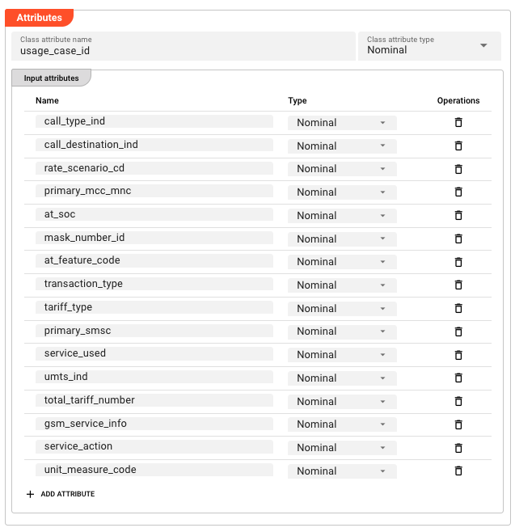
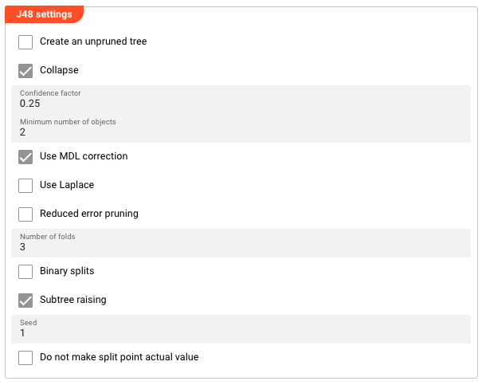
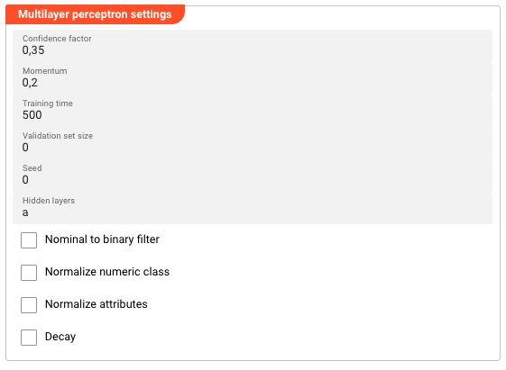

import WipDisclaimer from '../../../snippets/common/_wip-disclaimer.md'

# AI Model Resource

## Purpose

The **AI Model Resource** defines the technical specification for an AI model — its input and output attributes, the algorithm to use, and the hyperparameters that control how that algorithm trains. It is a shared definition used by both the [AI Trainer](../processors-flow/asset-flow-ai-trainer) (to train the model) and the [AI Classifier](../processors-flow/asset-flow-ai-classifier) (to apply it at runtime).

Before you can train or classify with an AI model, the model must be defined here.

## Prerequisites

- A **Data Dictionary** with attributes defined for the input features and the output (class) attribute. The attribute names and types must match what your Workflow messages provide at runtime.

:::tip
If you are not familiar with how AI fits into layline.io Workflows, read [Using Artificial Intelligence in Workflows](/docs/concept/advanced/artificial-intelligence) first.
:::

## Configuration

### Name & Description

**`Name`** — Name of the Asset. Spaces are not allowed.

**`Description`** — Free-text description of this model.

### Algorithm / Model

**`Classifier`** — The machine learning algorithm to use. Select from:

| Option | Algorithm | Type |
|--------|----------|------|
| `Weka J48` | C4.5 decision tree | Supervised learning — classification |
| `Weka Multilayer Perceptron` | Feedforward neural network | Supervised learning — classification |

#### Weka J48

J48 is a decision tree classifier based on the C4.5 algorithm. It builds a tree by recursively splitting data on the attribute that maximizes information gain ratio at each node. Each leaf represents a class label.

**Strengths:** Easy to interpret, handles both numeric and nominal attributes, relatively efficient.

**Weaknesses:** Sensitive to noisy data, can overfit without pruning.

**Use when:** You need an interpretable model and your data has clear decision boundaries.

#### Weka Multilayer Perceptron

MLP is a feedforward neural network trained via backpropagation. It consists of an input layer, one or more hidden layers, and an output layer. Each layer contains nodes (neurons) connected by weighted edges.

**Strengths:** Can learn complex non-linear relationships, flexible architecture.

**Weaknesses:** Requires more tuning, less interpretable than decision trees, computationally heavier.

**Use when:** Your data has complex patterns that decision trees cannot capture.

### Attributes

Defines the input schema and output (class) attribute for the model. These must match the attribute names and types in your Data Dictionary.

#### Classification Result

**`Class attribute name`** — The name of the attribute that holds the classification result. This is the attribute the model will predict.

**`Class attribute type`** — The data type of the class attribute:

| Type | Description | Example |
|------|-------------|---------|
| Numeric | Continuous numerical value | `age > 21`, `amount = 149.99` |
| String | Free-text value | `"PREMIUM"`, `"error_message"` |
| Nominal | One of a fixed set of categories | `call_type_ind IN {VOICE, SMS, DATA}` |
| Date | Date or time value | `2024-01-15`, `14:30:00` |
| Relation | Nested relation | A customer record containing multiple transaction attributes |

#### Input Attributes

The attributes used as features for training and classification. Each row defines one input attribute:

| Column | Description |
|--------|-------------|
| **Name** | The attribute name — must match a Data Dictionary attribute |
| **Type** | The attribute's data type (same options as Class Attribute Type above) |

Click **+ ADD ATTRIBUTE** to add rows to the table. You need one row for each feature the model will use.

### Weka J48 Settings

Appears when `Weka J48` is selected as the Classifier.

**`Create an unpruned tree`** — When enabled, the tree is not pruned after building. An unpruned tree may perform better on training data but risks overfitting. Default: disabled.

**`Collapse`** — When enabled, the tree is collapsed (pruned) after building. Default: enabled.

**`Confidence factor`** — Controls how aggressively the tree is pruned. Smaller values = more aggressive pruning = simpler tree. Range: 0.0–1.0. Default: `0.25`.

**`Minimum number of objects`** — The minimum number of instances required at a leaf node. Higher values produce simpler trees; lower values allow more detail. Default: `2`.

**`Use MDL correction`** — Uses Minimum Description Length correction when pruning, which penalizes tree complexity. Default: enabled.

**`Use Laplace`** — Applies Laplace smoothing when calculating class probabilities. Default: disabled.

**`Reduced error pruning`** — Uses reduced error pruning instead of confidence-based pruning. Default: disabled.

**`Number of folds`** — The number of folds used for cross-validation during pruning. Higher values give more reliable estimates but take longer. Default: `3`.

**`Binary splits`** — Uses binary splits for nominal attributes instead of multi-way splits. Default: disabled.

**`Subtree raising`** — Enables subtree raising during pruning. Default: enabled.

**`Seed`** — Random seed used for tree construction and pruning. Set to a fixed value for reproducible results across runs. Default: `1`.

**`Do not make split point actual value`** — Prevents the algorithm from using actual data values as split points, forcing more generalizable boundaries. Default: disabled.

### Weka Multilayer Perceptron Settings

Appears when `Weka Multilayer Perceptron` is selected as the Classifier.

**`Learning rate`** — Controls how much each weight update contributes during backpropagation. Range: 0.0–1.0. Higher values learn faster but may overshoot; lower values are more stable but slower. Default: `0.3`.

**`Momentum`** — Adds a fraction of the previous weight update to the current update, helping to prevent oscillation and escape local minima. Range: 0.0–1.0. Default: `0.2`.

**`Training time`** — The maximum number of epochs (complete passes through the training data) for training. Default: `500`.

**`Validation set size`** — The percentage of training data held out for validation during training. Validation is used to monitor convergence and stop early if overfitting begins. Default: `0` (no validation set).

**`Validation threshold`** — The minimum improvement in validation error required to continue training. If validation error does not improve by this threshold for two consecutive epochs, training stops early. Default: `20`.

**`Seed`** — Random seed for weight initialization and shuffling. Set to a fixed value for reproducible results. Default: `0`.

**`Hidden layers`** — Defines the number and size of hidden layers. Specify as comma-separated integers (e.g., `4,8,2`). Special letters can also be used: `a` = (attributes + classes)/2, `i` = number of attributes, `o` = number of classes, `t` = attributes + classes. Default: `a` (one hidden layer with (attributes + classes)/2 nodes).

**`Nominal to binary filter`** — Converts nominal attributes to binary attributes before training. May improve performance when your data contains nominal features. Default: disabled.

**`Normalize numeric class`** — Normalizes the class attribute values to the 0–1 range before training. Only applies when the class attribute is numeric. Default: disabled.

**`Normalize attributes`** — Normalizes all numeric attributes to the 0–1 range before training. Recommended when attribute values have very different scales. Default: disabled.

**`Decay`** — When enabled, the learning rate decreases linearly over the course of training (learning rate decay). Default: disabled.

## Behavior

### Model Training

After defining an AI Model Resource, use it in an [AI Trainer](../processors-flow/asset-flow-ai-trainer) to train the model. The trained model is stored automatically in the cluster's AI Storage and can be referenced by an [AI Classifier](../processors-flow/asset-flow-ai-classifier) using the same path and version scheme.

### Attribute Matching

The input attribute names and types defined in this Resource must match the attribute names in your Data Dictionary. The Trainer uses the configured input attribute mappings to extract values from Workflow messages; if names or types don't align, training will fail or produce incorrect results.

## Example

A Workflow classifies telecom usage records as one of several usage types based on call attributes.

**Step 1 — Define the AI Model Resource:**

| Setting | Value |
|---------|-------|
| Name | `UsageClassifier` |
| Classifier | `Weka J48` |

**Attributes:**

| Attribute | Type |
|-----------|------|
| `call_type_ind` (input) | String |
| `call_destination_ind` (input) | String |
| `rate_scenario_cd` (input) | String |
| `usage_case_id` (class) | String |

**J48 Settings:**

| Setting | Value |
|---------|-------|
| Confidence factor | `0.25` |
| Minimum number of objects | `2` |
| Use MDL correction | enabled |

**Step 2 — Use in AI Trainer:**

Reference the `UsageClassifier` AI Model Resource in the Trainer's Models to train table. The trained model is stored in AI Storage at the configured path (e.g., `models/usage-classifier-v2`).

**Step 3 — Use in AI Classifier:**

Reference the same model from AI Storage at `models/usage-classifier-v2:latest`. The Classifier reads the input attributes from each message, passes them to the J48 model, and writes the predicted class label to the configured message attribute.

## See Also

- [AI Trainer](../processors-flow/asset-flow-ai-trainer) — train the model defined by this Resource
- [AI Classifier](../processors-flow/asset-flow-ai-classifier) — apply the trained model to classify new messages
- [AI Service](../services/asset-service-ai) — expose an AI model as a service endpoint
- [Using Artificial Intelligence in Workflows](/docs/concept/advanced/artificial-intelligence) — conceptual overview of supervised learning in layline.io

---

<WipDisclaimer></WipDisclaimer>
