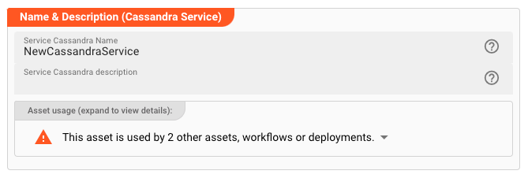

import WipDisclaimer from '../../../snippets/common/_wip-disclaimer.md'
import Testcase from '../../../snippets/assets/_asset-service-test.md';
import Tabs from '@theme/Tabs';
import TabItem from '@theme/TabItem';
import DataDictionaryCard from '../../../snippets/assets/data-dictionary-card.md';

# Cassandra Service

## Purpose

Define a service to interface with a Cassandra or an Cassandra compatible store (e.g.AWS Keyspaces).

")

## Prerequisites

None

## Configuration

### Name & Description



* **`Name`** : Name of the Asset. Spaces are not allowed in the name.

* **`Description`** : Enter a description.

The **`Asset Usage`** box shows how many times this Asset is used and which parts are referencing it.
Click to expand and then click to follow, if any.

### Required roles

")

In case you are deploying to a Cluster which is running (a) Reactive Engine Nodes which have (b) specific Roles
configured, then you **can** restrict use of this Asset to those Nodes with matching
roles.
If you want this restriction, then enter the names of the `Required Roles` here. Otherwise, leave empty to match all
Nodes (no restriction).

### Contact Points

")

Enter the list of cluster seed nodes.
It should contain IPs or hostnames of Cassandra cluster nodes, optionally with ports if different than the default Cassandra port.

### Data Center, Keyspace, Parallelism

")

* **`Local data center`** : Name of the Cassandra local datacenter. To find your datacenter name, check in your Cassandra node's `cassandra-rackdc.properties` file.
  If you are using AWS Keyspaces, then enter the region name here, then set the value for local-datacenter to the Region you're connecting to. 
  For example, if you are connecting to `cassandra.us-east-2.amazonaws.com`, then set the local data center to `us-east-2`. 
  For all available AWS Regions, see [Service endpoints](https://docs.aws.amazon.com/keyspaces/latest/devguide/programmatic.endpoints.html) for Amazon Keyspaces.

* **`Keyspace`** : Name of the Keyspace.

* **`Parallelism`** :
  This is a performance tuning parameter.
  Enter a number which defines how many requests can be performed in parallel.
  Leave empty for no parallelism.

### Service Functions

Services are accessed from other Assets via invocations of _Functions_.
This is where you define such functions.
In the context of Cassandra, a Service Function encapsulates any valid DML (data manipulation) or even DDL (data definition)
statement.
Typically, you will be using `INSERT`, `SELECT` and `UPDATE` CQL-statements here.

Let’s assume we would only want to read the customer data `Customer` in our example.
This would require its own Service Function.

#### Create Service Function

First create a new Function (1):

")

Next fill out the details:

")

* `Function name` (1): The name of the function. Must not have whitespaces.

* `Function description` : Something that describes the function (optional).

* `CQL Statement` (2): The actual CQL-Statement to access execute against the Cassandra/Keyspaces data source.
  Please note the use of the `:Id` bind-variable in the example above.
  The variables you can use here must have been defined in the data dictionary and assigned via the `Parameter type`.
  See the next section to learn how to do this.

* `Parameter type` (3): Reference to a data dictionary type which you must have defined below.
  All members of this type can be used as bind-variables in the SQL-Statement.

* `Result type` (4): Reference to a data dictionary type which you must have defined below.
  All members of this type can be used as result variables in the SQL-Statement.
  Note, that this can be the same type as used for the `Parameter type`.
  In our example they share the same variables.

* `Mappings` (5): Define how you map the results from the SQL-Statement to your `Result Type` data structure.
  On the left you enter (assisted) the bind-variable names to which members of the `Result Type` should be mapped.
  Member names are always preceded with `result.` and then followed by the member name.
  On the right-hand side, enter the original field names used in your SQL-Statement.

### Typesafe Configuration

Access to Cassandra and Keyspaces data sources relies on the [Datastax-Driver](https://docs.datastax.com/en/developer/java-driver/index.html).
This driver allows for a wide number of configuration options.
You can configure these options here.
As to which configuration options are available, please refer to the [Datastax-Driver documentation](https://docs.datastax.com/en/developer/java-driver/4.17/manual/core/configuration/reference/index.html).

Example:

")

:::note HOCON format
Please note that the notation follows [HOCON format](https://www.w3schools.io/file/hocon-introduction).
:::

:::note Use of macros
As you can see from the example above, you can use [Macros](../../../language-reference/macros) within the Typesafe Configuration.
:::

<DataDictionaryCard />

### Example: Using the Cassandra Service

The Cassandra Service can be used from within a JavaScript Asset.
In our example we have a simple Workflow which reads a file with customer-related data (1), then in a next step (2) reads the corresponding customer date from a Cassandra source, and
simply outputs this data to the log.
There is no other purpose in this Workflow than to demonstrate how to use the Service.

")

In the middle of the Workflow we find a JavaScript Processor by the name of “_EnrichCustomer_”.
This Processor reads additional customer information from a Cassandra source using the Cassandra Service.

How is it configured?


#### Link EnrichCustomer Processor to Cassandra Service

To use the Cassandra Service in the JavaScript Processor, we first have to **assign the Service within the JavaScript
Processor** like so:

")

* **`Physical Service`** (1): The Cassandra Service, which we have configured above.

* **`Logical Service Name`** (2): The name by which we want to use the Service within JavaScript.
  This could be the exact same name as the Service or a name which you can choose.
  Must not include whitespaces.

#### Access the Service from within a Script Processor

Now let's use the service within a script processor:


##### Reading from Cassandra Source

<Tabs>
  <TabItem value="javascript" label="JavaScript">

```javascript
let cassandraData = null; // will receive a message type
let customer_id = 1234;
try {
    // Invoke service function.
    // Service access defined as synchronous. Therefore no promise syntax here
    cassandraData = services.MyCassandraService.SelectCustomerById(
        {Id: customer_id}
    );
    // services: fixed internal term to access linked services
    // MyCassandraService: The logical name of the service which we have given to it
    // SelectCustomerById: Collection function to read the customer data with the given customer_id
} catch (error) {
    // handle error
}

// Output the customer data to the processor log
if (cassandraData && cassandraData.data.length > 0) {
    processor.logInfo('Name: ' + cassandraData.data[0].Name);
    processor.logInfo('Address: ' + cassandraData.data[0].Address);
} else {
    processor.logInfo('No customer data found for customer ID ' + customer_id);
}
```

  </TabItem>
  <TabItem value="python" label="Python">

```python
cassandra_data = None  # will receive a message type
customer_id = 1234
try:
    # Invoke service function.
    # Service access defined as synchronous. Therefore no promise syntax here
    cassandra_data = services.MyCassandraService.SelectCustomerById({
        'Id': customer_id
    })
    # services: fixed internal term to access linked services
    # MyCassandraService: The logical name of the service which we have given to it
    # SelectCustomerById: Collection function to read the customer data with the given customer_id
except error:
    # handle error
    pass

# Output the customer data to the processor log
if cassandra_data and cassandra_data.data.length > 0:
    processor.log_info('Name: ' + cassandra_data.data[0].Name)
    processor.log_info('Address: ' + cassandra_data.data[0].Address)
else:
    processor.log_info('No customer data found for customer ID ' + str(customer_id))
```

  </TabItem>
</Tabs>

:::tip Note: Service functions return a Message
Note how the Service function returns a [Message](../../../04-language-reference/javascript/02-API/classes/Message.md) as a result
type.

Since SQL-queries always return arrays, you can find the results in `message.data` as an array.
If we are only expecting one row as a result we can test it with `cassandraData.data.length > 0` and access the first row with `cassandraData.data[0]`.
:::

##### Insert/Update to Cassandra

Let's assume we also had defined a function `WriteCustomerData` which inserts a new customer:

```sql
insert into customer
values id = :Id, name = :Name, address = :Address;
```

We could then invoke this function and pass values to it like so:

<Tabs>
  <TabItem value="javascript" label="JavaScript">

```javascript
try {
    services.MyCassandraService.WriteCustomerData(
        {
            Id: 1235,
            Name: 'John Doe',
            Address: 'Main Street',
        }
    )
} catch (error) {
    // handle error
}
```

  </TabItem>
  <TabItem value="python" label="Python">

```python
try:
    services.MyCassandraService.WriteCustomerData({
        'Id': 1235,
        'Name': 'John Doe',
        'Address': 'Main Street',
    })
except error:
    # handle error
    pass
```

  </TabItem>
</Tabs>

<Testcase></Testcase>

---

<WipDisclaimer></WipDisclaimer>
