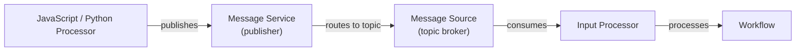
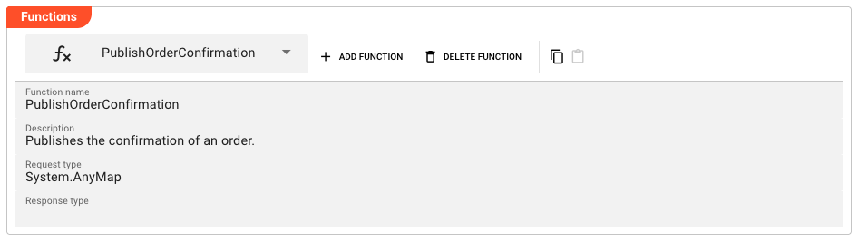

import WipDisclaimer from '../../../snippets/common/_wip-disclaimer.md'
import Testcase from '../../../snippets/assets/_asset-service-test.md';
import Tabs from '@theme/Tabs';
import DataDictionaryCard from '../../../snippets/assets/data-dictionary-card.md';
import TabItem from '@theme/TabItem';

# Message Service

## Purpose

The Message Service is the **producer side** of layline.io's internal publish/subscribe messaging system. It publishes messages to topics defined in a [Message Source](../sources/asset-source-message.md). Messages can be published from JavaScript or Python processors, making it useful for:

- Triggering downstream Workflows based on events
- Broadcasting data to multiple consumers simultaneously
- Decoupling processing stages across Workflows

### Architecture

The Message Service is the counterpart to the [Message Source](../sources/asset-source-message.md) (consumer). Together they form a publish/subscribe system:



A single Message Service can reference multiple Message Sources. For each Message Source, you define **functions** that publish to specific topics.

### This Asset can be used by:

| Asset type | Link |
|------------|------|
| Processors | [JavaScript Processor](../processors-flow/asset-flow-javascript.md) |
| | [Python Processor](../processors-flow/asset-flow-python.md) |

### Related Asset

| Asset | Description |
|-------|-------------|
| [Message Source](../sources/asset-source-message.md) | Defines the topics that this service publishes to |

## Configuration

### Name & Description

* **`Service Name`** : Name of the Asset. Spaces are not allowed in the name.

* **`Service Description`** : Enter a description.

The **`Asset Usage`** box shows how many times this Asset is used and which parts are referencing it.
Click to expand and then click to follow, if any.

### Required Roles

In case you are deploying to a Cluster which is running (a) Reactive Engine Nodes which have (b) specific Roles
configured, then you **can** restrict use of this Asset to those Nodes with matching roles.
If you want this restriction, then enter the names of the `Required Roles` here. Otherwise, leave empty to match all
Nodes (no restriction).

### Sources

Under **Sources**, add references to the [Message Sources](../sources/asset-source-message.md) whose topics this service publishes to. Each entry links a Message Source asset to this service.

| Column | Description |
|--------|-------------|
| **Source** | Select a Message Source asset from the project |

Click **Add source** to add a new Message Source reference.

### Functions



Functions define the publish operations available to this service. Each function maps to a topic in the referenced Message Source(s).

Click **Add Function** to create a new function.

#### Function Name & Description

* **`Function name`** : Name of the function. Must be unique within the service. Must not contain spaces.

* **`Description`** : Optional description of the function.

#### Request Type

* **`Request type`** : The data dictionary type of the message payload that will be published. This defines the structure of the data sent when calling this function.

#### Response Type

* **`Response type`** : The data dictionary type of the response (if any). Optional. If not set, the function returns no response.

### Auto-Generated Function Names

Message Service functions are auto-generated and invoked from processors using the pattern:

```
services.<ServiceName>.<FunctionName>
```

For example, a service named `OrderMessageService` with a function named `PublishOrder` would be called as:

```
services.OrderMessageService.PublishOrder({ ... })
```

### Function Parameters

When calling a Message Service function from a processor, the following parameters are available:

| Parameter | Description |
|-----------|-------------|
| `Topic` | The name of the topic to publish to (as defined in the Message Source) |
| `PartitionKey` | Optional. Used to determine which partition the message goes to (for ordering guarantees within a key) |
| `Request` | The message payload, matching the `Request type` defined above |
| `Source` | Optional. The name of the Message Source to publish to. Required if the service references more than one Message Source |

### Data Dictionary

<DataDictionaryCard />

## Using the Message Service from a Script Processor

### Publishing a Message


<Tabs>
  <TabItem value="javascript" label="JavaScript">

```javascript
/**
 * Publish an order confirmation message
 * @param orderData Order confirmation data
 */
function publishOrderConfirmation(orderData) {
    services.OrderMessageService.PublishOrderConfirmation({
        Topic: "order-confirmations",
        PartitionKey: orderData.orderId,
        Request: orderData
    });
}
```

  </TabItem>
  <TabItem value="python" label="Python">

```python
def publish_order_confirmation(order_data):
    """Publish an order confirmation message.
    @param order_data: Order confirmation data
    """
    services.OrderMessageService.PublishOrderConfirmation({
        'Topic': 'order-confirmations',
        'PartitionKey': order_data.order_id,
        'Request': order_data
    })
```

  </TabItem>
</Tabs>

### Publishing with Automatic Source Selection

If the service references only one Message Source, the `Source` parameter can be omitted:

<Tabs>
  <TabItem value="javascript" label="JavaScript">

```javascript
/**
 * Publish a notification event
 * @param eventData The event to publish
 */
function publishNotification(eventData) {
    services.NotificationService.SendNotification({
        Topic: "notifications",
        Request: eventData
    });
}
```

  </TabItem>
  <TabItem value="python" label="Python">

```python
def publish_notification(event_data):
    """Publish a notification event.
    @param event_data: The event to publish
    """
    services.NotificationService.SendNotification({
        'Topic': 'notifications',
        'Request': event_data
    })
```

  </TabItem>
</Tabs>

### Publishing with Explicit Source

If the service references multiple Message Sources, specify which one to use:

<Tabs>
  <TabItem value="javascript" label="JavaScript">

```javascript
/**
 * Publish to a specific Message Source
 * @param data The data to publish
 */
function publishToSpecificSource(data) {
    services.MultiSourceService.PublishData({
        Source: "CustomerDataSource",
        Topic: "customer-updates",
        PartitionKey: data.customerId,
        Request: data
    });
}
```

  </TabItem>
  <TabItem value="python" label="Python">

```python
def publish_to_specific_source(data):
    """Publish to a specific Message Source.
    @param data: The data to publish
    """
    services.MultiSourceService.PublishData({
        'Source': 'CustomerDataSource',
        'Topic': 'customer-updates',
        'PartitionKey': data.customer_id,
        'Request': data
    })
```

  </TabItem>
</Tabs>

### Full Example: Order Processing Pipeline

A complete example showing how Message Source and Message Service work together:

1. **Define a Message Source** named `OrderSource` with a topic `order-confirmations`
2. **Define a Message Service** named `OrderMessageService` that references `OrderSource`
3. **Create a function** `PublishOrderConfirmation` with a `Request type` of `OrderConfirmation`
4. **In a script processor**, call the service to publish when an order is confirmed:

<Tabs>
  <TabItem value="javascript" label="JavaScript">

```javascript
/**
 * Called when an order has been confirmed
 * @param orderId The ID of the confirmed order
 * @param orderDetails The order details
 */
function onOrderConfirmed(orderId, orderDetails) {
    let confirmationData = dataDictionary.createMessage(
        dataDictionary.type.OrderConfirmation
    );
    confirmationData.data.orderId = orderId;
    confirmationData.data.customerId = orderDetails.customerId;
    confirmationData.data.timestamp = DateTime.now().toString();

    services.OrderMessageService.PublishOrderConfirmation({
        Topic: "order-confirmations",
        PartitionKey: orderId,
        Request: confirmationData
    });
}
```

  </TabItem>
  <TabItem value="python" label="Python">

```python
def on_order_confirmed(order_id, order_details):
    """Called when an order has been confirmed.
    @param order_id: The ID of the confirmed order
    @param order_details: The order details
    """
    confirmation_data = data_dictionary.createMessage(
        data_dictionary.type.OrderConfirmation
    )
    confirmation_data.data.order_id = order_id
    confirmation_data.data.customer_id = order_details.customer_id
    confirmation_data.data.timestamp = str(datetime.now())

    services.OrderMessageService.PublishOrderConfirmation({
        'Topic': 'order-confirmations',
        'PartitionKey': order_id,
        'Request': confirmation_data
    })
```

  </TabItem>
</Tabs>

A downstream Workflow that references `OrderSource` will receive this message via its Input Processor and can process the confirmation further.

For more on processors, see [JavaScript Processor](../processors-flow/asset-flow-javascript.md) and [Python Processor](../processors-flow/asset-flow-python.md).

<Testcase></Testcase>

---

<WipDisclaimer></WipDisclaimer>
