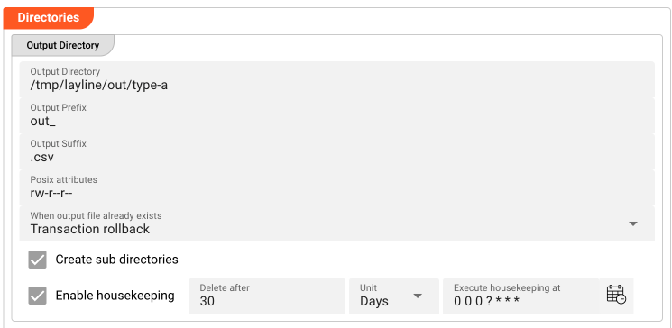
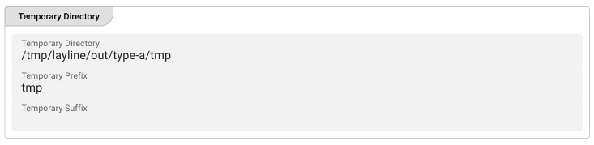
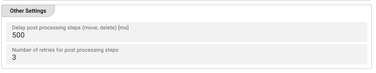

import WipDisclaimer from '../../../snippets/common/_wip-disclaimer.md'

# Sink File System

## Purpose

Defines the parameters for writing output files to the local file system. The File System Sink writes directly to a local directory accessible by the Reactive Engine, without requiring a Connection asset (unlike NFS, SMB, or FTP sinks).

### This Asset can be used by:

| Asset type        | Link                                                                |
|-------------------|---------------------------------------------------------------------|
| Output Processors | [Stream Output Processor](../processors-output/asset-output-stream) |

### Prerequisite

None — this sink writes directly to the local file system and does not require a Connection asset.

## Configuration

### Name & Description

")

* **Sink Name** — A descriptive name for this sink asset.
* **Sink description** — Optional description of what this sink is used for.

You can expand **Asset usage** to see which other assets, workflows, or deployments reference this sink.

### Required roles

Optionally specify which roles are required to use this sink. Click **Add required role** to add role requirements.

### Directories

The Directories section defines where files are written and how they are handled during processing.

#### Output Directory

* **Output Directory** — The directory to write output files to. The path can be:
  * **Absolute** — e.g., `/tmp/layline/output` or `C:\layline\output`
  * **Relative** — Relative to the working directory of the Reactive Engine cluster node executing the workflow
  
  You can use `$\{...\}` macros to expand variables defined in [environment variables](../resources/asset-resource-environment).

* **Output Prefix** — Prefix to add to the filename when writing to the output directory. E.g., `out_` will prepend `out_` to the filename.

* **Output Suffix** — Suffix to add to the filename after move to the output directory. E.g., `_processed` will append `_processed` to the filename.

* **Posix attributes** — POSIX-style file permissions for files written to this directory. Example: `rw-r--r--` or `644`. This applies to the output file after it is written.

* **When output file already exists** — Defines what happens if a file with the same name already exists in the output directory:

  * **Transaction rollback** — Rollback the complete transaction. No output file will be written.
  * **Replace existing output file** — Replace the existing file in the output directory.
  * **Rename the existing output and add a numerical version counter as suffix** — Rename the existing file by adding a number (e.g., `file.txt` → `file_1.txt`).
  * **Rename the existing output and add the current timestamp as suffix** — Rename the existing file by adding a timestamp (e.g., `file.txt` → `file_2026-03-16_14-30-00.txt`).
  * **Move the existing output file to the archive directory** — Move the existing file to the archive directory (see Archive Directory below).

* **Create sub directories** — If enabled, creates the output directory and any intermediate subdirectories if they don't exist.

* **Enable housekeeping** — If enabled, automatically deletes old files from the output directory based on age criteria:

  * **Delete after** — The age threshold for files to delete (number + units).
  * **Units** — The time unit (days, hours, or minutes).
  * **Execute housekeeping at** — A cron expression defining when housekeeping runs. Click the calendar icon to open the cron expression editor.

#### Temporary Directory

* **Temporary Directory** — The directory for temporary files during processing. Files are first written here, then moved to the output directory when processing completes.
  
  The path can be absolute or relative (relative to the Reactive Engine's working directory).

* **Temporary Prefix** — Prefix for the temporary filename while processing.

* **Temporary Suffix** — Suffix for the temporary filename while processing.

All temporary files are automatically removed upon successful processing. Residual temporary files may indicate a crash or incomplete transaction.

#### Archive Directory

This section appears only when **"Move the existing output file to the archive directory"** is selected in the Output Directory settings.

* **Archive Directory** — The directory to move existing files to when a new file with the same name is written. Path can be absolute or relative.

* **When archive file already exists** — What to do if the archive file already exists:

  * **Replace existing archive file** — Overwrite the existing archive file.
  * **Rename existing archive and add a numerical version counter as suffix** — Add a number suffix.
  * **Rename existing archive and add the current timestamp as suffix** — Add a timestamp suffix.

### Other Settings

* **Delay post processing steps (move, delete) [ms]** — Delay in milliseconds before post-processing steps (moving temp file to output, deleting from temp). Useful for "sensitive" file systems that need time to settle.

* **Number of retries for post processing steps** — Number of retry attempts if post-processing operations fail. Useful for robust handling of transient file system issues.

## Behavior

1. During workflow execution, the Reactive Engine writes processed data to the **Temporary Directory** first.
2. Once processing is complete, the file is moved to the **Output Directory**.
3. If a file with the same name exists in the Output Directory, the behavior is determined by the **"When output file already exists"** setting.
4. The **Output Prefix** and **Output Suffix** are applied when the file is moved to the Output Directory.
5. The **Posix attributes** are applied to the final output file.
6. Temporary files are automatically cleaned up after successful processing.

## Example

A typical configuration might look like:

| Field | Value |
|-------|-------|
| Output Directory | `/tmp/layline/processed` |
| Output Prefix | `processed_` |
| Output Suffix | `.csv` |
| Posix attributes | `rw-r--r--` |
| When output file already exists | Replace existing output file |
| Create sub directories | Checked |
| Enable housekeeping | Checked (Delete after: 7, Units: days) |
| Temporary Directory | `/tmp/layline/processed/tmp` |

This configuration:
- Writes processed files to `/tmp/layline/processed`
- Adds `processed_` prefix and `.csv` suffix to filenames
- Sets file permissions to `rw-r--r--`
- Replaces existing files with the same name
- Creates the output directory if it doesn't exist
- Automatically deletes files older than 7 days
- Uses a separate temp directory during processing

## See Also

* [Stream Output Processor](../processors-output/asset-output-stream)
* [File System Source](../sources/asset-source-file.md)
* [Environment Variables](../resources/asset-resource-environment)

---

<WipDisclaimer></WipDisclaimer>
