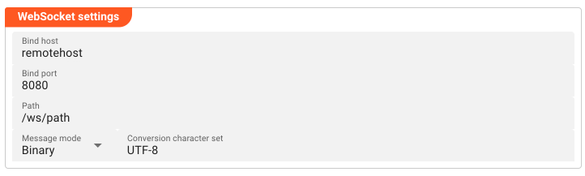
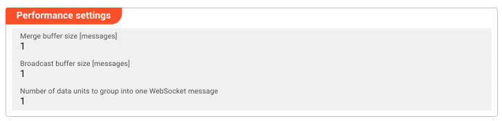

import WipDisclaimer from '../../../snippets/common/_wip-disclaimer.md'
import NameAndDescription from '../../../snippets/assets/_asset-name-and-description.md';
import RequiredRoles from '../../../snippets/assets/_asset-required-roles.md';

# Sink WebSocket

## Purpose

Defines the outbound connection parameters for a WebSocket sink. The sink acts as a WebSocket client — it connects to a remote WebSocket server and sends data to it. Connection parameters are configured inline; no separate Connection asset is required.

### This Asset can be used by:

| Asset type         | Link                                                                          |
|--------------------|-------------------------------------------------------------------------------|
| Output Processors  | [Stream Output Processor](../processors-output/asset-output-stream) |

### Prerequisite

No other assets are required to configure this sink. All connection parameters are set directly within this asset.

## Configuration

### Name & Description

<NameAndDescription></NameAndDescription>

### Required roles

<RequiredRoles></RequiredRoles>

### WebSocket Settings

- **Bind host**: Local network interface or IP address to bind when connecting to the remote WebSocket server. Leave empty to bind to all interfaces.
- **Bind port**: Local port to use when establishing the outbound connection.
- **Path**: Path on the remote WebSocket server (e.g. `/ws`, `/stream`).
- **Message mode**: How messages are encoded on the wire: **Mixed** (text and binary frames), **Binary**, or **Text**.
- **Conversion character set**: Character encoding used for text messages. Only applies when Message mode is `Mixed` or `Text`. Disabled (grayed out) when set to `Binary`.

### Performance Settings

- **Merge buffer size [messages]**: Number of messages to buffer before sending. Increase to improve throughput; decrease for lower latency.
- **Broadcast buffer size [messages]**: Number of messages to buffer for broadcast to connected clients.
- **Number of data units to group into one WebSocket message**: How many data units are aggregated into a single outgoing WebSocket frame.

## Related Topics

### Internal

* [Stream Output Processor](../processors-output/asset-output-stream)

---

<WipDisclaimer></WipDisclaimer>
