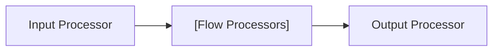
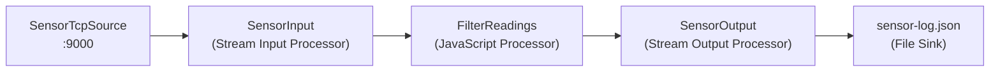

import NameAndDescription from '../../../snippets/assets/_asset-name-and-description.md';
import RequiredRoles from '../../../snippets/assets/_asset-required-roles.md';

# Workflow

## Purpose

A Workflow is a configured pipeline of processor instances that moves data from a Source through optional processing stages to a Sink. Every Project requires at least one Workflow to process anything.

A Workflow contains exactly one **Input Processor**, any number of **Flow Processors**, and any number of **Output Processors**. Processors are arranged on a canvas and connected by links that define the data flow direction.

### Key concepts

* **Processor Instance** — a concrete placement of an Asset on the Workflow canvas. A Workflow references Assets and creates instances of them with specific configuration for this workflow.
* **Resources** — a Workflow can declare dependencies on Formats, Services, and Resources that it uses. This makes the dependency explicit and allows inheritance from a parent Project or Workflow.
* **Inheritance** — like other Assets, Workflows support inheritance. A child Workflow can override scheduler weight, timeout values, and alarming settings while inheriting everything else from its parent.

## This Asset can be used by:

| Asset type | Link |
|---|---|
| Projects | [Project](../../concept/projects-workflows/project) |

## Configuration

### Name & Description

<NameAndDescription></NameAndDescription>

### Required Roles

<RequiredRoles></RequiredRoles>

### Resources

Declares explicit dependencies on Formats, Services, and Resources that are not automatically deployed.

Most Formats, Services, and Resources are automatically deployed with a Workflow when they are referenced by any Asset or processor within that Workflow. However, items that are only accessed programmatically — for example, a data dictionary used exclusively in a JavaScript or Python script — must be added here explicitly so that they are included in the deployment.

If a Resource is already deployed as part of another Workflow in the same deployment, it does not need to be added again here.

| Allowed type | Purpose |
|---|---|
| **Format** | Data format definitions used by processors to parse or serialise messages |
| **Service** | Service functions (e.g., database queries) callable from processors |
| **Resource** | Environment variables, shared constants, or other shared resources |

### Workflow Settings

* **`Scheduler weight`** : Relative priority of this Workflow compared to other Workflows on the same engine. Higher values receive more processing time. Set to `0` (default) for equal weighting.
* **`Restart timeout in case of failures [sec]`** : Number of seconds the engine waits before attempting to restart a failed Workflow instance. If `0`, no automatic restart occurs.
* **`Watchdog timeout [sec]`** : Number of seconds after which a Workflow that has not made progress is considered stalled. A stalled Workflow triggers the configured alarming. If `0`, the watchdog is disabled.

### Alarming

Configure notifications for Workflow lifecycle events. Each event type uses the [Alarm Center](../../../operations/cluster/alarm-center) to route alerts.

| Event | When it fires |
|-------|-------------|
| **When a stream is rolled back** | A stream failed and was rolled back to its last committed state |
| **When a stream shall be retried** | A stream retry has been triggered |
| **When a stream has warnings or failures** | A stream completed with non-fatal issues |
| **When a stream is committed** | A stream completed successfully |

## Example: IoT Sensor Processing Workflow

This example builds on the [TCP Source](../sources/asset-source-tcp) and [Stream Input Processor](../processors-input/asset-input-stream) to create a complete sensor data ingestion pipeline.

### Goal

Receive temperature and humidity readings from IoT sensors over TCP, filter out anomalous readings, and write the cleaned records to a log file.

### Assets used

| Asset | Role in workflow |
|-------|-----------------|
| [Source TCP](../sources/asset-source-tcp) `SensorTcpSource` | Listens on `acme.sensor.host:9000` |
| [Stream Input Processor](../processors-input/asset-input-stream) `SensorInput` | Reads the TCP stream as newline-delimited JSON |
| [JavaScript Flow Processor](../processors-flow/asset-flow-javascript) `FilterReadings` | Filters readings by temperature range |
| [Stream Output Processor](../processors-output/asset-output-stream) `SensorOutput` | Writes cleaned records to a file |
| [Generic Format](../formats/asset-format-generic) `SensorFormat` | Defines the structure of a sensor reading |
| [File Sink](../sinks/asset-sink-file) `SensorLogSink` | Output file `sensor-log.json` |

### Workflow canvas

### Workflow settings

| Setting | Value | Reason |
|---------|-------|--------|
| Scheduler weight | `10` | Give this workflow higher priority than batch workflows |
| Restart timeout | `60` | Retry failed streams within 1 minute |
| Watchdog timeout | `300` | Alert if no progress for 5 minutes |

### Alarming configuration

| Event | Action |
|-------|--------|
| Stream rolled back | Alert: "Sensor stream rollback — check sensor connectivity" |
| Stream retry | Log only |
| Warnings or failures | Alert: "Sensor readings contain anomalies" |
| Stream committed | Log only |

### What happens at runtime

1. **SensorTcpSource** binds to `0.0.0.0:9000` and accepts incoming TCP connections from sensors
2. **SensorInput** reads the raw byte stream and uses `SensorFormat` to split it into newline-delimited JSON records
3. **FilterReadings** (JavaScript Processor) evaluates each reading — records outside a configurable temperature range (e.g., below `-40°C` or above `85°C`) are silently dropped
4. **SensorOutput** writes the remaining records to `sensor-log.json` using `SensorLogSink`
5. If a stream fails, the engine rolls back and retries automatically. If retries are exhausted, the configured alarms fire.

## See Also

* [Project](../../concept/projects-workflows/project) — Workflows are contained within Projects
* [Stream Input Processor](../processors-input/asset-input-stream) — the required entry point of every Workflow
* [Deployment](../../concept/projects-workflows/deployment) — how Workflows are deployed to an engine
* [Alarm Center](../../../operations/cluster/alarm-center) — how alarming events are routed and handled
