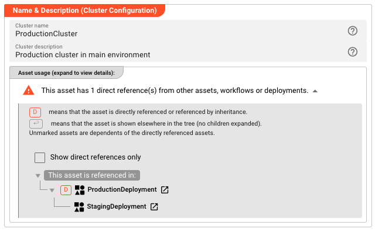
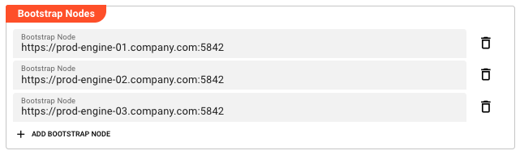

import NameAndDescription from '../../snippets/assets/_asset-name-and-description.md';

# Cluster

> Defines connection endpoints for a layline.io cluster, enabling deployment of workflows to distributed engine instances.

---

## Purpose

A (Reactive)Cluster asset defines the network endpoints that the Configuration Center uses to communicate with a layline.io cluster. In layline.io's distributed architecture, workflows run on Reactive Engines that are organized into clusters for high availability and horizontal scaling. The Cluster asset tells the Configuration Center where to find these engines when deploying workflows.

Think of a Cluster asset as the "address book entry" for your runtime environment. You might have multiple Cluster assets defined in your project — one for development, one for staging, and one for production — each pointing to a different set of engine instances. When you create a Deployment Composition, you select which Cluster to target, determining where your workflows will actually execute.

The bootstrap nodes you define in a Cluster asset are the initial contact points. The Configuration Center connects to these nodes to discover the full cluster topology and to transfer deployment packages containing your workflows, configurations, and secrets.

Cluster assets support inheritance, allowing you to define base cluster configurations and extend them for specific environments. For example, you might have a `ProductionCluster` with three bootstrap nodes, and a `StagingCluster` that inherits from it but overrides the node list to point to your staging infrastructure.



## Prerequisites

Before creating a Cluster asset, you should have:

- A running layline.io cluster with at least one node accessible via HTTP/HTTPS
- The hostnames or IP addresses and ports of your cluster nodes

## Configuration

### Name & Description

<NameAndDescription></NameAndDescription>

### Bootstrap Nodes

Bootstrap nodes are the entry points for communicating with your cluster. Each bootstrap node is a URL pointing to a cluster node's REST API endpoint. When deploying workflows, the Configuration Center connects to these nodes to transfer deployment packages and coordinate with the cluster.

You can define multiple bootstrap nodes for redundancy. If one node is unavailable, the Configuration Center will attempt to connect to the others. This ensures deployment capability even when individual cluster nodes are down for maintenance or experiencing issues.

**Bootstrap Node** — The URL of a cluster node. The format is:

```
protocol://hostname:port
```

Where:
- **protocol** — `http` or `https` depending on your cluster configuration
- **hostname** — The DNS name or IP address of the cluster node
- **port** — The REST API port (default: `5842`)

Examples:
- `http://node1.example.com:5842`
- `https://192.168.1.10:5842`
- `http://engine-node-01:5842`

Click **Add bootstrap node** to add a new node to the list. Each node appears as an editable field with the ability to reset to parent values if inheriting from a base cluster configuration. Click the delete icon to remove a node from the list.

The order of bootstrap nodes does not matter — the Configuration Center will use any available node. However, listing all nodes in your cluster provides maximum redundancy.



## Behavior

### Node Discovery

When you deploy to a cluster, the Configuration Center uses the bootstrap node URLs to establish initial contact. Once connected, it discovers the full cluster topology automatically. You only need to define enough bootstrap nodes to ensure at least one is reachable — defining all nodes is recommended for redundancy but not required for operation.

### Inheritance

Bootstrap nodes support inheritance just like other asset fields. When a Cluster asset extends a parent cluster, it inherits the parent's bootstrap node list. Child clusters can:

- **Add new nodes** — Append additional bootstrap nodes beyond those inherited
- **Override nodes** — Change the URL of inherited nodes (marking them as overridden)
- **Remove nodes** — Delete inherited nodes that don't apply to the child context
- **Reset to parent** — Restore an overridden or deleted node to its inherited value

This is useful when you have clusters with similar but not identical topologies. For example, a production cluster might have three nodes, while a disaster recovery cluster inherits those three and adds a fourth node at a different data center.

### Connection Security

The protocol (`http` vs `https`) determines whether connections to cluster nodes are encrypted. In production environments, always use `https` to ensure deployment packages and credentials are transmitted securely. The Configuration Center validates TLS certificates when using HTTPS connections.

## Example

**Basic single-node cluster for development:**

| Field | Value |
|-------|-------|
| Name | `LocalDevCluster` |
| Bootstrap Node 1 | `http://localhost:5842` |

**Production cluster with three nodes:**

| Field | Value |
|-------|-------|
| Name | `ProductionCluster` |
| Bootstrap Node 1 | `https://prod-engine-01.company.com:5842` |
| Bootstrap Node 2 | `https://prod-engine-02.company.com:5842` |
| Bootstrap Node 3 | `https://prod-engine-03.company.com:5842` |

**Staging cluster inheriting from production with override:**

| Field | Value |
|-------|-------|
| Name | `StagingCluster` |
| Inherits from | `ProductionCluster` |
| Bootstrap Node 1 | `https://staging-engine-01.company.com:5842` (overridden) |
| Bootstrap Node 2 | `https://staging-engine-02.company.com:5842` (overridden) |
| Bootstrap Node 3 | *(inherited from ProductionCluster, reset to parent)* |

In this example, `StagingCluster` inherits the third node from `ProductionCluster` but overrides the first two to point to staging infrastructure. This pattern ensures consistency where appropriate while allowing environment-specific customization.

## See Also

- [**Deployment Composition**](./asset-deployment-composition.md) — Groups Cluster with other deployment assets into a deployable unit
- [**Engine Configuration**](./asset-deployment-engine.md) — Defines workflows and runtime settings deployed to a cluster
- [**Cluster Settings**](../../concept/settings/settings-cluster) — System-level cluster configuration for the Configuration Center
