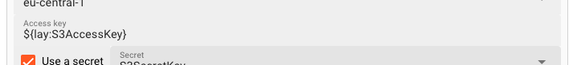

import WipDisclaimer from '/docs/snippets/common/_wip-disclaimer.md';

# Connection AWS

## Purpose

To enable the connection to AWS cloud services or an AWS compatible endpoint.

### This Asset can be used by:

| Asset type | Link                                                          |
|------------|---------------------------------------------------------------|
| Source     | [S3 Source](/docs/assets/sources/asset-source-s3)             |
|            | [SQS Source](/docs/assets/sources/asset-source-sqs)           |
| Sink       | [S3 Sink](/docs/assets/sinks/asset-sink-s3)                   |
|            | [SNS Sink](/docs/assets/sinks/asset-sink-sns)                 |
|            | [SQS Sink](/docs/assets/sinks/asset-sink-sqs)                 |
|            | [Kinesis Sink](/docs/assets/sinks/asset-sink-kinesis)         |
|            | [EventBridge Sink](/docs/assets/sinks/asset-sink-eventbridge) |
      

## Configuration

### Name & Description

")

**`Name`** : Name of the Asset. Spaces are not allowed in the name.

**`Description`** : Enter a description.

The **`Asset Usage`** box shows how many times this Asset is used and which parts are referencing it. Click to expand and then click to follow, if any.

### Required roles

")

In case you are deploying to a Cluster which is running (a) Reactive Engine Nodes which have (b) specific Roles configured, then you **can** restrict use of this Asset to those Nodes with matching
roles.
If you want this restriction, then enter the names of the `Required Roles` here. Otherwise, leave empty to match all Nodes (no restriction).

### AWS Server

Use these settings to define how to connect to AWS or a compatible service.

")

The AWS Connection Asset supports three authentication modes:

1. No credentials required (AWS only)
2. Default credential provider chain (AWS only)
3. Access Key / Secret Key credentials

#### Authentication Mode

##### No Credentials

Pick this for access to an AWS endpoint which does not require authentication.

* **`Region`**:
  Use this setting to set the AWS endpoint region.
  You can find standard Amazon Web Services (AWS) regions in the drop-down list.

##### Default credential provider chain (AWS only)

To avoid using clear text credentials in AWS connector, customers can enable "Default AWS Credentials Provider Chain" and use Role in AWS connector.
Please check [Working with AWS Credentials](https://docs.aws.amazon.com/sdk-for-java/v1/developer-guide/credentials.html) to learn more about this type of authentication.

AWS credentials provider chain that looks for credentials in this order:

* Environment Variables - AWS_ACCESS_KEY_ID and AWS_SECRET_ACCESS_KEY (RECOMMENDED since they are recognized by all the AWS SDKs and CLI except for .NET), or AWS_ACCESS_KEY and AWS_SECRET_KEY (only
  recognized by Java SDK)
* Java System Properties - aws.accessKeyId and aws.secretKey
* Web Identity Token credentials from the environment or container
* Credential profiles file at the default location (~/.aws/credentials) shared by all AWS SDKs and the AWS CLI
* Credentials delivered through the Amazon EC2 container service if AWS_CONTAINER_CREDENTIALS_RELATIVE_URI" environment variable is set and security manager has permission to access the variable,
* Instance profile credentials delivered through the Amazon EC2 metadata service

:::info
Please note, that the environment variables must be accessible through the Reactive Engine where the Asset is deployed to as part of a Workflow.
:::

##### Access Key / Secret Key credentials

Pick this for an Access and Secret Key driven authentication.
This requires the provision of an Access Key and a Secret as described below.

")

* **`Region`**:
  Use this setting if your AWS (compatible) Server requires region information.
  You can find standard Amazon Web Services (AWS) regions in the drop-down list.
  If your endpoint does not require a region, simply ignore the entry or leave empty.

* **`Endpoint URL`**:
  If you are connecting to an AWS endpoint, you can ignore this field.
  Otherwise, you need to enter the endpoint URL here.

* **`Access Key and Secret`**:
  If you have selected `Access key / Secret key credentials` as the Authentication Mode above,
  then you will have to enter the Access Key and Secret here respectively.
  Both are made available to you by the endpoint provider (e.g. AWS or your compatible setup).

")

* **`Access Key`**: Enter the Access Key you want to use to access the endpoint.
  You can use $\{...\} macros to expand variables defined in [environment variables](/docs/assets/resources/asset-resource-environment).

* **`Use Secret`**: Check this box, if you have a configured a secret and want to reference this here
  instead of entering the Secret directly.
  Pick one of the Secrets in the list. The Secret must have been defined in a [Secrets Resource](/docs/assets/resources/asset-resource-secret).
  You cannot manually enter a secret here.

")

* **`Use alternative provider`**:
  Check this box, if you do not want to connect to Amazon AWS, but an alternative, compatible provider with a different URL.
  You can use $\{...\} macros to expand variables defined in [environment variables](/docs/assets/resources/asset-resource-environment).

")

or use a placeholder:

")

#### Connection test

The UI will constantly try to verify your connection credentials and show the results at the bottom of the box:

")

In case you have used placeholders you must also have specified a test environment, so that the system understands what to replace the placeholders with when testing.
When a connection could be established, you will see:

")

In case the connection failed, it will display failure. When hovering over the red text, you will be able to see the details of the problem:

")

:::info Attention: Connection is not tested between browser and endpoint
Please note that the connection test is not performed between your web browser and the backend.
Connection data is rather sent to the Configuration Server first, which then tries to establish the connection between itself and the endpoint.
In case you run into a connection error, please therefore check whether the endpoint can be reached from the viewpoint of the Configuration Server.

This also does not warrant, that a connection can be established from your deployment on a Reactive Engine, as this will only be evaluated at runtime of the Workflow utilizing this Connection Asset.
The Reactive Engine must be able to reach the configured endpoint, or otherwise connection at runtime will fail.
:::

## Related Topics

### Internal

* [S3 Source](/docs/assets/sources/asset-source-s3)
* [S3 Sink](/docs/assets/sinks/asset-sink-s3)
* [Create and manage secrets](/docs/assets/resources/asset-resource-secret)

### External

* [Working with AWS Credentials](https://docs.aws.amazon.com/sdk-for-java/v1/developer-guide/credentials.html).

---
<WipDisclaimer></WipDisclaimer>
