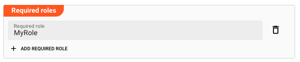

import WipDisclaimer from '/docs/snippets/common/_wip-disclaimer.md';

# Connection Kafka

## Purpose

Defines the connection parameters for a Kafka endpoint.

### This Asset can be used by:

| Asset type | Link                                                    |
|------------|---------------------------------------------------------|
| Source     | [Kafka Source](/docs/assets/sources/asset-source-kafka) |
| Sink       | [Kafka Sink](/docs/assets/sinks/asset-sink-kafka)       |

## Configuration

### Name & Description

**`Name`** : Name of the Asset. Whitespaces are not allowed in the name.

**`Description`** : Enter a description.

The **`Asset Usage`** box shows how many times this Asset is used and which parts are referencing it. Click to expand and then click to follow, if any.

### Required roles

In case you are deploying to a Cluster which is running (a) Reactive Engine Nodes which have (b) specific Roles configured, then you **can** restrict use of this Asset to those Nodes with matching
roles.
If you want this restriction, then enter the names of the `Required Roles` here. Otherwise, leave empty to match all Nodes (no restriction).

### Kafka Settings

#### General

* **`Bootstrap servers`**: List of URLs of available Kafka bootstrap servers. Enter URLs like `host:port.` Separate multiple URLs with a comma.

#### Security: Communication

**`Use SSL`**: Enable to establish a SSL-based secure connection.

If SSL is enabled, and you have either a truststore and optionally a keystore, then you have more options:

* **`Use truststore`**: The truststore is a file that contains the public key of the Kafka Server certificate. You have either created the truststore file yourself, or it was provided to you by a
  3rd-party.
  This entry is equivalent to the `ssl.truststore.location` property.
  Example: `/var/private/ssl/kafka.server.truststore.jks`

* **`Use identitity certificate`**: Select the secret necessary to decrypt the truststore. If this list is empty, then you first need to create it [here](/docs/assets/resources/asset-resource-secret).
  This entry is equivalent to the `ssl.truststore.password` property.
  Example: `1234`

* **`Keystore location`**: The keystore is a file used by an application server to store its private key and site certificate. Example: "_/Users/xyz/home/ssl/server.keystore.jks_".
  This entry is equivalent to the `ssl.keystore.location` property.
  Example: `/var/private/ssl/kafka.server.keystore.jks`

* **`Keystore password secret`**: Select the secret necessary to decrypt the keystore. If this list is empty, then you first need to create it [here](/docs/assets/resources/asset-resource-secret).
  This entry is equivalent to the `ssl.keystore.password` property.
  Example: `test1234`

* **`Key password secret`**:  Password secret for decryption of Key in Keystore. If this list is empty, then you first need to create it [here](/docs/assets/resources/asset-resource-secret).
  This entry is equivalent to the `ssl.key.password` property.
  Example: `test1234`

For more information about these configuration parameters, please also consult the
specific [Confluent documentation on this topic](https://docs.confluent.io/platform/current/kafka/authentication_ssl.html).
To learn about how to create a keystore and truststore using self-signed certificate
check [here](https://unix.stackexchange.com/questions/347116/how-to-create-keystore-and-truststore-using-self-signed-certificate).

#### Authentication

For Kafka, layline.io supports either no authentication or _SASL / PLAIN_ or _SASL / SCRAM_ based authentication.
SASL (Simple Authentication Security Layer) is a framework that provides developers of applications and shared libraries with mechanisms for authentication, data integrity-checking, and encryption.
Authentication parameters for the Kafka connection:

**`Authentication type`**:

Choice of

* **`None`**: No authentication

* **`SASL / PLAIN`**: PLAIN, or SASL/PLAIN, is a simple username/password authentication mechanism that is typically used with TLS for encryption to implement secure authentication.

* **`SASL / SCRAM`**: Salted Challenge Response Authentication Mechanism (SCRAM), or SASL/SCRAM, is a family of SASL mechanisms that addresses the security concerns with traditional mechanisms that
  perform username/password authentication like PLAIN.

You can check the [Confluent Authentication Documentation](https://docs.confluent.io/platform/current/kafka/overview-authentication-methods.html) for more information on authentication types, their
meaning and related settings.

For _SASL / PLAIN_ and _SCRAM_ based authentication you need to consider the following settings:

**`Credential Type`**: Choice of

* **`User/Password`**: Enter a username & password combination in the fields `Username` and `Password` respectively.
  Tick the `Do not substitute macro terms in password` checkbox if you do not want to have macros (if any) replaced in a password, but rather keep the raw string as the password.
  If - for example - your password is `pass_${env:MYVAR}_word` and you do not want the term `${env:MYVAR}` to be interpreted as a macro and then replaced with the MYVAR environment variable, then tick
  this box to keep the raw string value.

* **`User/Secret`**:
  Enter a `Username` and select a `Secret` from the drop-down list. It the list is empty, then you need to first [create a secret](/docs/assets/resources/asset-resource-secret) to be able to assign it
  here.

  Please [follow this link to "Advanced Concepts"](/docs/concept/advanced/secret-management) to learn about the concept and use of the Security Storage.

#### Connection Test Result:

While you are entering and changing Kafka Settings parameters, layline.io frequently tries to connect to the endpoint.
The status of these attempts are displayed at the bottom of the Kafka Settings group box.

In case of error, you can hover the mouse over the red output and view what the problem is:

This usually helps to resolve the issue.

:::info Attention: Connection is not tested between browser and endpoint
Please note that the connection test is not performed between your web browser and the backend.
Connection data is rather sent to the Configuration Server first, which then tries to establish the connection between itself and the endpoint.
In case you run into a connection error, please therefore check whether the endpoint can be reached from the viewpoint of the Configuration Server.

This also does not warrant, that a connection can be established from your deployment on a Reactive Engine, as this will only be evaluated at runtime of the Workflow utilizing this Connection Asset.
The Reactive Engine must be able to reach the configured endpoint, or otherwise connection at runtime will fail.
:::

## Related Topics

### Internal

* [Kafka Source](/docs/assets/sources/asset-source-kafka)
* [Kafka Sink](/docs/assets/sinks/asset-sink-kafka)
* [Kafka Input Processor](/docs/assets/processors-input/asset-input-kafka)
* [Kafka Output Processor](/docs/assets/processors-output/asset-output-kafka)
* [Create and manage secrets](/docs/assets/resources/asset-resource-secret)

### External

* [Confluent Kafka: Authentication Methods Overview](https://docs.confluent.io/platform/current/kafka/overview-authentication-methods.html)
* [Confluent Kafka: Encryption and Authentication with SSL](https://docs.confluent.io/platform/current/kafka/authentication_ssl.html)
* [Confluent Kafka: Producer Configurations](https://docs.confluent.io/platform/current/installation/configuration/producer-configs.html)
* [Confluent Kafka: Consumer Configurations](https://docs.confluent.io/platform/current/installation/configuration/consumer-configs.html)
* [Create a keystore and truststore using self-signed certificate](https://unix.stackexchange.com/questions/347116/how-to-create-keystore-and-truststore-using-self-signed-certificate).

---
<WipDisclaimer></WipDisclaimer>
