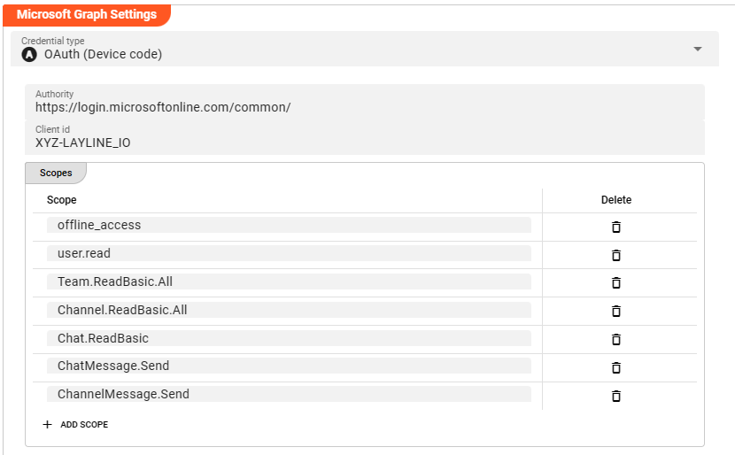
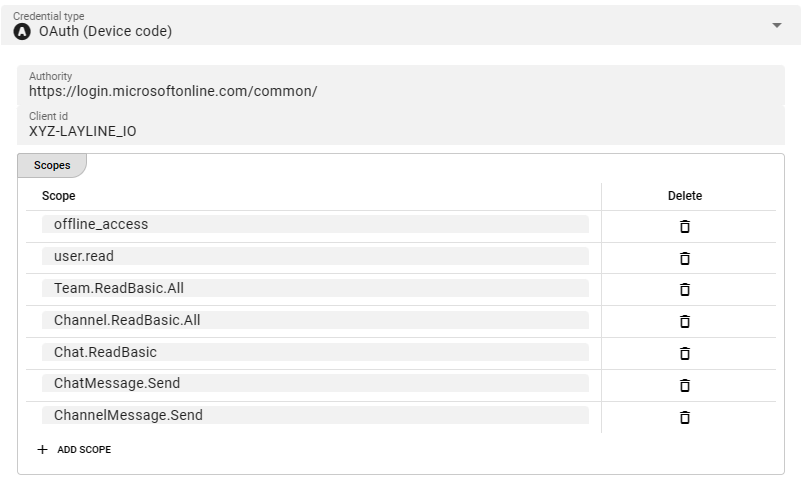

import WipDisclaimer from '../../snippets/common/_wip-disclaimer.md'
import CredentialType from '../../snippets/assets/_credential-type.md';

# Connection MS Graph

## Purpose

Defines the connection parameters for various Microsoft application endpoints, for instance SharePoint, MSTeams, et al.

### This Asset can be used by:

| Asset type | Link                                                              |
|------------|-------------------------------------------------------------------|
| Source     | [OneDrive Source](/../sources/asset-source-onedrive)     |
|            | [SharePoint Source](/../sources/asset-source-sharepoint) |
| Sink       | [OneDrive Sink](/../sinks/asset-sink-onedrive)           |
|            | [SharePoint Sink](/../sinks/asset-sink-sharepoint)       |
| Service    | [Teams Service](/../services/asset-service-teams)        |

## Configuration

### Name & Description

")

**`Name`** : Name of the Asset. Spaces are not allowed in the name.

**`Description`** : Enter a description.

The **`Asset Usage`** box shows how many times this Asset is used and which parts are referencing it. Click to expand and then click to follow, if any.

### Required roles

")

In case you are deploying to a Cluster which is running (a) Reactive Engine Nodes which have (b) specific Roles configured, then you **can** restrict use of this Asset to those Nodes with matching
roles.
If you want this restriction, then enter the names of the `Required Roles` here. Otherwise, leave empty to match all Nodes (no restriction).

### Microsoft Graph settings

The MS Graph connection Asset supports the Microsoft 365 connection protocol.
Note, that this is proprietary to Microsoft.

#### Credential type

Microsoft Graph supports two different authentication flows:

1. OAuth (Client Credentials)
2. OAuth (Device Flow)

Please check with your Microsoft endpoint which authentication flow is appropriate for your use case.

##### Microsoft OAuth (Client Credentials)

The Client Credentials Flow involves an application exchanging its application credentials, such as client ID and client secret, for an access token.
You can check the [Auth0 documentation](https://auth0.com/docs/get-started/authentication-and-authorization-flow/client-credentials-flow) for an example description.

* **`Authority`**:
  The authority URL as provided by the party to connect to. This is the endpoint which authorizes the connection and issues a respective token.

* **`Client ID`**:
  An ID issued by the authenticating authority.

* **`Scopes`**:
  These are the authentication scopes requested by the connection and which must be granted by the authenticating authority.
  This is typically defined by the issuing authority in the context of the client id.
  I.e. if the other party has granted the access scopes which you define here, they authentication will be successful.
  Otherwise, the authentication may fail.

  **Note**: the above screenshot shows the authentication scopes required for the Teams Service.

##### Microsoft OAuth (Device Flow)

With input-constrained devices that connect to the internet, rather than authenticate the user directly, the device asks the user to go to a link on their computer or smartphone and authorize the
device.
This avoids a poor user experience for devices that do not have an easy way to enter text.
To do this, device apps use the Device Authorization Flow, in which they pass along their Client ID to initiate the authorization process and get a token.

You can check the [Auth0 documentation](https://auth0.com/docs/get-started/authentication-and-authorization-flow/device-authorization-flow) for an example description.

For settings please see [Microsoft Client Credential Flow](#microsoft-oauth-client-credentials) above.

<WipDisclaimer></WipDisclaimer>
