import WipDisclaimer from '/docs/snippets/common/_wip-disclaimer.md';

# ASN.1 Format

## Purpose

This Asset allows you to define an ASN.1-based data format based on a grammar in ASN.1 notation.

It provides a simple interface to submit the original ASN.1 grammar and configure how to create layline.io messages from them.

The editor enables you to:

1. **Define** the grammar of a ASN.1-encoded format.
2. **Test** the grammar with real-life data while in edit-mode.

Formats defined this way may be used to both read and write data in this format.

In addition to this, **and very importantly so**, the grammar also enables you to access the data within defining business logic, e.g. in Javascript and other Assets.

We will explain all of this in this document.

:::caution Not all ASN.1 types are supported yet.
While most of the ASN.1 language is supported, there may be edge cases which layline.io may yet not be able to handle successfullly.
Should you encounter such a case, then please let us know at support@layline.io.
We will ensure that your case will be accommodated in the short term.
:::

### This Asset can be used by:

| Asset type        | Link                                                                                 |
|-------------------|--------------------------------------------------------------------------------------|
| Input Processors  | [Kafka Input](/docs/assets/processors-input/asset-input-kafka)                       |
|                   | [Request-Response Input](/docs/assets/processors-input/asset-input-request-response) |
|                   | [Stream Input](/docs/assets/processors-input/asset-input-stream)                     |
|                   | [Frame Input](/docs/assets/processors-input/asset-input-frame)                       |
| Output Processors | [Stream Output](/docs/assets/processors-output/asset-output-stream)                  |

## Configuration

Note that this Asset has two tabs at the top:

<div className="frame">

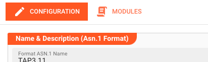

</div>

1. **`Configuration`**:
   Basic configuration parameters and message mapping

2. **`Modules`**:
   Configuration of ASN.1 modules --> This is where you submit the ASN.1 grammars

We wil guide you through the configuration using the example of the TAP3.11 ASN.1 format grammar.

:::info TAP 3 Specification
You can obtain the complete TAP3 specification [here](https://www.gsma.com/aboutus/workinggroups/wp-content/uploads/2015/01/tap3-docs1.zip).
:::

### Name & Description

<div className="frame">

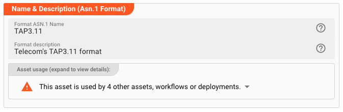

</div>

**`Name`** : Name of the Asset. Spaces are not allowed in the name.

**`Description`** : Enter a description.

The **`Asset Usage`** box shows how many times this Asset is used and which parts are referencing it. Click to expand and then click to follow, if any.

### Modules

#### Adding ASN.1 modules

Switch to the modules tab:

<div className="frame">

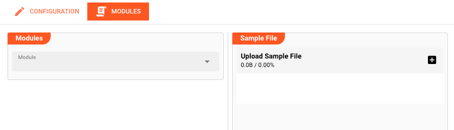

</div>

This is divided into two panels:

1. **`Modules`**: List of configured ASN.1 modules.
2. **`Sample File`**: Format testing panel.

Define one or more ASN.1 modules (depending on your grammar) using the Modules drop-down:

<div className="frame">

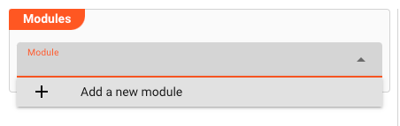

</div>

In our example we will define an ASN.1-grammar based on one module:

<div className="frame">

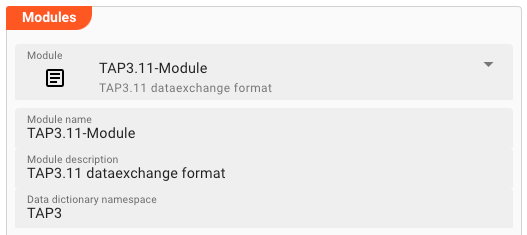

</div>

* **`Name`**: Provide a logical name for the module. Avoid whitespace.

* **`Description`**: Provide a description (optional).

* **`Data Dictionary Namespace`** (optional):
  Internal name of the target namespace for this grammar (without whitespace). Must be unique across all formats.
  If you enter a name here, then layline.io will create a namespace in the global data dictionary by that name.
  The structure defined by the ASN.1 grammar is then accessible by this name from the data dictionary.
  If, for example, you would want to create a brand new ASN.1 message within a Javascript Processor, you could invoke:

  ```js title="Script to create a message from data dictionary namespave 'TAP3'"
  let message = dataDictionary.createMessage(dataDictionary.type.TAP3);
  ```

  See also [createMessage](/docs/lang-ref/javascript/API/classes/DataDictionary#createmessage).

* **`ASN.1 module`**:
  At last, enter the ASN.1 grammar in the editor:

  <div className="frame">

  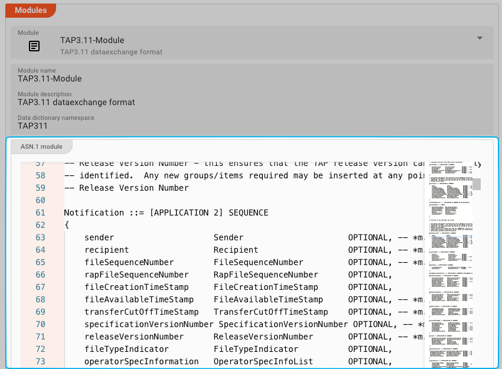

  </div>

You can either enter the grammar manually, or simply copy and paste it from a specification document or specification file which you have obtained.

When you are done, let's switch back to the `Configuration` tab. We will test the file format later.

<div className="frame">

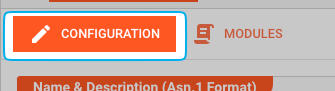

</div>

### Message Creation

In the Configuration tab we still need to define how ASN.1 contexts should map onto an internal message of layline.io.
As an example, within the TAP3 format we used for demonstration purposes, we do have a header context, a detail context, and a trailer.
For layline.io to be able to identify them based on their ASN.1 context, we have to manually map them.

Explore the `Message Creation` box:

<div className="frame">

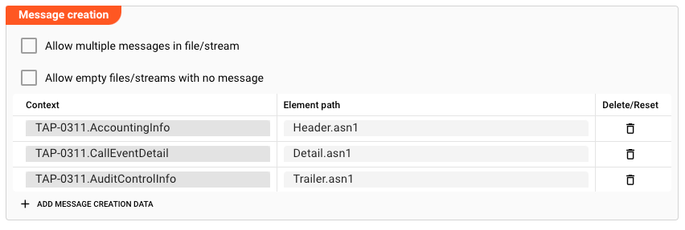

</div>

* **Allow multiple messages in file stream**:
  Check this, if your ASN.1 format defines multiple messages, i.e. there is not just one root element (as is the case in our TAP3 example), or whether it contains multiple individual messages.

* **Allow empty files/streams with no message**:
  Check this box, if an empty stream is allowed, e.g. if it contains no messages at all.
  Leave unchecked if such a condition should be treated as an error by the system.

* **Message mapping**:
  This is where we define how to ASN.1 contexts should be reflected in the internal message structure of layline.io.

  Click on `ADD MESSAGE CREATION DATA` below the table:

  <div className="frame">

  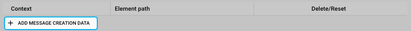

  </div>

  A new line will be added to the table. You can now enter a ASN.1 context as taken from one of the ASN.1 modules which you have added.
  Note, how this is assisted through the UI:

  <div className="frame">

  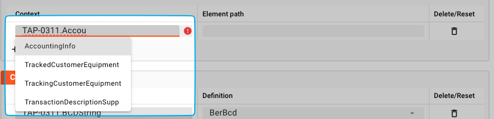

  </div>

  In the column `Element path` we enter how this identified record should be accessible within layline.io.
  Also, enter all remaining elements:

  <div className="frame">

  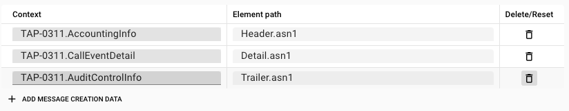

  </div>

  What happens here is that layline.io will dissect the ASN.1 message and look for the respective message contexts which we have entered above.
  For example an ASN.1 message part of context `TAP-0311.AccountingInfo` will be mapped into the data dictionary at namespace `Header.asn1`.
  Likewise `TAP-0311.CallEventDetail` will be mapped to `Detail.asn1`.
  We can then for example access this information within a Javascript Flow Processor script like so:

  ```js title="MyAsn1Processor.js""
  function onMessage(message) {
      
    if (message.type.Detail) {
      const msisdn = message.data.asn1.mobileTerminatedCall.basicCallInformation.chargeableSubscriber.simChargeableSubscriber.msisdn;
      // Now do something with the msisdn ....
    } else if (message.type.Header) {
      const currency = message.data.asn1.localCurrency;
      // Now do something with the currency ....      
    } else if (message.type.Trailer) {
      const charge = message.data.asn1.totalCharge;
      // Now do something with the charge ....      
    }
    
    stream.emit(message, OUTPUT_PORT);
  }
  ``` 

With the message creation parameters specified, we can now test the configured ASN.1 format with real data.

### Sample File Testing

The UI provides the capability to not only define the grammar for your format, but readily test whether it actually works.
All of this without having to go through the round-trip of deploying a whole Project to a cluster, running it, only to find out that you made a configuration mistake in the grammar.

Head over to the `Modules` tab:

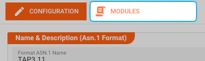

#### Matching grammar and data

Next to the Module-Definition Editor is the Sample-File Viewer.
This is where you can upload a sample file with real-life data to see whether your grammar matches your data.

Simply drag-and-drop a matching file onto the white area or hit the `+`-button to add a file:

<div className="frame">

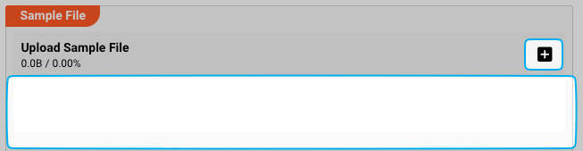

</div>

In the image below we have loaded a small sample file for our example grammar which we have introduced at the beginning of this description.

If your file matches the grammar, you will see the structure in a tree on the left, and a corresponding list with the hex values to the right.

<div className="frame">

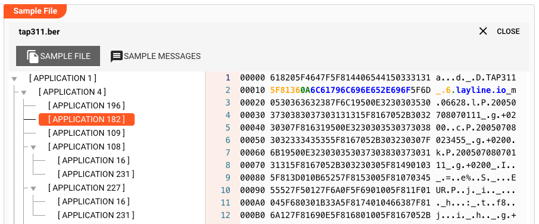

</div>

Selecting a part of the structure will highlight the corresponding hex output:

<div className="frame">

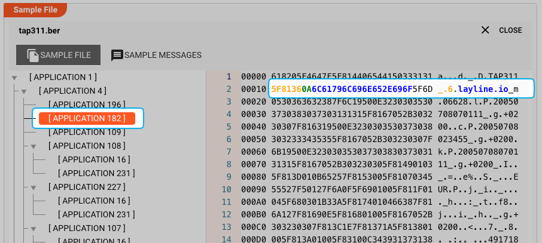

</div>

To view how this is parsed by layline.io, select the `SAMPLE MESSAGES` tab:

<div className="frame">

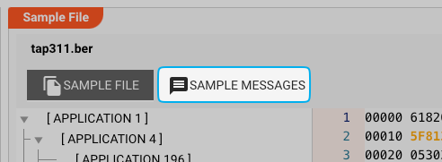

</div>

A table with the parsed values will be displayed:

<div className="frame">

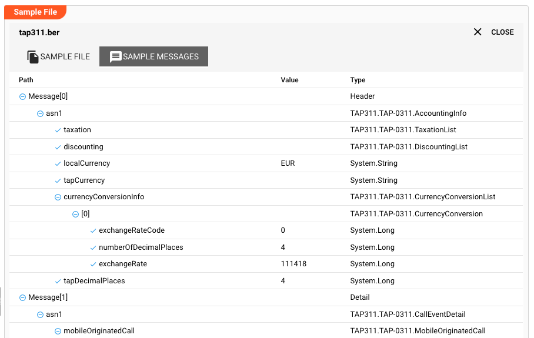

</div>

Please note the column `Value` and see how the types are converted internally.

#### In the case of error

Should an error occur during sample file parsing, nothing will be displayed.
For potential analysis of the error, you currently have to turn to the console output of the Configuration Server.
We plan to display proper error messages in the UI in a future version.


---
<WipDisclaimer></WipDisclaimer>
