import WipDisclaimer from '/docs/snippets/common/_wip-disclaimer.md';

# Data Dictionary Format

## What is the Data Dictionary?

One thing which sets layline.io apart from other message processors (e.g. Kafka), is that it was designed to understand
your data from the outset.
It's not enough to just push data around. If you need to work with data you need to understand it. Hence, the capability
to define data formats of any kind.

:::tip First: Read about the Data Dictionary concept
If you are not familiar with the concept of the Data Dictionary in layline.io, please read about it first and then return here.

-> [Data Dictionary Concept](/docs/concept/data-dictionary)
:::

## What is the purpose of the Data Dictionary Asset?

As explained in the [Data Dictionary Concept](/docs/concept/data-dictionary), layline.io creates a global internal Data Dictionary based on all the data formats defined by you.
There might be cases, however, where this is not enough, and where you want to store additional information alongside a message which traverses the system.

Some examples:

* **Message augmentation**:
  Data is read from a Source in Format A.
  As you process the information in a Workflow, you derive additional information from the content.
  You may need this additional derived data further downstream in the Workflow.
  In order to store this additional information you can define a Data Dictionary Format which is then able to store this data.

  Since the data dictionary you create (with the Asset we are describing here) becomes part of the global data dictionary, and ever message is based on this, you can therefore retrieve any data stored
  in this Data Dictionary namespace
  anywhere you process a message.

* **Message creation**:
  Any structure which is contained in the Data Dictionary can be used to create a new message, which is based on such a structure.
  This can be used to create a structured message container which you can fill with data and then process and output it downstream.
  An example would be to create a new message and then write its content to a Kafka topic in a structured format.
  The same structure can then be used to read it from a Kafka topic where it is parsed based on the structure you defined in the Data Dictionary and converted into a layline.io message for further
  processing.

### This Asset can be used by:

| Asset type      | Link                                                                      |
|-----------------|---------------------------------------------------------------------------|
| Formats         | [Generic Format](/docs/assets/formats/asset-format-generic)               |
| Flow Processors | [Filter & Routing](/docs/assets/processors-flow/asset-flow-filterrouting) |
|                 | [Javascript](/docs/assets/processors-flow/asset-flow-javascript)          |
|                 | [Mapping](/docs/assets/processors-flow/asset-flow-mapping)                |
|                 | [Stream Boundary](/docs/assets/processors-flow/asset-flow-streamboundary) |

## Configuration

### Name & Description

<div className="frame">

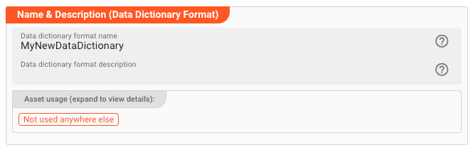

</div>

**`Name`** : Name of the Asset. Spaces are not allowed in the name.

**`Description`** : Enter a description.

The **`Asset Usage`** box shows how many times this Asset is used and which parts are referencing it. Click to expand and then click to follow, if any.

### Format Dependencies

The Data Dictionary Elements you define with this Asset, may reference other Formats which you have already defined elsewhere (e.g. Generic formats, ASN.1 formats, etc.).
In order to let the system know that you require and reference these other formats in this Data Dictionary, you have to add them here.

<div className="frame">

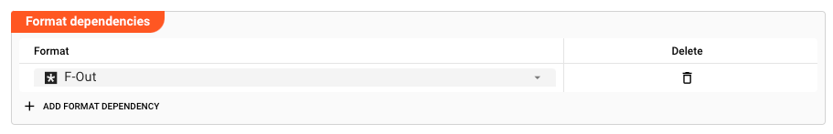

</div>

:::caution Potential pitfall
If you forget or omit to define other data formats which you are referencing in the Data Dictionary format you are defining in this Asset, you may run into runtime errors during execution.

This could look like this:


This example error is taken from the Audit Trail Log. It shows that the system does not know the F_OUT element, which in this example is defined in another Format `F-Out`.
This can occur when elements of that format are being referenced in a Workflow, but the format is neither being actively used in input or output, or was not added as a dependency.
:::

### Format Types

This is where you actually define your specific Data Dictionary itself.
Remember that a Data Dictionary basically is a tree of elements with specific names and types.
Types may reference other types within this Data Dictionary, or from another Data Dictionary (which stems from another format definition, e.g. Generic Format, etc.).

Use the following dialog to define this tree.

<div className="frame">

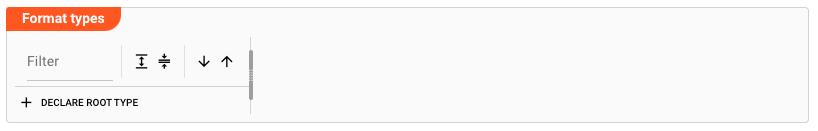

</div>

#### Example

We will explain the configuration using an example, configuring the following data dictionary:

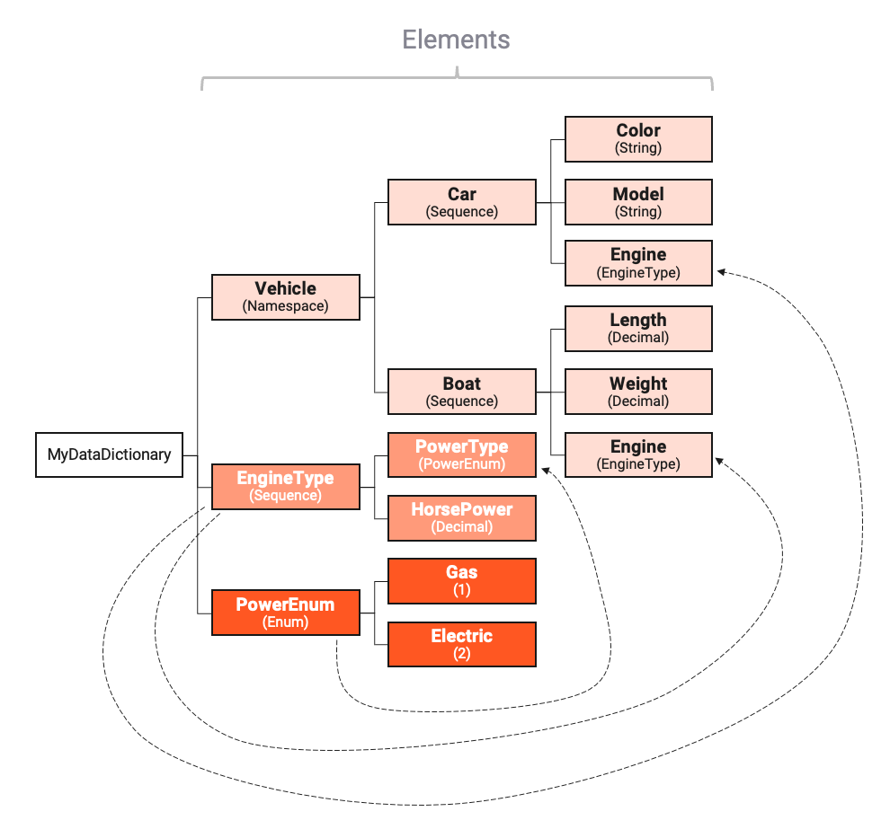

Depicted by the arrows, we can see that elements `EngineType` and `PowerEnum` are reused elsewhere in the Data Dictionary.
It is also possible to reference elements which are defined in other formats (e.g. Generic Format, another Data Dictionary, etc.).
If you are using elements from another format, then please make sure you observe what we wrote on [Format Dependencies](#format-dependencies) above.

#### Declaring Root Element

Let's get started declaring the `PowerEnum` enumeration.
We pick this one first, because it is required to be referenced by other elements we plan to create.

* Click on `Declare Root Type`:

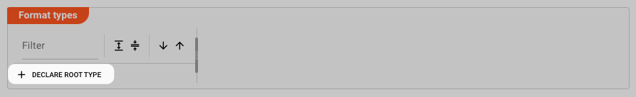

A new element `Namespace1` will be created. Click on it to select it.

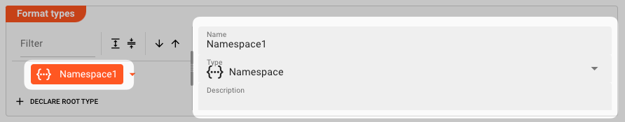

On the right hand panel you will see that the type defaults to "_Namespace_".

- Change the name to "_PowerEnum_".
- Change the type in the `Type` drop-down box to `Enumeration`.
- Enter a description (optional).

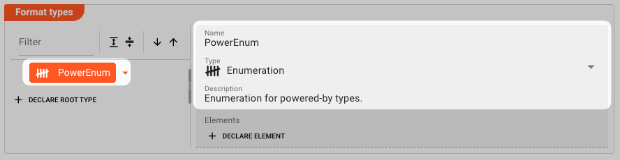

#### Declaring Members / Elements

##### Example: `PowerEnum` declaration

We can now continue by declaring the individual members (properties) of the enumeration.
Click on `Declare Element`.

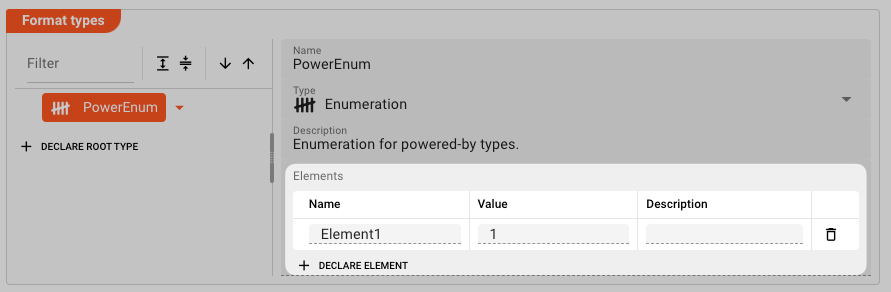

and define the following elements:

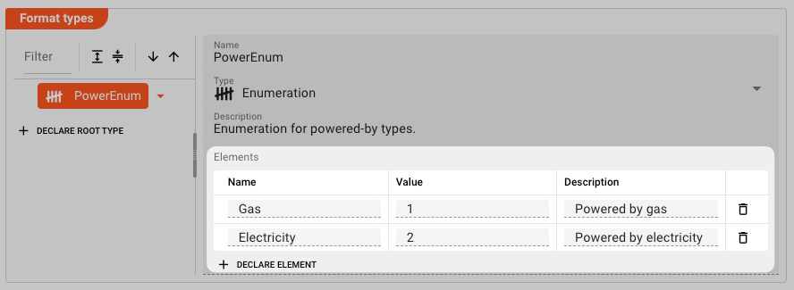

We are done declaring the `PowerEnum` data dictionary type.

##### Example: `EngineType` declaration

Next we declare the `EngineType` almost the same way we declared the `PowerEnum` type.

1. Declare a new root-level element
2. Make it of type `Sequence`
3. Add members `PoweredBy ` and `HorsePower`

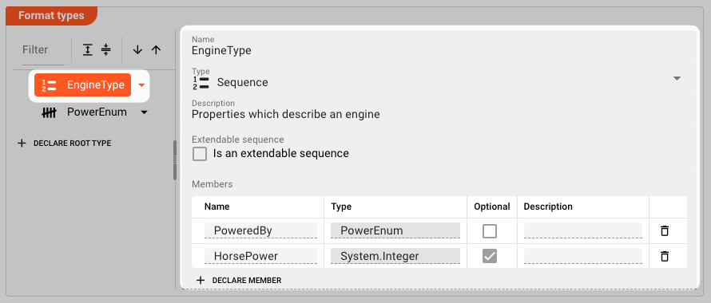

Note the type of member `PoweredBy` which is `PowerEnum`.
That's the type we have just defined in the previous section and is a good example of how data types can be reused within the Data Dictionary.

##### Example: `Vehicle Type` declaration.

At last, we define the `Vehicle` namespace, and within it the `Boat` and `Car` members:
To add child members to an element, click the arrow to the right of the element, and select `Add Child`:

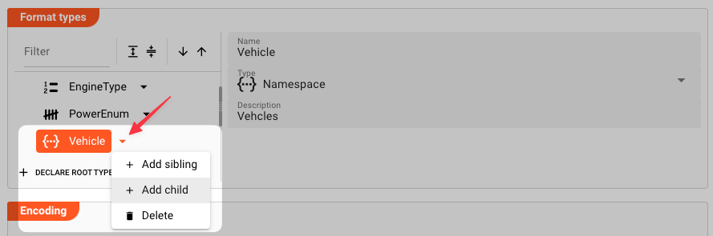

Then add the `Boat` element:

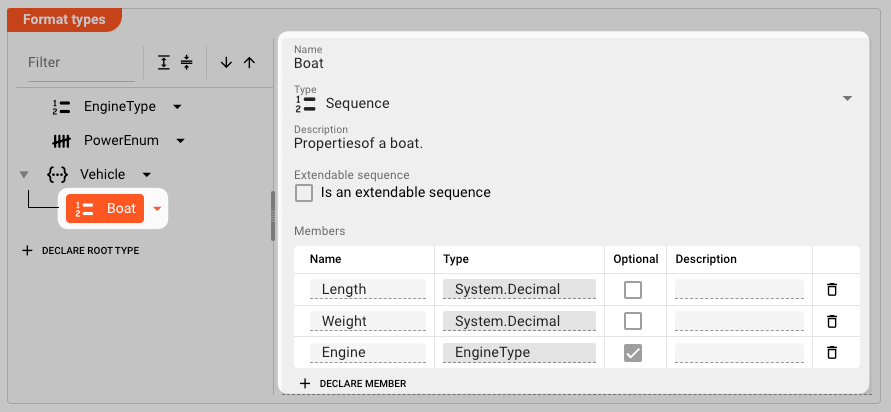

Note that member `Engine` is of type `EngineType` which we have declared above.
It is also optional, so it does not have to be filled to make the `Engine` element valid.

Finally, add the `Car` element:

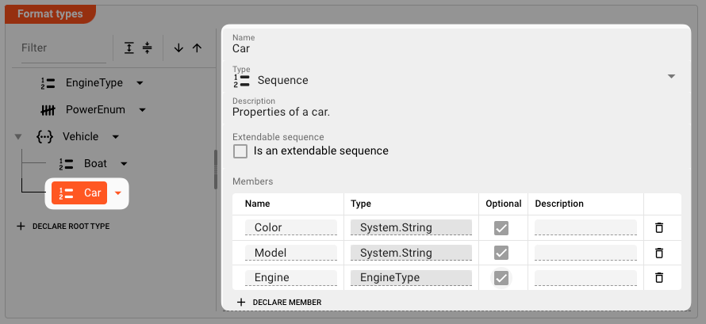

Again, note how member `Engine` is also of type `EngineType`.

We have now finalized the setup of what we wanted to create in the Data Dictionary as described in [Example](#example).

:::caution
If you delete an Element which is referenced elsewhere, the system will not notify you.  
You will get an error at runtime, however.
:::

### Element Types

In our example above, we already learned how to set up a Data Dictionary.   
It's time to look at the supported element types in detail and their configuration options:

#### Namespace

**Definition**
A set of signs that are used to identify and refer to objects of various kinds. A namespace ensures that all of a given set of objects have unique names so that they can be easily identified.

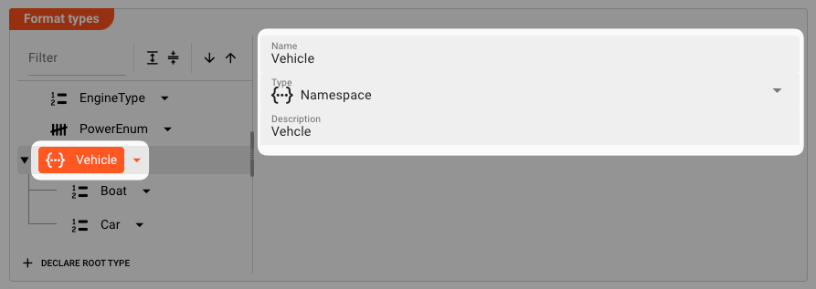

* **`Name`**:
  The name of the namespace.
  :::info
  If you define a namespace of the same name in another format, the namespaces will be merged under this namespace name.
  Overlapping identical member names will lead to a runtime error.
  :::
* **`Type`**: `Namespace`
* **`Description`**: Anything that describes the namespace better.

#### Array

**Definition**
A data structure consisting of a collection of elements of specific type, e.g. `System.Integer`, or `PowerEnum` from our example.

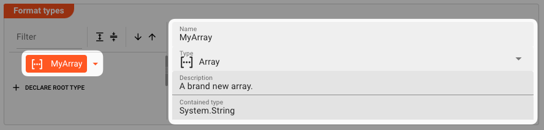

* **`Name`**:
  The name of the array.
* **`Type`**: `Array`
* **`Description`**: Anything that describes the array better.
* **`Contained type`**: A System type, or any data type which is defined in this Data Dictionary format or any another format.

#### Choice

**Definition**
A multipurpose element used to allow a selection of either one of its declared members.

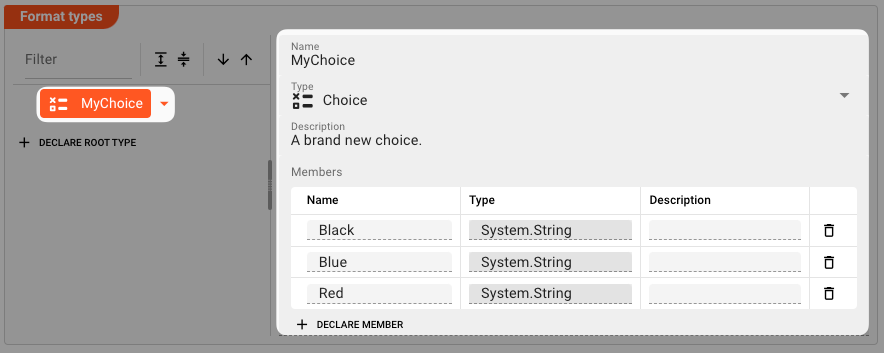

* **`Name`**:
  The name of the choice.
* **`Type`**: `Choice`
* **`Description`**: Anything that describes the namespace better.
* **`Members`**: A list of members which are exclusive. You may only assign one of these properties in the `Choice` datatype.
    * **`Name`**: Unique name per member.
    * **`Type`**: A System type, or any data type which is defined in this Data Dictionary format or any another format.
    * **`Description`**: Anything that describes the member better.

#### Enumeration

**Definition**
A data type consisting of a set of named values called elements (enumerators), of the type. The enumerator names are usually identifiers that behave as constants.

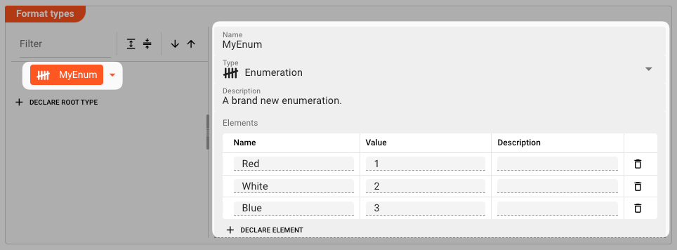

* **`Name`**:
  The name of the enumeration.
* **`Type`**: `Enumeration`
* **`Description`**: Anything that describes the enumeration better.
* **`Members`**: A list of unique enumerators.
    * **`Name`**: Unique name per member.
    * **`Value`**: A unique integer value.
    * **`Description`**: Anything that describes the enumerator better.

#### Sequence

**Definition**
A defined sequence of members (properties).

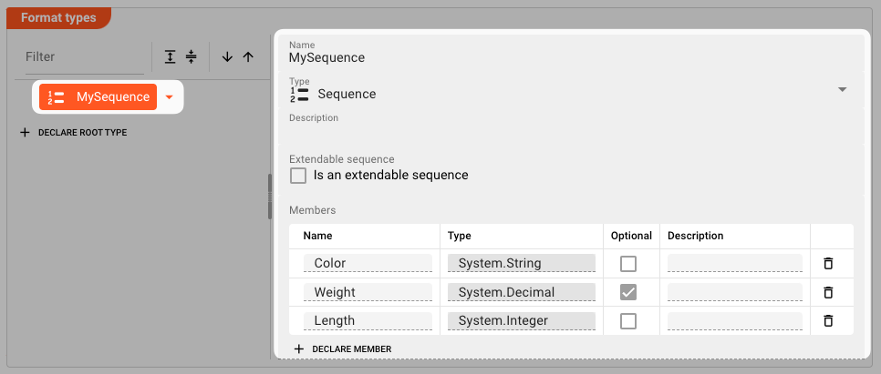

* **`Name`**:
  The name of the sequence.
* **`Type`**: `Sequence`
* **`Description`**: Anything that describes the sequence better.
* **`Extendable sequence`**:
  Members of a sequence are usually fixed.
  If you want to allow to add additional members at runtime, then check this.
* **`Members`**: A list of unique properties.
    * **`Name`**: Unique name per member.
    * **`Type`**: A System type, or any data type which is defined in this Data Dictionary format or any another format.
    * **`Optional`**: Check this, if the member is optional. If not, then this member must exist in the sequence.
    * **`Description`**: Anything that describes the member better.

### Encoding

There may be situations, in which you want to write out parts of data formats into a store in a specific format (e.g. JSON), and/or read data our from a store and then have it converted back into the
internal data
representation. The question then is, that whenever the data is read back from the store, how does the system determine how to **_encode_** it back to the data dictionary format?

**Encoding** helps you accomplish this task.

To demonstrate how to use this, we extend our example by the following use case:

1. "_We want to write the data into a Kafka topic in JSON format._"
2. "_At a later stage_we want to read it back out of Kafka and **encode it back** from JSON into our own data dictionary._"

First - and only for the purpose of our example - we extend the data dictionary by the following structure (blue).

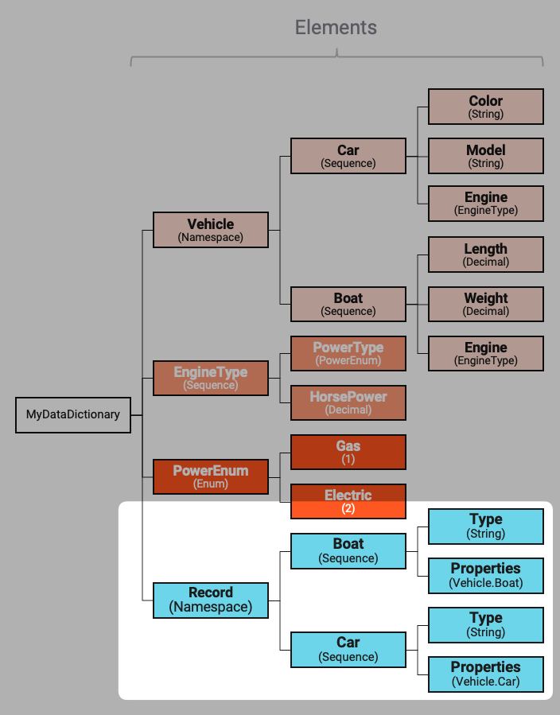

Let's assume we have a message of type `Vehicle.Boat` in our Workflow, which we not want to write out to Kafka in JSON format.
This is how we would prepare this using a Javascript Flow Processor in our example workflow:

```js title="Preparing JSON output data in Javascript Flow Processor"
    // Create a new message based on the Data Dictionary type Record.Boat 
let outputRecord = dataDictionary.createMessage(dataDictionary.type.Record.Boat);

outputRecord.data = {
    Type: 'Boat',
    Properties: {
        Color: message.Vehicle.Boat.Color,
        Model: message.Vehicle.Boat.Model,
        Engine: {
            PoweredBy: message.Vehicle.Boat.Engine.PoweredBy,
            HorsePower: message.Vehicle.Boat.Engine.HorsePower
        }
    }
};

stream.emit(outputRecord, OUTPUT_PORT);
```

So the example output to Kafka could eventually look like this:

```json title="Sample JSON output to Kafka"
{
  "Type": "Boat",
  "Properties": {
    "Color": "Blue",
    "Model": "Yacht",
    "Engine": {
      "PoweredBy": "Electricity",
      "HorsePower": "500"
    }
  }
}
```

When the data is then output to a Kafka Sink, it is output and store in JSON.

Now, let's assume we have another Workflow which reads the data back out of the Kafka topic, how is this then brought back into Data Dictionary form?
That's where encoding comes into play.

In the "Encoding" section we define the following:

#### JSON

##### Type Name

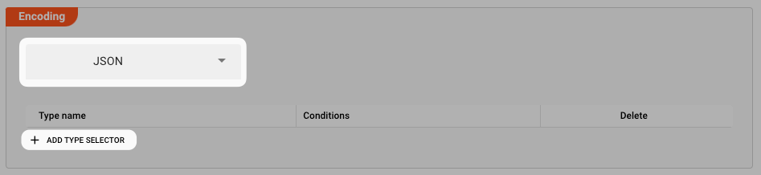

First we select the encoding type from the drop-down list. Currently only "JSON" is supported.
We are going to add additional formats in the future, e.g. ProtoBuf, etc.

We then start adding configuration information which allows the system to understand how to convert incoming JSON data streams back into the respective Data Dictionary types.
We want to convert incoming JSON back into either `Record.Boat` or `Record.Car`.
So we are adding the following:

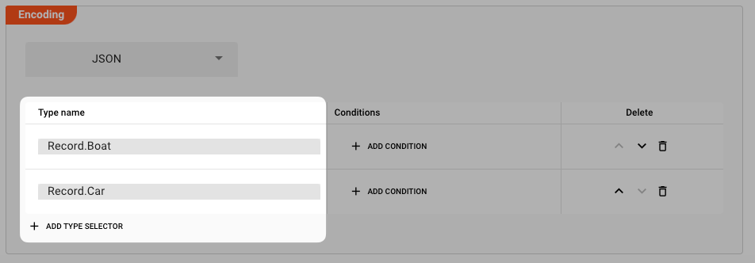

Next, we add the conditions for when these should be selected, based on the incoming information:

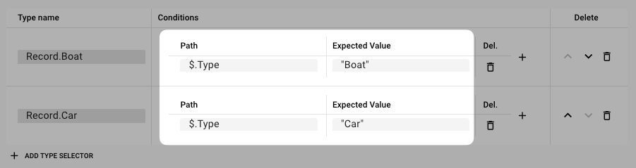

##### Conditions

* **`Path`**:
  This is how the system identifies a field in the incoming input data against which we want to compare and deduce back to the internal Data Dictionary type.
  In our example this would mean, that if we can find a field `Type` on root level of the incoming JSON, and hte value is `Boat`, then it would be encoded as `Record.Boat`.
  The Path conforms with _JSON-Path_. Other allowed operators:

  | Operator                  | Description                                                     |
      |---------------------------|-----------------------------------------------------------------|
  | $                         | The root element to query. This starts all path expressions.    |
  | @                         | The current node being processed by a filter predicate.         |
  | *                         | Wildcard. Available anywhere a name or numeric are required.    |
  | ..                        | Deep scan. Available anywhere a name is required.               |
  | .<name\>                  | Dot-notated child                                               |
  | ['<name\>' (, '<name\>')] | Bracket-notated child or children                               |
  | [<number\> (, <number\>)] | Array index or indexes                                          |
  | [start:end]               | Array slice operator                                            |
  | [?(<expression\>)]        | Filter expression. Expression must evaluate to a boolean value. |

  Our implementation of JSON-path is based off of the Jaymark-Library which contains other useful functions for JSON-Path evaluation.
  You can find the full list [here](https://github.com/json-path/JsonPath).

* **`Expected Value`**: The value which must be met to match the condition.

Coming back to our example, the incoming JSON data would be interpreted either as `Record.Boat` if the `Type` property equals = `"Boat"`, or as `Record.Car` if the `Type` property equals `"Car"`.

We could be adding additional conditions which have to be met. For example if a `Boat` is only a `Boat` if it has a property `Subtype` which equals `"small"`.

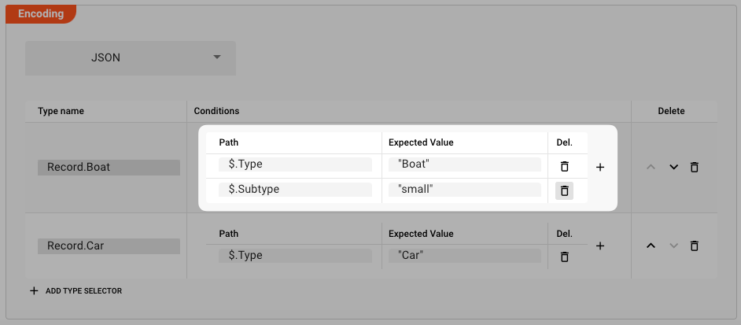

Now, in our example when reading the data back out of Kafka, we may have an Input Processor which `Format` is linked to this Data Dictionary `MyNewDataDictionary`:

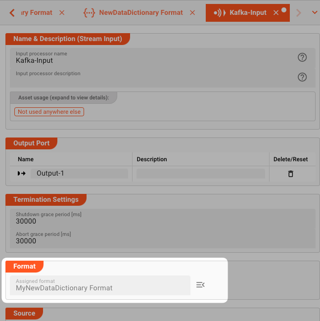

When data is now read through this Input Processor, the incoming data will be parsed by the applied Data Dictionary Format `MyNewDataDictionary`.

Let's also say following the Input Processor we again have a Javascript Flow Processor.
This could then access the data like with any other applied format like so:

```js title="Accessing parse data of Format MyNewDataDictionary"
function onMessage(message) {
    if (message.type.Record.Boat) {
        onBoat(message);
    } else if (message.type.Record.Car) {
        onCar(message);
    } else {
        throw "Unknown Record Type";
    }
}

function onBoat(detail) {
    if (detail.data.Properties.Length > 10) {
    ...
    }
}

function onCar(detail) {
    if (detail.data.Properties.Model === "Mustang") {
    ...
    }
}
```

:::tip Working with the Data Dictionary in Javascript
To understand how to work with the Data Dictionary in Javascript, [check here](/docs/category/javascript).
:::

---

<WipDisclaimer></WipDisclaimer>

