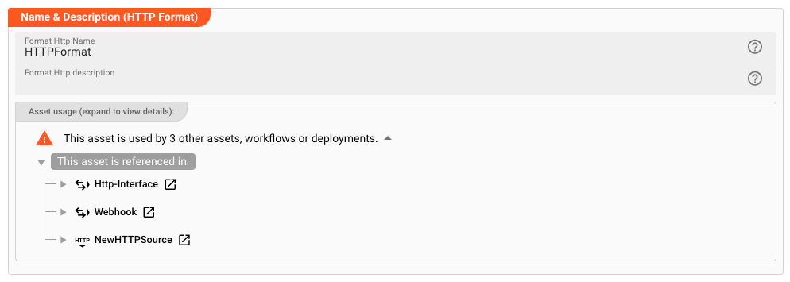
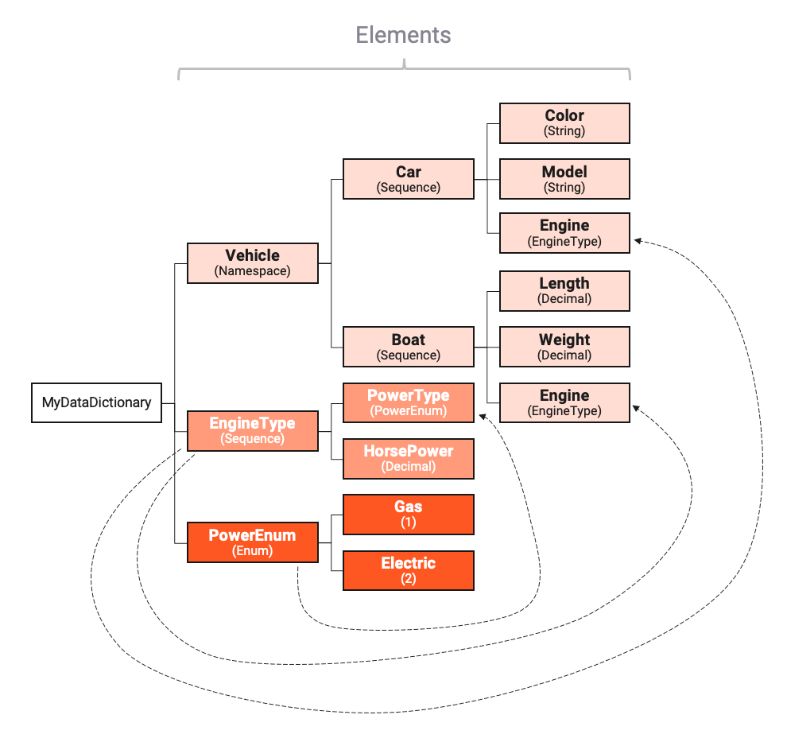
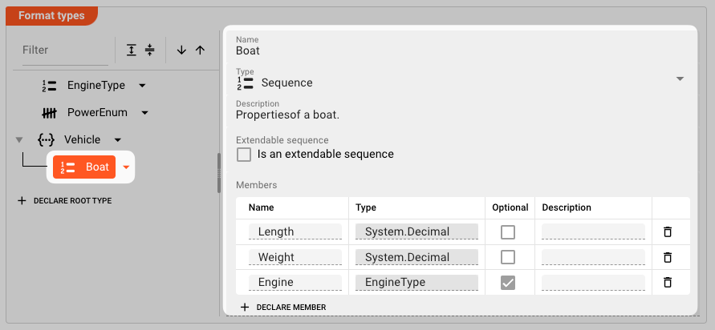
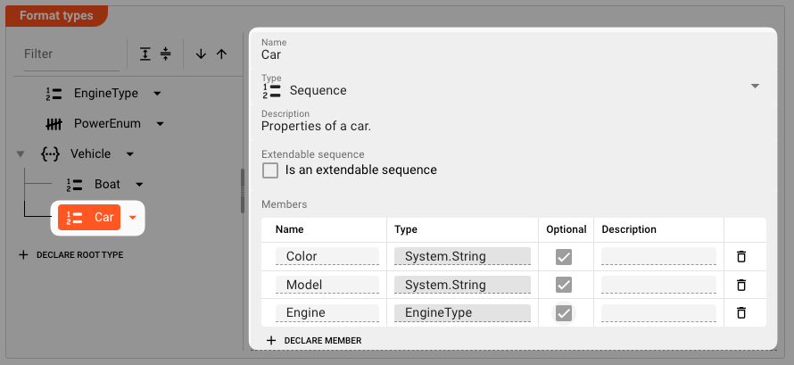
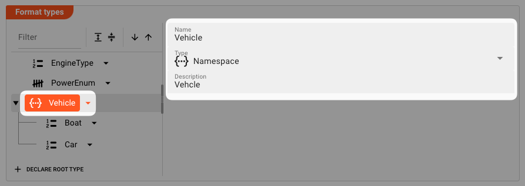
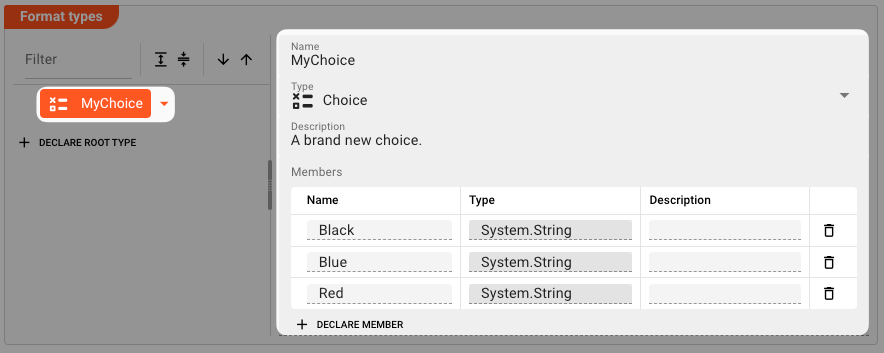
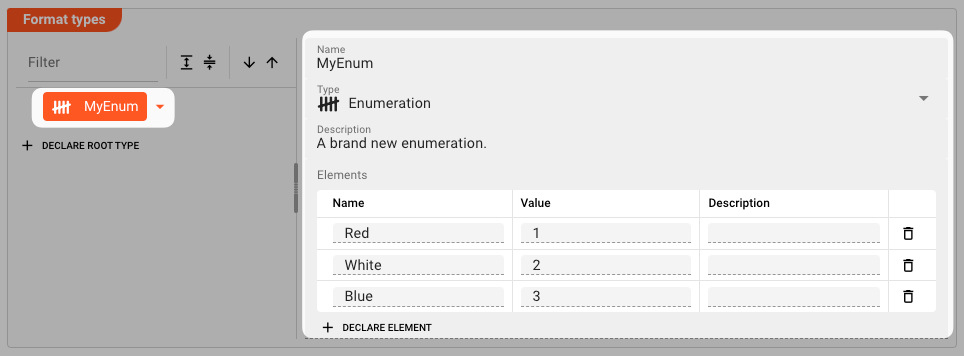
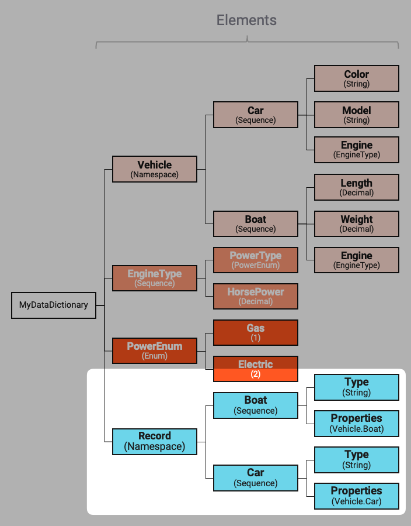
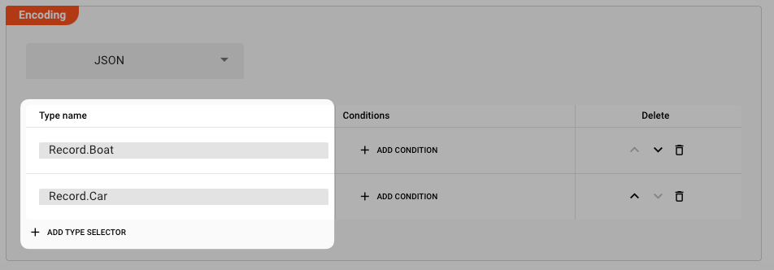

import WipDisclaimer from '/docs/snippets/common/_wip-disclaimer.md';

# Http Format

## Purpose

The Http-Format Asset defines Http-Rest-Interfaces which can be used together with a [Request-Response Input](../processors-input/asset-input-request-response) Processor.
Essentially you will be defining all the ways, an external entity can invoke a layline.io Workflow through an Http-interface.
Each call will generate a message with an optional payload (depending on how you configure the format).
The message then starts traversing the Workflow and can be subsequently be reacted to.

Some examples:

* **Exposing an interface to provide messages through a ReST interface**:
  An external system wants to issue data through an Http-call.
  layline.io provides this interface to pass the data by way of an interface which it exposes.

* **Querying data from layline.io**:
  An external system wants to query a layline.io instance for specific data by way of an Http-interface.
  layline.io provides this interface to receive the query, retrieve the necessary information and respond back to the querying system through the Http-interface.

Please check the [Request-Response Input](../processors-input/asset-input-request-response) Processor for more insight and adequate examples.

### This Asset can be used by:

| Asset type       | Link                                                                           |
|------------------|--------------------------------------------------------------------------------|
| Input Processors | [Request-Response](/docs/assets/processors-input/asset-input-request-response) |
| Source           | [Http Source](/docs/assets/sources/asset-source-http)                          |

## Configuration

### Name & Description

<div className="frame">



</div>

**`Name`** : Name of the Asset. Spaces are not allowed in the name.

**`Description`** : Enter a description.

The **`Asset Usage`** box shows how many times this Asset is used and which parts are referencing it. Click to expand and then click to follow, if any.

### Paths

In this section you define

1. **Paths**: The path identifies the specific resource in the host that the web client wants to access.
   These are the actual http-paths, e.g. `/` for the root path, or (our example) `/apaleo` for a specific path, etc.
2. **Methods**: These are the access methods **per path**, e.g. `GET` or `POST`, etc..

For each you can define the appropriate and necessary parameters, such as header parameters, query parameters etc.

As a result you are essentially creating a format which in a schema looks like this:

```
- /
  - GET
  - POST
- /mypath1
  - GET
- /anotherpath
  - GET
  - POST
```

You get the idea.

#### Data Dictionary Namespace

The first thing you define is the namespace under which the paths and the methods you define will be inserted into the global namespace.
For the purpose of our example we are defining an interface to apaleo; a widely used headless property management system.

We will therefore name the data dictionary namespace `Apaleo.Http`.
This will create a namespace by this name in the global data dictionary.
We wil learn later, how we can use this.


#### Add new Path

To add a new path, click on tha `PATH` drop-down box.
Select `Add a new path`.


A new path will be created with some default parameters.


* **`Name`**: The data dictionary name of this path.
  This is the name which will be used to reference the path within the data dictionary.
  May not contain any whitespace.

* **`Http Path`**: The actual http url part of the path under which the http methods can be reached.

  Example: Let's assume you have configured a workflow to handle incoming http requests.
  The workflow has a [Request-Response Input](../processors-input/asset-input-request-response) which is bound to a Source Asset which opens port 4712 under address `https://mycluster.mydomain.com`.
  Then given this path configuration you can access it under `htttps://mycluster.mydomain.com:4712/apaleo`.

* **`Header Parameters`**: These are the header parameters which you would like to access in the course of handling the http-call.
  Click on `+ ADD HEADER PARAMETER` to add a header.

    * **`Name`**: Enter the name which you want to use to access the header information from the message.
      Do not use whitespaces.

    * **`Header Name`**: Enter the name of the field as it is delivered in the header.

    * **`Optional`**: Check if the header field is optional, else leave unchecked.
      If it is mandatory, but not included in the call, then this will lead to a http error.

    * Accessing the header information from within Javascript:

  ```js
  function onMessage(message) {

    if (message.exists(dataDictionary.type.Apaleo.Http.Apaleo.GET)) {
        if (message.data.Request.Header.TheHeaderField === 'The value I expect') {
            // ...
        }
    } else {
        stream.logError('Unknown message received.');
    }
  
    // ...
  }

  ```

* **`Path Parameters`**:
* **`Query Parameters`**:

The Data Dictionary Elements you define with this Asset, may reference other Formats which you have already defined elsewhere (e.g. Generic formats, ASN.1 formats, etc.).
In order to let the system know that you require and reference these other formats in this Data Dictionary, you have to add them here.

<div className="frame">


</div>

:::warning Potential pitfall
If you forget or omit to define other data formats which you are referencing in the Data Dictionary format you are defining in this Asset, you may run into runtime errors during execution.

This could look like this:


This example error is taken from the Audit Trail Log. It shows that the system does not know the F_OUT element, which in this example is defined in another Format `F-Out`.
This can occur when elements of that format are being referenced in a Workflow, but the format is neither being actively used in input or output, or was not added as a dependency.
:::

### Format Types

This is where you actually define your specific Data Dictionary itself.
Remember that a Data Dictionary basically is a tree of elements with specific names and types.
Types may reference other types within this Data Dictionary, or from another Data Dictionary (which stems from another format definition, e.g. Generic Format, etc.).

Use the following dialog to define this tree.

<div className="frame">


</div>

#### Example

We will explain the configuration using an example, configuring the following data dictionary:



Depicted by the arrows, we can see that elements `EngineType` and `PowerEnum` are reused elsewhere in the Data Dictionary.
It is also possible to reference elements which are defined in other formats (e.g. Generic Format, another Data Dictionary, etc.).
If you are using elements from another format, then please make sure you observe what we wrote on [Format Dependencies](#format-dependencies) above.

#### Declaring Root Element

Let's get started declaring the `PowerEnum` enumeration.
We pick this one first, because it is required to be referenced by other elements we plan to create.

* Click on `Declare Root Type`:


A new element `Namespace1` will be created. Click on it to select it.


On the right hand panel you will see that the type defaults to "_Namespace_".

- Change the name to "_PowerEnum_".
- Change the type in the `Type` drop-down box to `Enumeration`.
- Enter a description (optional).


#### Declaring Members / Elements

##### Example: `PowerEnum` declaration

We can now continue by declaring the individual members (properties) of the enumeration.
Click on `Declare Element`.


and define the following elements:


We are done declaring the `PowerEnum` data dictionary type.

##### Example: `EngineType` declaration

Next we declare the `EngineType` almost the same way we declared the `PowerEnum` type.

1. Declare a new root-level element
2. Make it of type `Sequence`
3. Add members `PoweredBy ` and `HorsePower`


Note the type of member `PoweredBy` which is `PowerEnum`.
That's the type we have just defined in the previous section and is a good example of how data types can be reused within the Data Dictionary.

##### Example: `Vehicle Type` declaration.

At last, we define the `Vehicle` namespace, and within it the `Boat` and `Car` members:
To add child members to an element, click the arrow to the right of the element, and select `Add Child`:


Then add the `Boat` element:



Note that member `Engine` is of type `EngineType` which we have declared above.
It is also optional, so it does not have to be filled to make the `Engine` element valid.

Finally, add the `Car` element:



Again, note how member `Engine` is also of type `EngineType`.

We have now finalized the setup of what we wanted to create in the Data Dictionary as described in [Example](#example).

:::warning
If you delete an Element which is referenced elsewhere, the system will not notify you.  
You will get an error at runtime, however.
:::

### Element Types

In our example above, we already learned how to set up a Data Dictionary.   
It's time to look at the supported element types in detail and their configuration options:

#### Namespace

**Definition**
A set of signs that are used to identify and refer to objects of various kinds. A namespace ensures that all of a given set of objects have unique names so that they can be easily identified.



* **`Name`**:
  The name of the namespace.
  :::info
  If you define a namespace of the same name in another format, the namespaces will be merged under this namespace name.
  Overlapping identical member names will lead to a runtime error.
  :::
* **`Type`**: `Namespace`
* **`Description`**: Anything that describes the namespace better.

#### Array

**Definition**
A data structure consisting of a collection of elements of specific type, e.g. `System.Integer`, or `PowerEnum` from our example.


* **`Name`**:
  The name of the array.
* **`Type`**: `Array`
* **`Description`**: Anything that describes the array better.
* **`Contained type`**: A System type, or any data type which is defined in this Data Dictionary format or any another format.

#### Choice

**Definition**
A multipurpose element used to allow a selection of either one of its declared members.



* **`Name`**:
  The name of the choice.
* **`Type`**: `Choice`
* **`Description`**: Anything that describes the namespace better.
* **`Members`**: A list of members which are exclusive. You may only assign one of these properties in the `Choice` datatype.
    * **`Name`**: Unique name per member.
    * **`Type`**: A System type, or any data type which is defined in this Data Dictionary format or any another format.
    * **`Description`**: Anything that describes the member better.

#### Enumeration

**Definition**
A data type consisting of a set of named values called elements (enumerators), of the type. The enumerator names are usually identifiers that behave as constants.



* **`Name`**:
  The name of the enumeration.
* **`Type`**: `Enumeration`
* **`Description`**: Anything that describes the enumeration better.
* **`Members`**: A list of unique enumerators.
    * **`Name`**: Unique name per member.
    * **`Value`**: A unique integer value.
    * **`Description`**: Anything that describes the enumerator better.

#### Sequence

**Definition**
A defined sequence of members (properties).


* **`Name`**:
  The name of the sequence.
* **`Type`**: `Sequence`
* **`Description`**: Anything that describes the sequence better.
* **`Extendable sequence`**:
  Members of a sequence are usually fixed.
  If you want to allow to add additional members at runtime, then check this.
* **`Members`**: A list of unique properties.
    * **`Name`**: Unique name per member.
    * **`Type`**: A System type, or any data type which is defined in this Data Dictionary format or any another format.
    * **`Optional`**: Check this, if the member is optional. If not, then this member must exist in the sequence.
    * **`Description`**: Anything that describes the member better.

### Encoding

There may be situations, in which you want to write out parts of data formats into a store in a specific format (e.g. JSON), and/or read data our from a store and then have it converted back into the
internal data
representation. The question then is, that whenever the data is read back from the store, how does the system determine how to **_encode_** it back to the data dictionary format?

**Encoding** helps you accomplish this task.

To demonstrate how to use this, we extend our example by the following use case:

1. "_We want to write the data into a Kafka topic in JSON format._"
2. "_At a later stage_we want to read it back out of Kafka and **encode it back** from JSON into our own data dictionary._"

First - and only for the purpose of our example - we extend the data dictionary by the following structure (blue).



Let's assume we have a message of type `Vehicle.Boat` in our Workflow, which we not want to write out to Kafka in JSON format.
This is how we would prepare this using a Javascript Flow Processor in our example workflow:

```js title="Preparing JSON output data in Javascript Flow Processor"
    // Create a new message based on the Data Dictionary type Record.Boat 
let outputRecord = dataDictionary.createMessage(dataDictionary.type.Record.Boat);

outputRecord.data = {
    Type: 'Boat',
    Properties: {
        Color: message.Vehicle.Boat.Color,
        Model: message.Vehicle.Boat.Model,
        Engine: {
            PoweredBy: message.Vehicle.Boat.Engine.PoweredBy,
            HorsePower: message.Vehicle.Boat.Engine.HorsePower
        }
    }
};

stream.emit(outputRecord, OUTPUT_PORT);
```

So the example output to Kafka could eventually look like this:

```json title="Sample JSON output to Kafka"
{
  "Type": "Boat",
  "Properties": {
    "Color": "Blue",
    "Model": "Yacht",
    "Engine": {
      "PoweredBy": "Electricity",
      "HorsePower": "500"
    }
  }
}
```

When the data is then output to a Kafka Sink, it is output and store in JSON.

Now, let's assume we have another Workflow which reads the data back out of the Kafka topic, how is this then brought back into Data Dictionary form?
That's where encoding comes into play.

In the "Encoding" section we define the following:

#### JSON

##### Type Name


First we select the encoding type from the drop-down list. Currently only "JSON" is supported.
We are going to add additional formats in the future, e.g. ProtoBuf, etc.

We then start adding configuration information which allows the system to understand how to convert incoming JSON data streams back into the respective Data Dictionary types.
We want to convert incoming JSON back into either `Record.Boat` or `Record.Car`.
So we are adding the following:



Next, we add the conditions for when these should be selected, based on the incoming information:


##### Conditions

* **`Path`**:
  This is how the system identifies a field in the incoming input data against which we want to compare and deduce back to the internal Data Dictionary type.
  In our example this would mean, that if we can find a field `Type` on root level of the incoming JSON, and hte value is `Boat`, then it would be encoded as `Record.Boat`.
  The Path conforms with _JSON-Path_. Other allowed operators:

  | Operator                    | Description                                                     |
  |-----------------------------|-----------------------------------------------------------------|
  | $                           | The root element to query. This starts all path expressions.    |
  | @                           | The current node being processed by a filter predicate.         |
  | *                           | Wildcard. Available anywhere a name or numeric are required.    |
  | ..                          | Deep scan. Available anywhere a name is required.               |
  | .\<name\>                   | Dot-notated child                                               |
  | ['\<name\>' (, '\<name\>')] | Bracket-notated child or children                               |
  | [\<number\> (, \<number\>)] | Array index or indexes                                          |
  | [start:end]                 | Array slice operator                                            |
  | [?(\<expression\>)]         | Filter expression. Expression must evaluate to a boolean value. |

  Our implementation of JSON-path is based off of the Jaymark-Library which contains other useful functions for JSON-Path evaluation.
  You can find the full list [here](https://github.com/json-path/JsonPath).

* **`Expected Value`**: The value which must be met to match the condition.

Coming back to our example, the incoming JSON data would be interpreted either as `Record.Boat` if the `Type` property equals = `"Boat"`, or as `Record.Car` if the `Type` property equals `"Car"`.

We could be adding additional conditions which have to be met. For example if a `Boat` is only a `Boat` if it has a property `Subtype` which equals `"small"`.


Now, in our example when reading the data back out of Kafka, we may have an Input Processor which `Format` is linked to this Data Dictionary `MyNewDataDictionary`:


When data is now read through this Input Processor, the incoming data will be parsed by the applied Data Dictionary Format `MyNewDataDictionary`.

Let's also say following the Input Processor we again have a Javascript Flow Processor.
This could then access the data like with any other applied format like so:

```js title="Accessing parse data of Format MyNewDataDictionary"
function onMessage(message) {
    if (message.type.Record.Boat) {
        onBoat(message);
    } else if (message.type.Record.Car) {
        onCar(message);
    } else {
        throw "Unknown Record Type";
    }
}

function onBoat(detail) {
    if (detail.data.Properties.Length > 10) {
    ...
    }
}

function onCar(detail) {
    if (detail.data.Properties.Model === "Mustang") {
    ...
    }
}
```

:::tip Working with the Data Dictionary in Javascript
To understand how to work with the Data Dictionary in Javascript, [check here](/docs/language-reference/javascript).
:::

---

<WipDisclaimer></WipDisclaimer>

