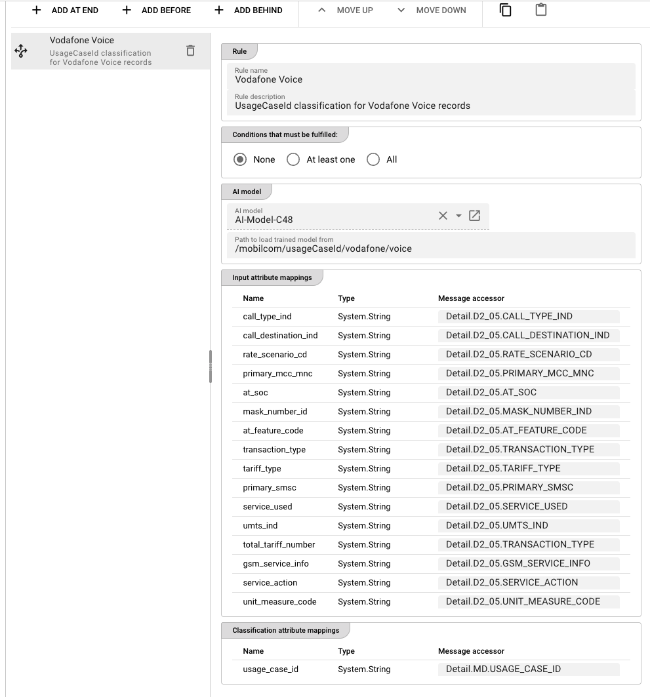

import WipDisclaimer from '../../snippets/common/_wip-disclaimer.md'
import FailureHandling from '../../snippets/assets/_failure-handling-flow.mdx';
import InputPorts from '../../snippets/assets/_input-ports-single.md';
import OutputPorts from '../../snippets/assets/_output-ports-single.md';

# AI Classifier

## Purpose

The **AI Classifier** Processor (type: `aiClassifier`) classifies messages within a Workflow using a trained AI model. It takes one or more input values from the current message, passes them to a supervised machine learning model, and writes the predicted classification result directly into a message attribute.

Classification is useful for tasks such as:

- Assigning a category to a transaction based on its attributes
- Detecting fraud based on transaction patterns
- Routing messages to different downstream processes based on predicted outcomes
- Enriching messages with inferred data

The processor evaluates a configurable **ordered list of rules**. Each rule specifies its own AI model, trained model file, input mappings, and classification mappings. Rules are evaluated **top to bottom** — the first rule whose conditions match the current message is applied, and the remaining rules are skipped.

Use this Processor to:

- Apply trained AI models to classify messages in real time within a Workflow
- Route messages to different downstream processes based on predicted categories
- Enrich messages with inferred attributes derived from their content

:::tip Prerequisite
This processor requires a **trained AI model file** (`.joblib` format) and an **[AI Model Resource](../../assets/resources/asset-resource-ai-model)** that defines the model's technical details. Both must exist in the Project before you can configure this processor. If you need to train a model first, use the [AI Trainer](./asset-flow-ai-trainer) Processor.
:::

## Configuration

### Name & Description

**`Name`**: Name of the Asset. Spaces are not allowed in the name.

**`Description`**: Enter a description.

### Input Ports

<InputPorts></InputPorts>

### Output Ports

<OutputPorts></OutputPorts>

### Classifier Rules

This is the core configuration area. The processor maintains an **ordered list of rules**. Rules are evaluated top to bottom — the first rule whose conditions match the current message wins.

The rules editor shows:

- A **rule selector dropdown** listing all configured rules, in evaluation order
- **↑ / ↓ buttons** to reorder rules (order matters — see [Rule Evaluation Order](#rule-evaluation-order) below)
- An **Add a new rule** option at the top of the dropdown

<div className="frame">



</div>

#### Rule: General

**`Rule name`** — a human-readable name for this rule (e.g., `Classify by usage type`).

**`Rule description`** — optional free-text description of what this rule does.

#### Rule: Conditions

Define when this rule should be applied. The condition is evaluated against the current message. If true, the rule fires and remaining rules are skipped.

Click **Add condition** to add condition rows. Each condition has:

- **Condition** — a conditional expression (e.g., `USAGE_CASE_ID == null` or `amount > 1000`)
- **Logical operator** — `AND` or `OR` (between conditions)

If all conditions evaluate to true for the current message, the rule fires. If no conditions are defined, the rule always fires.

#### Rule: AI model

**`AI model`** — a reference to an **AI Model Resource** in the Project. The Resource defines the model type (e.g., Weka) and which attributes are available as inputs and outputs.

**`Path to load trained model from`** — the file path to the trained model file (`.joblib`). Must be a valid path accessible to the Reactive Engine at runtime. Supports [macros](../../language-reference/macros) for per-environment values.

#### Rule: Input attribute mappings

Defines which Data Dictionary attributes from the AI model should receive values from the current message.

Each row maps a Data Dictionary **attribute** to a **message accessor**:

| Column | Description |
|--------|-------------|
| **Name** | The attribute name from the AI Model Resource's input schema (read-only) |
| **Type** | The attribute's data type from the Data Dictionary (read-only) |
| **Message accessor** | A message accessor expression that reads the value from the current message (e.g., `message.USAGE_BYTE_12`) |

The values read from the message via these accessors are assembled into a feature vector and passed to the trained model for prediction.

#### Rule: Classification attribute mappings

Defines where the classifier should write its prediction results back into the message.

| Column | Description |
|--------|-------------|
| **Name** | The output attribute name from the AI Model Resource (read-only) |
| **Type** | The attribute's data type from the Data Dictionary (read-only) |
| **Message accessor** | A message accessor expression that specifies where to write the result (e.g., `message.USAGE_CASE_ID`) |

The model returns a predicted class label. This value is written directly to the specified message attribute via the accessor. No return value handling is needed in your Workflow.

### Failure Handling

<FailureHandling></FailureHandling>

## Behavior

### Rule Evaluation Order

Rules are evaluated **strictly in the order they appear in the rules list**. The first rule whose conditions match the current message is applied, and all subsequent rules are skipped for that message.

This means **rule order matters**. Place your most specific or highest-priority rules at the top. A catch-all rule with no conditions (which always matches) should always be placed last.

### How Classification Works (Step by Step)

When a message arrives:

1. The processor iterates through the rules list in order
2. For each rule, it evaluates the conditions against the message
3. If all conditions match (or the rule has no conditions), the processor:
   a. Reads values from the message using the **input attribute mappings**
   b. Assembles them into a feature vector
   c. Passes the vector to the trained AI model (loaded from the `.joblib` file)
   d. Receives the predicted class label from the model
   e. Writes the prediction to the message attribute specified in the **classification attribute mappings**
4. The message is emitted on the output port to the next processor in the Workflow

If no rule's conditions match, the message passes through unchanged (no classification is applied).

### Inheritance

All settings support inheritance — a child Asset can override individual rules or rule fields while inheriting the rest from its parent.

### Trained Model Requirements

- The model must be in **`.joblib`** format (serialized via Python's `joblib` or Weka's model serialization)
- The model must be accessible at the path specified in `Path to load trained model from` on the Reactive Engine host
- The model's input schema (number and type of features) must match the **Input attribute mappings** configured in the rule
- The model's output must be a **class label** (string or categorical) — the classifier writes this label directly to the configured message attribute

## Example

A Workflow reads raw usage records from a source. Before further processing, each record needs to be classified by its **usage type** (e.g., `STANDARD`, `PREMIUM`, `ENTERPRISE`) based on byte-count attributes.

**Workflow chain:**

```
SAMPLE2 (Source) → ClassifyRecord (JavaScript Processor) → ClassifyUsageType (AI Classifier)
```

The JavaScript Processor first extracts and validates the raw fields. The AI Classifier then applies the trained model to write the classification result.

<div className="frame">


</div>

**AI Classifier configuration (`ClassifyUsageType`):**

**Rule: `Always`** — fires on every message (no conditions):

| Field | Value |
|-------|-------|
| AI model | `USAGE_CLASSIFIER` |
| Path to load trained model from | `/models/usage-classifier-v2.joblib` |

**Input attribute mappings:**

| Attribute | Type | Message accessor |
|-----------|------|-----------------|
| `USAGE_BYTE_12` | Long | `message.USAGE_BYTE_12` |
| `USAGE_BYTE_60` | Long | `message.USAGE_BYTE_60` |

**Classification attribute mappings:**

| Attribute | Type | Message accessor |
|-----------|------|-----------------|
| `USAGE_CASE_ID` | String | `message.USAGE_CASE_ID` |

**What happens at runtime:**

1. A message arrives with `USAGE_BYTE_12 = 4521` and `USAGE_BYTE_60 = 18420`
2. The `Always` rule fires (no conditions to check)
3. The processor reads `USAGE_BYTE_12` and `USAGE_BYTE_60` from the message
4. The trained Weka model predicts the class label, e.g., `PREMIUM`
5. The processor writes `PREMIUM` to `message.USAGE_CASE_ID`
6. The message continues downstream with the classified `USAGE_CASE_ID`

## See Also

- [AI Trainer](./asset-flow-ai-trainer) — for training and exporting new AI models before using them with this Processor
- [AI Service](../../assets/services/asset-service-ai) — for defining the interface to an AI model
- [AI Model Resource](../../assets/resources/asset-resource-ai-model) — for the technical model definition used by both Trainer and Classifier
- [Using Artificial Intelligence in Workflows](../../concept/advanced/artificial-intelligence) — conceptual overview of supervised learning in layline.io

---

<WipDisclaimer></WipDisclaimer>
