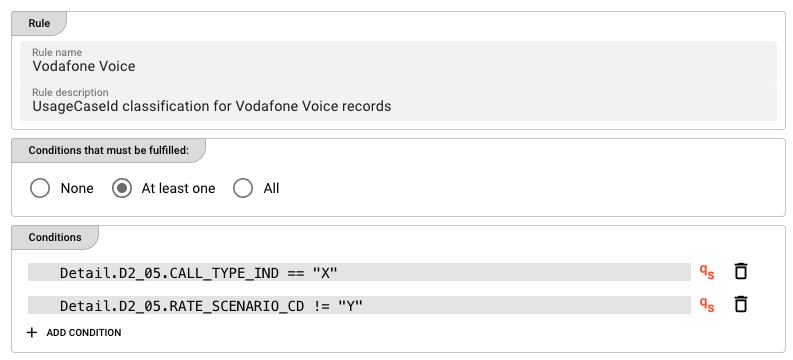
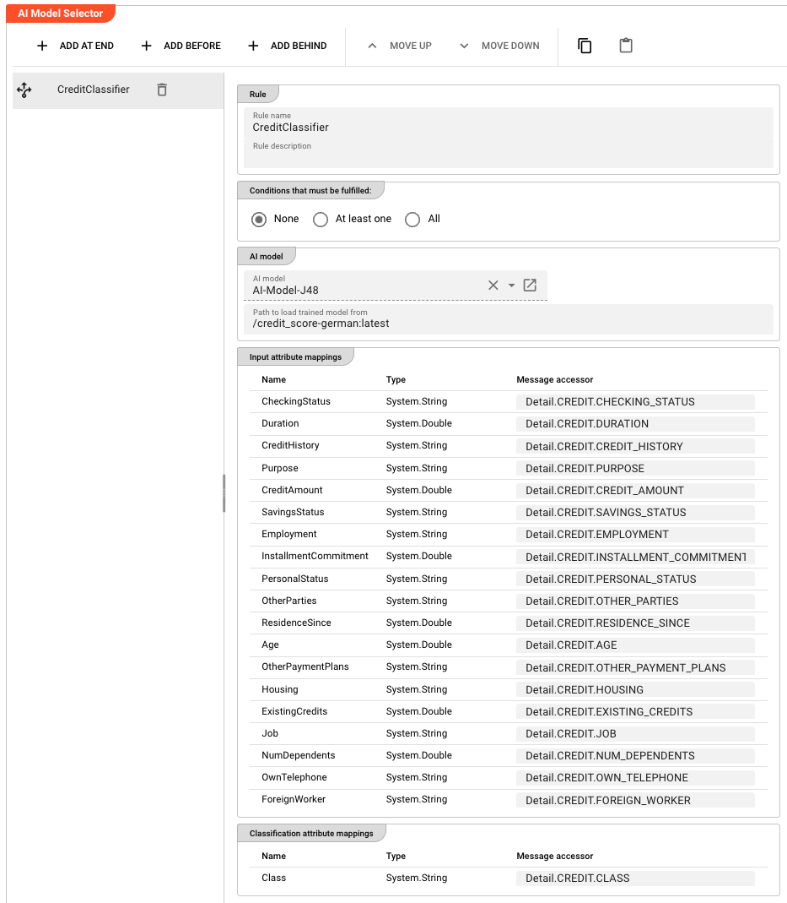
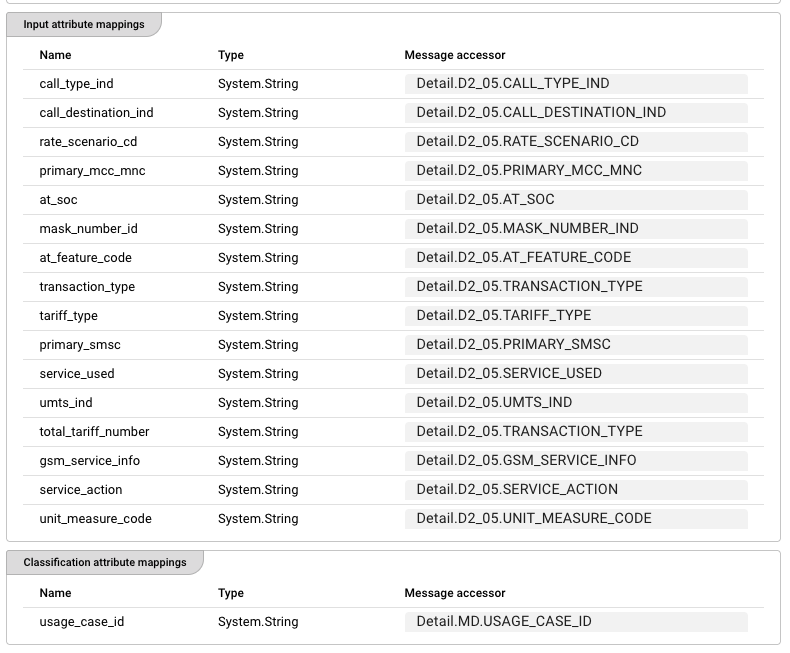
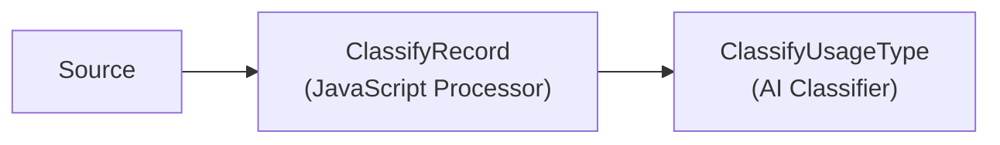
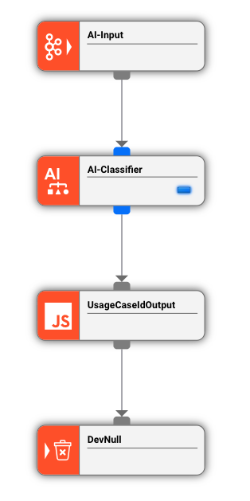

import WipDisclaimer from '../../snippets/common/_wip-disclaimer.md'
import InputPorts from '../../snippets/assets/_input-ports-single.md';
import OutputPorts from '../../snippets/assets/_output-ports-single.md';

# AI Classifier

## Purpose

The **AI Classifier** Processor classifies messages within a Workflow using a trained AI model. It takes one or more input values from the current message, passes them to a supervised machine learning model, and writes the predicted classification result directly into a message attribute.

Classification is useful for tasks such as:

- Assigning a category to a transaction based on its attributes
- Detecting fraud based on transaction patterns
- Routing messages to different downstream processes based on predicted outcomes
- Enriching messages with inferred data

The processor evaluates a configurable **ordered list of rules**. Each rule specifies its own AI model, trained model file, input mappings, and classification mappings. Rules are evaluated **top to bottom** — the first rule whose conditions match the current message is applied, and the remaining rules are skipped.

Use this Processor to:

- Apply trained AI models to classify messages in real time within a Workflow
- Route messages to different downstream processes based on predicted categories
- Enrich messages with inferred attributes derived from their content

:::tip Prerequisite
This processor requires an **AI Model Resource** that defines the model's technical details and a reference to a trained model stored in the cluster's **AI Storage**. If you need to train a model first, use the [AI Trainer](./asset-flow-ai-trainer) Processor.
:::

## Configuration

### Name & Description

**`Name`**: Name of the Asset. Spaces are not allowed in the name.

**`Description`**: Enter a description.

### Input Ports

<InputPorts></InputPorts>

### Output Ports

<OutputPorts></OutputPorts>

### Classifier Rules

This is the core configuration area. The processor maintains an **ordered list of rules**. Rules are evaluated top to bottom — the first rule whose conditions match the current message wins.

The rules editor shows:

- A **rule selector dropdown** listing all configured rules, in evaluation order
- **↑ / ↓ buttons** to reorder rules (order matters — see [Rule Evaluation Order](#rule-evaluation-order) below)
- An **Add a new rule** option at the top of the dropdown

#### Rule: General

**`Rule name`** — a human-readable name for this rule (e.g., `Vodafone Voice`).

**`Rule description`** — optional free-text description of what this rule does.

#### Rule: Conditions

Define when this rule should be applied. The condition is evaluated against the current message. If true, the rule fires and remaining rules are skipped.

**Logical operator** — how multiple conditions are combined:

| Option | Meaning |
|--------|---------|
| **None** | No conditions — the rule always fires (no condition rows are shown) |
| **At least one** | OR logic — the rule fires if at least one condition is true |
| **All** | AND logic — the rule fires only if all conditions are true |

**Conditions** — each condition is a [QuickScript expression](#quickscript-conditions).

Click **+ ADD CONDITION** to add a new condition row. Each row has:

- A QuickScript expression field — click the field or use the **qS** indicator to confirm QuickScript mode is active
- **qS** — indicator that the field accepts QuickScript expressions
- A delete button (trash icon) to remove the condition

<div className="frame">



</div>

#### QuickScript Conditions

Conditions are written as **QuickScript** expressions — a lightweight expression language used throughout layline.io to reference message fields and write conditional logic. QuickScript allows you to read attributes from the message structure (e.g., `Detail.D2_05.CALL_TYPE_IND`) and compare them using standard operators.

For the full QuickScript language reference, see [QuickScript Language Reference](../../language-reference/quickscript).

Example QuickScript conditions:

```
Detail.D2_05.CALL_TYPE_IND == "X"
Detail.D2_05.RATE_SCENARIO_CD != "Y"
amount > 1000
recordType == "PREMIUM"
```

#### Rule: AI model

**`AI model`** — a reference to an **AI Model Resource** in the Project. The Resource defines the model type (e.g., Weka) and which attributes are available as inputs and outputs.

**`Path in AI Storage`** — the path of the trained model in AI Storage (e.g., `models/my-classifier`). Append `:<version>` to reference a specific version (e.g., `models/my-classifier:3`) or `:latest` for the most recent version. Supports [macros](../../language-reference/macros) for per-environment values.

<div className="frame">



</div>

#### Rule: Input attribute mappings

Defines which Data Dictionary attributes from the AI model should receive values from the current message.

Each row maps a Data Dictionary **attribute** to a **message accessor**:

| Column | Description |
|--------|-------------|
| **Name** | The attribute name from the AI Model Resource's input schema (read-only) |
| **Type** | The attribute's data type from the Data Dictionary (read-only) |
| **Message accessor** | A message accessor expression that reads the value from the current message (e.g., `Detail.D2_05.CALL_TYPE_IND`) |

The values read from the message via these accessors are assembled into a feature vector and passed to the trained model for prediction.

<div className="frame">



</div>

#### Rule: Classification attribute mappings

Defines where the classifier should write its prediction results back into the message.

| Column | Description |
|--------|-------------|
| **Name** | The output attribute name from the AI Model Resource (read-only) |
| **Type** | The attribute's data type from the Data Dictionary (read-only) |
| **Message accessor** | A message accessor expression that specifies where to write the result (e.g., `Detail.MD.USAGE_CASE_ID`) |

The model returns a predicted class label. This value is written directly to the specified message attribute via the accessor. No return value handling is needed in your Workflow.

## Behavior

### Rule Evaluation Order

Rules are evaluated **strictly in the order they appear in the rules list**. The first rule whose conditions match the current message is applied, and all subsequent rules are skipped for that message.

This means **rule order matters**. Place your most specific or highest-priority rules at the top. A catch-all rule with **None** conditions (which always matches) should always be placed last.

### How Classification Works (Step by Step)

When a message arrives:

1. The processor iterates through the rules list in order
2. For each rule, it evaluates the QuickScript conditions against the message using the selected logical operator (None / At least one / All)
3. If the conditions match (or the rule has **None** conditions), the processor:
   a. Reads values from the message using the **input attribute mappings**
   b. Assembles them into a feature vector
   c. Passes the vector to the trained AI model (loaded from AI Storage)
   d. Receives the predicted class label from the model
   e. Writes the prediction to the message attribute specified in the **classification attribute mappings**
4. The message is emitted on the output port to the next processor in the Workflow

If no rule's conditions match, the message passes through unchanged (no classification is applied).

### Inheritance

All settings support inheritance — a child Asset can override individual rules or rule fields while inheriting the rest from its parent.

### Trained Model Requirements

- The model must be stored in the cluster's **AI Storage** at the path specified in `Path in AI Storage`
- Append `:<version>` to reference a specific trained version (e.g., `models/my-classifier:3`) or `:latest` for the most recent version
- The model's input schema (number and type of features) must match the **Input attribute mappings** configured in the rule
- The model's output must be a **class label** (string or categorical) — the classifier writes this label directly to the configured message attribute

## Example

A Workflow reads raw usage records from a telecom source. Before further processing, each record needs to be classified by its **usage type** based on multiple record attributes.



The JavaScript Processor first extracts and validates the raw fields. The AI Classifier then applies the trained model to write the classification result.

<div className="frame">



</div>

**AI Classifier configuration (`ClassifyUsageType`):**

**Rule: `Vodafone Voice`** — fires only on Vodafone Voice records:

| Field | Value |
|-------|-------|
| Logical operator | `At least one` |
| Condition 1 | `Detail.D2_05.CALL_TYPE_IND == "X"` |
| Condition 2 | `Detail.D2_05.RATE_SCENARIO_CD != "Y"` |
| AI model | `UsageClassifier` |
| Path in AI Storage | `models/usage-classifier-v2` |

**Input attribute mappings (16 features):**

| Attribute | Message accessor |
|-----------|----------------|
| `call_type_ind` | `Detail.D2_05.CALL_TYPE_IND` |
| `call_destination_ind` | `Detail.D2_05.CALL_DESTINATION_IND` |
| `rate_scenario_cd` | `Detail.D2_05.RATE_SCENARIO_CD` |
| ... (12 more attributes) | `Detail.D2_05.*` |

**Classification attribute mappings:**

| Attribute | Message accessor |
|-----------|----------------|
| `usage_case_id` | `Detail.MD.USAGE_CASE_ID` |

**What happens at runtime:**

1. A message arrives with `Detail.D2_05.CALL_TYPE_IND = "X"` and `Detail.D2_05.RATE_SCENARIO_CD = "Z"`
2. The `Vodafone Voice` rule fires (at least one condition matches)
3. The processor reads all 16 input attributes from the message
4. The trained model from AI Storage predicts the class label, e.g., `VOICE_STANDARD`
5. The processor writes `VOICE_STANDARD` to `Detail.MD.USAGE_CASE_ID`
6. The message continues downstream with the classified `USAGE_CASE_ID`

## See Also

- [AI Trainer](./asset-flow-ai-trainer) — for training and exporting new AI models before using them with this Processor
- [AI Service](../../assets/services/asset-service-ai) — for defining the interface to an AI model
- [QuickScript Language Reference](../../language-reference/quickscript) — for the expression language used in rule conditions
- [Using Artificial Intelligence in Workflows](../../concept/advanced/artificial-intelligence) — conceptual overview of supervised learning in layline.io

---

<WipDisclaimer></WipDisclaimer>
