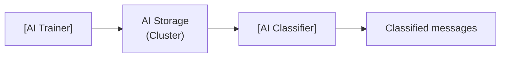

import WipDisclaimer from '../../snippets/common/_wip-disclaimer.md'
import InputPorts from '../../snippets/assets/_input-ports-single.md';
import OutputPorts from '../../snippets/assets/_output-ports-single.md';

# AI Trainer

## Purpose

The **AI Trainer** Processor trains one or more AI models using message data collected from a Workflow. It reads attribute values from incoming messages, assembles them into a training dataset, trains a machine learning model using the Weka library, and stores the trained model in the cluster's **AI Storage**.

The trained model is then used by an [AI Classifier](./asset-flow-ai-classifier) Processor to classify new messages.

Use this Processor to:

- Train a classification model from historical or sample message data
- Collect training data over time (time/message-based mode) or in batches (stream-based mode)
- Store a trained model in AI Storage that can be deployed for real-time classification



:::note
Each training run creates a new **version** of the model in AI Storage, identified by a running number. Use `:latest` to reference the most recent version, or `:<version-number>` to reference a specific version.
:::

## Prerequisites

This processor requires:

1. An **[AI Model Resource](../resources/asset-resource-ai)** that defines the model's input/output attributes, model type (e.g., J48 Decision Tree, Multilayer Perceptron), and hyperparameters
2. A path in AI Storage where the trained model will be stored
3. Incoming messages with attribute values that can be mapped to the model's input schema

## How Training Works

The Trainer accumulates message data as training samples and then runs a Weka model training algorithm. The steps are:

1. **Collect** — read attribute values from each incoming message using the configured input attribute mappings
2. **Aggregate** — store collected samples until the training trigger conditions are met
3. **Train** — run the selected Weka training algorithm on the collected dataset
4. **Store** — save the trained model to the configured path in AI Storage

Each training run creates a new version of the model. The path combined with the version number uniquely identifies each model version in AI Storage.

## Configuration

### Name & Description

**`Name`**: Name of the Asset. Spaces are not allowed in the name.

**`Description`**: Enter a description.

### Input Ports

<InputPorts></InputPorts>

### Output Ports

<OutputPorts></OutputPorts>

### Training Settings

#### Training mode

Controls how and when training data is collected and when training is triggered.

| Option | Description |
|-------|-------------|
| **Stream based** | All messages from the same stream are collected as one training batch. Training starts when the stream ends (onCommit). Use this when you have a complete labeled dataset in one stream. |
| **Time / Message based** | Messages are collected continuously over time. Training starts when both the minimum message count AND minimum duration have been reached, and ends when either the maximum message count OR maximum duration is reached. Use this for continuous data collection with periodic retraining. |

#### Training set limits (Time / Message based only)

Configure the boundaries for when training starts and stops:

**Minimum training set:**

| Field | Description |
|-------|-------------|
| **Minimum number of training messages** | The smallest number of messages required before training begins. Leave empty for no minimum. |
| **Minimum training duration [s]** | The shortest time period (in seconds) that must elapse before training begins. Leave empty for no minimum. |

**Maximum training set:**

| Field | Description |
|-------|-------------|
| **Maximum number of training messages** | The maximum number of messages to collect before training starts. Leave empty for no maximum. |
| **Maximum training duration [s]** | The maximum time period (in seconds) before training starts, regardless of message count. Leave empty for no maximum. |

Training begins when BOTH minimum conditions are met, and ends when EITHER maximum condition is met.

#### Models to train

The models table lists all AI Model Resources to train and where to store each trained model in AI Storage.

Click **+ ADD MODEL** to add a new model configuration. Each row has:

| Column | Description |
|--------|-------------|
| **Model name** | A human-readable name for this trained model (e.g., `VoiceClassifier-v2`) |
| **Path in AI Storage** | The path in AI Storage where the trained model will be stored (e.g., `models/my-classifier`). Supports [macros](../../language-reference/macros) for per-environment values. |
| **AI Model** | Reference to an existing **AI Model Resource** in the Project — defines the input/output schema, model type, and hyperparameters |
| **Model type** | The Weka algorithm to use (read from the selected AI Model Resource, e.g., `J48 Decision Tree`, `Multilayer Perceptron`) |

The AI Model Resource defines:

- **Input attributes** — the attribute names and types that the model expects as input
- **Output attribute** — the attribute that the model will predict (the class label)
- **Model type** — the Weka algorithm (Decision Tree / Neural Network)
- **Hyperparameters** — algorithm-specific settings (e.g., for J48: unpruned tree, minimum number of objects per leaf; for MLP: learning rate, momentum, hidden layers)

#### Input attribute mappings

For each selected AI Model, defines how incoming message data maps to the model's input attributes.

Each row maps a Data Dictionary **attribute** (from the AI Model Resource's input schema) to a **message accessor**:

| Column | Description |
|--------|-------------|
| **Name** | The attribute name from the AI Model Resource's input schema (read-only) |
| **Type** | The attribute's data type from the Data Dictionary (read-only) |
| **Message accessor** | A message accessor expression that reads the value from the current message |

These are the features that will be fed to the Weka model during training.

## Behavior

### Stream Based Mode

1. Each message in the stream is added to the training batch as a training sample
2. The input attribute mappings are used to extract feature values from each message
3. When the stream ends (onCommit), the collected batch is used to train the model
4. The trained model is stored in AI Storage at the configured path
5. If the stream contains fewer messages than `Minimum number of training messages`, training is skipped

### Time / Message Based Mode

1. Messages are collected continuously over time
2. Each message adds to the training batch
3. Training starts when both minimum conditions are met (message count AND time elapsed)
4. Training ends when either maximum condition is met (message count reached OR time elapsed)
5. If neither maximum is set, training never triggers automatically (manual reset required)
6. After training, the batch is cleared and collection begins again for the next training cycle

### Inheritance

All settings support inheritance — a child Asset can override individual models or fields while inheriting the rest from its parent.

## Example

A Workflow receives usage records and needs to train a classification model to categorize records by type.

**Workflow chain:**

```
SAMPLE2 (Source) → ExtractTrainingData (JavaScript Processor) → TrainUsageClassifier (AI Trainer)
```

The JavaScript Processor extracts and formats the relevant attributes from each record before passing them to the Trainer.

**AI Trainer configuration:**

| Setting | Value |
|---------|-------|
| Training mode | `Time / Message based` |
| Minimum number of training messages | `1000` |
| Maximum number of training messages | `10000` |

**Models to train:**

| Model name | Path to trained model file | AI Model | Model type |
|-----------|--------------------------|----------|------------|
| `UsageClassifier-v2` | `models/usage-classifier-v2` | `UsageClassifier` | J48 Decision Tree |

**Input attribute mappings:**

| Attribute | Message accessor |
|-----------|----------------|
| `call_type_ind` | `Detail.D2_05.CALL_TYPE_IND` |
| `call_destination_ind` | `Detail.D2_05.CALL_DESTINATION_IND` |
| `rate_scenario_cd` | `Detail.D2_05.RATE_SCENARIO_CD` |
| ... | `Detail.D2_05.*` |

**What happens at runtime:**

1. Messages arrive with raw attributes from the source
2. The JavaScript Processor extracts and formats the relevant fields
3. The AI Trainer collects the formatted messages into a training batch
4. After 1000+ messages have been collected, the Trainer assembles the feature data into a Weka dataset
5. The J48 Decision Tree algorithm trains on the dataset
6. The trained model is stored in AI Storage at `models/usage-classifier-v2`
7. The model is now available for the AI Classifier to load and use for classification

## See Also

- [AI Classifier](./asset-flow-ai-classifier) — for applying a trained model to classify new messages
- [AI Service](../services/asset-service-ai) — for defining the interface to an AI model
- [AI Model Resource](../resources/asset-resource-ai) — for the model definition including input/output schema and hyperparameters
- [Operations → AI Storage](../operations/cluster/cluster#ai-storage) — for managing trained model files after training
- [Using Artificial Intelligence in Workflows](../../concept/advanced/artificial-intelligence) — conceptual overview of supervised learning in layline.io

---

<WipDisclaimer></WipDisclaimer>
