# Filter & Routing

## Purpose

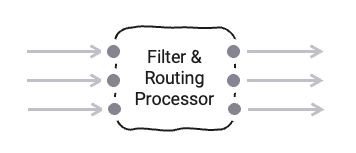

A common task during message stream handling is to filter and/or route messages based on their content.
The Filter & Routing Processor helps to accomplish this task based on simple routing rules which you can edit using the UI.

## Prerequisites

None

## Configuration

### Name & Description

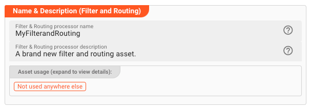

* **`Name`** : Name of the Asset. Whitespaces are not allowed in the name.

* **`Description`** : Enter a description.

The **`Asset Usage`** box shows how many times this Asset is used and which parts are referencing it. Click to expand
and then click to follow, if any.

### Asset dependency

Use this section to add Formats which you plan to use as part of your filtering and routing rules.

**Why do I have to add formats here?**  
Doesn't the system know which Formats I am using?
layline.io automatically understands when you are using Formats as part of your input and output processors and automatically mounts them at runtime.
But when you are referencing Formats which are not used as part of an input or output Processor directly, but rather referenced in
a [Javascript Flow Processor](/docs/assets/processors-flow/asset-flow-javascript) or [Quickscript](/docs/category/quickscript), then the system may not be aware that you are using this format within
any of those scripts.
This would result in a runtime error.

To avoid this, you can explicitly mention the Formats you are referencing in your scripts.
This ensures, that these Formats will always be mounted at runtime.
So it is best practice to add Formats which are referenced in this Asset here.

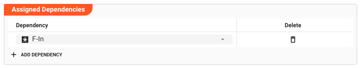

To add formats click on `Add Dependency` and select the Format you wish to add as a dependency.
Repeat for any other Format dependency.

### Input Ports

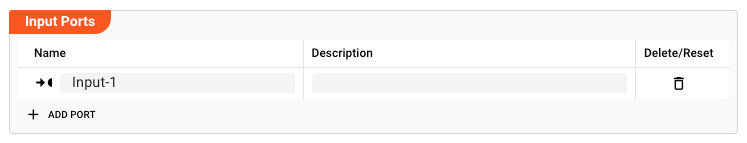

A Javascript processor can have one or more input ports from which it receives data to process.
**It must have at least one input port, however.**

A port can have a name and description. Names must exist and be unique within the processor.

You can add an input port by clicking on `Add Port`, or remove an input port by clicking on `Delete`.
You cannot delete the port if it is the last one within the processor.

In the case of this Asset, any message received through one of the Input Ports will be subjected to the rules which will be defined below.

### Output Ports

As is true for Input Ports, a Filter 6 Routing Processor can have one-to-many Output Ports to send messages on within the
Workflow.

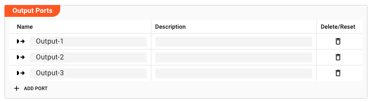

A port can have a name and description. Names must exist and be unique within the processor.

The routing rules you define can target any of the Output Ports defined here.

### Filter & Routing Rules

This section is where you can define the actual rules upon which to filter and route message.

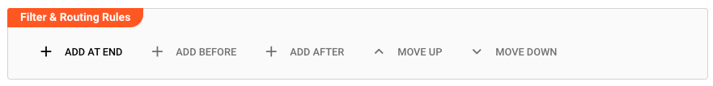

Let's add a rule by clicking on `+ ADD AT END`:

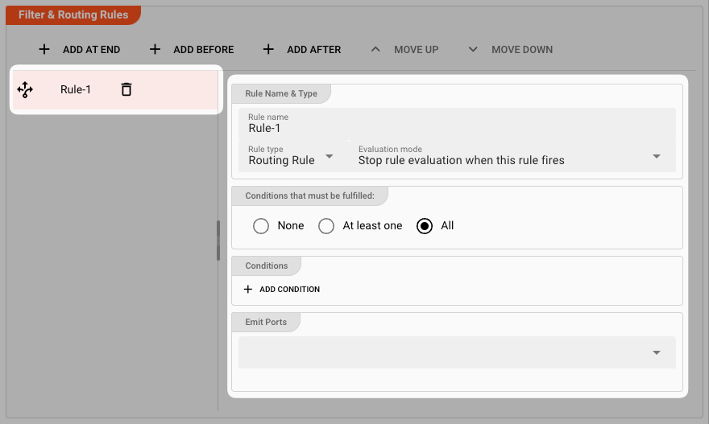

A new rule is added. The details of the rule are represented in the panel to the right

#### Basics

* **`Name`**: The name of the rule. This is just to better distinguish the rules from one another.

#### Rule Name & Type

* **`Rule type`**:  
  There are two different types of rules:
    1. **`Routing Rule`**: Routing rules let you forward messages to a specific Output Port based on a match to the rule.

    2. **`Filter Rule`**: Filter rules let you filter out messages based on a match to the rule.
       Nothing is forwarded to a code. The message is essentially destroyed.

* **`Evaluation mode`**:
  As you can have a list of rules and filters, you can decide how the system should behave when a rule matches the currently evaluated message.

  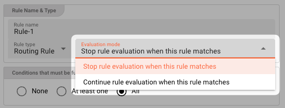

  Pick either of the two options:
    1. **`Stop rule evaluation when this rule matches`**:   
       When this rule matches the message, all **following rules** in the list will be disregarded.
       For example if this rule is a Routing Rule "_R_", and a **subsequent rule** is a Filter Rule "_F_" which would filter the current message and discard it, then that rule "_F_" would not be
       evaluated if this rule "_R_" matches first.

    2. **`Continue rule evaluation when this rule matches`**:  
       When this rule matches, subsequent rules will continue to evaluate.
       In effect, ALL rules will be evaluated on the order of the list.
       Execution of the rule list only ends either when there are no other rules to evaluate or until a rule with the option from above (_Stop rule evaluation when this rule matches_), that does
       match, is fired.
       For example if you have a Routing Rule "_R-1_" and a Routing Rule "_R-2_" which on match output the current message to Output Port "_P-1_" and "_P-2_" respectively.
       In the case that the message matches both rules, then it will be output to both defined ports.

#### Conditions that must be fulfilled

You can choose whether you want none, at least one (OR) or all rules (AND) of the configured conditions condition to be true in order to have a positive outcome of the complete rule.

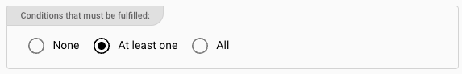

* **`None`**: The rule will always evaluate to true. No conditions for the rule can be configured.
  Use this setting if you simply want to pass through the message, regardless of any conditions.

* **`At least one`**: At least one of the defined conditions must be met, for the rule to return true.

* **`All`**: All of the conditions have to be met for the rule to evaluate to true.

#### Conditions

In you picked either option `At least one` or `All` from the previous section, then you can now enter conditions for when the rule should evaluate to true.
Click `ADD CONDITION` to add your first condition.

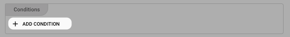

You can then start entering conditions in [Quickscript](/docs/category/quickscript) language:

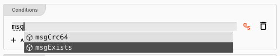

The system will support you in this quest. When you start typing, you will be presented with options for autocomplete.

Let's fill in some conditions:


**Explanation:**
This rule will now evaluate to true, if

1. The message includes a data dictionary structure `Record.Boat`, and
2. The length of the boat is greater than 10.

Depending on what you selected in the [Conditions Options](#conditions-that-must-be-fulfilled), either all or at least one of these conditions must be met.

Enter as many conditions as necessary.

#### Emit Ports

When the rule with its conditions evaluates to true, the message is then forwarded to the Output Ports defined here:

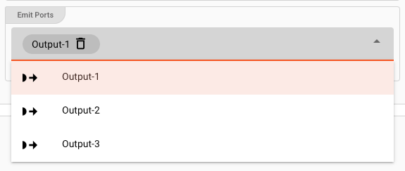

Pick as many Output Ports as you require for your scenario.
If you pick more than one, then the message will be output to all the ports selected.

#### Repeat

You have just defined your first Rule.
Create additional rules as you see fit for your Workflow and scenario.

:::caution Order of Rules matters
As you enter more rules, please recall, that rules are evaluated in the order as presented in the rules list.
If any of the rules follows an `Evaluation Mode` of "_Stop rule evaluation when this rule matches_", and the rule does match a message, then evaluation of all other rules following that respective
rule will not be done.
:::

### Failure Handling

Processing within a Flow Processor like this one can fail for various reasons.
In this section you can define how the system should behave in case of such problems.

#### Failure Types

Four types of failures are observable:

1. **`Stream start failure handling`**: A problem occurred in this Asset when starting a new stream.
2. **`Stream end failure handling`**: A problem occurred in this Asset when ending a stream.
3. **`Message failure handling`**: A problem occurred when handling a specific message in this Asset.
4. **`Rollback commit failure handling`**: A problem occurred during system issued rollback or commit procedure.

#### Failure Type Reactions

Each of these failure types can be responded to with four different reactions:

##### `Ignore`

Don't do anything.

##### `Rollback Stream`

Rollback the complete stream. In the case of batch/file processing for example the complete file (which represents the stream) will be rolled back and put into error.

:::caution
A rollback signal will be issued to all participating Workflow Processors.
Each Processor needs to ensure itself how to deal with a rollback.
A Javascript Flow Processor, for example, which directly interacts with a database will have to react to a [rollback signal](/docs/lang-ref/javascript/API/classes/JavaScriptProcessor#onrollback):

```js title="Rollback example in Javascript"
   function onRollback() {
    if (connection) {
        try {
            connection.rollbackTransaction();
            connection.closeConnection();
        } catch (err) {
        } finally {
            connection = null;
        }
    }
}
```

:::

##### `Retry Stream`

Don't simply give up. Try to process the whole stream again.
This option allows you to define how often and in what intervals the retries should be performed.

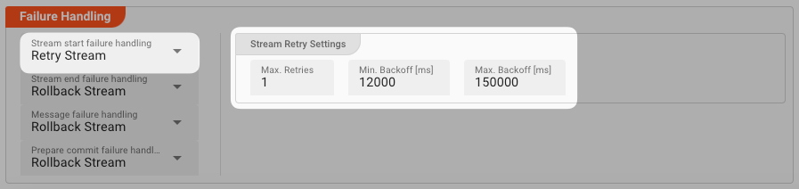

**Stream Retry Settings**

* **`Max. Retries`**: The number of retries which should be performed. For example "_5_".
* **`Min. Backoff [ms]`**: Wait at least x milliseconds between each retry. For example "_12000_" (12 seconds).
* **`Max. Backoff [ms]`**: Wait at max x milliseconds between each retry. For example "_150000_" (150 seconds).

Based on these parameters, the system will try to balance the defined number of retries within the time boundaries of min. backoff and max. backoff.  
Taken the example numbers from above, the five retries would happen in this timespan:

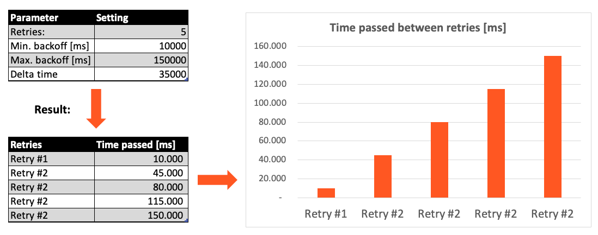

##### `Retry Event/Message`

Pick this reaction if you want to retry processing the current message.
As is the case with the [Retry Stream](#retry-stream) reaction you can define how often and in what intervals the retries should be performed.


The settings are the same as with the [Retry Stream](#retry-stream) reaction. So please refer to this.
There is one additional setting, however, which is `When final retry failed`.

You here have the option to decide what to do if the message cannot be processed, even after the final retry:

* **`Ignore`**: Don't do anything.
* **`Rollback Stream`**: Fallback to rolling back the whole stream.
* **`Retry Stream`**: Retry the whole stream once again.
  If you pick this option then you can again define all relevant [Retry Stream](#retry-stream) parameters.

  

## My filter and routing requirements cannot be met.

If this Filter & Routing Asset is not sufficient because your requirements are based on more complex rules and potentially require additional information to determine what to filter and where to
route, you can always use the [Javascript Flow Processor Asset](/docs/assets/processors-flow/asset-flow-javascript) to freely handle message filtering, routing, and whatever else you plan to do with
the message.


---
:::note Can't find what you are looking for?
Please note, that the creation of the online documentation is **Work-In-Progress**. It is constantly being updated.
Should you have questions or suggestions, please don't hesitate to contact us at support@layline.io .
:::


