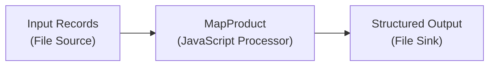

import AssetDependency from '../../snippets/assets/_asset-dependency.md';
import FailureHandling from '../../snippets/assets/_failure-handling-flow.mdx';
import WipDisclaimer from '../../snippets/common/_wip-disclaimer.md'
import InputPorts from '../../snippets/assets/_input-ports.md';
import OutputPorts from '../../snippets/assets/_output-ports.md';

# Javascript Flow Processor

## Purpose

")

The Javascript Asset allows you to define detailed business logic which you may want to apply to a flow of messages.
Here are some examples:

* Convert message data from one format to another
* Filter information based on specific rules
* Enrich individual data using specific rules and/or external data sources (e.g. reference data)
* Route messages based on your own criteria
* Gather metrics and statistics, and store and forward them to other targets

and basically anything else you can imagine here.

## Prerequisites

You need:

* A Source Script which should be executed within this asset.
* Knowledge on how to work with Javascript in layline.io. Please check
  the [Javascript Language Reference](../../language-reference/javascript/javascript_introduction) to learn about this.

## Configuration

### Name & Description

")

* **`Name`** : Name of the Asset. Spaces are not allowed in the name.

* **`Description`** : Enter a description.

The **`Asset Usage`** box shows how many times this Asset is used and which parts are referencing it. Click to expand
and then click to follow, if any.

### Asset Dependencies

<AssetDependency></AssetDependency>

### Input Ports

<InputPorts></InputPorts>

### Output Ports

<OutputPorts></OutputPorts>

### Root Script

The Javascript Asset obviously needs a Script to be executed. Prior to version 1.0 of layline.io the Script was
configured as part of this Asset. Starting with v1.0 all Scripts are defined in the `Sources` tab of the project (2):

")

The root script to be executed within this Asset is then selected here:

")

:::tip Javascript Language Reference
To understand how a Source must be structured to work in a Javascript Asset, please consult
the [Javascript Language Reference](../../language-reference/javascript/javascript_introduction).
:::

### Service Mappings

Javascripts may make use of Services which you may have
configured [here](../services/asset-service-introduction#purpose-of-services). These methods could be database
operations, HTTP-request and whatever else Services do provide.

Let's say your Javascript invokes an HTTP-Service which provides a method to retrieve the current Bitcoin price via a
REST-Api. Let's also assume that the name of the Service to be linked is `BTCService`.

1. Add a Service Mapping by clicking on `Add Service Mapping` (1).
2. Select the Service which you want to map (2).
3. Provide a `Logical Service Name`. This is the name by which the Service is used in the underlying Javascript! If the
   name you enter here, is different to what you are using in your script, the script will not recognize the Service.

")

### Arguments

You can pass arguments to the assigned script. This may be useful when reusing the same script in various different
Javascript Assets and Workflows, but the script should behave slightly different in each of those instances.
Passing arguments from a Javascript Asset to can provide this functionality. Please check the `getArguments()`
method [here](../../language-reference/javascript/API/classes/Processor#getarguments), on how to retrieve arguments in the script.

")

In case you are entering arguments (1), the editor will check for valid JSON and outline this in case it is invalid.
You can format the JSON entries with a click on `Format JSON (2)`.

:::warning Invalid JSON
Entering invalid JSON will cause problems when using the Arguments in the underlying script.
:::

### Failure Handling

<FailureHandling></FailureHandling>

## Example

The following example reads inbound product records, filters them by category, and maps the matching records to a structured output format with Header, Detail, and Trailer records.


```mermaid
graph LR
    A["Input Records<br/>(File Source)"] --> B["MapProduct<br/>(JavaScript Processor)"]
    B --> C["Structured Output<br/>(File Sink)"]
```

**Configuration:**

| Setting | Value |
|---------|-------|
| Root Script | `MapProduct.js` (defined in Sources) |
| Input Port | `Input` (default) |
| Output Port | `Output-1` |

**Script: `MapProduct.js`**

```javascript
/**
 * Filters inbound product records by category and maps them to a
 * structured output format (Header / Detail / Trailer).
 */

const OUTPUT_PORT = processor.getOutputPort('Output-1');
let totalRecords = 0;
let headerEmitted = false;

// Category to filter on — set via Arguments (e.g. "Electronics")
let CATEGORY_FILTER = null;

export function onInit() {
    const args = processor.getArguments();
    CATEGORY_FILTER = args?.categoryFilter ?? null;
}

export function onShutdown() {
}

export function onStreamStart() {
    stream.logInfo("--- onStreamStart");
    totalRecords = 0;
    headerEmitted = false;
}

export function onMessage() {
    const category = message.data.Category;

    // Skip records that don't match the filter
    if (CATEGORY_FILTER && category !== CATEGORY_FILTER) {
        return;
    }

    stream.logInfo("--- onMessage. Message: " + message.toJson());

    // Write header on first matching record
    if (!headerEmitted) {
        const headerMessage = dataDictionary.createMessage(dataDictionary.type.Header);
        headerMessage.data.PRODUCT = {
            RECORD_TYPE: "H",
            FILENAME: "Id;Code;Name;Category;Price;StockQuantity;Color;LaunchDate"
        };
        stream.emit(headerMessage, OUTPUT_PORT);
        headerEmitted = true;
    }

    // Create and emit a Detail record
    const detailMessage = dataDictionary.createMessage(dataDictionary.type.Detail);
    detailMessage.data.PRODUCT = {
        RECORD_TYPE: "D",
        ID: message.data.Id,
        CODE: message.data.Code,
        NAME: message.data.Name,
        CATEGORY: message.data.Category,
        PRICE: message.data.Price,
        STOCK_QUANTITY: message.data.StockQuantity,
        COLOR: message.data.Color,
        LAUNCH_DATE: message.data.LaunchDate
    };
    stream.emit(detailMessage, OUTPUT_PORT);
    totalRecords++;
}

export function onStreamEnd() {
    stream.logInfo("--- onStreamEnd");

    // Write trailer if any matching records were processed
    if (totalRecords > 0) {
        const trailerMessage = dataDictionary.createMessage(dataDictionary.type.Trailer);
        trailerMessage.data.PRODUCT = {
            RECORD_TYPE: "T",
            RECORD_COUNT: totalRecords
        };
        stream.emit(trailerMessage, OUTPUT_PORT);
    }
}
```

**Arguments:**

To filter records by category, pass a `categoryFilter` argument:

```json
[
    { "key": "categoryFilter", "value": "Electronics" }
]
```

Only records whose `Category` field matches the filter value are emitted. Records that do not match are silently skipped. Omit the argument to emit all records without filtering.

**What happens at runtime:**

1. `onStreamStart` initialises the record counter and header flag
2. For each message, `onMessage` checks the `Category` field against the filter — non-matching records are skipped
3. On the first matching record, `onMessage` emits a Header record followed by the first Detail record
4. All subsequent matching records emit Detail records only
5. `onStreamEnd` emits a Trailer record with the total count of matching records
6. `onShutdown` is called when the processor stops (e.g., on workflow stop)

## See Also

- [JavaScript Language Reference](../../language-reference/javascript/javascript_introduction) — full JavaScript language guide for layline.io
- [JavaScriptProcessor API](../../language-reference/javascript/API/classes/JavaScriptProcessor) — available hooks and lifecycle methods
- [DataDictionary API](../../language-reference/javascript/API/classes/DataDictionary) — working with Reference Data in scripts
- [PackedMessage API](../../language-reference/javascript/API/classes/PackedMessage) — reading and writing message fields
- [Service Mappings](#service-mappings) — connecting external services (HTTP, DB, etc.) to a JavaScript Asset

---

<WipDisclaimer></WipDisclaimer>


