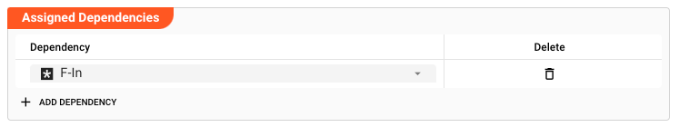

# Javascript Flow Processor

## Purpose

")

The Javascript Asset allows you to define detailed business logic which you may want to apply to a flow of messages.
Here are some examples:

* Convert message data from one format to another
* Filter information based on specific rules
* Enrich individual data using specific rules and/or external data sources (e.g. reference data)
* Route messages based on your own criteria
* Gather metrics and statistics, and store and forward them to other targets

and basically anything else you can imagine here.

## Prerequisites

You need:

* A Source Script which should be executed within this asset.
* Knowledge on how to work with Javascript in layline.io. Please check
  the [Javascript Language Reference](/docs/lang-ref/javascript/javascript_introduction) to learn about this.

## Configuration

### Name & Description

")

* **`Name`** : Name of the Asset. Whitespaces are not allowed in the name.

* **`Description`** : Enter a description.

The **`Asset Usage`** box shows how many times this Asset is used and which parts are referencing it. Click to expand
and then click to follow, if any.

### Asset dependency

Use this section to add Formats which you plan to use as part of your filtering and routing rules.

**Why do I have to add formats here?**  
Doesn't the system know which Formats I am using?
layline.io automatically understands when you are using Formats as part of your input and output processors and automatically mounts them at runtime.
But when you are referencing Formats which are not used as part of an input or output Processor directly, but rather referenced in a [Javascript Flow Processor](/docs/assets/processors-flow/asset-flow-javascript) or [Quickscript](/docs/category/quickscript), then the system may not be aware that you are using this format within any of those scripts.
This would result in a runtime error.

To avoid this, you can explicitly mention the Formats you are referencing in your scripts.
This ensures, that these Formats will always be mounted at runtime.
So it is best practice to add Formats which are referenced in this Asset here.

To add formats click on `Add Dependency` and select the Format you wish to add as a dependency.
Repeat for any other Format dependency.

### Input Ports

")

A Javascript processor can have one or more input ports from which it receives data to process.
**It must have at least one input port.**

A port can have a name and description. Names must exist and be unique within the processor.

You can add an input port by clicking on `Add Port` (1), or remove an input port by clicking on `Delete`.
You cannot delete the port if it is the last one within the processor.

### Output Ports

As is true for Input Ports, a Javascript Processor can have one-to-many Output Ports to send messages on within the
Workflow.

")

A port can have a name and description. Names must exist and be unique within the processor.

### Root Script

The Javascript Asset obviously needs a Script to be executed. Prior to version 1.0 of layline.io the Script was
configured as part of this Asset. Starting with v1.0 all Scripts are defined in the `Sources` tab of the project (2):

")

The root script to be executed within this Asset is then selected here:

")

:::tip Javascript Language Reference
To understand how a Source must be structured to work in a Javascript Asset, please consult
the [Javascript Language Reference](/docs/lang-ref/javascript/javascript_introduction).
:::

### Service Mappings

Javascripts may make use of Services which you may have
configured [here](/docs/assets/services/asset-service-introduction#purpose-of-services). These methods could be database
operations, HTTP-request and whatever else Services do provide.

Let's say your Javascript invokes a HTTP-Service which provides a method to retrieve the current Bitcoin price via a
REST-Api. Let's also assume that the name of the Service to be linked is `BTCService`.

1. Add a Service Mapping by clicking on `Add Service Mapping` (1).
2. Select the Service which you want to map (2).
3. Provide a `Logical Service Name`. This is the name by which the Service is used in the underlying Javascript! If the
   name you enter here, is different to what you are using in your script, the script will not recognize the Service.

")

### Arguments

You can pass arguments to the assigned script. This may be useful when reusing the same script in various different
Javascript Assets and Workflows, but the script should behave slightly different in each of those instances.
Passing arguments from a Javascript Asset to can provide this functionality. Please check the `getArguments()`
method [here](/docs/lang-ref/javascript/API/classes/Processor#getarguments), on how to retrieve arguments in the script.

")

In case you are entering arguments (1), the editor will check for valid JSON and outline this in case it is invalid.
You can format the JSON entries with a click on `Format JSON (2)`.

:::caution Invalid JSON
Entering invalid JSON will cause problems when using the Arguments in the underlying script.
:::

### Failure Handling

Please see section [Forced Errors](/docs/lang-ref/javascript/javascript_introduction#forced-errors) to understand how to use these settings.

")

---

:::note Can't find what you are looking for?
Please note, that the creation of the online documentation is **Work-In-Progress**. It is constantly being updated.
Should you have questions or suggestions, please don't hesitate to contact us at support@layline.io .
:::

