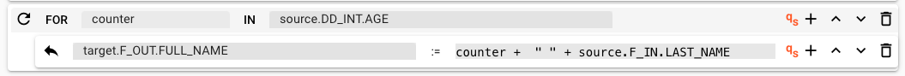

import WipDisclaimer from '/docs/snippets/common/_wip-disclaimer.md';
import AssetDependency from '/docs/snippets/assets/_asset-dependency.md';
import AssetConditions from '/docs/snippets/assets/_asset-conditions.md';
import FailureHandling from '/docs/snippets/assets/_failure-handling-flow.md';
import InputPorts from '/docs/snippets/assets/_input-ports.md';
import OutputPorts from '/docs/snippets/assets/_output-ports.md';

# Mapping Flow Processor

## Purpose

A common task during message stream handling is to map data from one format to another, based on their content.
The obvious case would be a Workflow which sole purpose is format conversion, however, there are many use cases for this Asset in almost any Workflow.  
The Mapping Processor helps to accomplish this task based on simple mapping rules which you can edit using the UI.

## Prerequisites

Before using this Asset, we recommend configuring the Formats you plan to use, first.
This will help the Intellisense feature in the mapping configuration to help with the setup.

## Configuration

### Name & Description


* **`Name`** : Name of the Asset. Spaces are not allowed in the name.

* **`Description`** : Enter a description.

The **`Asset Usage`** box shows how many times this Asset is used and which parts are referencing it. Click to expand
and then click to follow, if any.

### Asset Dependencies

<AssetDependency></AssetDependency>

### Input Ports

<InputPorts></InputPorts>

### Output Ports

<OutputPorts></OutputPorts>

### Mapping Scenarios

A Mapping Scenario describes how one `source` data structure from the data dictionary should be mapped to a `target` data structure. 

**Example:**
Let's assume we are processing messages of three different types:
1. Header
2. Detail
3. Trailer

In this case we would require three mapping scenarios, one for each type.

:::info Understand the Data Dictionary
To perform mapping you should have a solid understanding of **[layline.io's Data Dictionary concept](/docs/concept/data-dictionary)**.
:::

#### Adding a new mapping scenario


In this section you will define the actual format mapping.
Initially no scenarios are configured.


Select `Add a new scenario` from the drop-down box:


#### Scenario Name and Description

Each Mapping Scenario must have a unique name and can have a description:


#### Source message and conditions

In this section you will define 
1. **Which message type**, and
2. **What other conditions** 

must be met to trigger the Mapping Scenario. 

##### Source message that triggers the scenario

A specific Mapping Scenario is triggered by the discovery of a specific message type within the flow of messages in a Workflow. 
The type is defined through Format definitions (e.g. Generic Format, Data Dictionary Format, etc.).
Select the message type upon which this Mapping Scenario should be triggered:


e.g.:


:::warning Mapping scenarios should use distinct messsage types
Make sure, that each Mapping Scenario refers to a distinct message type.  
You may otherwise encounter inconsistent results.
:::

##### Additional conditions that must be fulfilled 

You can define additional conditions which need to be met for the Mapping Scenario to trigger:

Choose whether you want none, at least one (OR) or all rules (AND) of the configured conditions condition to be true in order for mapping to be considered:


* **`None`**: There are no further conditions.

* **`At least one`**: At least one of the defined conditions must be met, for mapping to occur.

* **`All`**: All of the conditions have to be met for mapping to occur.

##### Conditions

<AssetConditions></AssetConditions>

##### Message forwarding and updating

By default, the Mapping Flow Processor discards the original message and forwards the mapped message only.
Many times, this is not the desired behavior.
Instead, we may want to forward and/or update the original message with the mapped values:

* **`Forward original message`**: The original messages is forwarded (output) from the Mapping Flow Processor.

* **`Update original message`**: The original messages is not only forwarded, but it's contents also updated with the mapped values. 
  Use this, if you want to keep the original message and have it enriched with the mapped values. 

:::info
Please note, that a mapped message will be output to all output ports which you have defined.
:::

#### Mapping Steps

In this section you define the actual mapping which you want to execute.
Click `ADD MAPPING STEP` to add a mapping:


A new step is created.


There are four different types of mappings available:

1. **Simple** mapping step
2. **Conditional** mapping step
3. **Loop** mapping step
4. **Create** message step

The default is "_Simple mapping step_".

You can add as many steps as you require. 
Note, that the steps are executed in order. So if two mapping steps alter the same data, the last mapping step will prevail.

Each mapping step provides a number of operators which we explain here:


* **&#x002B;** : Add another mapping step below the current one.
* **&#x2303;** : Move the current step up in the hierarchy
* **&#x2304;** : Move the current step down in the hierarchy
* **&#x1F5D1;** : Delete the mapping step

In general mapping works in the fashion `left side (target) := right side (source)`.
When we define a mapping in the mapping steps (explained below), then we use the keyword `target` to address the target message, and `source` to address the source message.

```bash title="Example mapping for name field from source to target message."
target.F_OUT.FULL_NAME := source.F_IN.FIRST_NAME + " " + source.F_IN.LAST_NAME
# -> first and last name are combined and map to one field in the target message 
```

In the example above fields "FIRST_NAME" and "LAST_NAME" from the incoming message (source), are mapped to field "FULL_NAME" in the target message.
If you selected "_Forward original message_" and "_Update original message_" above, the mapping will happen within the same message.
If you did not select these options, then the fields will mapped to the target message, and the target message will be forwarded, i.e. the source fields will not be present be in the target message.

##### Simple 

Use this to define a "_simple_" mapping to a field (target) from other values in the message:


As the little "_qs_" icon to the right implies, and is shown in the example, you can use [Quickscript](/docs/language-reference/quickscript) here.


##### Conditional 

Use this if you only want to perform mapping under certain conditions:


##### Loop

Use this to loop through a value either from the source or target message or an array (which you enter here).  



##### Create message

Use this to create a brand-new message.
You need to give the message a name and define its type. To define the type pick any of the types which you have already defined in the data dictionary.


Then add the various mapping steps to fill the message with data.

##### Add mapping step

FIXME


### Failure Handling

<FailureHandling></FailureHandling>

---

<WipDisclaimer></WipDisclaimer>
