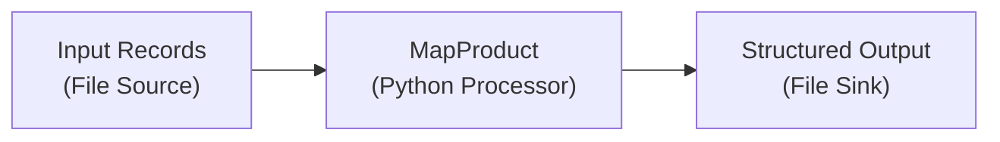

import AssetDependency from '../../snippets/assets/_asset-dependency.md';
import FailureHandling from '../../snippets/assets/_failure-handling-flow.mdx';
import WipDisclaimer from '../../snippets/common/_wip-disclaimer.md'
import InputPorts from '../../snippets/assets/_input-ports.md';
import OutputPorts from '../../snippets/assets/_output-ports.md';

# Python Flow Processor

## Purpose

")

The Python Asset allows you to define detailed business logic which you may want to apply to a flow of messages.
Here are some examples:

* Convert message data from one format to another
* Filter information based on specific rules
* Enrich individual data using specific rules and/or external data sources (e.g. reference data)
* Route messages based on your own criteria
* Gather metrics and statistics, and store and forward them to other targets

and basically anything else you can imagine here.

## Prerequisites

You need:

* A Source Script which should be executed within this asset.
* Knowledge on how to work with Python in layline.io. Please check
  the [Python Language Reference](../../language-reference/python/python_introduction) to learn about this.

## Configuration

### Name & Description

")

* **`Name`** : Name of the Asset. Spaces are not allowed in the name.

* **`Description`** : Enter a description.

The **`Asset Usage`** box shows how many times this Asset is used and which parts are referencing it. Click to expand
and then click to follow, if any.

### Asset Dependencies

<AssetDependency></AssetDependency>

### Input Ports

<InputPorts></InputPorts>

### Output Ports

<OutputPorts></OutputPorts>

### Root Script

The Python Asset obviously needs a Script to be executed. Prior to version 1.0 of layline.io the Script was
configured as part of this Asset. Starting with v1.0 all Scripts are defined in the `Sources` tab of the project (2):

")

The root script to be executed within this Asset is then selected here:

")

:::tip Python Language Reference
To understand how a Source must be structured to work in a Python Asset, please consult
the [Python Language Reference](../../language-reference/python/python_introduction).
:::

### Service Mappings

Python scripts may make use of Services which you may have
configured [here](../services/asset-service-introduction#purpose-of-services). These methods could be database
operations, HTTP-request and whatever else Services do provide.

Let's say your Python script invokes an HTTP-Service which provides a method to retrieve the current Bitcoin price via a
REST-Api. Let's also assume that the name of the Service to be linked is `BTCService`.

1. Add a Service Mapping by clicking on `Add Service Mapping` (1).
2. Select the Service which you want to map (2).
3. Provide a `Logical Service Name`. This is the name by which the Service is used in the underlying Python script! If the
   name you enter here, is different to what you are using in your script, the script will not recognize the Service.

")

### Arguments

You can pass arguments to the assigned script. This may be useful when reusing the same script in various different
Python Assets and Workflows, but the script should behave slightly different in each of those instances.
Passing arguments from a Python Asset can provide this functionality. Please check the `getArguments()`
method [here](../../language-reference/python/API/classes/Processor#getarguments), on how to retrieve arguments in the script.

")

In case you are entering arguments (1), the editor will check for valid JSON and outline this in case it is invalid.
You can format the JSON entries with a click on `Format JSON (2)`.

:::warning Invalid JSON
Entering invalid JSON will cause problems when using the Arguments in the underlying script.
:::

### Failure Handling

<FailureHandling></FailureHandling>

## Example

The following example reads inbound product records and maps them to a structured output format with Header, Detail, and Trailer records.



**Configuration:**

| Setting | Value |
|---------|-------|
| Root Script | `map_product.py` (defined in Sources) |
| Input Port | `Input` (default) |
| Output Port | `Output-1` |

**Script: `map_product.py`**

```python
"""
Maps input messages to a different output format.
"""

OUTPUT_PORT = processor.get_output_port('Output-1')
TOTAL_RECORDS = 0

# Default column mapping, can be overridden via Arguments
COLUMN_MAP = None


def on_init():
    """Called once when the Project starts."""
    global COLUMN_MAP
    args = processor.get_arguments()
    if args and args.get('columnMap'):
        COLUMN_MAP = args.get('columnMap')
    else:
        COLUMN_MAP = {
            "id": "Id",
            "code": "Code",
            "name": "Name",
            "category": "Category",
            "price": "Price",
            "stock": "StockQuantity",
            "color": "Color",
            "launchDate": "LaunchDate"
        }


def on_shutdown():
    """Called when the processor shuts down."""
    pass


def on_stream_start():
    """Called when a new stream starts."""
    global TOTAL_RECORDS
    stream.log_info("--- on_stream_start")
    TOTAL_RECORDS = 0


def on_message():
    """Called for every message arriving at the Input port."""
    global TOTAL_RECORDS
    stream.log_info("--- on_message. Message: " + message.to_json())

    # Write header on first record
    if TOTAL_RECORDS == 0:
        header_message = data_dictionary.create_message(data_dictionary.type.Header)
        header_message.data.PRODUCT = {
            "RECORD_TYPE": "H",
            "FILENAME": "Id;Code;Name;Category;Price;StockQuantity;Color;LaunchDate"
        }
        stream.emit(header_message, OUTPUT_PORT)

    # Create and emit a Detail record
    detail_message = data_dictionary.create_message(data_dictionary.type.Detail)
    detail_message.data.PRODUCT = {
        "RECORD_TYPE": "D",
        "ID": message.data[COLUMN_MAP["id"]],
        "CODE": message.data[COLUMN_MAP["code"]],
        "NAME": message.data[COLUMN_MAP["name"]],
        "CATEGORY": message.data[COLUMN_MAP["category"]],
        "PRICE": message.data[COLUMN_MAP["price"]],
        "STOCK_QUANTITY": message.data[COLUMN_MAP["stock"]],
        "COLOR": message.data[COLUMN_MAP["color"]],
        "LAUNCH_DATE": message.data[COLUMN_MAP["launchDate"]]
    }
    stream.emit(detail_message, OUTPUT_PORT)
    TOTAL_RECORDS += 1


def on_stream_end():
    """Called when the stream ends."""
    global TOTAL_RECORDS
    stream.log_info("--- on_stream_end")

    # Write trailer if any records were processed
    if TOTAL_RECORDS > 0:
        trailer_message = data_dictionary.create_message(data_dictionary.type.Trailer)
        trailer_message.data.PRODUCT = {
            "RECORD_TYPE": "T",
            "RECORD_COUNT": TOTAL_RECORDS
        }
        stream.emit(trailer_message, OUTPUT_PORT)
```

**Arguments:**

To override the default column mapping, pass a JSON object argument:

```json
[
    { "key": "columnMap", "value": { "id": "product_id", "code": "sku", "name": "product_name" } }
]
```

**What happens at runtime:**

1. `on_stream_start` initializes the record counter to 0
2. For the first message, `on_message` emits a Header record with the column header string
3. For every message, `on_message` emits a Detail record with the mapped fields
4. `on_stream_end` emits a Trailer record with the total record count
5. `on_shutdown` is called when the processor shuts down (e.g., on workflow stop)


## See Also

- [Python Language Reference](../../language-reference/python/python_introduction) — full Python language guide for layline.io
- [PythonProcessor API](../../language-reference/python/API/classes/PythonProcessor) — available hooks and lifecycle methods
- [DataDictionary API (Python)](../../language-reference/python/API/classes/DataDictionary) — working with Reference Data in Python scripts
- [PackedMessage API (Python)](../../language-reference/python/API/classes/PackedMessage) — reading and writing message fields
- [Service Mappings](#service-mappings) — connecting external services (HTTP, DB, etc.) to a Python Asset

Please see section [Forced Errors](../../language-reference/python/python_introduction#forced-errors) to understand how to use these settings.

---

<WipDisclaimer></WipDisclaimer>
