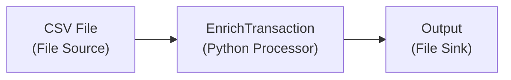

import AssetDependency from '../../snippets/assets/_asset-dependency.md';
import FailureHandling from '../../snippets/assets/_failure-handling-flow.mdx';
import WipDisclaimer from '../../snippets/common/_wip-disclaimer.md'
import InputPorts from '../../snippets/assets/_input-ports.md';
import OutputPorts from '../../snippets/assets/_output-ports.md';

# Python Flow Processor

## Purpose

")

The Python Asset allows you to define detailed business logic which you may want to apply to a flow of messages.
Here are some examples:

* Convert message data from one format to another
* Filter information based on specific rules
* Enrich individual data using specific rules and/or external data sources (e.g. reference data)
* Route messages based on your own criteria
* Gather metrics and statistics, and store and forward them to other targets

and basically anything else you can imagine here.

## Prerequisites

You need:

* A Source Script which should be executed within this asset.
* Knowledge on how to work with Python in layline.io. Please check
  the [Python Language Reference](../../language-reference/python/python_introduction) to learn about this.

## Configuration

### Name & Description

")

* **`Name`** : Name of the Asset. Spaces are not allowed in the name.

* **`Description`** : Enter a description.

The **`Asset Usage`** box shows how many times this Asset is used and which parts are referencing it. Click to expand
and then click to follow, if any.

### Asset Dependencies

<AssetDependency></AssetDependency>

### Input Ports

<InputPorts></InputPorts>

### Output Ports

<OutputPorts></OutputPorts>

### Root Script

The Python Asset obviously needs a Script to be executed. Prior to version 1.0 of layline.io the Script was
configured as part of this Asset. Starting with v1.0 all Scripts are defined in the `Sources` tab of the project (2):

")

The root script to be executed within this Asset is then selected here:

")

:::tip Python Language Reference
To understand how a Source must be structured to work in a Python Asset, please consult
the [Python Language Reference](../../language-reference/python/python_introduction).
:::

### Service Mappings

Python scripts may make use of Services which you may have
configured [here](../services/asset-service-introduction#purpose-of-services). These methods could be database
operations, HTTP-request and whatever else Services do provide.

Let's say your Python script invokes an HTTP-Service which provides a method to retrieve the current Bitcoin price via a
REST-Api. Let's also assume that the name of the Service to be linked is `BTCService`.

1. Add a Service Mapping by clicking on `Add Service Mapping` (1).
2. Select the Service which you want to map (2).
3. Provide a `Logical Service Name`. This is the name by which the Service is used in the underlying Python script! If the
   name you enter here, is different to what you are using in your script, the script will not recognize the Service.

")

### Arguments

You can pass arguments to the assigned script. This may be useful when reusing the same script in various different
Python Assets and Workflows, but the script should behave slightly different in each of those instances.
Passing arguments from a Python Asset can provide this functionality. Please check the `getArguments()`
method [here](../../language-reference/python/API/classes/Processor#getarguments), on how to retrieve arguments in the script.

")

In case you are entering arguments (1), the editor will check for valid JSON and outline this in case it is invalid.
You can format the JSON entries with a click on `Format JSON (2)`.

:::warning Invalid JSON
Entering invalid JSON will cause problems when using the Arguments in the underlying script.
:::

### Failure Handling

<FailureHandling></FailureHandling>

## Example

A Workflow reads transaction records from a **File Source**. Each record carries a `transaction_id`, `customer_id`, `amount`, and `currency`. The Python Processor enriches every record by looking up the customer's `name` and `loyalty_tier` from a **Reference Data** dictionary, then passes the enriched record downstream.



**Workflow configuration:**

| Setting | Value |
|---------|-------|
| Root Script | `enrich_transaction.py` (defined in Sources) |
| Input Port | `Input` (default) |
| Output Port | `Output` (default) |

**Script: `enrich_transaction.py`**

```python
import json

# Global variables initialised in on_init
OUTPUT_PORT = None
CUSTOMER_DICT = None


def on_init():
    """Called once when the Project starts. Set up the output port and dictionary."""
    global OUTPUT_PORT, CUSTOMER_DICT
    OUTPUT_PORT = processor.get_output_port('Output')
    CUSTOMER_DICT = dictionary.get_data_dictionary('CustomerReference')


def on_message():
    """Called for every message arriving at the Input port."""
    customer_id = message.data.get_string('customer_id')
    amount = message.data.get_float('amount')
    currency = message.data.get_string('currency')

    # Look up customer data from the Reference Data dictionary
    customer_name = 'Unknown'
    loyalty_tier = 'STANDARD'

    if CUSTOMER_DICT.exists(customer_id):
        customer = CUSTOMER_DICT.get(customer_id)
        customer_name = customer.get_string('name')
        loyalty_tier = customer.get_string('loyalty_tier')
    else:
        # Log a warning for unrecognised customer IDs
        stream.log_warn('Customer not found in Reference Data: ' + str(customer_id))

    # Write enriched fields back to the outgoing message
    message.data.set_string('customer_name', customer_name)
    message.data.set_string('loyalty_tier', loyalty_tier)

    # Pass the enriched record to the next processor
    stream.emit(message, OUTPUT_PORT)
```

**What happens at runtime:**

1. The File Source reads a CSV record and produces a message with fields `transaction_id`, `customer_id`, `amount`, `currency`
2. The Python Processor's `on_message` hook fires for each message
3. The script extracts `customer_id` and looks it up in the `CustomerReference` Data Dictionary
4. If found, `customer_name` and `loyalty_tier` are written to the message
5. If not found, a warning is logged and default values are used
6. The enriched message is emitted to the `Output` port and continues downstream

**Arguments example:**

To make the same script reusable across different dictionaries, pass the dictionary name as an argument:

```json
[
  \{ "key": "dictionaryName", "value": "CustomerReference" \}
]
```

```python
def on_init():
    global OUTPUT_PORT, CUSTOMER_DICT
    args = processor.get_arguments()
    dict_name = args.get('dictionaryName', 'CustomerReference') if args else 'CustomerReference'
    CUSTOMER_DICT = dictionary.get_data_dictionary(dict_name)
    OUTPUT_PORT = processor.get_output_port('Output')
```

## See Also

- [Python Language Reference](../../language-reference/python/python_introduction) — full Python language guide for layline.io
- [PythonProcessor API](../../language-reference/python/02-API/classes/PythonProcessor) — available hooks and lifecycle methods
- [DataDictionary API (Python)](../../language-reference/python/02-API/classes/DataDictionary) — working with Reference Data in Python scripts
- [PackedMessage API (Python)](../../language-reference/python/02-API/classes/PackedMessage) — reading and writing message fields
- [Service Mappings](#service-mappings) — connecting external services (HTTP, DB, etc.) to a Python Asset

Please see section [Forced Errors](../../language-reference/python/python_introduction#forced-errors) to understand how to use these settings.

---

<WipDisclaimer></WipDisclaimer>
