import WipDisclaimer from '../../snippets/common/_wip-disclaimer.md'
import AssetDependency from '../../snippets/assets/_asset-dependency.md';
import FailureHandling from '../../snippets/assets/_failure-handling-flow.md';
import InputPorts from '../../snippets/assets/_input-ports.md';
import OutputPorts from '../../snippets/assets/_output-ports.md';
import OutputPortsSingle from '../../snippets/assets/_output-ports-single.md';

# Stream Boundary

## Purpose

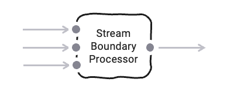

The Stream Boundary Controller allows you to split a stream of data into chunks of consecutive streams based on specific conditions.
Imagine a continuous stream of data being read from a Kafka topic which you want to turn into individual files.
The Stream Boundary Controller allows you to do just that by letting you define the conditions for splitting the stream into chunks.
These chunks represent individual streams of their own which can then be subsequently be output to files.

## Prerequisites

Before using this Asset, we recommend configuring the Formats you plan to use, first.
This will help the Intellisense feature in the mapping configuration to help with the setup.

## Configuration

### Name & Description

* **`Name`** : Name of the Asset. Spaces are not allowed in the name.

* **`Description`** : Enter a description.

The **`Asset Usage`** box shows how many times this Asset is used and which parts are referencing it. Click to expand
and then click to follow, if any.

### Asset Dependencies

<AssetDependency></AssetDependency>

### Input Ports

<InputPorts></InputPorts>

### Output Ports

<OutputPortsSingle></OutputPortsSingle>

### Boundary Controller

In the Boundary Controller section you define the rules on how to split an incoming stream into multiple streams.

#### Boundary Controller Type

There are two distinct options on how to do determine the rules for stream splitting:

1. Based on Volume ann/or time: The stream will be split based on a preset number of messages or time passed or specific times (e.g. at the full hour).
2. Based on stream content: The stream will be split based on the criteria in the content of the stream, e.g. at the appearance of a special type of message or specific content in the message.

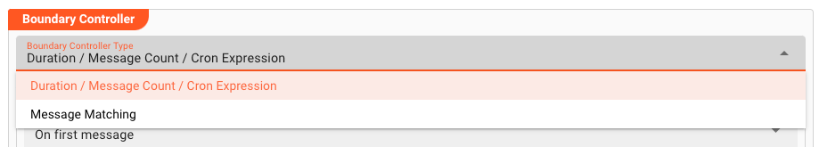

Depending on which type you pick for your purposes the configuration differs.

### Boundary Controller Type "Duration / Message / Cron"

This Controller Type allow you to split the stream based on

- Duration, or
- Number of Messages (Count), or
- Time

#### Stream Configuration

##### Stream Start Mode

Defines when the new stream should be started.
You have two options:

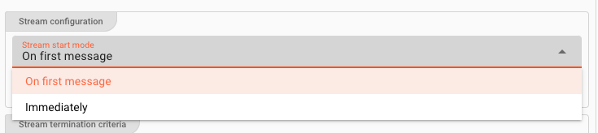

1. `On first message`: The outgoing stream will be started, whenever the first message passes through.
   This option makes the most sense when you for example define that a new stream should be started for each 1.000 messages passing through.
2. `Immediately`: This setting will start a new stream as soon as the Processor is ready.
   This setting makes most sense when used in conjunction with time-based stream splitting, e.g. every 60 seconds, or at the full hour, etc.

##### Name of the split stream

By its nature, the Stream Boundary Controller creates multiple new streams from an incoming message stream.
At this point you define the naming convention for the newly created streams:

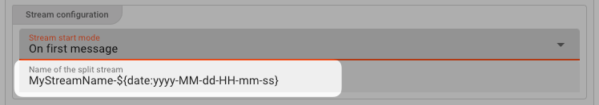

As you can see from the example above, you can use [Macros](../../language-reference/macros) here.
In this case we chose to include a constant `MyStreamName-` plus the current date and time in the newly created stream name.

#### Stream Termination Criteria

In this box you define the criteria upon which the current stream shall be committed and a new stream started (i.e. the splitting criteria).

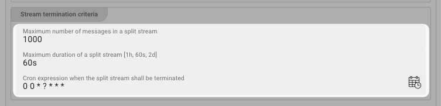

In our example above we have defined the following

- **`Max. number of messages in split stream`** (e.g. 1.000): Create a new stream every 1.000 messages.
  Note, that if a stream runs shy of 1.000 messages, the newly created stream will never be closed.
  You should consider using this parameter in conjunction with one of the two following time based parameters.

- **`Maximum duration of a split stream`** (e.g. 60s): Start a new stream every 60 seconds from start of new stream.
  Accepts the following notations:

  | What         | Unit                     |
  |--------------|--------------------------|
  | MILLISECONDS | ms, millis, milliseconds |
  | MICROSECONDS | us, micros, microseconds |
  | NANOSECONDS  | ns, nanos, nanoseconds   |
  | DAYS         | d, days                  |
  | HOURS        | h, hours                 |
  | SECONDS      | s, seconds               |
  | MINUTES      | m, minutes               |

- **`Cron expression on when stream shall be terminated`** (e.g. "0 0 * ? * * *"): Strictly time based condition on when current stream should be closed.
  Enter a cron term here.
  Either enter the term yourself using [quartz notation](http://www.quartz-scheduler.org/documentation/quartz-2.3.0/tutorials/crontrigger.html),
  or click the button to the right of the field for assisted entry.

:::warning Stream Termination Criteria apply discretely
Keep in mind, that each termination condition applies on its own. So in case, you have defined a stream to terminate each 1.000 messages,
and have also defined for a stream to be terminated each 60 seconds, then both triggers will apply on their own terms. That is either after 1.0000 OR after 60 seconds.

This behavior can be desired, as it will allow you to split a stream every 60 seconds regardless of whether 1.000 messages have been reached or not.
Should you receive more than 1.000 messages per 60 seconds, then the output will always be 1.000 messages per split stream.
Should the incoming stream fall below 1.000 messages per second then it will be split after 60 seconds regardless.  
:::

### Boundary Controller Type "Message Matching"

This Controller Type will allow you to split a stream based on the stream content.

A practical example would be that - within your incoming message stream - you receive certain message types that should signal the beginning of a new stream as well as the end..
In other words, split stream boundaries **can be determined based on the stream's content**.

This is comparable to interpreting a data format which has a header, detail and a trailer message.
Unlike in file processing the data is received as a continuous stream, however.
Imagine you are reading data from a Kafka topic which contains messages in this order, then this Controller will allow you to split this continuous stream into individual streams based on the header
and trailer marker messages.

**Example Data Stream:**

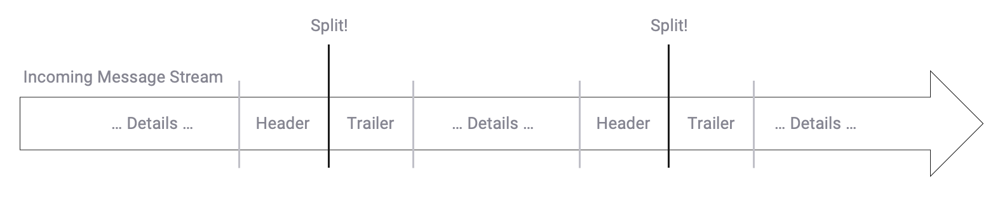

#### Finite State Machine

Essentially the rules to split a stream of messages into individual streams can be reflected by a Finite State Machine.
Let's explain:

In order to split a continuous stream the Controller must know what message to expect so that it can decide

1. what to do with each message that "flies by", and
2. when to actually split the stream based on definable conditions.

In doing so, the Controller needs to be able to keep track of different states.
Taking our example from above we do have the following rules to observe:

1. A new stream starts with a message of type `Header`.
2. Subsequent messages must be of type `Detail` or `Trailer`.
3. Once we receive a `Trailer` message the stream ends. We expect a `Header` message after that.
4. If we receive a `Header` directly after having received a `Detail`, it's an error.

So basically we have two states, each one with its own conditions:

1. **State #1 "Header":**
    * Waiting for a `Header` message.
    * Anything else ignore it.
2. **State #2 "In Transaction":**
    * Processing `Details` and `Trailer` message.
    * If we receive a `Header`, that's an error.

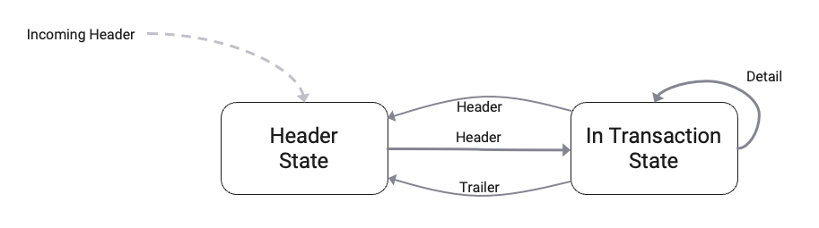

The UI supports you in entering these states and related conditions.
We will explain how to do this, using our example:

#### States

In addition to representing a `State`, States can also forward messages as output, or inhibit forwarding of messages.

##### Adding a State

To add a State, click on `+ ADD STATE`.

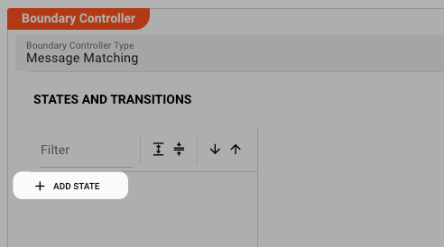

A State will be automatically inserted in the table below. 
We name the State `Header`.

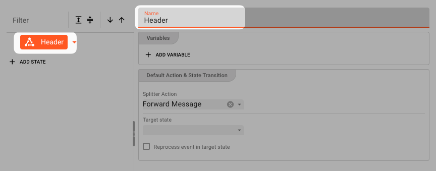

Add another State `In Transaction`.
You now have two States. The States do not contain any `Cases` yet.

In the graph above the table, you should be able to see your two States:

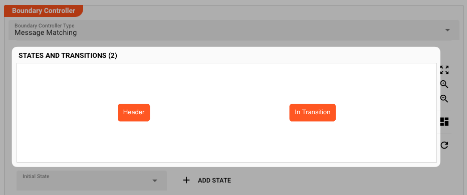

Add as many states as your model requires.
You can also add or remove States later.

##### Setting the Initial State

A State Machine must start somewhere.
It's the same with this State Machine which is why you must set the initial state of the state machine here:

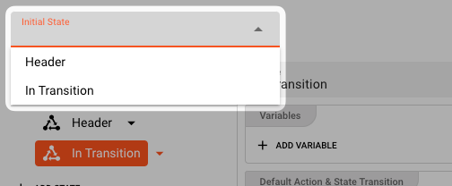

##### State Variables

The current version of the UI, already allows you to define State Variables.
State Variables serve the purpose of passing values from one State to another.

As an example you could pass a field `StreamId` from the `Header` message in the `Header` State, to the `In Transaction` State.

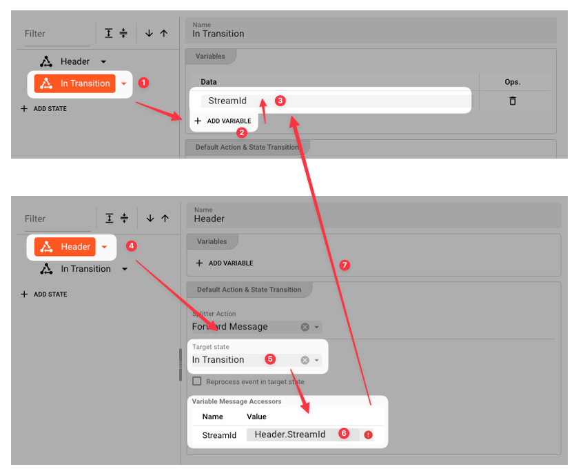

In that State you could then use the value, e.g. to check whether the data you are processing in the `In Transaction` State stems from the same StreamId by comparing contained StreamId information with that from the variable.

:::warning
This feature is currently not supported. You can therefore define variables at this stage, but not use them.
:::

#### Cases

`Cases` are defined within `States`.
`Cases` define the conditions upon which

1. messages are forwarded / inhibited, and
2. State-transitions are performed.

You may have noticed, that there is always a default `Case` which you can configure on `State` level. It is triggered when nothing else fires.
By default, it will forward the current message.

To further our example, let's add a Case which transitions state to the `In Transaction` state when a Header type message is encountered, and also forwards the Header message downstream.

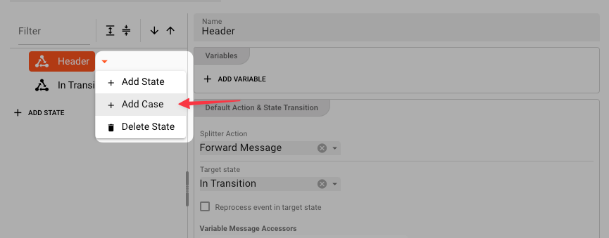

We now have a new `Case` for which we can enter the details:

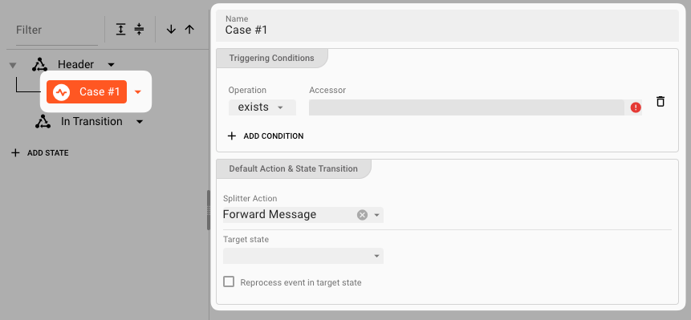

A `Case` is split between

1. "Case and related triggering conditions" on the left (-> WHEN to do things), and
2. "Action & State Transition" on the right (-> WHAT to do)

##### Conditions

Conditions define when a passing message within the current `State` should trigger an `Action`.

Currently two operations are supported:

1. `exists`: Looks for a message **data dictionary structure** to exist within the message.
2. `equals`: Looks for specific content to exist in the message.

**Multiple conditions all need to match for the `Case` to fire.**

Examples Conditions:

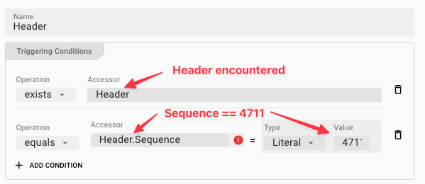

For the purpose of our example we only need the first condition.

##### Action & State Transition

Actions and State Transition define what should happen if the previously defined conditions apply.
You basically define

1. **Splitter Action**: What should happen with the message.
2. **Target State**: Whether a State Transition should be triggered and where to.

**`Splitter Action` options**:

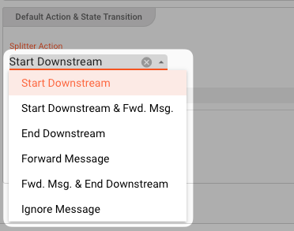

| Splitter Action                        | Effect                                                                                                                                                                                      | Other options                                                                                                                                                                                                                                                                                                                                                                                                                                                                                                                                                                                                                                                                                                                                                                                             |   |
|----------------------------------------|---------------------------------------------------------------------------------------------------------------------------------------------------------------------------------------------|-----------------------------------------------------------------------------------------------------------------------------------------------------------------------------------------------------------------------------------------------------------------------------------------------------------------------------------------------------------------------------------------------------------------------------------------------------------------------------------------------------------------------------------------------------------------------------------------------------------------------------------------------------------------------------------------------------------------------------------------------------------------------------------------------------------|---|
| **Start Downstream**                   | Start a new stream. The original message is **NOT** forwarded.                                                                                                                              | - `Stream Name`: Name of the newly created stream. You can use [Macros](../../language-reference/macros) here. Example: `${msg:Header.Name}`                                                                                                                                                                                                                                                                                                                                                                                                                                                                                                                                                                                                                                                      |   |
| **Start Downstream & Forward Message** | Same as `Start Downstream`, but the original message **IS** forwarded.                                                                                                                      | Same as above.                                                                                                                                                                                                                                                                                                                                                                                                                                                                                                                                                                                                                                                                                                                                                                                            |   |
| **End Downstream**                     | Ends the current downstream. This is equivalent to a "split" of the incoming stream. The current message is **NOT** forwarded. Now a new stream can be started based on another `Case`. | - `Stream Result`: Pick either `Failure` or `Ok` depending on how you want to value the outcome. Pick `Failure` for example if the value encountered is not what was expected. - `Reason text`: Enter a text here which you want to attach to the status of this message. This is especially helpful in case you defined `Failure` as a result. You can then see the message you enter here as part of the failure status in the log. - `Trigger Upstream Savepoint`: Check this to make sure that the upstream source which is delivering the messages is notified that it should be trigger a savepoint, i.e. memorize the position. Should the system try to reprocess data, it will only be reprocessed from that point forward. The delivering source, must support savepoints (e.g. Kafka). |   |
| **Forward Message**                    | Just forward the message downstream.                                                                                                                                                        | -                                                                                                                                                                                                                                                                                                                                                                                                                                                                                                                                                                                                                                                                                                                                                                                                         |
| **Forward Message & End Downstream**   | Same as `End Downstream`, but also forwards the message downstream.                                                                                                                         | -                                                                                                                                                                                                                                                                                                                                                                                                                                                                                                                                                                                                                                                                                                                                                                                                         |
| **Ignore Message**                     | Do nothing with the message. It will be ignored and **NOT** sent downstream.                                                                                                                | -                                                                                                                                                                                                                                                                                                                                                                                                                                                                                                                                                                                                                                                                                                                                                                                                         |

 

:::note Forward Message
Forwarding a message in this context means that the message is forwarded for downstream processing.
If you select an option which does not forward the message, then the original message will be destroyed and will not be forwarded.
:::

**Target State**:

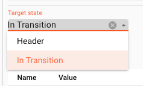

The `Target State` defines which State should be assumed if the conditions of this `Case` match.
You can pick of one of the existing States which you have defined.

**Reprocess event in target state**

As we have learned, in the Controller Type "Message Matching", a message can trigger a State change.
You may want to reprocess this message in the new state. In this case, check this box.

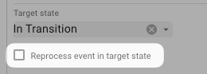

Revisiting the State Graph at the top of the table, this now reflects the state transition condition which you have just configured:

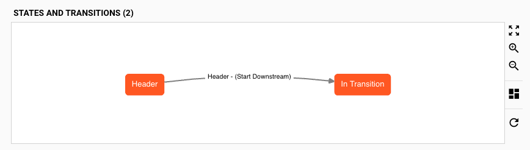

#### Complete Example Configuration

If we complete all settings based on our example, we come up with the following:

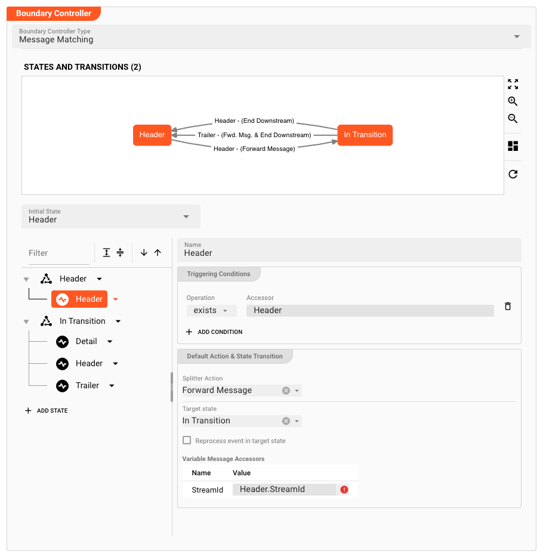

### Failure Handling

<FailureHandling></FailureHandling>

Processing within a Flow Processor like this one can fail for various reasons.

In this section you can define how the system should behave in case of such problems.

---

<WipDisclaimer></WipDisclaimer>
