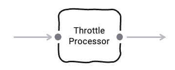
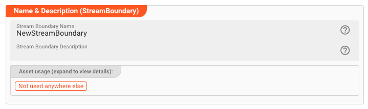
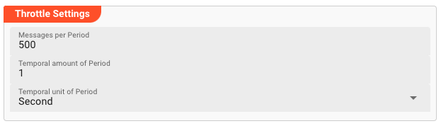

import WipDisclaimer from '../../snippets/common/_wip-disclaimer.md'
import AssetDependency from '../../snippets/assets/_asset-dependency.md';
import FailureHandling from '../../snippets/assets/_failure-handling-flow.md';
import InputPorts from '../../snippets/assets/_input-ports-single.md';
import OutputPorts from '../../snippets/assets/_output-ports-single.md';

# Throttle

## Purpose

The Throttle Asset allows you to slow down processing speed within the leg of a Workflow where this Processor is inserted.

Typical use cases are when you do not want to overburden an external system with too many requests in too little time. Using the Throttle Asset you can control throughput based on only a few
parameters.

## Prerequisites

None.

## Configuration

### Name & Description

* **`Name`** : Name of the Asset. Spaces are not allowed in the name.

* **`Description`** : Enter a description.

The **`Asset Usage`** box shows how many times this Asset is used and which parts are referencing it. Click to expand and then click to follow, if any.

### Asset Dependencies

<AssetDependency></AssetDependency>

### Input Ports

<InputPorts></InputPorts>

### Output Ports

<OutputPorts></OutputPorts>

### Throttle Settings

This is where you define how to actually throttle the flow.
The paradigm is that you define how many messages per time interval should be allowed to pass.

What does this setting define?:
***"Throttle the processing flow to 500 messages for every one second."***

- **`Messages per Period`**: The number of messages which are allowed to pass per time period (interval).

- **`Temporal amount of Period`**: This value is best described in the connection with the next parameter `Temporal unit of Period`.
  Let's assume the unit is `Second`, and the amount which we enter field is `2`.
  This defines, that message throughput should be limited by e.g. 500 (defined in `Messages per Period`) message for each two second interval.

- **`Temporal unit of Period`**: The interval unit, e.g. `Seconds`, `Minutes`, etc..

---

<WipDisclaimer></WipDisclaimer>
