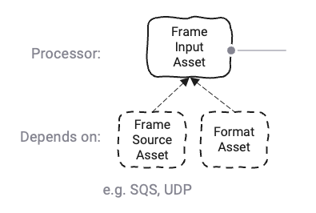
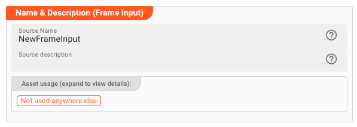
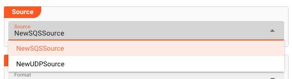
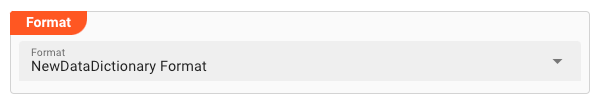

import FailureHandling from '/docs/snippets/assets/_failure-handling-input.md';
import WipDisclaimer from '/docs/snippets/common/_wip-disclaimer.md';
import OutputPorts from '/docs/snippets/assets/_output-ports-single.md';

# Input Frame

## Purpose

Let's first understand why this is called a _Frame_ Input Asset. 
It's a generic term for Sources which provide data in the form of datagrams.
Within layline.io these are for example SQS and UDP Source Assets.

So if you are working with any of these Sources, then you need this Frame Input Asset to be able to get data from the Source.  

This Asset is used within a Workflow definition.

### Prerequisite

You need:
* [SQS Source](/docs/assets/sources/asset-source-sqs), or
* [UDP Source](/docs/assets/sources/asset-source-http)
* [Format](/docs/category/formats)

## Configuration

### Name & Description

* **`Name`** : Name of the Asset. Whitespaces are not allowed in the name.

* **`Description`** : Enter a description.

The **`Asset Usage`** box shows how many times this Asset is used and which parts are referencing it. Click to expand
and then click to follow, if any.

### Output Ports

<OutputPorts></OutputPorts>

### Source

Assign a source from the drop-down list. 
Only SQS and UDP sources will be displayed.

### Format

If you have defined a format, then you can select it from the list of available formats.
The format will be applied on the incoming data so that it can be accessed via the data dictionary.  

### Failure Handling

<FailureHandling></FailureHandling>

---

<WipDisclaimer></WipDisclaimer>
