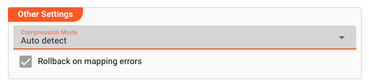

import OutputPorts from '/docs/snippets/assets/_output-ports.md';
import FailureHandling from '/docs/snippets/assets/_failure-handling-input.md';
import WipDisclaimer from '/docs/snippets/common/_wip-disclaimer.md';

# Input Stream

## Purpose

Defines input parameters to ingest data from a Service Source.

This Asset is used within a Workflow definition.

")

## Prerequisites

You need:

**A Format**

* [Format](/docs/category/formats)

**A Stream Source, of either**

* [File System Source](/docs/assets/sources/asset-source-file)
* [FTP Source](/docs/assets/sources/asset-source-ftp)
* [S3 Source](/docs/assets/sources/asset-source-s3)
* [SMB Source](/docs/assets/sources/asset-source-smb)
* [TCP Source](/docs/assets/sources/asset-source-tcp)
* [WebDav Source](/docs/assets/sources/asset-source-webdav)
* [WebSocket Source](/docs/assets/sources/asset-source-websocket)

### Name & Description

")

**`Name`** : Name of the Asset. Whitespaces are not allowed in the name.

**`Description`** : Enter a description.

The **`Asset Usage`** box shows how many times this Asset is used and which parts are referencing it. Click to expand and then click to follow, if any.

### Output Ports

<OutputPorts></OutputPorts>

### Termination Settings

Using termination settings you can control how layline.io should behave upon shutdown of a Workflow that this Asset is part of.
A Workflow shutdown at most goes through three phases:

1. Signalling shutdown: layline.io signals inputs that it wants to shut down.
2. Signalling abort: In case the shutdown was not confirmed, layline.io sends an abort request.
3. If the abort was not confirmed, layline.io terminates the input without further wait.

")

* **`Shutdown grace period [ms]`** : Time to wait for the input processor to gracefully confirm shutdown once a shutdown request has been received.

* **`Abort grace period [ms]`** : In case the shutdown signal was not confirmed in due time, an abort request will be issued.
  If the abort is not confirmed in the configured time interval, a hard termination will be issued. The abort timeout is consecutive to the shutdown timeout.

### Format

Data must be read in a format which must have been previously defined by you.

")

If you have defined such a format, then you can select it from the list of available formats by clicking on the button next to the field.

### Source

You need to assign a Source which you have defined (see [Prerequisites](#prerequisites)). The Source defines which topics can be read from.
The Source must have been previously defined.

")

Select the Sink by clicking on the button next to the field (1).

### Other Settings

#### Compression Mode

In case your incoming stream data is in compressed format, you can define the algorithm to be used for decompression here.
If you do not know the compression-algorithm, simply select `Auto detect`, and the system will try to determine the correct decompression automatically.
For uncompressed data, please leave the setting on `None`.

#### Rollback on mapping errors

Check this box, if you want the system to issue a rollback request in case the incoming data cannot be mapped to the assigned format.
The default is `on`. If you are unsure about this, then just leave the default.

### Failure Handling

<FailureHandling></FailureHandling>

---

<WipDisclaimer></WipDisclaimer>
