import InputPorts from '/docs/snippets/assets/_input-ports-single.md';
import FailureHandling from '/docs/snippets/assets/_failure-handling-output.md';
import WipDisclaimer from '/docs/snippets/common/_wip-disclaimer.md';

# Output Frame

## Purpose

Let's first understand why this is called a _Frame_ Output Asset.
It's a generic term for Sinks which receive data in the form of datagrams.
Within layline.io these are for example Kafka, SNS, and more. See [Prerequisites](#prerequisites) for a full list.

If you are working with any of these Sinks, then you need this Frame Output Asset to be able to output data to the Source.

This Asset is used within a Workflow definition.

")

## Prerequisites

You need:
**A Sink, either one of:**

* [EventBridge](/docs/assets/sinks/asset-sink-eventbridge)
* [Kafka](/docs/assets/sinks/asset-sink-kafka)
* [Kinesis](/docs/assets/sinks/asset-sink-kinesis)
* [SNS](/docs/assets/sinks/asset-sink-sns)
* [SQS](/docs/assets/sinks/asset-sink-sqs)

## Configuration

### Name & Description

")

**`Name`** : Name of the Asset. Whitespaces are not allowed in the name.

**`Description`** : Enter a description.

The **`Asset Usage`** box shows how many times this Asset is used and which parts are referencing it. Click to expand and then click to follow, if any.

### Input Ports

<InputPorts></InputPorts>

### Sink

The Frame Output Asset can serve a number of different Sink Types (see [Prerequisites](#prerequisites)).
Select the Sink you would like to use for this output.
The Sink you want to use must have been configured by you prior to assigning it here.

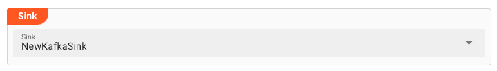

Now, depending on the Sink type you picked, the following configurations will differ.

## Sink Settings for EventBridge

AWS EventBridge is a fully managed event bus service that simplifies building event-driven architectures and applications.
It allows different systems, services, and applications within your AWS environment to communicate and interact through events.

If you want to output data to EventBridge, then you need to configure the settings in this section.

### Parallel requests

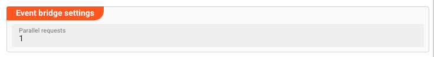

In order to accelerate writing to a EventBridge, you can parallelize this process.
Entering `100` here (example) allows layline.io to have 100 messages "in-flight" to EventBridge in parallel.

### Routing Rules

This is where we can define HOW we want to route the data to EventBridge.
By creating granular rules, we can specify that certain data goes to certain targets, based on the message's content.

#### Default behavior

In case a message cannot be matched by any rule, you can define a default behavior of what to do:

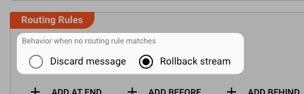

* **`Discard Message`**: Only discard the current message if the message does not match any rule.

* **`Rollback stream`**: Discard and roll back the complete stream.

#### Managing Routing Rules

Next you can define individual routing rules for messages which shall be output to EventBridge.
Rules are evaluated in order. The first one takes precedence over the second and so forth.
Use the respective buttons to add or move a new rule in the designated space:

")

Let's assume our condition for routing messages are as follows:

**Rule: "NewRule"**

##### Conditions

First you define the conditions under which the individual message should match the rule.

You can pick whether `all` conditions must be fulfilled, `at least one` of the rules must be met, or `none`.

You then go on to enter the individual conditions.
Conditions follow the [Quickscript](/docs/lang-ref/quickscript/quickscript) language.
So you can define pretty complex rules at this point.
You will probably have simple rules most of the time, however.

")

**Conditions**: The message field `message.Detail.Boat.Length` must be greater than `30`, OR `message.Detail.Boat.Weight` must be less than `20000`.

##### Destination

In case the conditions are met, the message is then forwarded to an [EventBridge Bus](https://docs.aws.amazon.com/eventbridge/latest/userguide/eb-event-bus.html) in the format you define.

* **`Event Buses`**: You can forward each message to one or more EventBridge Event Buses.
  To add an Event Bus destination reference, click on `Add Event Bus`.

  ")

  An Event Bus reference can be selected from Event Buses which you have already defined in an [Event Bridge Sink](/docs/assets/sinks/asset-sink-eventbridge),
  or you can define a term which returns the Event Bus name through a [Quickscript](/docs/lang-ref/quickscript/quickscript) term.

    * **Constant**: Pick this option to select from Event Buses which you have defined in an in an [Event Bridge Sink](/docs/assets/sinks/asset-sink-eventbridge).
      Select the available Event Buses from the drop down on the right:

  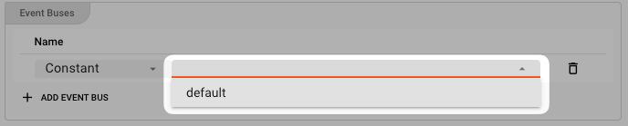

    * **Calculated**: Enter a [Quickscript](/docs/lang-ref/quickscript/quickscript) term which evaluates to a Event Bus name.
      You can also use ${...} macros to expand variables defined in [environment variables](/docs/assets/resources/asset-resource-environment).
      Make sure the result is enclosed in quotes as a result to form a valid result string.

      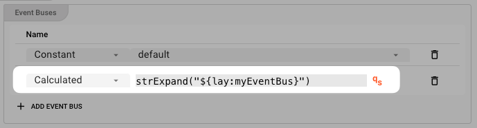

The following settings allow you to define the properties which are expected in an EventBridge message structure.
The structure looks like [this](https://docs.aws.amazon.com/eventbridge/latest/userguide/eb-events-structure.html):

```json 
{
  "version": "0",
  "id": "UUID",
  "detail-type": "event name",
  "source": "event source",
  "account": "ARN",
  "time": "timestamp",
  "region": "region",
  "resources": [
    "ARN"
  ],
  "detail": {
    JSON
    object
  }
}
```

* **`Source`**: Enter a term (Constant) or a QuickScript (Calculated) which is passed as the "Source" to EventBridge.

  ")

  In EventBridge, a "source" refers to the origin or the entity that emits or publishes events. It indicates the system, application, or service that generates and sends events to the event bus.

  The source helps identify the type or category of events being published. It provides information about the source system or application that produced the event, allowing you to filter and route
  events based on their source.

  For example, if you have multiple applications integrated with EventBridge, each application can be configured to define its own source when publishing events. This enables you to differentiate and
  handle events based on their sources when creating rules or configuring event routing.

  The source value is typically included in the event payload or metadata, which EventBridge utilizes to determine how to route the event to its desired targets. By leveraging the source information,
  you can effectively manage and handle events from different sources within your event-driven architecture.

* **`Detail Type`**: Enter a term (Constant) or a QuickScript (Calculated) which is passed as the "Detail Type" to EventBridge.

  ")

  In EventBridge, a "detail type" is an attribute that provides additional categorization or classification for events. It allows you to further organize and filter events based on their specific
  types or subcategories.

  The detail type is a string value associated with each event and provides information about the nature or purpose of the event. It helps to differentiate events within a particular source or
  context.

  By using detail types, you can create rules and filters in EventBridge that specify which events should be processed or routed based on their specific detail type. This enables you to take different
  actions or trigger different workflows based on the nature of the event.

  For example, if you have an application that generates events related to user activities, you can use detail types like "login", "logout", "purchase", or "profile update" to classify different types
  of events. You can then define rules in EventBridge to route these events to appropriate targets or perform specific actions based on their detail type.

  Overall, detail types provide a way to further refine and categorize events within EventBridge, enhancing the flexibility and precision in event handling and processing.

* **`Event detail message accessor`**: At this point you define which data from the message you want to map to the output.
  You pick a path from the data dictionary which is then turned into JSON in the output and passed on to the EventBridge Buses which you have defined above.

  ")

  In the example above, the branch "Detail.Boat" from the message is output to EventBridge in JSON format.
  To learn more about messages and data dictionary please check [here](/docs/concept/data-dictionary).

* **`Resources`**: Define EventBridge Resource names here.

  ")

  In EventBridge, "Resources" refer to the entities or services that generate events or receive events as targets.
  Resources can include AWS services, custom applications, or any other system capable of generating or receiving events.

  When it comes to generating events, Resources can be event sources or producers.
  These could be services like AWS Lambda, Amazon S3, Amazon CloudWatch, or any custom application integrated with EventBridge.
  Event sources are responsible for publishing events to the event bus.

  On the other hand, Resources can also be event targets or consumers.
  These are services or applications that subscribe to events from the event bus and perform some action or processing based on the received events.
  Event targets can include services like AWS Lambda functions, Amazon SNS topics, AWS Step Functions, or even custom applications.

  EventBridge allows you to configure rules that determine how events are routed to specific Resources based on their patterns or attributes.
  Resources play a crucial role in event-driven architectures, as events drive actions and communication between different components and services.

## Sink Settings for Kafka

### Routing Modes

The Kafka Output Processor gives you granular control to which topic data is written and how.
For this purpose we distinguish between two `Routing Modes`:

1. **`Routing Table`** : This mode allows you to define default as well as specific data-driven rules to which topics data is written to.
   Pick this mode when you want to have detailed control over topic access.

2. **`Exclusive Partition`** : This mode enables you to gain exclusive access to a Kafka partition.
   Pick this mode if you want to make sure you are the only one writing to a specific Kafka partition.
   An example would be multiple inputs reading from files and writing their content to Kakfa.
   However, you want to ensure, that one file's contents are always written to one partition only.

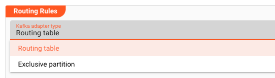

### Routing Table Mode

In this mode, we can define HOW we want to route the data to respective Kafka topics.
By creating granular rules, we can specify that certain data goes to certain topics, based on the message's content.

#### Default behavior

In case a message cannot be matched by any rule, you can define a default behavior of what to do:

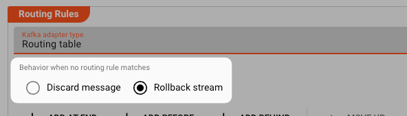

* **`Discard Message`**: Only discard the current message if the message does not match any rule.

* **`Rollback stream`**: Discard and roll back the complete stream.

#### Routing Rules

Based on your settings above, this is where you can define individual routing rules for messages which shall be output to Kafka.
Rules are evaluated in order. The first one takes precedence over the second and so forth.
Use the respective buttons to add or move a new rule in the designated space:

")

Let's assume our condition for routing messages are as follows:

**1. Rule: "MyRoutingRule"**

##### Conditions

First you define the conditions under which the individual message should match the rule.

You can pick whether `all` conditions must be fulfilled, `at least one` of the rules must be met, or `none`.

You then go on to enter the individual conditions.
Conditions follow the [Quickscript](/docs/lang-ref/quickscript/quickscript) language.
So you can define pretty complex rules at this point.
You will probably have simple rules most of the time, however.

")

**Conditions**: The message field `message.Detail.Boat.Length` must be greater than `30`, OR `message.Detail.Boat.Weight` must be less than `20000`.

##### Destination

In case the conditions are met, the message is then forwarded to the topic an in the format you define.

* **`Format`**: Pick a format in which you would like to output the data to Kafka.
  You must have pre-defined the format [here](/docs/category/formats).
  Please note that only the data which is part of the format in the data dictionary which you pick here will be written.
  So if you read the data in format `A`, but then want to output format `B`, then the relevant data must have been mapped from `A` to `B´ in a previous step (e.g. by way of
  the [Mapping Asset](/docs/assets/processors-flow/asset-flow-mapping) or via [Javascript](/docs/assets/processors-flow/asset-flow-javascript)).

* **`Topic`**: Enter a [Quickscript](/docs/lang-ref/quickscript/quickscript) term which evaluates to the topic name of where you want to send the individual message.
  Let's assume your default topic name is "myTopic", then you simply enter "myTopic" (include quotes) in the field.
  In our example we have entered `strExpand("${lay:derivedDataTopic}")`.
  This also is QuickScript which means that the name of the topic is in an environment variable `derivedDataTopic` which is defined in an Environment Asset, and this environment variable is expanded
  by the QuickScript function `strExpand`.
  Using QuickScript here allows you to make decisions on the outcome of the topic name, beyond simply putting a hard-coded name here.
  If you do want to output all messages to a hard-coded topic then simply enter the topic name here.
  Make sure that you put quotes around it, since this is a QuickScript field and if you want the outcome to be a string, it must be quoted.

  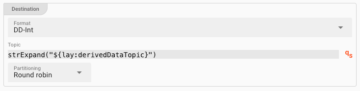

* **`Partitioning`**:
  For Kafka topics which are partitioned we can define which partition to write the data to:

    * **`Round Robin`**: Serve all partitions equally incoming messages will be evenly distributed across all available partitions of the given topic.

    * **`Use key`**: Messages will be forwarded to a specific partition of the topic. The key of the partition is identified by `type` and the actual `key`. You can enter QuickScript for the key.

    * **`Specify partition`**: Define the partition using QuickScript. Example `strExpand("${lay:myPartition}")`, where the partition name is specified in the environment variable `myPartition`.

**2. Rule: "MyOtherRoutingRule"**

In our example we have created another routing rule `MyOtherRoutingRule` **below** the first rule.

The order of rules is important, as they will be evaluated in this order.
If you need to change the order you can do so by using the `Move Up` and `Move Down` buttons at the top of the Routing Rules section.

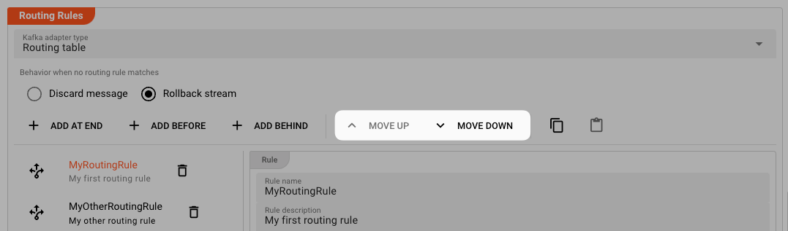

**Summary:**

* We have two rules which are evaluated in order.
* If rule 1 matches then the message is stored in topic `"myTopic"`.
  If rule 1 did not match but rule 2 matches, then the message will be stored in topic `"anotherTopic"`.
* If none of the rules matches, then the default handling kicks in (see above).

### Exclusive Partition Mode

Use this mode, in case you want to write to a multi-partitioned Kafka topic, and you specifically want obtain exclusive access to a topic partition.

What this entails, is that each instance of a Workflow running this Asset as a Processor, will try to obtain exclusive access one of the partitions of a topic configured.

**Example:**

Setting the scene:

1. You have a Kafka topic which is divided into 10 partitions.
2. You are processing files on the input (example) and **want to process multiple files in parallel**.
3. Results of this processing shall be written to a Kafka topic.
4. You want to ensure, that data from each file is written subsequently and in order to the topic.
   Data from different files should not be "mixed" in the topic.
   The reason for this is, that you want to be able to read the data back out from the topics through some other consumer,
   and this consumer expects the data of each stream transaction (file) to be in consecutive order.

In this case you would

1. create a workflow which writes to the Kafka topic, and
2. instantiate the Workflow 10 times.

Each time the Workflow is instantiated (10 times in total), each Workflow instance running this Asset will try to obtain exclusive access to one of the partitions of the configured topic.
If exclusive access cannot be obtained, you will receive an error.

**Configuration:**

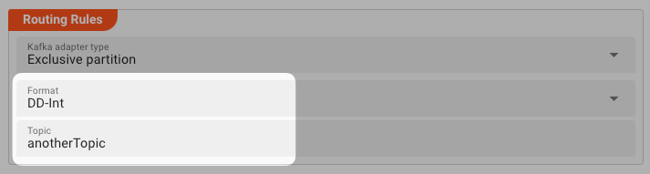

* **`Format`**: Pick a format in which you would like to output the data to Kafka.
  You must have pre-defined the format [here](/docs/category/formats).
  Please note that only the data which is part of the format in the data dictionary which you pick here will be written.
  So if you read the data in format `A`, but then want to output format `B`, then the relevant data must have been mapped from `A` to `B´ in a previous step (e.g. by way of
  the [Mapping Asset](/docs/assets/processors-flow/asset-flow-mapping) or via [Javascript](/docs/assets/processors-flow/asset-flow-javascript)).

* **`Topic`**: Enter the name of the topic you want to exclusively obtain access to.
  You can use ${...} macros to expand variables defined in [environment variables](/docs/assets/resources/asset-resource-environment).

## Sink Settings for Kinesis

AWS Kinesis (Amazon Kinesis) is a cloud-based platform that allows you to easily collect, process, and analyze streaming data in real-time.
It offers a suite of services designed to handle and manage real-time data streams at scale.

### Parallel requests

")

In order to accelerate writing to Kinesis, you can parallelize this process.
Entering `100` here (example) allows layline.io to have 100 messages "in-flight" to Kinesis in parallel.

### Routing Rules

This is where we can define HOW we want to route the data to Kinesis.
By creating granular rules, we can specify that certain data goes to certain targets, based on the message's content.

#### Default behavior

In case any rule cannot match a message, you can define a default behavior of what to do:

")

* **`Discard Message`**: Only discard the current message if the message does not match any rule.

* **`Rollback stream`**: Discard and roll back the complete stream.

#### Managing Routing Rules

Next, you can define individual routing rules for messages which shall be output to Kinesis.
Rules are evaluated in order. The first one takes precedence over the second and so forth.
Use the respective buttons to add or move a new rule in the designated space:

")

**Rule: "NewRule"**

##### Conditions

First you define the conditions under which the individual message should match the rule.

You can pick whether `all` conditions must be fulfilled, `at least one` of the rules must be met, or `none`.

You then go on to enter the individual conditions.
Conditions follow the [Quickscript](/docs/lang-ref/quickscript/quickscript) language.
So you can define pretty complex rules at this point.
You will probably have simple rules most of the time, however.

")

**Conditions**: The message field `message.Detail.Boat.Length` must be greater than `30`, OR `message.Detail.Boat.Weight` must be less than `20000`.

##### Destination

In case the conditions are met, the message is then forwarded to SNS in the format you define.

* **`Format`**: Pick a format in which you would like to output the data to Kinesis.
  You must have pre-defined the format [here](/docs/category/formats).
  Please note that only the data which is part of the format in the data dictionary which you pick here will be written.
  So if you read the data in format `A`, but then want to output format `B`, then the relevant data must have been mapped from `A` tpo `B´ in a previous step (e.g. by way of
  the [Mapping Asset](/docs/assets/processors-flow/asset-flow-mapping) or via [Javascript](/docs/assets/processors-flow/asset-flow-javascript)).

  ")

* **`Kinesis Stream`**: Enter a term (Constant) or a QuickScript (Calculated) which is passed to Kinesis as the stream name to which the data should be written.

  The "stream" parameter in Amazon Kinesis refers to the name of the Kinesis data stream.
  A Kinesis data stream is a category through which you can send and receive real-time streaming data.
  It acts as a durable and ordered log of the data records. The stream parameter is used to identify the stream to which you want to send or receive data.

    * **Constant**: Pick this option to select from Streams which you have defined in an [Kinesis Sink](/docs/assets/sinks/asset-sink-kinesis).
      Select an available stream from the drop-down on the right:

      ")

      Alternatively, simply enter the name of the stream.

    * **Calculated**: Enter a [Quickscript](/docs/lang-ref/quickscript/quickscript) term which evaluates to a SNS topic name.
      You can also use ${...} macros to expand variables defined in [environment variables](/docs/assets/resources/asset-resource-environment).
      Make sure the result is enclosed in quotes as a result to form a valid result string.

      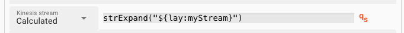


* **`Partition Key`**: Enter a term (Constant) or a QuickScript (Calculated) which is passed to Kinesis as the stream name to which the data should be written.

  In Amazon Kinesis, a "partition key" is a value used to determine the partition in which a data record is stored.
  Each data record sent to a Kinesis data stream is associated with a partition key.
  The partition key is used to evenly distribute the incoming data records across different shards (the units of capacity in a Kinesis stream).

  When choosing a partition key, it is important to consider the nature of the data and how evenly it can be distributed based on the available key values.
  A well-distributed partition key can help to ensure optimal parallel processing and efficient utilization of resources within your Kinesis application.

    * **Constant**: Pick this option to enter the identifier of a Kinesis partition key (a string)-

      ")

    * **Calculated**: Enter a [Quickscript](/docs/lang-ref/quickscript/quickscript) term which evaluates to Kinesis Partition Key.
      You can also use ${...} macros to expand variables defined in [environment variables](/docs/assets/resources/asset-resource-environment).
      Make sure the result is enclosed in quotes as a result to form a valid result string.

      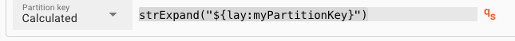

## Sink Settings for SNS

AWS SNS (Simple Notification Service) is a fully managed messaging service provided by Amazon Web Services (AWS).
It allows you to send messages or notifications to a large number of subscribers or endpoints through various protocols such as email, SMS, mobile push notifications, and more.

If you want to output data to AWS SQS, then you need to configure the settings in this section.

### Parallel requests

")

In order to accelerate writing to SNS, you can parallelize this process.
Entering `100` here (example) allows layline.io to have 100 messages "in-flight" to SNS in parallel.

### Routing Rules

This is where we can define HOW we want to route the data to SNS.
By creating granular rules, we can specify that certain data goes to certain targets, based on the message's content.

#### Default behavior

In case any rule cannot match a message, you can define a default behavior of what to do:

")

* **`Discard Message`**: Only discard the current message if the message does not match any rule.

* **`Rollback stream`**: Discard and roll back the complete stream.

#### Managing Routing Rules

Next, you can define individual routing rules for messages which shall be output to SNS.
Rules are evaluated in order. The first one takes precedence over the second and so forth.
Use the respective buttons to add or move a new rule in the designated space:

")

**Rule: "NewRule"**

##### Conditions

First you define the conditions under which the individual message should match the rule.

You can pick whether `all` conditions must be fulfilled, `at least one` of the rules must be met, or `none`.

You then go on to enter the individual conditions.
Conditions follow the [Quickscript](/docs/lang-ref/quickscript/quickscript) language.
So you can define pretty complex rules at this point.
You will probably have simple rules most of the time, however.

")

**Conditions**: The message field `message.Detail.Boat.Length` must be greater than `30`, OR `message.Detail.Boat.Weight` must be less than `20000`.

##### Destination

In case the conditions are met, the message is then forwarded to SNS in the format you define.

* **`Format`**: Pick a format in which you would like to output the data to SNS.
  You must have pre-defined the format [here](/docs/category/formats).
  Please note that only the data which is part of the format in the data dictionary which you pick here will be written.
  So if you read the data in format `A`, but then want to output format `B`, then the relevant data must have been mapped from `A` tpo `B´ in a previous step (e.g. by way of
  the [Mapping Asset](/docs/assets/processors-flow/asset-flow-mapping) or via [Javascript](/docs/assets/processors-flow/asset-flow-javascript)).

  ")

* **`Topic`**: Enter a term (Constant) or a QuickScript (Calculated) which is passed to SNS as the topic name to which the data should be written.

    * **Constant**: Pick this option to select from Topics which you have defined in an [SNS Sink](/docs/assets/sinks/asset-sink-sns).
      Select the available topics from the drop-down on the right:

      ")

      Alternatively, simply enter the name of the topic.

    * **Calculated**: Enter a [Quickscript](/docs/lang-ref/quickscript/quickscript) term which evaluates to a SNS topic name.
      You can also use ${...} macros to expand variables defined in [environment variables](/docs/assets/resources/asset-resource-environment).
      Make sure the result is enclosed in quotes as a result to form a valid result string.

      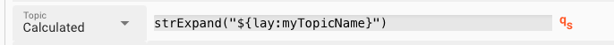

* **`Message Group Id`**: Enter a term (Constant) or a QuickScript (Calculated) which is passed as the "Message Group Id" to SNS.

  ")

  The SNS message group ID is a property that is used when you send messages to an Amazon SNS (Simple Notification Service) FIFO (First-In-First-Out) topic. This is specifically applicable to FIFO
  topics, which have strict ordering of messages.

  The message group ID provides a way to group related messages together, ensuring the correct order of message delivery within the same message group. Messages within the same group are processed
  sequentially, maintaining the order in which they were published.

  When publishing messages to a FIFO topic, you can assign a message group ID to each message. Messages with the same group ID are delivered to subscribers in order. If you do not specify a message
  group ID, the messages are treated as separate unordered messages.

  This can be useful when you have a set of messages that should be processed in a specific order by the subscribers of the FIFO topic. By assigning the same message group ID to those related
  messages, you can ensure that they are processed sequentially and maintain their intended order.

  It's important to note that the message group ID is not required for standard SNS topics since they do not enforce strict ordering of messages.

* **`Deduplication Id`**: Define whether you want to pass an SNS deduplication id on, and if so, how this should be generated.

  The SNS deduplication ID is a property that you can assign to an Amazon SNS (Simple Notification Service) message when publishing it to a topic. This ID helps to prevent duplicate messages from
  being delivered to subscribers.

  When you specify a deduplication ID for a message, SNS stores the ID and compares it with previous deduplication IDs within a defined period (default: 5 minutes). If a message with the same
  deduplication ID is received within that period, SNS considers it a duplicate and does not deliver it again. This prevents subscribers from receiving the same message multiple times.

  The deduplication ID can be any string value, and it is your responsibility to generate and assign unique deduplication IDs for each message you publish. It's usually beneficial to use an ID that
  uniquely identifies the content of the message or use a combination of data attributes from the message.

  By utilizing the deduplication ID, you can ensure that duplicate messages are effectively filtered out and that subscribers receive only unique messages in the topic. This helps in reducing
  unnecessary message processing or actions triggered by duplicate messages.

  ")

  You have the choice of the following options:

    * **`None`**: No deduplication id will be passed on to SNS. Duplicates will not be detected.

    * **`Unique`**: The system will auto-generate a unique id. Duplicates are practically not possible. A deduplication id will be passed on, regardless.

    * **`Content`**: The system will generate a deduplication id based on the content (hash). SNS can detect duplicates.

    * **`Calculated`**: Enter a [Quickscript](/docs/lang-ref/quickscript/quickscript) term which returns a deduplication id.
      This is especially useful if the message already contains a specific field which contains a unique id which you also want to use as the deduplication id.

      ")

* **`Phone number`**: In case messages should be sent via SNS to a phone or email address, enter the respective information here.

  AWS SNS (Simple Notification Service) allows you to send notifications to various endpoints, including email addresses, mobile devices (via SMS), and other AWS services. When you use SNS to send SMS
  notifications, a phone number is required.

  The phone number is necessary because SMS messages are typically sent to mobile devices. To deliver SMS notifications, SNS needs to know the recipient's phone number to direct the message
  appropriately. You provide the phone number as part of the subscription process when subscribing a mobile device to an SNS topic.

  It's worth noting that AWS SNS also supports sending notifications to email addresses and other AWS services without the need for a phone number. In those cases, the appropriate contact information
  or service endpoint would be used instead of phone numbers.

  ")

  You have the choice of the following options:

    * **`None`**: No phone number will be passed.

    * **`Content`**: Enter a fixed phone number or email to be passed to SNS.

    * **`Calculated`**: Enter a [Quickscript](/docs/lang-ref/quickscript/quickscript) term which returns phone number or email address.
      This is especially useful if the message contains a specific field which contains the necessary information.

* **`Subject`**: In case messages should be sent via SNS to a phone or email address, enter the respective information here.

  ")

  The SNS subject property is an optional attribute that you can include when publishing a message to an Amazon SNS (Simple Notification Service) topic. It provides a concise description or summary of
  the message content.

  The subject attribute acts as a title for the notification or message, giving recipients a quick overview of the message's purpose or topic. It is typically a short string that summarizes the main
  idea or subject of the message.

  When subscribers receive notifications from an SNS topic, the subject is often displayed prominently as the message title. Depending on the delivery method (such as email, SMS, or mobile push
  notifications), the subject may be visible in the subject line of an email, the title of a notification, or any other relevant presentation format.

  Setting the subject property is optional, but it can be helpful in providing context to recipients and helping them to quickly understand the message without having to dive into the message's
  content itself.

  Including a meaningful subject can make notifications more understandable, improved readability, and improve user experience in consuming the message.

  You have the choice of the following options:

    * **`Constant`**: Enter a fixed subject identifier. Otherwise leave empty.

    * **`Calculated`**: Enter a [Quickscript](/docs/lang-ref/quickscript/quickscript) term which returns a subject string.
      This is especially useful if the message contains a specific field which contains the necessary information.

* **`Attributes`**:

  In Amazon SNS (Simple Notification Service), attributes are additional metadata or properties that can be attached to a message when publishing it to an SNS topic. These attributes provide extra
  information about the message or control certain behaviors related to message delivery.

  SNS supports two types of message attributes:

    1. Message-level attributes: These attributes are attached to the entire message. They apply to the message as a whole and can include metadata or properties relevant to the message as a unit.
       Message-level attributes have a key-value format and can be of different data types, such as string, number, or binary.

    2. Message-level structure attributes: These attributes allow you to attach structured data to your message using terms and structured values. Structured attributes can contain multiple nested
       key-value pairs, enabling you to organize and include more detailed data within the message.

  Attributes can be used to convey additional information about the message or to control various aspects of message delivery, such as message filtering or encryption. Subscribers can access these
  attributes when consuming the message, allowing them to process the message according to its metadata or apply specific logic based on the attributes.

  When publishing messages to an SNS topic, you can include any desired attributes as part of the message. This flexibility in attaching attributes enhances the versatility and suitability of SNS for
  various use cases where additional metadata or control is required.

  You can enter any number of additional attributes in the respective table:

  ")

  For each attribute you have to define

    * **`Name`**: Enter a unique attribute name. Avoid whitespaces.
    * **`Type`**: Pick a type from `String`, `Number`, or `Binary`. The binary type is useful in the context of calculated content.
    * **`Mode`**: Pick `Constant` for a fixed value, or `Calculated` for a value derived from a QuickScript term. This can include information retrieved from the current message.
    * **`Value`**: The value depending on what you picked in `Mode`.

## Sink Settings for SQS

AWS SQS (Simple Queue Service) is a fully managed message queuing service provided by Amazon Web Services (AWS).
It enables you to decouple distributed systems and components by allowing messages to be sent and received asynchronously between applications or microservices.
It is often compared to Kafka.

If you want to output data to AWS SNS, then you need to configure the settings in this section.

### Parallel requests

")

In order to accelerate writing to SQS, you can parallelize this process.
Entering `100` here (example) allows layline.io to have 100 messages "in-flight" to SQS in parallel.

### Routing Rules

This is where we can define HOW we want to route the data to SQS.
By creating granular rules, we can specify that certain data goes to certain targets, based on the message's content.

#### Default behavior

In case any rule cannot match a message, you can define a default behavior of what to do:

")

* **`Discard Message`**: Only discard the current message if the message does not match any rule.

* **`Rollback stream`**: Discard and roll back the complete stream.

#### Managing Routing Rules

Next, you can define individual routing rules for messages which shall be output to SQS.
Rules are evaluated in order. The first one takes precedence over the second and so forth.
Use the respective buttons to add or move a new rule in the designated space:

")

**Rule: "NewRule"**

##### Conditions

First you define the conditions under which the individual message should match the rule.

You can pick whether `all` conditions must be fulfilled, `at least one` of the rules must be met, or `none`.

You then go on to enter the individual conditions.
Conditions follow the [Quickscript](/docs/lang-ref/quickscript/quickscript) language.
So you can define pretty complex rules at this point.
You will probably have simple rules most of the time, however.

")

**Conditions**: The message field `message.Detail.Boat.Length` must be greater than `30`, OR `message.Detail.Boat.Weight` must be less than `20000`.

##### Destination

In case the conditions are met, the message is then forwarded to SQS in the format you define.

* **`Format`**: Pick a format in which you would like to output the data to SQS.
  You must have pre-defined the format [here](/docs/category/formats).
  Please note that only the data which is part of the format in the data dictionary which you pick here will be written.
  So if you read the data in format `A`, but then want to output format `B`, then the relevant data must have been mapped from `A` tpo `B´ in a previous step (e.g. by way of
  the [Mapping Asset](/docs/assets/processors-flow/asset-flow-mapping) or via [Javascript](/docs/assets/processors-flow/asset-flow-javascript)).

  ")

* **`Queue`**: Enter a term (Constant) or a QuickScript (Calculated) which is passed to SQS as the queue name to which the data should be written.

    * **Constant**: Pick this option to select from Queues which you have defined in an [SQS Sink](/docs/assets/sinks/asset-sink-sqs).
      Select the available Queues from the drop-down on the right:

      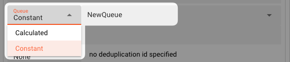

      Alternatively, simply enter the name of the topic.

    * **Calculated**: Enter a [Quickscript](/docs/lang-ref/quickscript/quickscript) term which evaluates to a SNS topic name.
      You can also use ${...} macros to expand variables defined in [environment variables](/docs/assets/resources/asset-resource-environment).
      Make sure the result is enclosed in quotes as a result to form a valid result string.

      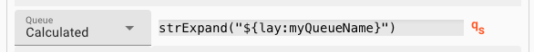

* **`Message Group Id`**: Enter a term (Constant) or a QuickScript (Calculated) which is passed as the "Message Group Id" to SNS.

  ")

  In Amazon SQS (Simple Queue Service), the message group ID is a property used when working with FIFO (First-In-First-Out) queues. FIFO queues ensure strict ordering of messages to maintain the order
  in which they are sent.

  The message group ID allows you to group related messages together within the same FIFO queue. Messages with the same message group ID are always processed one by one and in a strict order. However,
  it's important to note that messages with different message group IDs can be processed in parallel, even if they are in the same FIFO queue.

  By assigning a message group ID to a set of related messages, you can ensure that they are processed sequentially and maintain their intended order.

  For example, you might have a group of messages related to processing a particular order. By assigning the same message group ID to these messages, SQS guarantees that they will be processed in
  order, allowing you to maintain consistency and avoid race conditions in the processing logic.

  The message group ID is a string value that you set when sending messages to a FIFO queue using the SendMessageBatch or SendMessage API.

* **`Deduplication Id`**: Define whether you want to pass an SQS deduplication id on, and if so, how this should be generated.

  In Amazon SQS (Simple Queue Service), the deduplication ID is a property used to prevent duplicate messages from being delivered to a FIFO (First-In-First-Out) queue.

  Each message sent to a FIFO queue must have a unique deduplication ID. When a message with a particular deduplication ID is added to the queue, SQS checks whether there is an existing message with
  the
  same deduplication ID within a specific time window (5 minutes). If a message with the same deduplication ID is found within that window, SQS considers it a duplicate and discards the new message,
  ensuring only unique messages are delivered.

  Deduplication IDs can be used to ensure idempotent message processing, where the same message can be sent multiple times without causing side effects or duplicative actions. By assigning a unique
  deduplication ID to each message, you can guarantee that only the first occurrence of a message is processed, preventing duplicates from affecting the workflow.

  You can set the deduplication ID when sending a message to a FIFO queue using the SendMessage or SendMessageBatch API in SQS. It's up to the sender to generate or assign a unique deduplication ID
  for
  each message.

  ")

  You have the choice of the following options:

    * **`None`**: No deduplication id will be passed on to SQS. Duplicates will not be detected.

    * **`Unique`**: The system will auto-generate a unique id. Duplicates are practically not possible. A deduplication id will be passed on, regardless.

    * **`Content`**: The system will generate a deduplication id based on the content (hash). SQS can detect duplicates.

    * **`Calculated`**: Enter a [Quickscript](/docs/lang-ref/quickscript/quickscript) term which returns a deduplication id.
      This is especially useful if the message already contains a specific field which contains a unique id which you also want to use as the deduplication id.

      ")

* **`Attributes`**:

  In Amazon SQS (Simple Queue Service), message attributes are properties that provide additional metadata or information about a message in a queue. They offer a way to include structured data
  alongside the message content, enabling more advanced processing or customization of how messages are handled.

  The purpose of attributes in SQS is to:

    1. Provide Custom Metadata: Message attributes can hold custom metadata relevant to a message, such as message IDs, timestamps, sender information, or any other contextual data. These attributes
       can help in enhancing the understanding and processing of messages.

    2. Control Message Handling: Attributes can influence how messages are handled by SQS. For example, the Visibility Timeout attribute determines how long a message remains invisible to other
       consumers once a consumer starts processing it. Redrive Policy attributes control how dead-letter queues are used for failed messages.

    3. Enable Message Filtering: Message attributes can be used to define message filtering policies. Subscribers can subscribe to a specific subset of messages based on attribute values, filtering
       out unwanted or unrelated messages and only receiving the ones that match certain criteria.

    4. Facilitate Delayed Queuing: Attributes like the Delay Seconds attribute allow you to specify a delay for message delivery. Messages with a delay are retained in the queue but are not
       immediately available for consumption, effectively introducing a delay before they become visible.

  By utilizing attributes, SQS provides flexibility and extensibility in working with messages, enabling metadata organization, control over message handling,

  You can enter any number of additional attributes in the respective table:

  ")

  For each attribute you have to define

    * **`Name`**: Enter a unique attribute name. Avoid whitespaces.
    * **`Type`**: Pick a type from `String`, `Number`, or `Binary`. The binary type is useful in the context of calculated content.
    * **`Mode`**: Pick `Constant` for a fixed value, or `Calculated` for a value derived from a QuickScript term. This can include information retrieved from the current message.
    * **`Value`**: The value depending on what you picked in `Mode`.

## Failure Handling

<FailureHandling></FailureHandling>

---

<WipDisclaimer></WipDisclaimer>
