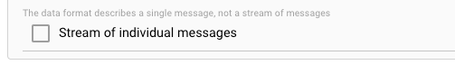

import InputPorts from '/docs/snippets/assets/_input-ports-single.md';
import WipDisclaimer from '/docs/snippets/common/_wip-disclaimer.md';
import FailureHandling from '/docs/snippets/assets/_failure-handling-output.md';

# Output Stream

## Purpose

The Output Stream Asset acts as a final endpoint of a Workflow.
You end a Workflow with an Output Stream Asset if you want to output to one of the Sinks mentioned in the [Prerequisites](#prerequisites) list below.

This Asset is used within a Workflow definition.

")

## Prerequisites

You need:

**A defined Format**

* [Formats](/docs/category/formats)

**A Stream Sink:**

* [Sink Kafka](/docs/assets/sinks/asset-sink-file)
* [Sink FTP](/docs/assets/sinks/asset-sink-ftp)
* [Sink S3](/docs/assets/sinks/asset-sink-s3)
* [Sink SMB](/docs/assets/sinks/asset-sink-smb)
* [Sink TCP](/docs/assets/sinks/asset-sink-tcp)
* [Sink WebDav](/docs/assets/sinks/asset-sink-webdav)
* [Sink WebSocket](/docs/assets/sinks/asset-sink-websocket)

### Name & Description

")

**`Name`** : Name of the Asset. Spaces are not allowed in the name.

**`Description`** : Enter a description.

The **`Asset Usage`** box shows how many times this Asset is used and which parts are referencing it.
Click to expand and then click to follow, if any.

### Input Ports

<InputPorts></InputPorts>

### Format

Data output by this Asset must be written in a sepecific format.

")

If you have defined such a format, then you can select it from the list of available formats by clicking on the button next to the field.

### Sink

You need to assign a [Sink](#prerequisites) which defines the physical output of the data.

")

Select the Sink by clicking on the button next to the field (1).

### Other Settings

#### Compression Mode

")

In case your outgoing stream data shall be written in compressed format, you can define the algorithm to be used for decompression here.
For uncompressed data, please leave the setting on `None`.

#### Stream of individual messages

Check this box, if the data format does only describe a single message, which is each message written should be considered a complete output and final output.

Explainer:
Any data format described and selected in [Format](#format) above, can be simply, or complex.
A complex format, for example, could require the data to be sent to be only complete, if it contains a header record, one to many detail records, and a trailer record.
To the contrary, a simple format could define only the structure of a songle message.

If we assume that we have selected a complex format like above as the output, then the system will observe and enforce, that the written output does comply with the format between starting and
stopping a stream.
I.e. it mus contain a header, one or many details, and a trailer record (example).
If this is not the case, then an error will be generated.

If we on the other hand have a simple format which in structure only describes a single message structure, then you may want the system to write individual messages as final transactions for eveery
single message.
In this case, and only in this case, you can check this box.
The default is `off`. If you are unsure about this, then just leave the default.

## Failure Handling

<FailureHandling></FailureHandling>

---

<WipDisclaimer></WipDisclaimer>
