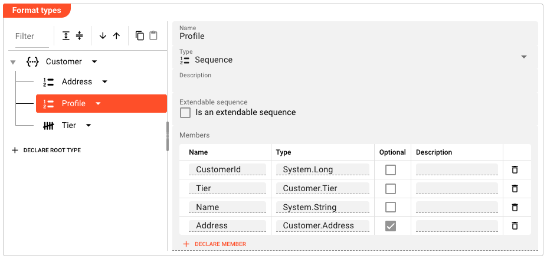

import WipDisclaimer from '../../snippets/common/_wip-disclaimer.md'

# Data Dictionary Updates

## Purpose

The **Data Dictionary** is the global type system that layline.io maintains internally — a superset of all format definitions in a Project. The **Data Dictionary Updates** Resource lets you further extend this global dictionary with custom type definitions beyond what individual Format Assets provide.

Use this Resource when you need to:

- Declare additional data structures that don't belong to any single input/output format
- Share common types across multiple Workflows and Formats
- Define types assembled at runtime from data processed through the system

For full details of supported element types (Namespace, Sequence, Choice, Enumeration, Array, Map), see the [Data Dictionary Format](../formats/03-asset-format-data-dictionary.md) documentation.

## Configuration

### Name & Description

**`Name`**: Name of the Asset. Spaces are not allowed in the name.

**`Description`**: Enter a description.

### Format Types

The Format Types section provides the Data Dictionary tree editor — the same component used by the [Data Dictionary Format](../formats/03-asset-format-data-dictionary.md). It allows you to declare, organize, and maintain a hierarchy of custom type definitions.

#### Tree Navigation

Each node represents a declared type. Click a node to select it and view or edit its details in the right panel.

#### Context Menu

Right-click a node (or click the dropdown button) to access:

- **Add sibling** — adds a new type at the same level as the selected node
- **Add child** — adds a child type beneath the selected node (only available for types that support children, e.g. Namespace, Sequence, Choice)
- **Delete** — removes the type from this Asset

Deleted types can be reset to their parent definition using the reset button that appears on the node.

#### Entity Detail Panel

When a node is selected, the right panel shows its fields. The available fields depend on the selected type:

**Common fields (all types):**

**`Name`**: The type's name. Must be unique within the same parent.

**`Type`**: The element type. Dropdown options include: `Namespace`, `Sequence`, `Choice`, `Enumeration`, `Array`, `Map`. Changing the type clears all previously declared members.

**`Description`**: Free-text description of the type.

**Sequence / Choice-specific:**

- **Is an extendable sequence** — when checked, additional members may be added to this sequence at runtime beyond what is statically defined
- **Members table** — columns: Name, Type (system type or another declared type), Optional (checkbox), Description. Each row has a delete button. Use **+ Declare Member** to add new rows.

**Enumeration-specific:**

- **Members table** — columns: Name, Value (integer), Description. Each row has a delete button. Use **+ Declare Element** to add new rows.

**Array / Map-specific:**

- **Contained type** — a single type selector for all items contained in the array or map

#### Root Types

Click **+ DECLARE ROOT TYPE** at the bottom of the tree to add a new top-level type declaration. Root types are not scoped under a parent Namespace.

## Example

The following example defines a `Customer` namespace with shared types that can be referenced by any Format or Workflow in the Project:

```
Customer (Namespace)
├── Profile (Sequence)
│   ├── CustomerId  (System.Long)
│   ├── Tier        (Customer.Tier)
│   ├── Name        (System.String)
│   └── Address     (Customer.Address)  [optional]
├── Address (Sequence)
│   ├── Street  (System.String)
│   ├── City    (System.String)
│   ├── Zip     (System.Integer)
│   └── Country (System.String)
└── Tier (Enumeration)
    ├── Standard   (1)
    ├── Premium    (2)
    └── Enterprise  (3)
```

Once defined, any asset in the Project can reference `Customer.Profile.CustomerId`, `Customer.Tier.Standard`, or `Customer.Address.Country` when mapping or transforming data.

<div className="frame">



</div>

## Behavior

- Types declared in this Resource are merged into the global Data Dictionary at Project startup
- Types with identical names defined in multiple Format Assets or this Resource are merged; conflicting definitions produce a runtime error
- Inheritance is supported: a type can be overridden at a child Asset level and reset to the parent definition at any time
- The clipboard supports copy and paste of individual entity sub-trees within or across Data Dictionary Assets

## See Also

- [Data Dictionary Format](../formats/03-asset-format-data-dictionary.md) — full reference for all element types, encoding configuration, and examples
- [Data Dictionary Concept](../../02-concept/03-data-dictionary) — architectural overview of how layline.io maintains and uses the global Data Dictionary

---

<WipDisclaimer></WipDisclaimer>
