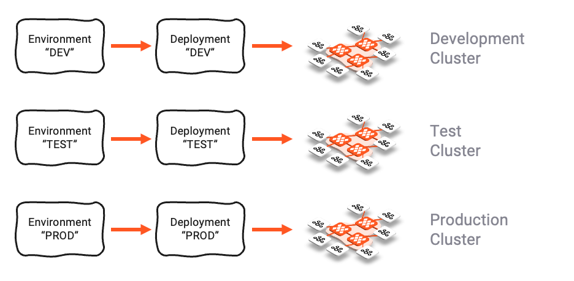
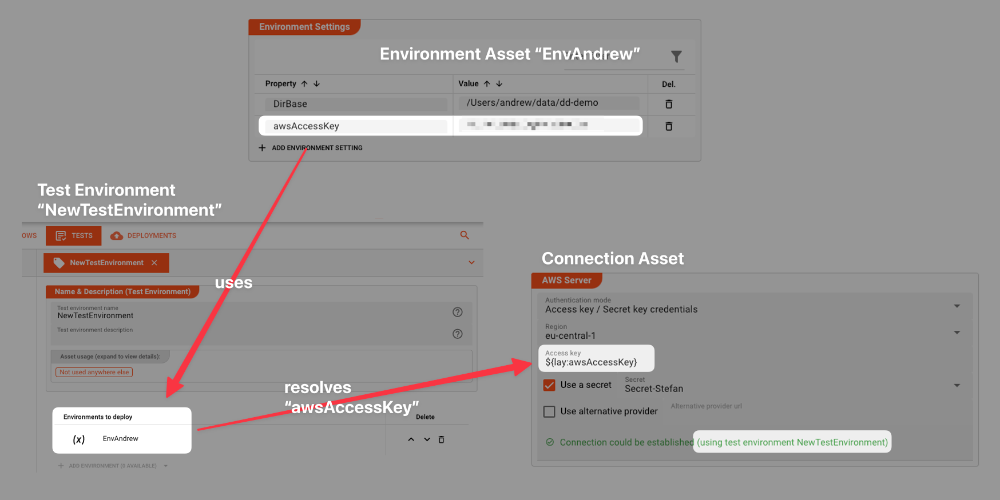

import WipDisclaimer from '/docs/snippets/common/_wip-disclaimer.md';

# Environment

## Purpose

A Project within layline.io may have to be tested and run in varying environments.
It would be quite common to run a Project within a development environment first, then in a staging and test environment, and finally in production.

While the logic itself would always be the same in each environment, the physical environment parameters would differ.
I.e. file directories, IP-addresses, database paths, any many more parameters are usually different between these different deployment targets.

It is therefore important that these physical environment settings are separate from the logical configuration, and only combined within the individual target system to from a runnable configuration.

## Configuring and using environment variables

The Environment Asset allows you to define a number of key-value pair tuples. 

Example:

")

In the table the key is on the left (Property) and the associated value on the right of the table.
Enter as many key-value-pairs as necessary.

These environment variables can then be used in the configuration like so:
 
")

To learn more about how to use environment variables within layline.io settings, please read [here](/docs/lang-ref/macros#lay).

## The Role of Environment Assets

### For Deployment

In case you have configured Environment Variables and are using them within configuration settings of other Assets (that's the idea, anyway), 
then you will have to make sure, that the Deployment knows which Environment Variables it has to use, in order to replace the variables with the actual values which you have configured.

You therefore need to add one or more Environment Assets to the Deployment Configuration, so that it knows what values to use when replacing the environment variables of the sort `${lay:dbUrl}`.

And because you have a

1. A Development Environment on your laptop
2. A Testing Environment on a Test Cluster, and
3. A Production Environment

you will likely have three different Environment Assets, each of which holds the same keys, but with different values to serve each of the distinct environments: 

### For Testing

Some aspects of your Project are "testable" without having to deploy it to a Reactive Cluster. 
An example is an AWS Connection Asset in which the access key is configured to be an environment variable `awsAccessKey`.

- We have an Environment Asset "EnvAndrew".
- In that Asset we have an Environment Variable `awsAccessKey`.
- We have set up a Test Environment "NewTestEnvironment". Assigned to this is the Environment Asset "EnvAndrew".
- We create an AWS Connection Asset in which we use the Environment Variable through a macro `${lay:awsAccessKey}`.
- Because the Project in the UI uses the Test Environment, and the Test Environment uses the Environment Asset "EnvAndrew", the AWS Connection Asset knows how to resolve the macro at configuration time, and thus can test the connection.

Hope this makes sense.

---

<WipDisclaimer></WipDisclaimer>
