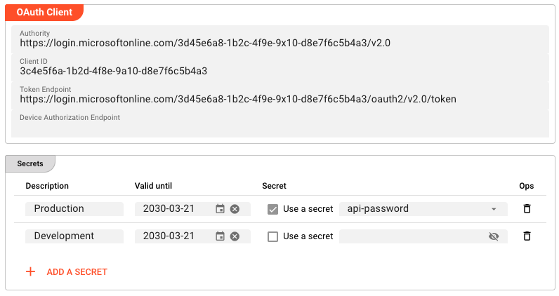

import WipDisclaimer from '../../snippets/common/_wip-disclaimer.md'

# OAuthClient

## Purpose

The **OAuthClient** Resource stores OAuth 2.0 client credentials and client secrets that are used by Connections and Targets requiring OAuth authentication. When the Reactive Engine starts, this Resource registers its credentials with the engine's internal Security Storage, making them available to any component that needs to authenticate via OAuth.

Connections that consume this Resource include Microsoft Graph, Google Cloud, and Email.

Use this Resource to:

- Store OAuth client credentials (authority, client ID, token endpoint) for a given identity provider
- Manage multiple client secrets for the same OAuth client with independent validity periods
- Share OAuth credentials across Environments using inheritance

## Configuration

### Name & Description

**`Name`**: Name of the Asset. Spaces are not allowed in the name.

**`Description`**: Enter a description.

### OAuth Client

**`Authority`** — the base URL of the OAuth authorization server. For example, for Microsoft Entra ID this would be `https://login.microsoftonline.com/{tenant-id}/v2.0`. Required.

**`Client ID`** — the OAuth client identifier assigned by the authorization server. Required.

**`Token Endpoint`** — the full URL of the token endpoint (e.g. `https://login.microsoftonline.com/{tenant-id}/oauth2/v2.0/token`). Required.

**`Device Authorization Endpoint`** — the full URL of the device authorization endpoint. Optional. Required only for [Device Code flow](https://datatracker.ietf.org/doc/html/rfc8628) authentication.

### Secrets

The Secrets table stores one or more client secrets associated with this OAuth client. Each row has four columns:

**`Description`** — a human-readable label identifying the secret (e.g. `Production`).

**`Valid until`** — an optional expiry date. If set, the secret is considered invalid after this date.

**`Secret`** — the secret value. Enable **Use a secret** to reference a value from [Secret Storage](../resources/asset-resource-secret), or disable it to enter a raw secret value directly.

**`Ops`** — remove this secret entry.

## Behavior

- All fields support inheritance: a child Asset can override individual values while inheriting the rest from its parent
- If `Valid until` is left empty, the secret does not expire
- The Resource validates that `Authority`, `Client ID`, and `Token Endpoint` are non-blank at configuration export time; missing values produce build errors
- At engine startup, credentials are registered with Security Storage — connections and targets reference this Resource by name to retrieve them
- Multiple secrets can coexist; the connection or target selects the appropriate one based on its configuration

## Example

The following configures an OAuthClient for a Microsoft Entra ID application:

**OAuth Client:**

| Field | Value |
|-------|-------|
| Authority | `https://login.microsoftonline.com/3d45e6a8-1b2c-4f9e-9x10-d8e7f6c5b4a3/v2.0` |
| Client ID | `3c4e5f6a-1b2d-4f8e-9a10-d8e7f6c5b4a3` |
| Token Endpoint | `https://login.microsoftonline.com/3d45e6a8-1b2c-4f9e-9x10-d8e7f6c5b4a3/oauth2/v2.0/token` |
| Device Authorization Endpoint | _(empty — not used)_ |

**Secrets:**

| Description | Valid until | Secret |
|-------------|-------------|--------|
| Production | `2030-03-21` | Use a secret: `api-password` |
| Development | `2030-03-21` | Raw value (masked in UI) |

The Production secret references a key stored in [Secret Storage](../resources/asset-resource-secret), keeping credentials out of the Project configuration file. The Development secret uses a raw value for convenience during development. Both secrets have a validity period set to March 2030.

## See Also

- [Secret](../resources/asset-resource-secret) — for storing secret values in Secret Storage and referencing them in this Resource
- [Microsoft Graph Connection](../connections/asset-connection-ms-graph) — uses OAuthClient for authentication
- [Google Cloud Connection](../connections/asset-connection-google-cloud) — uses OAuthClient for authentication
- [Secret Management (Concept)](../../concept/advanced/secret-management) — overview of how layline.io manages credentials

---

<WipDisclaimer></WipDisclaimer>
