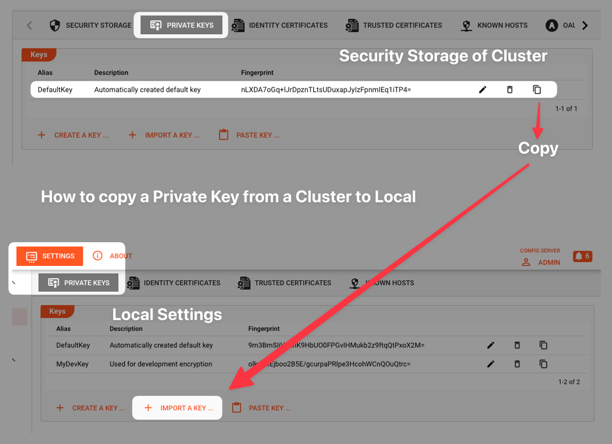

import WipDisclaimer from '/docs/snippets/common/_wip-disclaimer.md';

# Secret

## Purpose

When configuring a Project, it is common to require passwords, keys and other information which may be deemed confidential.
If you are working on a Project your own, or in a very trusted environment, you probably can put the passwords and other confidential info right into your configuration in clear text.
This is, however, rarely the case.
Most of the time, you work in a team with different levels of trust.
And it is likely that only a few people know the confidential data such as passwords, etc.
Also, envision that everybody may know about passwords, etc. in the development environment (which could just be your laptop),
as opposed to only two people knowing about the passwords and other confidential data for the production environment.

So we really have two requirements here in regard to handling confidential information:

1. **Encrypted Secrets:**

   Be able to store confidential information within a configuration without everyone being able to see it in clear text.
   This includes encrypting the confidential data in the files which store the configuration, so that it cannot be exploited by hacking the config files, etc.

2. **Different Secrets for different target environments:**

   Be able to define different Secret Environments, for different target environments such as development, testing, and production.

What's needed is very similar to how we are using variables from [Environment Assets](/docs/assets/resources/asset-resource-environment).
There we reference Environment Variables with [macros](/docs/lang-ref/macros#lay).
It works the same way with Secrets, only the [prefix (sec)](/docs/lang-ref/macros#sec) is different.

## Configuration

### Name & Description

")

**`Name`** : Name of the Asset. Spaces are not allowed in the name.

**`Description`** : Enter a description.

### Secrets

#### Fundamentals / Encryption Key

layline.io features a public/private-key encryption mechanism which ensures that secrets can only be decrypted by the system which holds the private key.

In this system, the Configuration Server as well as each Reactive Engine Cluster can have zero or more public/private-key-pairs configured.
For detailed information about this, please read through the [Security Storage](/docs/concept/advanced/secret-management#concept-in-laylineio) documentation first, and then return here.

In order to create Secrets, you will first have to select with which public key you want to encrypt the secrets.

")

A dialog will open, showing you the Configuration Server Keys as well as the known Reactive Clusters.
You will only see those Reactive Clusters, which have either been defined in [global cluster settings](/docs/concept/settings/settings-cluster), or within the currently opened Project

")

The default selection would be the `Configuration Server`.
If it is selected, you will see all Keys that have been configured for it on the right.

**What key to pick:**

It is important to understand, that a token encrypted with an encryption key can then only be decrypted by the system which holds the corresponding private key.
So if we truly want to keep Secrets confidential, then

1. the Private Key (PK) to encrypt the Secrets, should only be known in the target environment (e.g., development / testing / production cluster).
2. the Secrets do not need to be known by anyone working with the Project in clear text.

So let's revisit the example where we have a development, testing and production environment.
In our example, each environment has different ancillary systems it needs to connect to, requiring different usernames, passwords and other potentially sensitive information.

")

In the image above, we have defined a Secret Asset "DEV" (1).
This Asset contains Secrets for the Development Cluster.
Because the Development Cluster has its own ancillary testing systems (4, 5, and 6) and its own Private Key (PK), we want to use that PK to encrypt the secrets (2).

When you deploy the whole Project, together with the Secret Asset "DEV" (3),
then the development cluster is able to decrypt the Secrets because they were encrypted with the PK of the DEV-Cluster in the first place.

For the Production Environment, we create a different Secrets Asset "PROD" which holds the same Secrets (same Secret Keys), but encrypted with the encryption key of the Production Cluster.

So within the Project we have separate Secrete Assets for development, testing, and production clusters.
They all share the same Keys, but the values (Secrets) differ because they were each encrypted using different encryption keys.

This should answer the question about what key to pick for encryption in each specific Secret Asset.

:::note Login may be required
When you try to access keys from a Cluster, you may have to provide your login credentials for that Cluster, prior to being able to access the keys:

")
:::

Once you have selected an Encryption Key, its name and fingerprint will be displayed:

")

#### Adding Secrets

Once an Encryption Key has been selected, you can start adding Secrets.
Secrets are entered as key-value-pairs (1), whereas the key describes the name of the Secret, and the value is the actual Secret (e.g. password et al.) to be encrypted.

")

Use the "eye" icon (2) to show/hide entered secret values.

In our example above the private key is accessible by the UI.
This is depicted by the green open lock (3) and the phrase "Private key is known, decryption is possible".

This allows you to reveal the Secrets using the "eye" icon (2) next to the secret value.

"Known" in this context means, that the Configuration Server from which you started the Web-UI also knows the private key which was used to encrypt the Secrets.
You can check this at "Settings -> Security Storage -> Private Keys".

")

If the fingerprint which was used to perform the encryption is listed here, then you will be able to decrypt the Secrets in the UI.

If it is not listed here, then decryption in the UI will not be possible.
The lock icon in the UI will be closed and red (1):

")

You can, however, overwrite the Secrets with new secret values by clicking on the respective field value.
Encryption can be performed, because the public key is available.

#### Using Secrets

These Secrets can then be used in the configuration like so:

")

To learn more about how to use environment variables within layline.io settings, please read [here](/docs/lang-ref/macros#sec).

#### Changing Encryption Key

It is possible to change the encryption key, even if you have already added Secrets.
It is important to understand, however, that Secrets can only be re-encrypted using the new encryption key, if the current private key is known.

```mermaid
flowchart TD
    A[Change encryption key]
    A --> B{{New Private Key is known in local Settings ?}}
    B -->|Yes| D[Keys and Secrets can be migrated]
    B -->|No| E[Only keys can be migrated.<br>Secrets cannot be migrated.]  
 ```

If you cannot find the fingerprint of the encryption key which was used to encrypt the Secrets, in your local Settings, then you cannot decrypt the Secrets,
You may, however, be able to copy the Private Key from the source, e.g. a Cluster, into your local Settings.
It will then be known locally and the Secrets can be decrypted in the UI.



:::caution Must have sufficient rights
You must have sufficient rights to copy Private Keys. Otherwise, copy will not be possible.
:::

:::note Local Settings Key Storage
Keys stored in local Settings, are stored on the Configuration Server, not in the Web-Browser or a Cookie.
:::

### Renaming Secrets

:::caution Renaming Secrets
If you decide to rename a Secret key, the references to it will not be automatically renamed.
So, if you rename, but do not rename the references, then the link between them will be lost.
You will also get an error when trying to deploy a Project and Secrets cannot be resolved.

Use the `Search` functionality to find all references to a Secret.
:::

---

<WipDisclaimer></WipDisclaimer>
