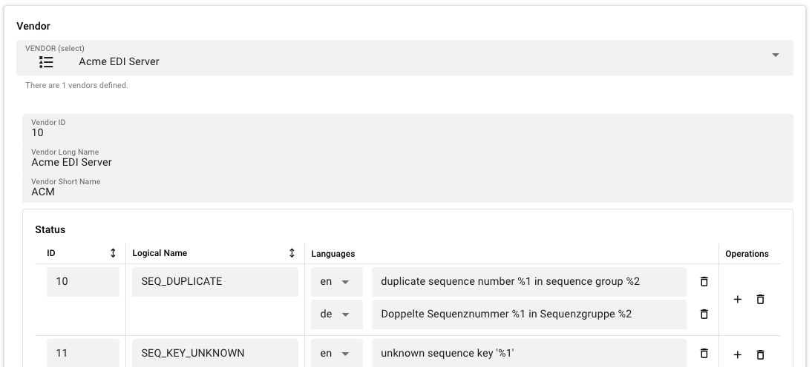

import WipDisclaimer from '../../snippets/common/_wip-disclaimer.md'

# StatusDefinition

## Purpose

The **StatusDefinition** Resource defines a set of **vendors**, each with a collection of named **status codes** and their associated **multilingual message texts**. When the Reactive Engine starts, this Resource registers all of its contents with the engine's central **Status Registry** singleton.

The Status Registry acts as a lookup service used throughout the engine: any component — including your own JavaScript or Python scripts — can call `Status.create(vendor, statusCode, ...params)` to build a Status object, and then read `status.message` to get the human-readable message with all placeholders substituted.

This means status codes from external systems (EDI servers, HTTP APIs, database engines, etc.) can be mapped to clear, localized descriptions rather than raw numeric codes, and your scripts can participate in this system.

Use this Resource to:

- Define custom status codes for an external system or protocol you are integrating with
- Provide multilingual translations for status messages (e.g., English, German, French)
- Organize status codes under logical vendor groupings
- Enable scripts to produce rich, localized status messages with dynamic parameters

## How It Works

### The Status Registry

The Status Registry is a JVM-wide singleton (`StatusRegistry.getInstance()`) initialized at engine startup:

1. The built-in `LAY` vendor (vendor ID `1`) is registered first with layline.io's built-in status messages
2. Each StatusDefinition Resource then adds its vendors and status codes on top
3. Throughout the engine, code calls `StatusRegistry.getMessage(vendorId, code, language)` to look up the text for a given status

### Vendor IDs

Vendor IDs are numeric identifiers. The range `1–9` is reserved:

| ID | Vendor |
|----|--------|
| 1 | `LAY` (layline.io built-in) |
| 10+ | Available for custom vendors |

Vendor IDs must be **10 or greater** for custom vendors. Vendor short names cannot be `LAY` (reserved).

### Language Codes

Language codes follow **ISO 639-1** (e.g., `en`, `de`, `fr`, `ja`). The registry searches through all configured language tables in order when resolving a message, returning the first match. This allows fallback chains (e.g., if a message is not available in German, fall back to English).

## Configuration

### Name & Description

**`Name`**: Name of the Asset. Spaces are not allowed in the name.

**`Description`**: Enter a description.

### Vendors and Statuses

This section contains two nested editors: the **Vendor selector** at the top, and the **Status table** below the selected vendor.

#### Vendor Selector

A dropdown listing all vendors defined in this Asset. Select a vendor to edit its details and its status codes. The dropdown also offers **Add a new vendor** as the first option.

#### Vendor Fields

When a vendor is selected, the following fields appear:

**`Vendor ID`** — a numeric identifier for the vendor. Must be `10` or greater for custom vendors. Must be unique within the Asset. Auto-assigned to the next available ID when created.

**`Vendor Long Name`** — the full name of the vendor (e.g., `Acme EDI Server`).

**`Vendor Short Name`** — a short identifier for the vendor (e.g., `ACM`). Cannot be `LAY` (reserved). Must be unique within the Asset.

#### Status Table

For the selected vendor, a table lists all defined status codes. Each row has four columns:

**`ID`** — the numeric status code. Must be a positive integer. Assigned automatically for new entries; editable for custom entries.

**`Logical Name`** — a human-readable identifier for the status (e.g., `CONNECTION_TIMEOUT`, `AUTH_FAILED`). This is the key used to look up the message at runtime alongside the vendor ID and language.

**`Languages`** — the multilingual message text entries. Each entry has a language code (ISO 639-1) and a corresponding translated message string. Message text may contain positional placeholders — see [Using Status Codes in Scripts](#using-status-codes-in-scripts) below. Click the **+** button on a status row to add a language entry.

**`Operations`** — add a language entry to this status, or delete the status entirely.

## Behavior

- Both vendors and status codes support inheritance: a child Asset can override or extend its parent's definitions
- Deleting a vendor also deletes all status codes associated with it
- Inherited vendors and status codes show a reset-to-parent button that restores the parent's definition
- At engine startup, all vendors and status codes from all StatusDefinition Resources are registered with the Status Registry
- The Status Registry resolves messages by searching language tables in order — if a message is not found in the requested language, the first available translation is returned
- Duplicate Vendor IDs, duplicate short names, and duplicate status IDs within the same vendor are validated and produce errors

## Example

A project integrates with an external EDI server called **Acme EDI**. The EDI server communicates status codes as numeric values — the integration layer needs to map these to human-readable messages in English and German.

**Vendor definition:**

| Field | Value |
|-------|-------|
| Vendor ID | `10` |
| Vendor Long Name | `Acme EDI Server` |
| Vendor Short Name | `ACM` |

**Status definitions for vendor `ACM`:**

| ID | Logical Name | Languages |
|----|-------------|-----------|
| `10` | `SEQ_DUPLICATE` | `en` → `duplicate sequence number %1 in sequence group %2`; `de` → `Doppelte Sequenznummer %1 in Sequenzgruppe %2` |
| `11` | `SEQ_KEY_UNKNOWN` | `en` → `unknown sequence key '%1'`; `de` → `Unbekannter Sequenzschlüssel '%1'` |

<div className="frame">



</div>

## Using Status Codes in Scripts

Status codes defined in a StatusDefinition Resource can be used in JavaScript and Python scripts to produce rich, localized status messages with dynamic parameters.

### Placeholder Syntax

Message texts may contain positional placeholders: `%1`, `%2`, `%3`, etc. When you create a Status with `Status.create()`, pass the values as arguments — they replace the placeholders in order.

Supported formats:
- `%1`, `%2`, etc. — positional parameter (1-indexed)
- `%{1}`, `%{2}`, etc. — same as above, with braces
- `%%` — escaped percent sign (renders as a literal `%`)

### JavaScript

```javascript
// Look up the ACM vendor by short name
const ACM = Status.getVendorByShortName('ACM');

// Create a Status with the SEQ_DUPLICATE code and two parameters
const status = Status.create(ACM, 'SEQ_DUPLICATE', '42', 'orders');

// Read the expanded message
const msg = status.message;
// Result: "duplicate sequence number 42 in sequence group orders"

// Access individual parts
const code = status.code;        // 'SEQ_DUPLICATE'
const vendorId = status.vendorId; // 10
const params = status.parameters; // ['42', 'orders']
```

### Python

```python
# Look up the ACM vendor by short name
ACM = Status.get_vendor_by_short_name('ACM')

# Create a Status with the SEQ_DUPLICATE code and two parameters
status = Status.create(ACM, 'SEQ_DUPLICATE', '42', 'orders')

# Read the expanded message
msg = status.message
# Result: "duplicate sequence number 42 in sequence group orders"

# Access individual parts
code = status.code        # 'SEQ_DUPLICATE'
vendor_id = status.vendor_id  # 10
params = status.parameters # ['42', 'orders']
```

### Vendor Lookup Methods

Both languages provide three ways to get a Vendor instance:

| Method | Description |
|--------|-------------|
| `Status.getVendorByShortName(name)` | Look up by Vendor Short Name (e.g., `'ACM'`) |
| `Status.getVendorByLongName(name)` | Look up by Vendor Long Name (e.g., `'Acme EDI Server'`) |
| `Status.getVendorById(id)` | Look up by numeric Vendor ID (e.g., `10`) |

## See Also

- [Secret](../resources/asset-resource-secret) — for storing secret values alongside status definitions
- [Environment](../resources/asset-resource-environment) — for environment-specific configuration

---

<WipDisclaimer></WipDisclaimer>
