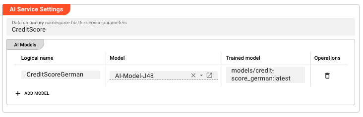

import WipDisclaimer from '../../snippets/common/_wip-disclaimer.md'

# AI Service

## Purpose

The **AI Service** exposes one or more trained AI models as callable functions from JavaScript or Python scripts within a Workflow. Scripts access the service via the `services` pseudo-class — the same mechanism used for other services like JDBC or KVS. Each logical model name in the service maps to a dynamically generated function that can classify new data.

## Prerequisites

- One or more **AI Model Resources** defining the model type, input/output schema, and hyperparameters
- One or more **trained models** stored in AI Storage (trained by an [AI Trainer](../processors-flow/asset-flow-ai-trainer))
- A **Data Dictionary** with attributes defined in the namespace configured in the service

:::tip
If you are not familiar with the AI workflow in layline.io, read [Using Artificial Intelligence in Workflows](../../concept/advanced/artificial-intelligence) first.
:::

## Configuration

### Name & Description

**`Name`** — Name of the Asset. Spaces are not allowed.

**`Description`** — Free-text description of this service.

### Required roles

If you are deploying to a Cluster with Reactive Engine Nodes that have specific Roles configured, you can restrict use of this Asset to those Nodes with matching roles. Leave empty to match all Nodes (no restriction).

### AI Service Settings

**`Data dictionary namespace for the service parameters`** — The Data Dictionary namespace used to define the request and response parameters for this service. Supports [macros](../../language-reference/macros) for per-environment values.

#### AI Models

The AI Models table lists the models this service exposes. Each row maps a logical parameter name to an AI Model Resource and a trained model version in AI Storage.

Click **+ Add model** to add a row:

| Column | Description |
|--------|-------------|
| **Logical name** | The logical name for this model. This name is used as part of the function name in scripts. |
| **Model** | Reference to an **AI Model Resource** in the Project. Select from the filtered list of AI Model Resources. |
| **Trained model** | The path in AI Storage where the trained model is stored (e.g., `models/usage-classifier`). Append `:<version>` for a specific version (e.g., `models/usage-classifier:3`) or `:latest` for the most recent version. |

<div className="frame">



</div>

## Behavior

### Exposed functions

For each row in the AI Models table, the service dynamically generates one or more functions:

**If a trained model path is set:**

| Function name | Description |
|--------------|-------------|
| `<LogicalName>Classify` | Classify a single record using the trained model |

**If an AI Model Resource is set (without a trained model path):**

| Function name | Description |
|--------------|-------------|
| `<LogicalName>BeginTraining` | Begin a new training session |
| `<LogicalName>Learn` | Add training data to the session |
| `<LogicalName>FinishTraining` | Complete training and store the model in AI Storage |

### Invocation from scripts

The AI Service is accessed from JavaScript or Python scripts the same way as other services (JDBC, KVS, etc.) — via the `services` pseudo-class.

**1. Link the service to a script processor:**

In the JavaScript or Python Processor editor, add the AI Service to the processor's **Service Assignments**.

**2. Access the service in your script:**

```javascript
// Access the AI Service via the services pseudo-class
const aiService = services.MyServiceName;

// Call the Classify function for a trained model
const result = await aiService.CreditScoreGermanClassify({
    // Input attributes matching the AI Model Resource's input schema
    call_type_ind: "VOICE",
    rate_scenario_cd: "STANDARD",
    primary_mcc_mnc: "26201"
});

// The result contains the predicted class label
processor.logInfo("Classification result: " + result.classLabel);
```

### Model versioning

Each training run of the same model path creates a new version in AI Storage. Use `:latest` to always use the most recent version, or specify `:<version-number>` to pin to a known version.

## Example

An AI Service exposes a trained credit scoring model for use by a JavaScript Processor.

**Step 1 — Prerequisites:**

- AI Model Resource: `AI-Model-J48` (Weka J48, defines input attributes and class attribute)
- Trained model in AI Storage: `models/usage-classifier:latest`
- Data Dictionary namespace: `CreditScore` (defines the input/output attribute types)

**Step 2 — Configure the AI Service:**

| Setting | Value |
|---------|-------|
| Name | `CreditScoringService` |
| Data dictionary namespace | `CreditScore` |
| Logical name | `CreditScoreGerman` |
| Model | `AI-Model-J48` |
| Trained model | `models/credit-score_german:latest` |

This exposes the function `CreditScoreGermanClassify(...)` in scripts.

**Step 3 — Link the service to a script processor:**

In a JavaScript Processor, add `CreditScoringService` to its Service Assignments.

**Step 4 — Call from JavaScript:**

```javascript
export function onMessage() {
    // Call the AI Classification function
    const result = await services.CreditScoringService.CreditScoreGermanClassify({
        call_type_ind: message.callType,
        rate_scenario_cd: message.rateScenario,
        primary_mcc_mnc: message.mccMnc
    });

    // Use the classification result
    message.classification = result.classLabel;

    stream.emit(message, OUTPUT_PORT);
}
```

## See Also

- [AI Trainer](../processors-flow/asset-flow-ai-trainer) — train and store models in AI Storage
- [AI Classifier](../processors-flow/asset-flow-ai-classifier) — use a trained model directly within a Workflow stream
- [AI Model Resource](../resources/asset-resource-ai-model) — define the model specification used for training and by this service
- [Using Artificial Intelligence in Workflows](../../concept/advanced/artificial-intelligence) — conceptual overview of supervised learning in layline.io

---

<WipDisclaimer></WipDisclaimer>
