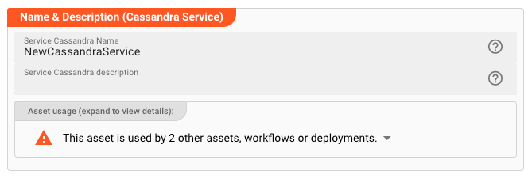

import WipDisclaimer from '/docs/snippets/common/_wip-disclaimer.md';

# Cassandra Service

Define a service to interface with a Cassandra or an Cassandra compatible store (e.g.AWS Keyspaces).

")

## Prerequisites

None

## Configuration

### Name & Description



* **`Name`** : Name of the Asset. Spaces are not allowed in the name.

* **`Description`** : Enter a description.

The **`Asset Usage`** box shows how many times this Asset is used and which parts are referencing it.
Click to expand and then click to follow, if any.

### Required roles

")

In case you are deploying to a Cluster which is running (a) Reactive Engine Nodes which have (b) specific Roles
configured, then you **can** restrict use of this Asset to those Nodes with matching
roles.
If you want this restriction, then enter the names of the `Required Roles` here. Otherwise, leave empty to match all
Nodes (no restriction).

### Contact Points

")

Enter the list of cluster seed nodes.
It should contain IPs or hostnames of Cassandra cluster nodes, optionally with ports if different than the default Cassandra port.

### Data Center, Keyspace, Parallelism

")

* **`Local data center`** : Name of the Cassandra local datacenter. To find your datacenter name, check in your Cassandra node's `cassandra-rackdc.properties` file.
  If you are using AWS Keyspaces, then enter the region name here, then set the value for local-datacenter to the Region you're connecting to. 
  For example, if you are connecting to `cassandra.us-east-2.amazonaws.com`, then set the local data center to `us-east-2`. 
  For all available AWS Regions, see [Service endpoints](https://docs.aws.amazon.com/keyspaces/latest/devguide/programmatic.endpoints.html) for Amazon Keyspaces.

* **`Keyspace`** : Name of the Keyspace.

* **`Parallelism`** :
  This is a performance tuning parameter.
  Enter a number which defines how many requests can be performed in parallel.
  Leave empty for no parallelism.

### Service Functions

Services are accessed from other Assets via invocations of _Functions_.
This is where you define such functions.
In the context of Cassandra, a Service Function encapsulates any valid DML (data manipulation) or even DDL (data definition)
statement.
Typically, you will be using `INSERT`, `SELECT` and `UPDATE` CQL-statements here.

Let’s assume we would only want to read the customer data `Customer` in our example.
This would require its own Service Function.

#### Create Service Function

First create a new Function (1):

")

Next fill out the details:

")

* `Function name` (1): The name of the function. Must not have whitespaces.

* `Function description` : Something that describes the function (optional).

* `CQL Statement` (2): The actual CQL-Statement to access execute against the Cassandra/Keyspaces data source.
  Please note the use of the `:Id` bind-variable in the example above.
  The variables you can use here must have been defined in the data dictionary and assigned via the `Parameter type`.
  See the next section to learn how to do this.

* `Parameter type` (3): Reference to a data dictionary type which you must have defined below.
  All members of this type can be used as bind-variables in the SQL-Statement.

* `Result type` (4): Reference to a data dictionary type which you must have defined below.
  All members of this type can be used as result variables in the SQL-Statement.
  Note, that this can be the same type as used for the `Parameter type`.
  In our example they share the same variables.

* `Mappings` (5): Define how you map the results from the SQL-Statement to your `Result Type` data structure.
  On the left you enter (assisted) the bind-variable names to which members of the `Result Type` should be mapped.
  Member names are always preceded with `result.` and then followed by the member name.
  On the right-hand side, enter the original field names used in your SQL-Statement.

### Typesafe Configuration

Access to Cassandra and Keyspaces data sources relies on the [Datastax-Driver](https://docs.datastax.com/en/developer/java-driver/).
This driver allows for a wide number of configuration options.
You can configure these options here.
As to which configuration options are available, please refer to the [Datastax-Driver documentation](https://docs.datastax.com/en/developer/java-driver/4.17/manual/core/configuration/reference/).

Example:

")

:::note HOCON format
Please note that the notation follows [HOCON format](https://www.w3schools.io/file/hocon-introduction).
:::

:::note Use of macros
As you can see from the example above, you can use [Macros](/docs/lang-ref/macros) within the Typesafe Configuration.
:::

### Data Dictionary

The Data Dictionary allows us to define complex data structures which can be mapped onto Cassandra data types and vice versa.
For this purpose, we need to define an internal custom data type which can receive the results of the statement, and/or
also provide data for other parts of the statement, e.g. for the `where`-clause as in our example.

As an example, let’s do this for the above CQL-Statement accessing the `customer` table. What do we need here?

1. We are selecting five fields `ìd`, `name`, `address`, `phone` and `email` from that table.
   So we need three corresponding fields in our own data dictionary that we can map these results to.
2. We query based on an `id` (of the customer).
   We need to map an internal Id field from the data dictionary to the `where`-clause in the CQL-Statement.
   For this purpose, we can use the same data structure as for 1., which already contains an Id field.

Let's define the necessary custom data type using the data dictionary:

1. Declare a new type
2. Declare namespace (optional)
3. Declare Sequence `Customer`

##### 1. Declare a new type (1):

")

##### 2. Declare namespace

")

To better organize data types, we declare a namespace first (optional):

* **`Name`** (1): The name of the element.
  If you are configuring a namespace, and you reuse the name of a namespace, which you have created elsewhere in this
  Project, then the elements of the namespaces will be merged into the namespace by
  this same name.
  Otherwise the name must be unique and may not contain spaces.

* **`Type`** (2): Pick the type of the element. In our example we first define a namespace. When we define additional
  elements under that namespace we will pick any of the other data types to actually
  hold the data.

* **`Description`** (3): Anything which describes the element further.

##### 3. Declare Customer Sequence

Add a child to the namespace we just created:

")

* Click the small arrow next to the namespace name (1)
* Select `Add child` to add a child element to the namespace
* Fill in the details:

")

* **`Name`** (1): Name the element `History`

* **`Type`** (2): Select `Sequence` as the element type. In the next step we will create individual members of the
  sequence.

* **`Extendable Sequence`** (3): Leave this unchecked for the example. If checked, it allows you and layline.io to
  dynamically extend the list of sequence members while working with the data type
  which we are defining. If - for example - your incoming data format has additional fields which are not defined in the
  sequence, the sequence will be automatically extended by these fields.

Now we add a list of member fields which make up the sequence (1):

")

To later reference the `Name` field, we can use the path `MyCorp.Customer.Name`, and so forth.

### Example: Using the JDBC Service

The Cassandra Service can be used from within a JavaScript Asset.
In our example we have a simple Workflow which reads a file with customer-related data (1), then in a next step (2) reads the corresponding customer date from a JDBC source, and
simply outputs this data to the log.
There is no other purpose in this Workflow than to demonstrate how to use the Service.

")

In the middle of the Workflow we find a JavaScript Processor by the name of “_EnrichCustomer_”.
This Processor reads additional customer information from Aerospike using the JDBC Service.

How is it configured?


#### Link EnrichCustomer Processor to Cassandra Service

To use the Cassandra Service in the JavaScript Processor, we first have to **assign the Service within the JavaScript
Processor** like so:

")

* **`Physical Service`** (1): The Cassandra Service, which we have configured above.

* **`Logical Service Name`** (2): The name by which we want to use the Service within JavaScript.
  This could be the exact same name as the Service or a name which you can choose.
  Must not include whitespaces.

#### Access the Service from within JavaScript

Now let’s finally use the service within JavaScript:

##### Reading from JDBC Source

```javascript
let cassandraData = null; // will receive a message type
let customer_id = 1234;
try {
    // Invoke service function.
    // Servcie access defined as synchronous. Therefore no promise syntax here
    cassandraData = services.MyCassandraService.SelectCustomerById(
        {Id: customer_id}
    );
    // services: fixed internal term to access linked services
    // CustomerData: The logical name of the service which we have given to it
    // MyFunction: Collection function to read the customer data with the given customer_id
} catch (error) {
    // handle error
}

// Output the customer data to the processor log
if (cassandraData && cassandraData.data.length > 0) {
    processor.logInfo('Name: ' + cassandraData.data[0].Name);
    processor.logInfo('Address: ' + cassandraData.data[0].Address);
} else {
    processor.logInfo('No customer data found for customer ID ' + customer_id);
}
```

:::tip Note: Service functions return a Message
Note how the Service function returns a [Message](/docs/lang-ref/javascript/API/classes/Message#message-2) as a result
type.

Since SQL-queries always return arrays, you can find the results in `message.data` as an array.
If we are only expecting one row as a result we can test it with `cassandraData.data.length > 0` and access the first row with `cassandraData.data[0]`.
:::

##### Insert/Update to Cassandra

Let's assume we also had defined a function `WriteCustomerData` which inserts a new customer:

```sql
insert into customer
values id = :Id, name = :Name, address = :Address;
```
We could then invoke this function and pass values to it like so:

```javascript
try {
    services.MyCassandraService.WriteCustomerData(
        {
            Id: 1235,
            Name: 'John Doe',
            Address: 'Main Street',
        }
    )
} catch (error) {
    // handle error
}
```

It works the same for any other JDBC compliant statement.

## Test

Most Service Assets allow you to test their functionality directly out of the Web-UI.
This saves you having to deploy the Project to a Reactive Cluster only to test the Service functions.

To test functions switch to the `Test` tab:


---

<WipDisclaimer></WipDisclaimer>
