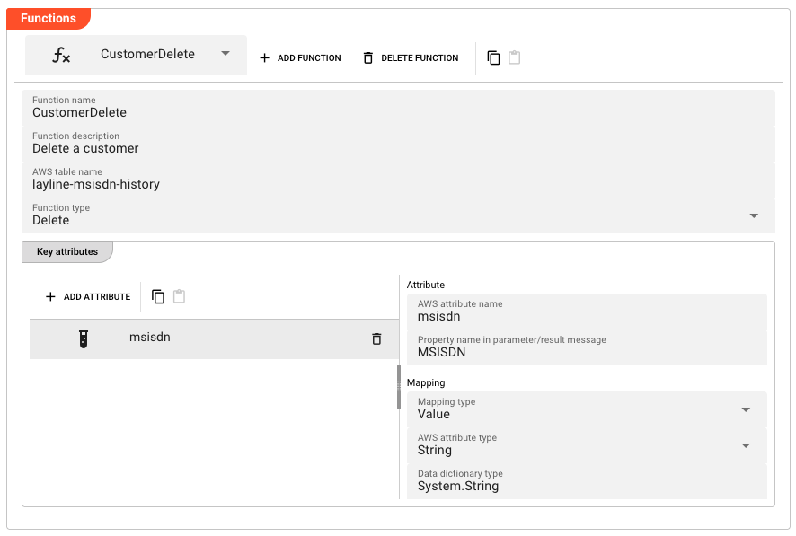
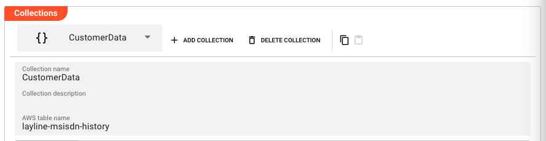
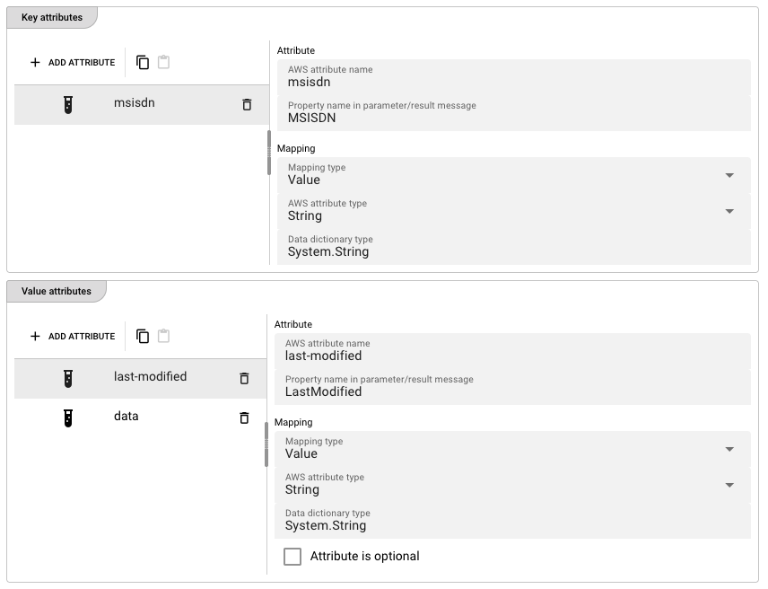

import WipDisclaimer from '../../snippets/common/_wip-disclaimer.md'
import Testcase from '../../snippets/assets/_asset-service-test.md';

# DynamoDB Service

## Purpose

Define a service to interface with an AWS DynamoDB database.

## Prerequisites

* An AWS Connection asset configured and available.
* AWS credentials (access key / secret key) or an IAM role with appropriate DynamoDB permissions.

## Configuration

### Name & Description

* **`Name`** : Name of the Asset. Spaces are not allowed in the name.

* **`Description`** : Enter a description.

The **`Asset Usage`** box shows how many times this Asset is used and which parts are referencing it.
Click to expand and then click to follow, if any.

### Required Roles

In case you are deploying to a Cluster which is running (a) Reactive Engine Nodes which have (b) specific Roles
configured, then you **can** restrict use of this Asset to those Nodes with matching roles.
If you want this restriction, then enter the names of the `Required Roles` here. Otherwise, leave empty to match all
Nodes (no restriction).

### Dynamo DB Settings

#### Connection

* **`Connection`** : The AWS Connection asset to use for DynamoDB access.
  This field supports inheritance from a parent Service definition.

#### Target Data Dictionary Namespace

* **`Target data dictionary namespace`** : Namespace for auto-generated data types in the Data Dictionary.
  If left empty, the namespace defaults to `Service{Name}Types` (e.g., a service named `CustomerData` would default to `ServiceCustomerDataTypes`).
  This field supports inheritance from a parent Service definition.


### Functions

Functions give granular control over DynamoDB operations. Unlike Collections, you define each function type explicitly. See [Auto-Generated Function Names](#auto-generated-function-names) for how these functions are named and invoked.

#### Add a Function

Click **Add Function** to create a new Function.

##### Function Name & Description

* **`Function name`** : Name of the Function. Must be unique within the Service. Must not contain spaces.

* **`Function description`** : Optional description of the Function.

##### AWS Table Name

* **`AWS table name`** : The name of the DynamoDB table. Can be overridden per function if different from the Service-level table name.

##### Function Type

* **`Function type`** : The type of DynamoDB operation. Options:

| Value | Description |
|-------|-------------|
| Delete | Delete an item from the table |
| Read | Read an item from the table |
| Write | Write an item to the table |

##### Key Attributes

Key attributes define the primary key of the DynamoDB table, just as in Collections. See [Attribute Mapping](#attribute-mapping) for details on how to configure the mapping.

##### Value Attributes

Value attributes are available for **Read** and **Write** function types only. See [Attribute Mapping](#attribute-mapping) for details on how to configure the mapping.

#### Delete / Copy / Paste / Reset to parent

* **Delete Function** : Removes the selected Function. A confirmation dialog appears.
* **Copy** : Copies the Function to the clipboard.
* **Paste** : Pastes a Function from the clipboard (if one has been copied).
* **Reset to parent** : Resets the Function to the inherited value from a parent Service (if any).



### Collections

Collections provide a convenient way to define DynamoDB table access. A Collection defines a table schema and
automatically generates **Read**, **Write**, and **Delete** functions for that table. See [Auto-Generated Function Names](#auto-generated-function-names) for how these functions are named and invoked.

Use Collections when you want a general-purpose way to access a table. Use [Functions](#functions) when you need
granular control over individual operations.

#### Add a Collection

Click **Add Collection** to create a new Collection.

##### Collection Name & Description

* **`Collection name`** : Name of the Collection. Must be unique within the Service. Must not contain spaces.

* **`Collection description`** : Optional description of the Collection.

##### AWS Table Name

* **`AWS table name`** : The name of the DynamoDB table as defined in AWS.

##### Key Attributes

Key attributes define the primary key of the DynamoDB table. You must define at least one key attribute.

Each key attribute maps a DynamoDB primary key component to a message property.

* **`AWS attribute name`** : The name of the attribute in DynamoDB.

* **`Property name in parameter/result message`** : The name of the corresponding field in the layline.io message.

For each key attribute, configure the [Mapping](#attribute-mapping) as described below.

##### Value Attributes

Value attributes define the non-key attributes of the DynamoDB item. These are optional depending on your access pattern.

Each value attribute has the same fields as key attributes, plus additional mapping options. See [Attribute Mapping](#attribute-mapping) for details on how to configure the mapping.

#### Delete / Copy / Paste / Reset to parent

* **Delete Collection** : Removes the selected Collection. A confirmation dialog appears.
* **Copy** : Copies the Collection to the clipboard.
* **Paste** : Pastes a Collection from the clipboard (if one has been copied).
* **Reset to parent** : Resets the Collection to the inherited value from a parent Service (if any).



### Attribute Mapping

Each attribute (key or value) has a configurable mapping that defines how the attribute is stored in DynamoDB
and how it maps to the layline.io message.

#### Mapping Type

* **`Mapping type`** : How the attribute value is resolved. Options:

| Value | Description |
|-------|-------------|
| Data Dictionary | Maps to a data dictionary type (complex types) |
| Value | Uses a static value type (string, binary) |
| TTL | Maps to a DynamoDB TTL (time-to-live) attribute |

#### Available Options per Mapping Type

The following table shows which options are available for each `Mapping type`, and describes what each option does. All mapping types also include the base Attribute fields (`AWS attribute name`, `Property name in parameter/result message`) which are described above.

| Option | Data Dictionary | Value | TTL | Description |
|--------|----------------|-------|-----|-------------|
| `AWS attribute type` | Yes | Yes | — | The DynamoDB attribute type. Options: `Binary`, `String`. |
| `Data dictionary type` | Yes | Yes | — | Select a layline.io data dictionary type instead of (or in addition to) an AWS attribute type. |
| `Serialization type` | Yes | — | — | How complex types are serialized. Currently only `Json` is supported. |
| `Attribute is optional` | Yes | Yes | — | Checkbox (value attributes only). Marks the attribute as optional in the DynamoDB item. |
| `Use AWS null attribute` | Yes | Yes | — | Checkbox (value attributes only). When enabled alongside `Attribute is optional`, stores `null` values as a DynamoDB null type instead of omitting the attribute. |
| `Default TTL` | — | — | Yes | Default time-to-live value in seconds. The DynamoDB item will be automatically deleted by AWS after this many seconds from the TTL attribute value. |

Note: `Use AWS null attribute` for Value mapping is only available when `Attribute is optional` is checked.



### Data Dictionary

The Data Dictionary editor allows you to define custom data types used by the Service's Functions and Collections.
These types specify the structure of request parameters and response data for DynamoDB operations.

The namespace for these types is determined by the **Target data dictionary namespace** setting.
If not specified, it defaults to `Service{Name}Types` (e.g., `ServiceCustomerDataTypes`).

For example, if your Service is named `CustomerData` and your namespace is `ServiceCustomerDataTypes`, a
Read function's parameter type would be `ServiceCustomerDataTypes.ReadCustomerData.Parameter` and its result type
would be `ServiceCustomerDataTypes.ReadCustomerData.Result`.

Define types using the Data Dictionary editor. Each type consists of members that map to DynamoDB attributes
via the attribute mapping configuration.

:::tip
The Data Dictionary section is available directly within the DynamoDB Service editor, allowing you to create and manage
types in context while configuring your table mappings.
:::


### Auto-Generated Function Names

DynamoDB Service auto-generates Function names that are used to invoke the service from Workflows and JavaScript processors:

**From Collections:**

| Operation | Function Name Pattern |
|-----------|----------------------|
| Delete | `{Namespace}.Delete{CollectionName}` |
| Read | `{Namespace}.Read{CollectionName}` |
| Write | `{Namespace}.Write{CollectionName}` |

**From Functions:**

| Operation | Function Name Pattern |
|-----------|----------------------|
| Delete | `{Namespace}.{FunctionName}` |
| Read | `{Namespace}.Read{FunctionName}` |
| Write | `{Namespace}.Write{FunctionName}` |

Parameter and result types follow the pattern `{Namespace}.{Operation}{Name}.Parameter` and
`{Namespace}.{Operation}{Name}.Result` respectively.

#### Example

Given a DynamoDB Service named `CustomerDataDynamoDBService` with the default namespace (`ServiceCustomerDataTypes`),
and a Read function named `ReadCustomerData`:

| Item | Example Value |
|------|---------------|
| Function name | `ServiceCustomerDataTypes.ReadReadCustomerData` |
| Parameter type | `ServiceCustomerDataTypes.ReadReadCustomerData.Parameter` |
| Result type | `ServiceCustomerDataTypes.ReadReadCustomerData.Result` |

### Using a DynamoDB Service from a JavaScript Processor

To use a DynamoDB Service in a JavaScript processor:

1. **Add the DynamoDB Service asset** to your project and configure Collections or Functions with the desired table operations.

2. **Reference the Service** from your JavaScript processor by importing or accessing it via the `services` global:
   ```javascript
   const dynamoDBService = services.<ServiceName>;
   ```

3. **Call service functions** using the auto-generated function names:
   ```javascript
   let result = dynamoDBService.<Operation><FunctionName>({ /* parameters */ });
   ```

4. **Handle the response** using the auto-generated result types in the Data Dictionary.

For more information, see [JavaScript Processor](../processors-flow/asset-flow-javascript.md).

#### JavaScript Example: Write

```javascript
/**
 * Write the customer data to Dynamo DB
 * @param msisdn MSISDN to write
 * @param msisdnData Data of the MSISDN
 */
function writeMsisdnData(msisdn, msisdnData) {
    services.CustomerDataDynamoDBService.WriteCustomerData({
        MSISDN: msisdn,
        LastModified: DateTime.now().toString(),
        Data: msisdnData.data
    });

    if (!messageMsisdnDataValid(msisdnData)) {
        reportDataFailure(
            'Resulting MsisdnData is invalid (no Brand)',
            msisdnData
        );
    }
}
```

In this example:
- `services.CustomerDataDynamoDBService` references the DynamoDB Service asset
- `WriteCustomerData` is the auto-generated Write function name for a Collection or Function
- The parameter object includes the key attribute (`MSISDN`) and value attributes (`LastModified`, `Data`)
- The response is handled via validation against the local data dictionary type

<Testcase></Testcase>

---

<WipDisclaimer></WipDisclaimer>
