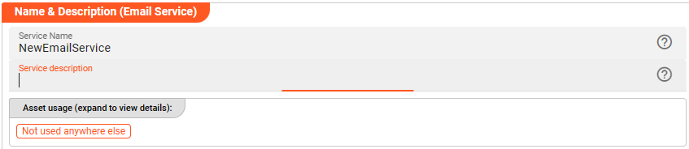
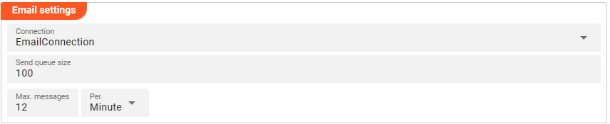
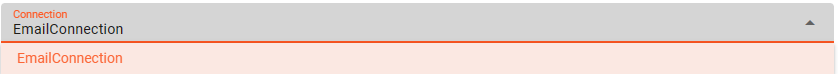
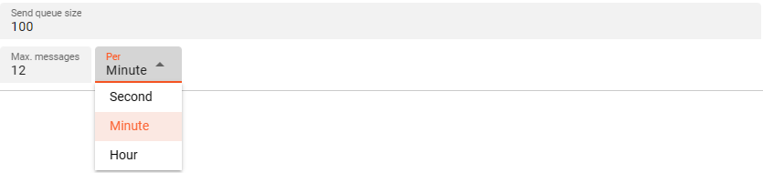

import WipDisclaimer from '../../snippets/common/_wip-disclaimer.md'
import NameAndDescription from '../../snippets/assets/_asset-name-and-description.md';
import RequiredRoles from '../../snippets/assets/_asset-required-roles.md';
import Testcase from '../../snippets/assets/_asset-service-test.md';
import Tabs from '@theme/Tabs';
import TabItem from '@theme/TabItem';

# Email Service

## Purpose

Define a service to interface with Email.

")

## Prerequisites

For this to work, you need a configured [Email Connection](../connections/asset-connection-email).

## Configuration

### Name & Description



<NameAndDescription></NameAndDescription>

### Required roles

<RequiredRoles></RequiredRoles>

### Email Service Settings

Configure the parameters for your Email Service:



#### Connection



Use the drop-down list to select a [Email Connection](../connections/asset-connection-email) that should
support this Email Service. If it does not exist, you need to create it first.

#### More Settings

The Email Service allows two functions: _**Send**_ and _**SendAndForget**_. 
Regardless of which function is used, the emails always go to into a queue that sends the email 
with a throttle setting defined by _**Max messages per time unit**_. With _**Send**_ you only get a response 
when the email has actually been sent (or in case of an error). With _**SendAndForget**_ you only get an error 
in case the queue reaches the limit defined in _**Send queue size**_. 
An attempt is then made to send the email, but you would no longer get an error.




* **`Send queue size`** : Defines the maximum number of messages waiting to be send out before a further send request leads to a failure.
* **`Max. messages / per`** : defines the throttle setting as explained above.

### Example: Using the Email Service

The Email Service can be used from within a JavaScript Asset. In our example we have a simple Workflow which reads an
input file with some data (1), then in a next step (2) sends a simple message via Email (only on the StreamEnd event), and
simply outputs the incoming data back to an output file again. There is no other purpose in this Workflow than to demonstrate how to use the
Service.

")


In the middle of the Workflow we find a JavaScript Processor by the name of “_SendEmail_”. This Processor prepares
a message to be send via Email as configured in the Service Email asset.

How is it configured?

#### Link SendEmail Processor to Email Service

To use the Email Service in the JavaScript Processor, we first have to **assign the Service within the JavaScript
Processor** like so:

")

* **`Physical Service`** (1): The Email Service which we have configured above.

* **`Logical Service Name`** (2): The name by which we want to use the Service within JavaScript. This could be the
  exact same name as the Service or a name which you can choose. Must not include whitespaces.

#### Access the Service from within a Script Processor


<Tabs>
  <TabItem value="javascript" label="JavaScript">

```javascript
// Example: sending an email
services.EmailService.Send({
    To: 'user@example.com',
    From: 'sender@example.com',
    Subject: 'Important Update',
    Body: 'This is the email body.'
});
```

  </TabItem>
  <TabItem value="python" label="Python">

```python
# Example: sending an email
services.EmailService.Send({
    'To': 'user@example.com',
    'From': 'sender@example.com',
    'Subject': 'Important Update',
    'Body': 'This is the email body.'
})
```

  </TabItem>
</Tabs>

<Testcase></Testcase>

---

<WipDisclaimer></WipDisclaimer>
